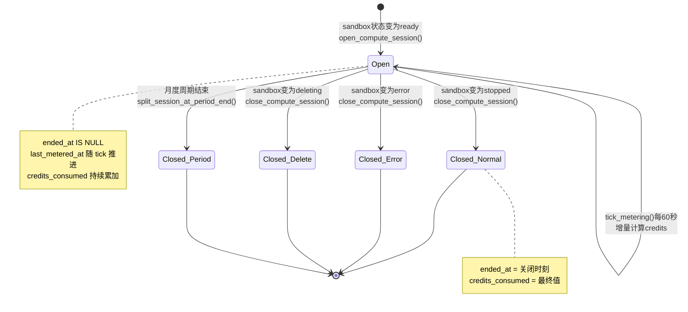
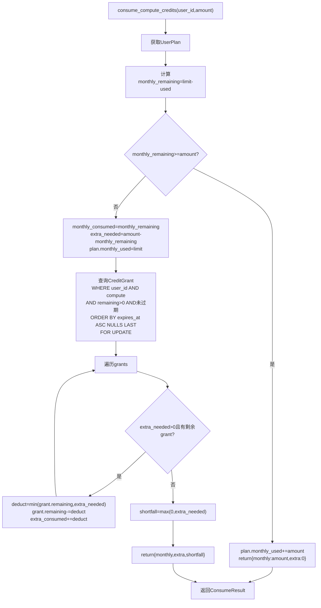
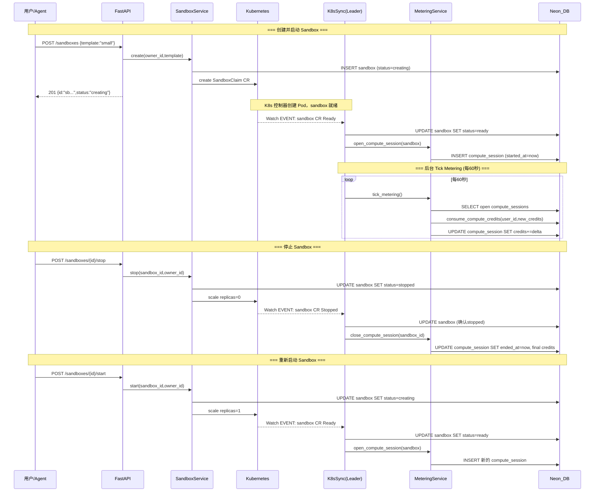

# Compute 计量设计

**日期：** 2026-03-26
**状态：** 设计中
**关联文档：** [计量系统总览](2026-03-26-metering-overview.md)

---

## 1. Compute Credit 定义

### 1.1 基本单位

**1 Compute Credit = 1 vCPU-hour 等价的计算资源。**

Compute Credit 是 Treadstone 平台衡量 sandbox 计算资源消耗的标准化单位。当一个 sandbox 以 1 vCPU / 2 GiB 内存运行 1 小时，消耗恰好 1 Compute Credit。

### 1.2 费率公式

```
credit_rate_per_hour = max(vCPU_request, memory_GiB_request / 2)
```

该公式确保以较大维度为准计费：

- 若用户选择的 sandbox 模板 CPU 和内存保持 1:2 的比例（当前所有模板均如此），则 `vCPU_request == memory_GiB_request / 2`，公式简化为 `vCPU_request`。
- 若未来引入非标比例的模板（如 CPU 密集型 2 vCPU / 2 GiB），则 `max(2, 2/2) = 2`，按 CPU 计费。
- 若引入内存密集型模板（如 1 vCPU / 8 GiB），则 `max(1, 8/2) = 4`，按内存计费。

### 1.3 当前模板费率表

| Template | vCPU Request | Memory Request | Credit Rate (credits/h) |
|----------|-------------|---------------|------------------------|
| tiny     | 0.25        | 0.5 GiB       | 0.25                   |
| small    | 0.5         | 1 GiB         | 0.50                   |
| medium   | 1           | 2 GiB         | 1.00                   |
| large    | 2           | 4 GiB         | 2.00                   |
| xlarge   | 4           | 8 GiB         | 4.00                   |

> **为什么基于 request 而非 limit？**
>
> Kubernetes 调度器以 Pod 的 resource request 决定节点分配——request 是节点上为 Pod **保底预留**的资源量。limit 仅限制运行时突发使用的上限（当前 Treadstone 的 limit = 2× request，见 `_build_resource_limits()`）。Treadstone 向用户售卖的是**保底可用资源**，因此按 request 计费更合理。用户无论是否实际用满 request，都已占用了集群上对应的调度容量。
>
> 这与行业标准一致：AWS Fargate 按 vCPU-hour / GB-hour 的 request 计费；GCP Cloud Run 按分配的 vCPU 和内存计费。

### 1.4 计量精度

| 维度 | 精度 |
|------|------|
| 内部记录 | 按秒（与 Daytona / E2B 对齐） |
| credits_consumed 字段 | `Decimal(10,4)`，精确到万分之一 credit |
| 对外展示 | 精确到分钟（向上取整），在 dashboard / 账单中展示 |
| tick 间隔 | 60 秒，实际精度 ≈ 秒级（基于 `last_metered_at` 到 `now()` 的实际差值） |

内部按秒级差值计算，确保即使 tick 间隔有波动（如 leader 切换导致间隔 > 60s），计量结果仍然准确。

---

## 2. ComputeSession 生命周期

### 2.1 概念

`ComputeSession` 追踪一个 sandbox 的**单次运行期间**的计算资源消耗。每次 sandbox 从非运行状态进入 `ready` 状态时创建一个新 session，当 sandbox 离开 `ready` 状态（进入 `stopped` / `error` / `deleting`）时关闭该 session。

一个 sandbox 的生命周期中可能产生多个 `ComputeSession`（每次 start/stop 循环产生一个）。

### 2.2 表结构

```sql
CREATE TABLE compute_session (
    id                      VARCHAR(24)    PRIMARY KEY,
    sandbox_id              VARCHAR(24)    NOT NULL REFERENCES sandbox(id),
    user_id                 VARCHAR(24)    NOT NULL REFERENCES "user"(id),
    template                VARCHAR(32)    NOT NULL,
    credit_rate_per_hour    DECIMAL(10,4)  NOT NULL,
    started_at              TIMESTAMPTZ    NOT NULL,
    ended_at                TIMESTAMPTZ,               -- NULL = 运行中
    last_metered_at         TIMESTAMPTZ    NOT NULL,
    credits_consumed        DECIMAL(10,4)  NOT NULL DEFAULT 0,
    credits_consumed_monthly DECIMAL(10,4) NOT NULL DEFAULT 0,
    credits_consumed_extra  DECIMAL(10,4)  NOT NULL DEFAULT 0,
    gmt_created             TIMESTAMPTZ    NOT NULL DEFAULT now(),
    gmt_updated             TIMESTAMPTZ    NOT NULL DEFAULT now()
);

CREATE INDEX ix_compute_session_sandbox ON compute_session(sandbox_id);
CREATE INDEX ix_compute_session_user    ON compute_session(user_id);
CREATE INDEX ix_compute_session_open    ON compute_session(ended_at) WHERE ended_at IS NULL;
```

字段说明：

| 字段 | 用途 |
|------|------|
| `id` | 主键，格式 `"cs" + random_id()`，与现有 ID 风格一致 |
| `sandbox_id` | 关联的 sandbox |
| `user_id` | 冗余存储 sandbox owner，避免每次 tick 都需要 JOIN sandbox 表 |
| `template` | 冗余存储模板名称，方便后续按模板维度统计 |
| `credit_rate_per_hour` | session 创建时锁定的费率。即使模板后续调价，已有 session 不受影响 |
| `started_at` | session 开始时间（sandbox 进入 `ready` 的时刻） |
| `ended_at` | session 结束时间。`NULL` 表示 sandbox 仍在运行 |
| `last_metered_at` | 上次 tick 计量的时间点，用于增量计算 |
| `credits_consumed` | 累计消耗的 credit 总量 |
| `credits_consumed_monthly` | 从月度额度扣除的部分 |
| `credits_consumed_extra` | 从额外额度（CreditGrant）扣除的部分 |
| `gmt_created` / `gmt_updated` | 审计时间戳，`gmt_updated` 兼作乐观锁版本标记 |

> **设计选择：`user_id` 冗余**
>
> `user_id` 可以通过 `sandbox.owner_id` JOIN 获取，但 `tick_metering()` 每 60 秒执行一次，涉及所有 open session。冗余 `user_id` 避免了 N 次 JOIN，将 tick 的核心查询简化为单表扫描 + 批量更新。

### 2.3 SQLAlchemy 模型

```python
class ComputeSession(Base):
    __tablename__ = "compute_session"

    id: Mapped[str] = mapped_column(
        String(24), primary_key=True, default=lambda: "cs" + random_id()
    )
    sandbox_id: Mapped[str] = mapped_column(
        String(24), ForeignKey("sandbox.id"), nullable=False, index=True
    )
    user_id: Mapped[str] = mapped_column(
        String(24), ForeignKey("user.id"), nullable=False, index=True
    )
    template: Mapped[str] = mapped_column(String(32), nullable=False)
    credit_rate_per_hour: Mapped[Decimal] = mapped_column(
        Numeric(10, 4), nullable=False
    )
    started_at: Mapped[datetime] = mapped_column(
        DateTime(timezone=True), nullable=False
    )
    ended_at: Mapped[datetime | None] = mapped_column(
        DateTime(timezone=True), nullable=True
    )
    last_metered_at: Mapped[datetime] = mapped_column(
        DateTime(timezone=True), nullable=False
    )
    credits_consumed: Mapped[Decimal] = mapped_column(
        Numeric(10, 4), nullable=False, default=Decimal("0")
    )
    credits_consumed_monthly: Mapped[Decimal] = mapped_column(
        Numeric(10, 4), nullable=False, default=Decimal("0")
    )
    credits_consumed_extra: Mapped[Decimal] = mapped_column(
        Numeric(10, 4), nullable=False, default=Decimal("0")
    )
    gmt_created: Mapped[datetime] = mapped_column(
        DateTime(timezone=True), default=utc_now, nullable=False
    )
    gmt_updated: Mapped[datetime] = mapped_column(
        DateTime(timezone=True), default=utc_now, nullable=False
    )
```

### 2.4 Session 状态机



### 2.5 Session 生命周期详细流程

#### 2.5.1 创建（Open）

触发时机：K8s Sync 检测到 sandbox 状态从 `creating` 变为 `ready`。

```python
async def open_compute_session(
    session: AsyncSession,
    sandbox: Sandbox,
) -> ComputeSession:
    credit_rate = calculate_credit_rate(sandbox.template)
    now = utc_now()

    cs = ComputeSession(
        sandbox_id=sandbox.id,
        user_id=sandbox.owner_id,
        template=sandbox.template,
        credit_rate_per_hour=credit_rate,
        started_at=now,
        last_metered_at=now,
        credits_consumed=Decimal("0"),
        credits_consumed_monthly=Decimal("0"),
        credits_consumed_extra=Decimal("0"),
    )
    session.add(cs)
    await session.commit()
    return cs
```

此时 `credits_consumed = 0`，`ended_at = NULL`。session 将在后续 tick 中累积消耗。

#### 2.5.2 更新（Tick）

后台 `tick_metering()` 每 60 秒运行一次（详见第 4 节）。对于每个 open session：

1. 计算 `elapsed = now() - last_metered_at`（秒级精度）
2. 计算 `new_credits = elapsed_seconds / 3600 * credit_rate_per_hour`
3. 调用 `consume_compute_credits()` 扣除额度（详见第 3 节）
4. 更新 `credits_consumed += new_credits`，`last_metered_at = now()`

#### 2.5.3 关闭（Close）

触发时机：K8s Sync 检测到 sandbox 状态变为 `stopped` / `error` / `deleting`。

```python
async def close_compute_session(
    session: AsyncSession,
    sandbox_id: str,
) -> None:
    now = utc_now()
    result = await session.execute(
        select(ComputeSession).where(
            ComputeSession.sandbox_id == sandbox_id,
            ComputeSession.ended_at.is_(None),
        )
    )
    cs = result.scalar_one_or_none()
    if cs is None:
        return

    elapsed = (now - cs.last_metered_at).total_seconds()
    final_credits = Decimal(str(elapsed)) / Decimal("3600") * cs.credit_rate_per_hour

    consume_result = await consume_compute_credits(
        session, cs.user_id, final_credits
    )

    cs.credits_consumed += final_credits
    cs.credits_consumed_monthly += consume_result.monthly
    cs.credits_consumed_extra += consume_result.extra
    cs.ended_at = now
    cs.last_metered_at = now
    cs.gmt_updated = now

    session.add(cs)
    await session.commit()
```

关闭时先计算从 `last_metered_at` 到 `now` 的最后一段消耗，确保不丢失最后一个 tick 间隔内的使用量。

---

## 3. Credit 消费逻辑（双池消费）

### 3.1 双池模型

用户的 Compute Credit 额度由两个来源组成：

| 池 | 来源 | 生命周期 | 优先级 |
|----|------|---------|--------|
| **Monthly Credits** | 订阅套餐自带，每月初自动刷新 | 当月有效，不结转 | **优先消费** |
| **Extra Credits** | 一次性发放（欢迎奖励、活动、管理员发放、推荐、购买） | 有各自的过期时间或永不过期 | Monthly 耗尽后消费 |

消费顺序：**先 Monthly，再 Extra。** 这保证了用户购买的额外额度不会被月度刷新"浪费"。

### 3.2 CreditGrant 表

`CreditGrant` 表存储 Extra Credits 的每笔发放记录，支持细粒度的过期管理和消费追踪。

```sql
CREATE TABLE credit_grant (
    id                VARCHAR(24)    PRIMARY KEY,
    user_id           VARCHAR(24)    NOT NULL REFERENCES "user"(id),
    credit_type       VARCHAR(16)    NOT NULL,   -- "compute" | "storage"
    grant_type        VARCHAR(32)    NOT NULL,   -- "welcome_bonus"|"campaign"|"admin_grant"|"referral"|"purchase"
    campaign_id       VARCHAR(64),               -- 关联的活动 ID（可选）
    original_amount   DECIMAL(10,4)  NOT NULL,
    remaining_amount  DECIMAL(10,4)  NOT NULL,
    reason            TEXT,                       -- 人类可读的发放原因
    granted_by        VARCHAR(24),               -- 管理员 user_id（可选）
    granted_at        TIMESTAMPTZ    NOT NULL DEFAULT now(),
    expires_at        TIMESTAMPTZ,               -- NULL = 永不过期
    gmt_created       TIMESTAMPTZ    NOT NULL DEFAULT now(),
    gmt_updated       TIMESTAMPTZ    NOT NULL DEFAULT now()
);

CREATE INDEX ix_credit_grant_user_type ON credit_grant(user_id, credit_type);
CREATE INDEX ix_credit_grant_expires   ON credit_grant(expires_at) WHERE remaining_amount > 0;
```

字段说明：

| 字段 | 用途 |
|------|------|
| `credit_type` | 区分 compute / storage 额度，避免混用 |
| `grant_type` | 标记来源，方便统计各渠道的发放量 |
| `original_amount` | 初始发放量，不可变，用于审计 |
| `remaining_amount` | 剩余量，消费时递减 |
| `expires_at` | 过期时间。`NULL` 表示永不过期。消费时优先使用即将过期的 grant |
| `granted_by` | 如果是管理员手动发放，记录操作者 |

### 3.3 消费算法

消费算法的核心原则：

1. **先 Monthly 后 Extra**：最大化 Extra Credits 的保留
2. **Extra 内按过期时间升序消费**：优先使用即将过期的 grant，减少浪费
3. **跳过已过期的 grant**：`expires_at < now()` 的 grant 不参与消费
4. **永不过期的 grant 排在最后**：`expires_at IS NULL` 排序为 `NULLS LAST`

#### 3.3.1 伪代码

```python
@dataclass
class ConsumeResult:
    monthly: Decimal   # 从月度额度扣除的量
    extra: Decimal     # 从 Extra Credits 扣除的量
    shortfall: Decimal # 不足量（额度全部耗尽时 > 0）


async def consume_compute_credits(
    session: AsyncSession,
    user_id: str,
    amount: Decimal,
) -> ConsumeResult:
    """从用户的 compute 额度中扣除 amount 个 credits。

    扣除顺序：Monthly → Extra (按 expires_at ASC, NULLS LAST)。
    """
    plan = await get_user_plan(session, user_id)
    monthly_remaining = (
        plan.compute_credits_monthly_limit - plan.compute_credits_monthly_used
    )

    # --- 阶段 1：从月度额度扣除 ---
    if monthly_remaining >= amount:
        plan.compute_credits_monthly_used += amount
        plan.gmt_updated = utc_now()
        session.add(plan)
        return ConsumeResult(monthly=amount, extra=Decimal("0"), shortfall=Decimal("0"))

    monthly_consumed = monthly_remaining
    extra_needed = amount - monthly_remaining
    plan.compute_credits_monthly_used = plan.compute_credits_monthly_limit
    plan.gmt_updated = utc_now()
    session.add(plan)

    # --- 阶段 2：从 CreditGrant 中按过期时间升序扣除 ---
    now = utc_now()
    result = await session.execute(
        select(CreditGrant)
        .where(
            CreditGrant.user_id == user_id,
            CreditGrant.credit_type == "compute",
            CreditGrant.remaining_amount > 0,
            or_(
                CreditGrant.expires_at.is_(None),
                CreditGrant.expires_at > now,
            ),
        )
        .order_by(
            CreditGrant.expires_at.asc().nulls_last()
        )
        .with_for_update()  # 行级锁，防止并发消费
    )
    grants = result.scalars().all()

    extra_consumed = Decimal("0")
    for grant in grants:
        if extra_needed <= Decimal("0"):
            break

        deduct = min(grant.remaining_amount, extra_needed)
        grant.remaining_amount -= deduct
        grant.gmt_updated = now
        session.add(grant)

        extra_consumed += deduct
        extra_needed -= deduct

    shortfall = max(Decimal("0"), extra_needed)

    return ConsumeResult(
        monthly=monthly_consumed,
        extra=extra_consumed,
        shortfall=shortfall,
    )
```

#### 3.3.2 关键设计决策

**为什么使用 `SELECT ... FOR UPDATE`？**

`tick_metering()` 运行在单一 leader 节点上，理论上不会有并发 tick。但以下场景可能引发并发消费：

- Leader 切换期间的短暂重叠
- API 层面的手动额度调整（管理员操作）
- 未来的 Storage 计量也会消费同一用户的额度

`FOR UPDATE` 对 CreditGrant 行加锁，确保同一用户的多个并发消费操作串行化，避免超额扣除。

**Shortfall 的处理**

当 `shortfall > 0` 时，意味着用户的所有额度已耗尽。此时：

1. `credits_consumed` 仍然累加——记录实际消耗，用于账单和审计
2. 触发 Grace Period 检查（详见 enforcement 文档）
3. 不立即终止 sandbox——给用户缓冲时间

#### 3.3.3 消费流程图



---

## 4. 后台 Tick Metering

### 4.1 概述

`tick_metering()` 是计量系统的心跳。它运行在 `sync_supervisor` 管理的 leader 节点上，每 60 秒对所有 open `ComputeSession` 进行一次增量计量。

### 4.2 执行逻辑

```python
TICK_INTERVAL = 60  # seconds

async def tick_metering(session_factory: async_sessionmaker[AsyncSession]) -> None:
    """对所有运行中的 ComputeSession 执行增量计量。"""
    async with session_factory() as session:
        now = utc_now()

        # 查询所有 open sessions
        result = await session.execute(
            select(ComputeSession).where(
                ComputeSession.ended_at.is_(None)
            )
        )
        open_sessions = result.scalars().all()

        for cs in open_sessions:
            elapsed_seconds = (now - cs.last_metered_at).total_seconds()
            if elapsed_seconds <= 0:
                continue

            new_credits = (
                Decimal(str(elapsed_seconds))
                / Decimal("3600")
                * cs.credit_rate_per_hour
            )

            consume_result = await consume_compute_credits(
                session, cs.user_id, new_credits
            )

            # 乐观锁：仅当 gmt_updated 未被其他操作修改时更新
            rows = await session.execute(
                update(ComputeSession)
                .where(
                    ComputeSession.id == cs.id,
                    ComputeSession.gmt_updated == cs.gmt_updated,
                )
                .values(
                    credits_consumed=cs.credits_consumed + new_credits,
                    credits_consumed_monthly=cs.credits_consumed_monthly + consume_result.monthly,
                    credits_consumed_extra=cs.credits_consumed_extra + consume_result.extra,
                    last_metered_at=now,
                    gmt_updated=now,
                )
            )

            if rows.rowcount == 0:
                logger.warning(
                    "Optimistic lock conflict for ComputeSession %s, skipping this tick",
                    cs.id,
                )
                await session.rollback()
                continue

        await session.commit()

        # 检查是否有用户触发了 Grace Period
        await check_grace_periods(session)
```

### 4.3 为什么选择 60 秒间隔

| 考量 | 分析 |
|------|------|
| **精度需求** | 用户对计量精度的预期为分钟级。60 秒 tick 恰好满足"精确到分钟"的对外展示需求 |
| **数据库负载** | 每次 tick 执行 `O(N)` 次 session 更新（N = 活跃 sandbox 数）。60 秒间隔在 1000 个并发 sandbox 下，约 17 QPS 的写入负载，对 Neon 完全可接受 |
| **崩溃恢复误差** | 最大漏计时间 = 1 个 tick 间隔 = 60 秒。对于任何 sandbox 模板，60 秒的最大误差 ≤ 0.067 credits（xlarge），在可接受范围内 |
| **Leader 切换** | Leader election 的 renew interval 通常为 10-15 秒，远小于 tick 间隔。新 leader 接手后最多 60 秒内会执行第一次 tick |
| **行业参考** | Daytona 和 E2B 的公开文档表明其内部计量间隔在 30-120 秒范围内 |

若未来 sandbox 规模超过 10,000，可考虑将 tick 改为批量 SQL 更新（单条 UPDATE ... FROM 子查询），而非逐行遍历。

### 4.4 并发控制

尽管 `tick_metering()` 通过 leader election 保证单点执行，仍需防御以下边界场景：

#### 4.4.1 乐观锁机制

每个 `ComputeSession` 的 `gmt_updated` 字段兼作乐观锁版本号。tick 更新时通过 `WHERE gmt_updated = :expected` 确保无并发修改：

```python
# 更新时携带 gmt_updated 条件
rows = await session.execute(
    update(ComputeSession)
    .where(
        ComputeSession.id == cs.id,
        ComputeSession.gmt_updated == cs.gmt_updated,  # 乐观锁
    )
    .values(...)
)
if rows.rowcount == 0:
    # 被 close_compute_session() 或其他操作抢先修改，跳过本次 tick
    await session.rollback()
```

#### 4.4.2 需要防御的场景

| 场景 | 风险 | 防御手段 |
|------|------|---------|
| Leader 切换重叠 | 旧 leader 的最后一次 tick 和新 leader 的第一次 tick 并发 | 乐观锁。两次 tick 不会重复计量——`last_metered_at` 确保增量不重叠 |
| tick 和 close 并发 | `tick_metering()` 读取 session 后、更新前，`close_compute_session()` 抢先关闭了该 session | 乐观锁。tick 的 UPDATE rowcount=0，跳过。close 已完成最终计量 |
| tick 执行时间 > 60 秒 | 下一个 tick 在上一个还没完成时启动 | 使用 `asyncio.Lock` 或在调度层确保上一次 tick 完成后才启动下一次 |

### 4.5 与 sync_supervisor 的集成

`tick_metering()` 集成到现有的 `LeaderControlledSyncSupervisor` 中，作为 sync loop 的一部分：

```python
async def _sync_loop_with_metering(
    namespace: str,
    k8s_client: K8sClientProtocol,
    session_factory: async_sessionmaker[AsyncSession],
) -> None:
    """原有 start_sync_loop 的增强版本，增加 tick_metering 定时任务。"""
    metering_task = asyncio.create_task(
        _periodic_tick_metering(session_factory)
    )
    try:
        await start_sync_loop(namespace, k8s_client, session_factory)
    finally:
        metering_task.cancel()
        with contextlib.suppress(asyncio.CancelledError):
            await metering_task


async def _periodic_tick_metering(
    session_factory: async_sessionmaker[AsyncSession],
) -> None:
    while True:
        await asyncio.sleep(TICK_INTERVAL)
        try:
            await tick_metering(session_factory)
        except Exception:
            logger.exception("tick_metering failed")
```

这样，`tick_metering()` 的生命周期与 K8s sync loop 完全绑定：只有 leader 节点运行 sync loop，也只有 leader 节点执行 tick。Leader 丧失后，sync loop 被 cancel，metering task 随之停止。

---

## 5. K8s Sync 集成

### 5.1 集成点

计量系统通过 hook 的方式嵌入现有的 `k8s_sync.py`，在 sandbox 状态转换时触发 session 的开启和关闭。

| K8s Sync 事件 | 状态转换 | 计量操作 |
|---------------|---------|---------|
| Watch ADDED/MODIFIED | `creating → ready` | `open_compute_session()` |
| Watch ADDED/MODIFIED | `ready → stopped` | `close_compute_session()` |
| Watch ADDED/MODIFIED | `ready → error` | `close_compute_session()` |
| Watch ADDED/MODIFIED | `ready → deleting` | `close_compute_session()` |
| Watch DELETED | `deleting → deleted` | `close_compute_session()`（如有 open session） |
| Reconcile | 发现 `ready` 的 sandbox 无 open session | `open_compute_session()`（修复遗漏） |
| Reconcile | 发现非 `ready` 的 sandbox 有 open session | `close_compute_session()`（修复遗漏） |

### 5.2 代码集成方式

在 `handle_watch_event()` 和 `reconcile()` 的状态更新后，调用 `MeteringService`：

```python
# 在 k8s_sync.py 的 _optimistic_update 成功后增加：

if new_status == SandboxStatus.READY and sandbox.status != SandboxStatus.READY:
    await metering_service.open_compute_session(sandbox)

if sandbox.status == SandboxStatus.READY and new_status in (
    SandboxStatus.STOPPED,
    SandboxStatus.ERROR,
    SandboxStatus.DELETING,
):
    await metering_service.close_compute_session(sandbox.id)
```

### 5.3 完整交互序列图



### 5.4 Reconcile 中的计量修复

`reconcile()` 作为 Watch 的兜底机制，除了修复 sandbox 状态漂移外，还要修复计量状态：

```python
async def reconcile_metering(
    session_factory: async_sessionmaker[AsyncSession],
) -> None:
    """检查并修复计量状态与 sandbox 状态的不一致。"""
    async with session_factory() as session:
        # 1. 找到 status=ready 但没有 open session 的 sandbox
        ready_sandboxes = await session.execute(
            select(Sandbox).where(Sandbox.status == SandboxStatus.READY)
        )
        for sandbox in ready_sandboxes.scalars():
            open_session = await session.execute(
                select(ComputeSession).where(
                    ComputeSession.sandbox_id == sandbox.id,
                    ComputeSession.ended_at.is_(None),
                )
            )
            if open_session.scalar_one_or_none() is None:
                logger.warning("Ready sandbox %s has no open session, opening one", sandbox.id)
                await open_compute_session(session, sandbox)

        # 2. 找到非 ready 状态但有 open session 的 sandbox
        open_sessions = await session.execute(
            select(ComputeSession).where(ComputeSession.ended_at.is_(None))
        )
        for cs in open_sessions.scalars():
            sandbox = await session.get(Sandbox, cs.sandbox_id)
            if sandbox is None or sandbox.status != SandboxStatus.READY:
                logger.warning(
                    "ComputeSession %s for sandbox %s is open but sandbox is %s, closing",
                    cs.id, cs.sandbox_id,
                    sandbox.status if sandbox else "deleted",
                )
                await close_compute_session(session, cs.sandbox_id)

        await session.commit()
```

---

## 6. 崩溃容错与对账

### 6.1 服务端崩溃恢复

**场景：** leader 节点崩溃并重启（或新节点当选 leader）。

**恢复机制：**

1. 新 leader 启动后，`tick_metering()` 被首次调度执行
2. 查询所有 `ended_at IS NULL` 的 open sessions
3. 对每个 session，计算 `now() - last_metered_at` 的差值
4. 如果 leader 宕机了 5 分钟，`last_metered_at` 距 `now()` 就是 5 分钟
5. tick 会一次性补算这 5 分钟的消耗

**最大误差：** 等于最后一次成功 tick 到崩溃时刻的间隔，最大为 1 个 tick 周期（60 秒）。因为崩溃时正在处理的 tick 可能未提交。

**数值示例：** 一个 xlarge sandbox（4 credits/h），leader 宕机 5 分钟后恢复：

```
补算量 = 5 * 60 / 3600 * 4 = 0.3333 credits
最大误差 = 60 / 3600 * 4 = 0.0667 credits
```

### 6.2 K8s 事件丢失

**场景：** Watch 连接断开时恰好错过了 sandbox 的状态变更。

**恢复机制：**

1. Watch 断开后，`start_sync_loop()` 会先执行一次完整的 `reconcile()`
2. Reconcile 通过 List API 获取所有 sandbox CR 的当前状态，并与 DB 比对
3. 如果发现 sandbox 已经 `stopped` 但 DB 仍为 `ready`，会更新 DB 状态
4. 状态更新触发 `close_compute_session()`，关闭 open session
5. 关闭时基于 `last_metered_at` 补算最后一段消耗

此外，`_periodic_reconcile()` 每 300 秒运行一次兜底 reconcile，确保即使 Watch 看似正常运行但实际丢失了事件，状态也能最终一致。

`reconcile_metering()` 会在每次 reconcile 后运行，检查计量状态与 sandbox 状态的一致性（详见 5.4 节）。

### 6.3 `last_metered_at` 的幂等性保障

`last_metered_at` 是计量系统的关键设计——它确保 tick 操作是**幂等安全的**：

```
每次 tick 的计量量 = (now - last_metered_at) × credit_rate_per_hour / 3600
```

- **正常 tick：** `last_metered_at` 距上次约 60 秒，计算 60 秒的增量
- **补算 tick：** `last_metered_at` 距上次可能有几分钟，一次性补算全部
- **重复 tick：** 如果 tick 刚刚执行过，`now - last_metered_at ≈ 0`，计量量趋近于 0
- **乐观锁冲突：** UPDATE 的 WHERE 条件包含 `gmt_updated`，并发写入只有一个成功

这个设计使得系统对 tick 的执行次数和时机具有鲁棒性——无论 tick 是准时、延迟、还是偶发多执行一次，计量结果都是正确的。

### 6.4 时钟同步策略

| 层面 | 策略 |
|------|------|
| 时区 | 所有时间戳使用 UTC（`DateTime(timezone=True)` + `datetime.now(UTC)`） |
| 时间源 | `started_at`、`ended_at` 使用应用服务器时间（`utc_now()`），与现有 sandbox 模型一致 |
| tick 增量计算 | 使用应用服务器时间差（`now - last_metered_at`），两个时间点来自同一服务器实例 |
| 跨实例一致性 | Leader election 确保同一时刻只有一个实例执行 tick，不存在跨实例时钟比较 |
| DB 默认值 | DDL 中的 `DEFAULT now()` 使用 DB 服务器时间，仅用于 `gmt_created` 兜底 |

> **注意：** 如果未来需要多 leader 并行计量（如分片），则需要改为统一使用 DB 服务器时间（`SELECT now()` 或 `func.now()`），避免应用服务器之间的时钟偏移。当前单 leader 架构无此问题。

---

## 7. 月度重置对 ComputeSession 的影响

### 7.1 问题

用户的 sandbox 可能跨月运行。例如，一个 sandbox 从 3 月 28 日启动，持续运行到 4 月 2 日。月度额度在 4 月 1 日刷新，需要将跨月的 ComputeSession 正确分割。

### 7.2 处理流程

当 `tick_metering()` 检测到当前时间已超过用户的 `period_end`：

```
1. 关闭旧 ComputeSession
   - ended_at = period_end
   - 计算 last_metered_at → period_end 之间的最终消耗

2. 重置 UserPlan 月度额度
   - compute_credits_monthly_used = 0
   - period_start = old period_end
   - period_end = old period_end + 1 month

3. 为仍在运行的 sandbox 创建新 ComputeSession
   - started_at = new period_start (即旧 period_end)
   - credit_rate_per_hour = 原费率（模板不变）
   - credits_consumed = 0
```

### 7.3 实现伪代码

```python
async def handle_period_rollover(
    session: AsyncSession,
    cs: ComputeSession,
    plan: UserPlan,
) -> ComputeSession | None:
    """处理跨月 session 分割。返回新创建的 session（如 sandbox 仍在运行）。"""
    now = utc_now()
    if now <= plan.period_end:
        return None  # 未跨月

    period_boundary = plan.period_end

    # 1. 关闭旧 session，截止到 period_end
    elapsed = (period_boundary - cs.last_metered_at).total_seconds()
    if elapsed > 0:
        final_credits = (
            Decimal(str(elapsed)) / Decimal("3600") * cs.credit_rate_per_hour
        )
        consume_result = await consume_compute_credits(
            session, cs.user_id, final_credits
        )
        cs.credits_consumed += final_credits
        cs.credits_consumed_monthly += consume_result.monthly
        cs.credits_consumed_extra += consume_result.extra

    cs.ended_at = period_boundary
    cs.last_metered_at = period_boundary
    cs.gmt_updated = now
    session.add(cs)

    # 2. 重置月度额度
    plan.compute_credits_monthly_used = Decimal("0")
    plan.period_start = period_boundary
    plan.period_end = period_boundary + relativedelta(months=1)
    plan.gmt_updated = now
    session.add(plan)

    # 3. 检查 sandbox 是否仍在运行
    sandbox = await session.get(Sandbox, cs.sandbox_id)
    if sandbox is None or sandbox.status != SandboxStatus.READY:
        return None

    # 4. 创建新 session，从新周期起点开始
    new_cs = ComputeSession(
        sandbox_id=cs.sandbox_id,
        user_id=cs.user_id,
        template=cs.template,
        credit_rate_per_hour=cs.credit_rate_per_hour,
        started_at=period_boundary,
        last_metered_at=period_boundary,
        credits_consumed=Decimal("0"),
        credits_consumed_monthly=Decimal("0"),
        credits_consumed_extra=Decimal("0"),
    )
    session.add(new_cs)
    await session.commit()

    # 5. 新周期内 period_boundary → now 的消耗，交给下一次 tick 处理
    return new_cs
```

### 7.4 时序示意

```
3月28日 10:00          3月31日 23:59:59         4月1日 00:00:00          4月2日 15:00
    |                       |                       |                       |
    |<-- ComputeSession A -->|                       |                       |
    |   (3月度额度消费)      |                       |                       |
    |                       |   <- period boundary   |                       |
    |                       |                       |<-- ComputeSession B -->|
    |                       |                       |   (4月度额度消费)      |
```

- Session A：`started_at = 3/28 10:00`，`ended_at = 4/1 00:00`
- Session B：`started_at = 4/1 00:00`，`ended_at = 4/2 15:00`（sandbox 停止时关闭）

---

## 8. 与 SandboxService 的集成

### 8.1 配额前置检查

在 `sandbox_service.py` 的 `create()` 和 `start()` 方法中，增加配额检查逻辑，在实际创建/启动 K8s 资源之前拦截超额请求。

#### 8.1.1 检查项

| 检查 | 函数 | 失败时的错误 |
|------|------|------------|
| Compute 额度余量 | `check_compute_quota(user_id)` | `ComputeQuotaExceededError` (402) |
| 并发 sandbox 数 | `check_concurrent_limit(user_id)` | `ConcurrentLimitExceededError` (429) |
| 模板权限 | `check_template_allowed(user_id, template)` | `TemplateForbiddenError` (403) |

#### 8.1.2 Error 子类定义

```python
class ComputeQuotaExceededError(TreadstoneError):
    def __init__(self, monthly_used: float, monthly_limit: float, extra_remaining: float):
        super().__init__(
            code="compute_quota_exceeded",
            message=(
                f"Compute credits exhausted. "
                f"Monthly used: {monthly_used:.1f} / {monthly_limit:.1f} vCPU-hours, "
                f"extra remaining: {extra_remaining:.1f} vCPU-hours. "
                f"Please wait for the next billing cycle or purchase additional credits."
            ),
            status=402,
        )


class ConcurrentLimitError(TreadstoneError):
    def __init__(self, current_running: int, max_concurrent: int):
        super().__init__(
            code="concurrent_limit_exceeded",
            message=f"Concurrent sandbox limit reached. Running: {current_running} / {max_concurrent}. Stop an existing sandbox before creating a new one.",
            status=429,
        )


class TemplateNotAllowedError(TreadstoneError):
    def __init__(self, tier: str, template: str, allowed_templates: list[str]):
        allowed_str = ", ".join(allowed_templates) if allowed_templates else "none"
        super().__init__(
            code="template_not_allowed",
            message=f"Template '{template}' is not available on the '{tier}' tier. Allowed templates: {allowed_str}. Upgrade your plan to access this template.",
            status=403,
        )
```

#### 8.1.3 集成伪代码

```python
class SandboxService:
    async def create(self, owner_id: str, template: str, ...) -> Sandbox:
        # === 新增：配额前置检查 ===
        await self._check_quotas(owner_id, template)

        # === 原有逻辑 ===
        sandbox_id = "sb" + random_id()
        # ... (后续不变)

    async def start(self, sandbox_id: str, owner_id: str) -> Sandbox:
        sandbox = await self.get(sandbox_id, owner_id)
        if sandbox is None:
            raise SandboxNotFoundError(sandbox_id)

        # === 新增：配额前置检查 ===
        await self._check_quotas(owner_id, sandbox.template)

        # === 原有逻辑 ===
        if sandbox.status != SandboxStatus.STOPPED:
            raise InvalidTransitionError(sandbox_id, sandbox.status, "ready")
        # ... (后续不变)

    async def _check_quotas(self, user_id: str, template: str) -> None:
        plan = await self._metering.get_user_plan(self.session, user_id)

        # 1. 模板权限
        if template not in plan.allowed_templates:
            raise TemplateNotAllowedError(plan.tier, template, plan.allowed_templates)

        # 2. 并发 sandbox 数
        active_count = await self._count_active_sandboxes(user_id)
        if active_count >= plan.max_concurrent_running:
            raise ConcurrentLimitError(active_count, plan.max_concurrent_running)

        # 3. Compute 额度余量
        monthly_remaining = (
            plan.compute_credits_monthly_limit - plan.compute_credits_monthly_used
        )
        extra_remaining = await self._sum_extra_credits(user_id, "compute")
        total_remaining = monthly_remaining + extra_remaining
        if total_remaining <= Decimal("0"):
            raise ComputeQuotaExceededError(user_id)

    async def _count_active_sandboxes(self, user_id: str) -> int:
        result = await self.session.execute(
            select(func.count(Sandbox.id)).where(
                Sandbox.owner_id == user_id,
                Sandbox.status.in_([
                    SandboxStatus.CREATING,
                    SandboxStatus.READY,
                ]),
            )
        )
        return result.scalar_one()

    async def _sum_extra_credits(self, user_id: str, credit_type: str) -> Decimal:
        now = utc_now()
        result = await self.session.execute(
            select(func.coalesce(func.sum(CreditGrant.remaining_amount), 0)).where(
                CreditGrant.user_id == user_id,
                CreditGrant.credit_type == credit_type,
                CreditGrant.remaining_amount > 0,
                or_(
                    CreditGrant.expires_at.is_(None),
                    CreditGrant.expires_at > now,
                ),
            )
        )
        return result.scalar_one()
```

### 8.2 审计日志集成

配额检查失败时，需要记录审计事件：

```python
await record_audit_event(
    session,
    action="sandbox.create.quota_check_failed",
    target_type="sandbox",
    target_id=None,
    actor_user_id=user_id,
    metadata={
        "reason": error.code,
        "template": template,
        "plan": plan.plan_name,
    },
    request=request,
)
```

---

## 9. Acceptance Scenarios

### 场景 1：Free 用户使用 tiny 模板运行 2 小时

**前提：** Free 用户月度额度 10 credits，已使用 0 credits。

| 时间 | 事件 | credits_consumed | monthly_used |
|------|------|-----------------|-------------|
| T+0min | sandbox 创建，status=ready | 0 | 0 |
| T+1min | tick #1 | 0.0042 | 0.0042 |
| T+2min | tick #2 | 0.0083 | 0.0083 |
| ... | ... | ... | ... |
| T+120min | tick #120 | 0.5000 | 0.5000 |
| T+120min | sandbox stop | 0.5000 (final) | 0.5000 |

**期望结果：** 消耗 0.5 credits（0.25 credits/h × 2h），全部从月度额度扣除。

### 场景 2：Pro 用户月度额度用完后自动切换到 Extra Credits

**前提：** Pro 用户月度额度 100 credits，已使用 99.8 credits。持有一笔 50 credits 的 Extra Grant。使用 medium 模板（1 credit/h）。

| 时间 | 事件 | monthly_consumed | extra_consumed | 说明 |
|------|------|-----------------|---------------|------|
| T+0min | sandbox ready | 0 | 0 | |
| T+1min | tick #1 | 0.0167 | 0 | 月度剩余 0.2，足够 |
| ... | ... | ... | ... | |
| T+12min | tick #12 | 0.2 | 0 | 月度额度恰好用完 |
| T+13min | tick #13 | 0 | 0.0167 | 自动切换到 Extra |
| ... | ... | ... | ... | |
| T+60min | tick #60 | 0.2 | 0.8 | |

**期望结果：** 月度消耗 0.2 credits（刚好用完），Extra 消耗 0.8 credits。用户体验无中断。

### 场景 3：跨月运行的 sandbox 正确分割 credits

**前提：** 用户从 3 月 31 日 22:00 UTC 启动 large 模板（2 credits/h），运行到 4 月 1 日 02:00 UTC。

| 时间 | 事件 | Session | 消耗 |
|------|------|---------|------|
| 3/31 22:00 | sandbox ready | Session A created | - |
| 3/31 23:59 | 最后一次 3 月 tick | Session A | 3.97 credits (3月度) |
| 4/1 00:00 | period rollover | Session A closed (ended_at=4/1 00:00), Session B created | A final = 4.0 credits |
| 4/1 00:00 | 月度额度重置 | - | monthly_used = 0 |
| 4/1 00:01 | 4 月首次 tick | Session B | 0.033 credits (4月度) |
| 4/1 02:00 | sandbox stop | Session B closed | B final = 4.0 credits |

**期望结果：** Session A 消耗 4.0 credits（计入 3 月），Session B 消耗 4.0 credits（计入 4 月）。

### 场景 4：服务端崩溃后 tick 自动补算

**前提：** small 模板（0.5 credits/h）sandbox 运行中。Leader 在 T+10min 崩溃，T+15min 新 leader 当选。

| 时间 | 事件 | last_metered_at | credits_consumed |
|------|------|----------------|-----------------|
| T+9min | 最后成功 tick | T+9min | 0.075 |
| T+10min | leader 崩溃 | (无变化) | 0.075 |
| T+15min | 新 leader 首次 tick | T+15min | 0.125 |

**期望结果：** 新 leader 的首次 tick 补算了 T+9min 到 T+15min 的 6 分钟消耗（0.05 credits），无需人工干预。最大漏计 = 60 秒 = 0.0083 credits。

### 场景 5：并发 sandbox 数达到上限时拒绝创建

**前提：** Free 用户并发上限 3 个 sandbox，当前已有 3 个处于 `ready` / `creating` 状态。

| 操作 | 结果 |
|------|------|
| POST /sandboxes | 返回 429 `concurrent_limit_exceeded` |
| 停止 1 个 sandbox | - |
| POST /sandboxes | 返回 201 Created |

**期望结果：** 配额检查在 K8s 资源创建之前执行，用户收到明确的错误信息。

### 场景 6：Extra Credits 按过期时间优先消费

**前提：** 用户月度额度已耗尽。持有两笔 Extra Grant：
- Grant A：10 credits，expires_at = 4 月 15 日
- Grant B：20 credits，expires_at = NULL（永不过期）

消费 5 credits。

| Grant | 消费前 remaining | 消费后 remaining |
|-------|-----------------|-----------------|
| Grant A (4/15 过期) | 10 | 5 |
| Grant B (永不过期) | 20 | 20 |

**期望结果：** 优先从即将过期的 Grant A 扣除，Grant B 保持不变。

### 场景 7：模板权限检查阻止越权使用

**前提：** Free 用户的 `allowed_templates = ["tiny", "small"]`。

| 操作 | 结果 |
|------|------|
| POST /sandboxes {template:"tiny"} | 201 Created |
| POST /sandboxes {template:"xlarge"} | 403 `template_forbidden` |

**期望结果：** 用户无法使用超出其套餐权限的模板。

### 场景 8：Watch 事件丢失后 Reconcile 修复计量

**前提：** sandbox 实际已被 K8s 停止（replicas=0），但 Watch 事件丢失，DB 中仍为 `ready`。

| 时间 | 事件 | 计量状态 |
|------|------|---------|
| T+0 | K8s 停止 sandbox，Watch 事件丢失 | session 仍 open，继续被 tick |
| T+5min | periodic reconcile 运行 | reconcile 发现 CR replicas=0，更新 DB status=stopped |
| T+5min | 状态变更触发 close_compute_session | session closed，ended_at = T+5min |

**期望结果：** 最大多计 = reconcile 间隔（300 秒）。在 300 秒内，tick 按 `ready` 状态持续计量，直到 reconcile 修复。这是一个已知的、可接受的边界——实际的 K8s Watch 丢失率极低。

---

## 附录 A：费率计算函数

```python
from decimal import Decimal

TEMPLATE_SPECS: dict[str, dict[str, Decimal]] = {
    "tiny":   {"vcpu": Decimal("0.25"), "memory_gib": Decimal("0.5")},
    "small":  {"vcpu": Decimal("0.5"),  "memory_gib": Decimal("1")},
    "medium": {"vcpu": Decimal("1"),    "memory_gib": Decimal("2")},
    "large":  {"vcpu": Decimal("2"),    "memory_gib": Decimal("4")},
    "xlarge": {"vcpu": Decimal("4"),    "memory_gib": Decimal("8")},
}


def calculate_credit_rate(template: str) -> Decimal:
    spec = TEMPLATE_SPECS.get(template)
    if spec is None:
        raise ValueError(f"Unknown template: {template}")
    return max(spec["vcpu"], spec["memory_gib"] / Decimal("2"))
```

## 附录 B：关键 SQL 查询

### B.1 查询用户当月 Compute 消耗明细

```sql
SELECT
    cs.sandbox_id,
    s.name AS sandbox_name,
    cs.template,
    cs.started_at,
    cs.ended_at,
    cs.credits_consumed,
    cs.credits_consumed_monthly,
    cs.credits_consumed_extra
FROM compute_session cs
JOIN sandbox s ON s.id = cs.sandbox_id
WHERE cs.user_id = :user_id
  AND cs.started_at >= :period_start
  AND (cs.ended_at IS NULL OR cs.ended_at <= :period_end)
ORDER BY cs.started_at DESC;
```

### B.2 查询当前所有 open sessions（tick_metering 核心查询）

```sql
SELECT * FROM compute_session
WHERE ended_at IS NULL;
```

### B.3 查询用户可用 Extra Credits 总量

```sql
SELECT COALESCE(SUM(remaining_amount), 0) AS total_extra
FROM credit_grant
WHERE user_id = :user_id
  AND credit_type = 'compute'
  AND remaining_amount > 0
  AND (expires_at IS NULL OR expires_at > now());
```
