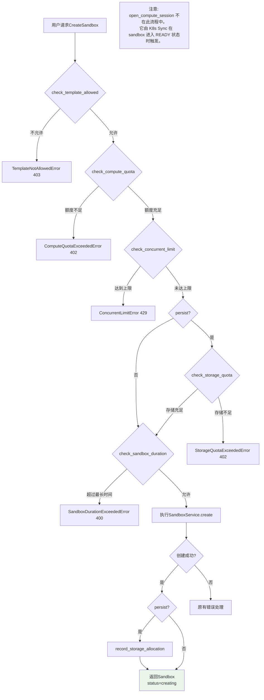
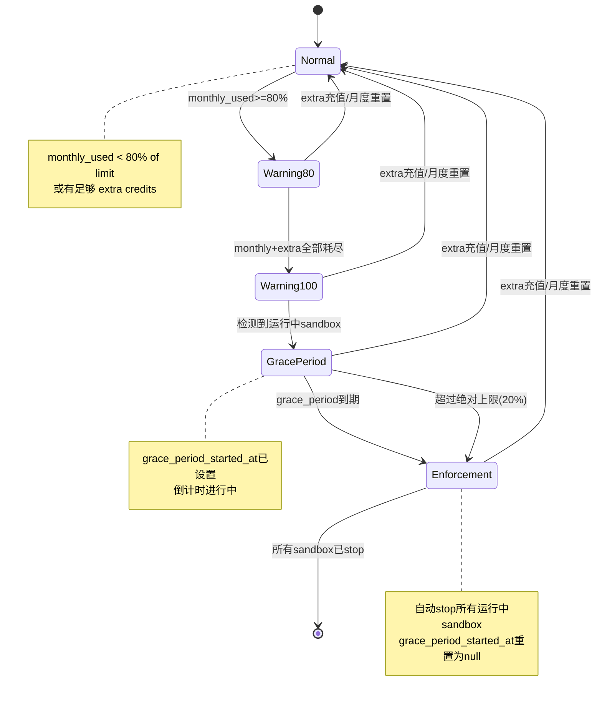

# 配额执行与 API 设计

**日期：** 2026-03-26
**状态：** 设计中
**关联文档：** [计量系统总览](2026-03-26-metering-overview.md)

---

## 1. 配额检查总流程

Sandbox 生命周期的关键节点需要执行配额检查，以确保用户在其 Tier 允许的范围内使用资源。

### 1.1 Create Sandbox 时的检查

创建 sandbox 是最严格的检查点，需要通过全部 5 项检查后才能继续：

1. **check_template_allowed(user_id, template)** — 检查用户所属 Tier 是否有权使用目标模板（如 Free 用户不能使用 `medium` / `large` 模板）
2. **check_compute_quota(user_id)** — 检查 Compute Credits 是否有剩余（月度额度 + Extra Credits 总余额 > 0）
3. **check_concurrent_limit(user_id)** — 检查当前运行中（`status = creating | ready`）的 sandbox 数量是否已达到并发上限
4. **if persist: check_storage_quota(user_id, size_gib)** — 仅当 `persist=True` 时，检查存储配额是否足够分配请求的空间
5. **check_sandbox_duration(user_id, template)** — 获取 Tier 允许的最长运行时间并与模板默认时长对比，超出则拒绝

所有检查通过后执行原有的 `SandboxService.create()` 逻辑，并在创建成功后记录存储分配。

### 1.2 Start Sandbox 时的检查

从 `stopped` 状态恢复时执行较轻量的检查：

1. **check_compute_quota(user_id)** — 恢复运行需要 Compute Credits
2. **check_concurrent_limit(user_id)** — 恢复后同样占用一个并发槽位

不需要重复 template、storage、duration 检查（创建时已验证）。

### 1.3 Stop / Delete Sandbox

不需要任何配额检查，始终允许执行。用户在任何情况下都可以主动停止或删除自己的 sandbox，包括在 grace period 和 enforcement 状态下。

### 1.4 Create Sandbox 配额检查流程图



### 1.5 检查顺序设计原则

检查按照「用户可操作性」排序——越容易通过自助操作解决的错误越先检查：

| 顺序 | 检查 | 用户自助解决方式 |
|------|------|---------------|
| 1 | template_allowed | 升级 Tier |
| 2 | compute_quota | 等待月度重置，或购买 Extra Credits |
| 3 | concurrent_limit | 停止已有 sandbox |
| 4 | storage_quota | 删除已有持久化 sandbox |
| 5 | sandbox_duration | 调小 auto_stop_interval |

---

## 2. 新增 Error 类型

在 `treadstone/core/errors.py` 中新增以下错误类，全部继承自 `TreadstoneError` 基类，遵循统一 JSON envelope 格式。

### 2.1 ComputeQuotaExceededError (HTTP 402)

选择 402 (Payment Required) 是因为该错误本质上是「资源使用已达上限，需要付费购买更多额度」，未来对接支付后语义完全对应。

```python
class ComputeQuotaExceededError(TreadstoneError):
    def __init__(
        self,
        monthly_used: float,
        monthly_limit: float,
        extra_remaining: float,
    ):
        super().__init__(
            code="compute_quota_exceeded",
            message=(
                f"Compute credits exhausted. "
                f"Monthly used: {monthly_used:.1f} / {monthly_limit:.1f} vCPU-hours, "
                f"extra remaining: {extra_remaining:.1f} vCPU-hours. "
                f"Please wait for the next billing cycle or purchase additional credits."
            ),
            status=402,
        )
```

**响应示例：**

```json
{
  "error": {
    "code": "compute_quota_exceeded",
    "message": "Compute credits exhausted. Monthly used: 100.0 / 100.0 vCPU-hours, extra remaining: 0.0 vCPU-hours. Please wait for the next billing cycle or purchase additional credits.",
    "status": 402
  }
}
```

### 2.2 StorageQuotaExceededError (HTTP 402)

```python
class StorageQuotaExceededError(TreadstoneError):
    def __init__(
        self,
        current_used_gib: int,
        requested_gib: int,
        total_quota_gib: int,
    ):
        super().__init__(
            code="storage_quota_exceeded",
            message=(
                f"Storage quota exceeded. "
                f"Current used: {current_used_gib} GiB, requested: {requested_gib} GiB, "
                f"total quota: {total_quota_gib} GiB (available: {total_quota_gib - current_used_gib} GiB). "
                f"Delete existing persistent sandboxes to free space, or upgrade your plan."
            ),
            status=402,
        )
```

**响应示例：**

```json
{
  "error": {
    "code": "storage_quota_exceeded",
    "message": "Storage quota exceeded. Current used: 8 GiB, requested: 5 GiB, total quota: 10 GiB (available: 2 GiB). Delete existing persistent sandboxes to free space, or upgrade your plan.",
    "status": 402
  }
}
```

### 2.3 ConcurrentLimitError (HTTP 429)

选择 429 (Too Many Requests) 是因为该错误表示「当前并发请求数过多」，与 HTTP 语义一致。客户端收到 429 后应停止已有 sandbox 再重试。

```python
class ConcurrentLimitError(TreadstoneError):
    def __init__(self, current_running: int, max_concurrent: int):
        super().__init__(
            code="concurrent_limit_exceeded",
            message=(
                f"Concurrent sandbox limit reached. "
                f"Running: {current_running} / {max_concurrent}. "
                f"Stop an existing sandbox before creating a new one."
            ),
            status=429,
        )
```

**响应示例：**

```json
{
  "error": {
    "code": "concurrent_limit_exceeded",
    "message": "Concurrent sandbox limit reached. Running: 3 / 3. Stop an existing sandbox before creating a new one.",
    "status": 429
  }
}
```

### 2.4 TemplateNotAllowedError (HTTP 403)

```python
class TemplateNotAllowedError(TreadstoneError):
    def __init__(self, tier: str, template: str, allowed_templates: list[str]):
        super().__init__(
            code="template_not_allowed",
            message=(
                f"Template '{template}' is not available on the '{tier}' tier. "
                f"Allowed templates: {', '.join(allowed_templates)}. "
                f"Upgrade your plan to access this template."
            ),
            status=403,
        )
```

**响应示例：**

```json
{
  "error": {
    "code": "template_not_allowed",
    "message": "Template 'medium' is not available on the 'free' tier. Allowed templates: tiny, small. Upgrade your plan to access this template.",
    "status": 403
  }
}
```

### 2.5 SandboxDurationExceededError (HTTP 400)

```python
class SandboxDurationExceededError(TreadstoneError):
    def __init__(self, tier: str, max_duration_seconds: int):
        hours = max_duration_seconds // 3600
        minutes = (max_duration_seconds % 3600) // 60
        duration_str = f"{hours}h{minutes}m" if minutes else f"{hours}h"
        super().__init__(
            code="sandbox_duration_exceeded",
            message=(
                f"Requested sandbox duration exceeds the '{tier}' tier maximum of {duration_str}. "
                f"Reduce auto_stop_interval or upgrade your plan."
            ),
            status=400,
        )
```

**响应示例：**

```json
{
  "error": {
    "code": "sandbox_duration_exceeded",
    "message": "Requested sandbox duration exceeds the 'free' tier maximum of 2h. Reduce auto_stop_interval or upgrade your plan.",
    "status": 400
  }
}
```

### 2.6 Error 类汇总

| Error 类 | HTTP Status | code | 触发场景 |
|----------|-------------|------|---------|
| ComputeQuotaExceededError | 402 | compute_quota_exceeded | 月度 + extra 额度全部耗尽 |
| StorageQuotaExceededError | 402 | storage_quota_exceeded | 存储已用 + 请求量 > 总配额 |
| ConcurrentLimitError | 429 | concurrent_limit_exceeded | 运行中 sandbox 数达到上限 |
| TemplateNotAllowedError | 403 | template_not_allowed | Tier 不允许使用目标模板 |
| SandboxDurationExceededError | 400 | sandbox_duration_exceeded | 超过 Tier 最长运行时间 |

所有错误均通过现有的 `TreadstoneError` 异常处理链（`main.py` 中的 `treadstone_error_handler`）自动转换为统一 JSON 格式。无需额外注册处理器。

---

## 3. Grace Period 状态机

当 Compute Credits 完全耗尽（月度 + Extra 均为 0）时，系统不会立即强制停止所有运行中 sandbox，而是进入一个 Grace Period（宽限期），给用户时间保存工作。

### 3.1 状态定义

| 状态 | 条件 | 用户可执行操作 | 系统行为 |
|------|------|--------------|---------|
| **normal** | `monthly_used < 80% of limit`（或有足够的 extra） | 全部操作 | 无 |
| **warning_80** | `monthly_used >= 80% of limit`（但 monthly + extra 仍有余额）| 全部操作 | 记录 `metering.compute_warning_80` 审计事件 |
| **warning_100** | `monthly + extra` 全部耗尽 | 禁止 `create` / `start`；运行中 sandbox 继续运行 | 记录 `metering.compute_warning_100`；运行中 sandbox 进入 grace period |
| **grace_period** | 耗尽后 grace period 倒计时中 | 禁止 `create` / `start`；可以 `stop` / `delete` | 记录 `metering.grace_period_started`；持续检查倒计时 |
| **enforcement** | grace period 到期（或超过绝对上限） | 仅 `stop` / `delete` | 自动 stop 所有运行中 sandbox；记录 `metering.auto_stop` |

### 3.2 Grace Period 时长

不同 Tier 的 Grace Period 时长不同，在 TierTemplate 中配置：

| Tier | Grace Period | 说明 |
|------|-------------|------|
| Free | 10 分钟 | 最短宽限，鼓励升级 |
| Pro | 30 分钟 | 足够保存工作 |
| Ultra | 60 分钟 | 充裕时间 |
| Enterprise | 自定义（默认 120 分钟） | 通过 `overrides` 调整 |

### 3.3 状态转换图



### 3.4 Grace Period 计时实现

在 `UserPlan` 模型中添加字段：

```python
grace_period_started_at: Mapped[datetime | None] = mapped_column(
    DateTime(timezone=True), nullable=True, default=None
)
```

- `None` 表示当前不在 grace period 中
- 非 `None` 表示 grace period 的起始时间

### 3.5 tick_metering() 中的 Grace Period 检查

`tick_metering()` 由 `sync_supervisor` 在 leader 节点上定期调用（建议间隔 60 秒），核心逻辑如下：

```python
async def check_grace_periods(self, session: AsyncSession) -> None:
    """检查所有用户的 grace period 状态，执行自动 stop。"""
    # 查询所有有运行中 sandbox 的用户
    users_with_running = await self._get_users_with_running_sandboxes(session)

    for user_id in users_with_running:
        plan = await self.get_user_plan(session, user_id)
        total_remaining = await self.get_total_compute_remaining(session, user_id)

        if total_remaining <= 0:
            # 额度耗尽
            if plan.grace_period_started_at is None:
                # 首次检测到耗尽 → 启动 grace period
                plan.grace_period_started_at = utc_now()
                session.add(plan)
                await record_audit_event(
                    session,
                    action="metering.grace_period_started",
                    target_type="user",
                    target_id=user_id,
                    actor_type=AuditActorType.SYSTEM.value,
                    metadata={
                        "tier": plan.tier,
                        "grace_period_seconds": plan.grace_period_seconds,
                        "monthly_used": float(plan.compute_credits_monthly_used),
                        "monthly_limit": float(plan.compute_credits_monthly_limit),
                    },
                )
                await session.commit()
                continue

            elapsed = (utc_now() - plan.grace_period_started_at).total_seconds()

            # 检查绝对上限：grace period 内超额消耗不超过月度额度的 20%
            overage = abs(total_remaining)  # total_remaining 为负数
            absolute_cap = float(plan.compute_credits_monthly_limit) * 0.20
            exceeded_absolute_cap = overage > absolute_cap

            if elapsed > plan.grace_period_seconds or exceeded_absolute_cap:
                # Grace period 到期或超过绝对上限 → 自动 stop
                reason = "absolute_cap_exceeded" if exceeded_absolute_cap else "grace_period_expired"
                sandboxes = await self._get_running_sandboxes(session, user_id)
                for sandbox in sandboxes:
                    await self._force_stop_sandbox(session, sandbox)
                    await record_audit_event(
                        session,
                        action="metering.auto_stop",
                        target_type="sandbox",
                        target_id=sandbox.id,
                        actor_type=AuditActorType.SYSTEM.value,
                        metadata={
                            "user_id": user_id,
                            "tier": plan.tier,
                            "reason": reason,
                            "grace_elapsed_seconds": int(elapsed),
                            "overage_vcpu_hours": float(overage),
                        },
                    )
                plan.grace_period_started_at = None
                session.add(plan)
                await session.commit()
        else:
            # 额度恢复（比如 admin 手动添加了 extra credits）
            if plan.grace_period_started_at is not None:
                plan.grace_period_started_at = None
                session.add(plan)
                await record_audit_event(
                    session,
                    action="metering.grace_period_cleared",
                    target_type="user",
                    target_id=user_id,
                    actor_type=AuditActorType.SYSTEM.value,
                    metadata={
                        "tier": plan.tier,
                        "total_remaining": float(total_remaining),
                    },
                )
                await session.commit()
```

### 3.6 绝对上限

Grace Period 内允许的最大超额消耗 = **Tier 月度额度的 20%**。

| Tier | 月度额度 | 绝对上限 (20%) | Grace Period |
|------|---------|---------------|-------------|
| Free | 10 vCPU-hours | 2 vCPU-hours | 10 分钟 |
| Pro | 100 vCPU-hours | 20 vCPU-hours | 30 分钟 |
| Ultra | 500 vCPU-hours | 100 vCPU-hours | 60 分钟 |
| Enterprise | 自定义 | 自定义 × 20% | 自定义 |

超过绝对上限时立即 stop 所有运行中 sandbox，不等 grace period 计时结束。这防止了长时间运行的高配 sandbox 在 grace period 内消耗过多资源。

### 3.7 与 auto_stop_interval 的关系

| 机制 | 作用域 | 触发条件 | 执行者 |
|------|--------|---------|--------|
| `auto_stop_interval` | 单个 sandbox | 该 sandbox 空闲超过指定分钟数 | K8s Sandbox Controller |
| Grace Period | 用户级别（全局） | 用户 compute credits 耗尽 | MeteringService.check_grace_periods() |

两者独立运行，互不干扰。当两者同时满足时，**取先到者执行 stop**：
- 如果 sandbox 先空闲超时，K8s controller 会 scale 到 0，`k8s_sync` 会将状态同步为 `stopped`
- 如果 grace period 先到期，`check_grace_periods()` 会通过 `_force_stop_sandbox()` 执行 stop

### 3.8 create / start 时的 Grace Period 感知

在 `check_compute_quota()` 中，如果 `total_remaining <= 0`，直接抛出 `ComputeQuotaExceededError`，不区分是否在 grace period 中。这意味着：

- 用户在 grace period 中**无法**创建新 sandbox 或启动已停止的 sandbox
- 用户在 grace period 中**可以**正常使用运行中的 sandbox、执行 stop、执行 delete
- Grace period 只影响新增资源消耗，不影响释放资源

---

## 4. 通知事件

Phase 1 通过审计日志（`audit_event` 表）记录计量通知事件。不发送邮件 / Webhook / 推送。未来 Phase 2 扩展通知渠道时，从审计日志中读取事件即可。

### 4.1 事件列表

| 事件 | action | 触发条件 | 严重程度 |
|------|--------|---------|---------|
| 80% 预警 | `metering.compute_warning_80` | `monthly_used >= 80% of monthly_limit`（首次跨越阈值时触发一次） | warning |
| 100% 预警 | `metering.compute_warning_100` | `monthly + extra` 全部耗尽 | critical |
| Grace Period 开始 | `metering.grace_period_started` | 首次检测到 credit 耗尽且有运行中 sandbox | critical |
| Grace Period 恢复 | `metering.grace_period_cleared` | 在 grace period 中恢复了额度 | info |
| 自动 Stop | `metering.auto_stop` | grace period 过期或超过绝对上限 | critical |
| 存储超配 | `metering.storage_overcommit` | 月度重置后存储超出新配额（降级场景） | warning |
| 月度重置 | `metering.monthly_reset` | 月度额度重置完成 | info |
| Extra Credits 发放 | `metering.credits_granted` | admin 手动或批量发放 extra credits | info |

### 4.2 事件 metadata 结构

所有计量事件的 `event_metadata` 统一包含以下基础字段：

```json
{
  "user_id": "user_abc123",
  "tier": "pro",
  "credits_monthly_used": 95.5,
  "credits_monthly_limit": 100.0,
  "credits_extra_remaining": 0.0,
  "credits_total_remaining": 4.5,
  "timestamp": "2026-03-26T10:30:00Z"
}
```

不同事件会附加额外字段：

**metering.grace_period_started** 额外字段：
```json
{
  "grace_period_seconds": 1800,
  "running_sandbox_count": 2,
  "running_sandbox_ids": ["sb_xxx", "sb_yyy"]
}
```

**metering.auto_stop** 额外字段：
```json
{
  "reason": "grace_period_expired",
  "grace_elapsed_seconds": 1823,
  "stopped_sandbox_ids": ["sb_xxx", "sb_yyy"],
  "overage_vcpu_hours": 5.2
}
```

**metering.storage_overcommit** 额外字段：
```json
{
  "current_storage_used_gib": 15,
  "new_storage_quota_gib": 10,
  "overcommit_gib": 5
}
```

**metering.credits_granted** 额外字段：
```json
{
  "grant_id": "cg_xxx",
  "credit_type": "compute",
  "amount": 100.0,
  "grant_type": "admin_grant",
  "granted_by": "user_admin_id",
  "reason": "特殊支持",
  "expires_at": "2026-06-01T00:00:00Z"
}
```

### 4.3 防重复触发

对于阈值类事件（`warning_80`、`warning_100`、`storage_overcommit`），使用 `UserPlan` 中的标志位避免在同一个 billing period 内重复触发：

```python
warning_80_notified_at: Mapped[datetime | None] = mapped_column(
    DateTime(timezone=True), nullable=True, default=None
)
warning_100_notified_at: Mapped[datetime | None] = mapped_column(
    DateTime(timezone=True), nullable=True, default=None
)
```

月度重置时将这两个字段清零，确保下个周期可以重新触发。

---

## 5. Usage API

新建 `treadstone/api/usage.py`，路由前缀 `/v1/usage`，`tags=["usage"]`。

所有端点使用 `get_current_control_plane_user` 认证（支持 session cookie 和 `sk-` API Key）。

### 5.1 GET /v1/usage — 使用概览

返回当前用户的完整配额使用概览，是前端仪表盘和 CLI 的主要数据源。

**认证**：`get_current_control_plane_user`

**请求**：

```
GET /v1/usage HTTP/1.1
Authorization: Bearer sk-xxxxxxxxxxxxxxxx
```

**成功响应**（200 OK）：

```json
{
  "tier": "pro",
  "billing_period": {
    "start": "2026-03-01T00:00:00Z",
    "end": "2026-04-01T00:00:00Z"
  },
  "compute": {
    "monthly_limit": 100.0,
    "monthly_used": 45.5,
    "monthly_remaining": 54.5,
    "extra_remaining": 50.0,
    "total_remaining": 104.5,
    "unit": "vCPU-hours"
  },
  "storage": {
    "monthly_limit": 10,
    "extra_remaining": 0,
    "total_quota": 10,
    "current_used": 5,
    "available": 5,
    "unit": "GiB"
  },
  "limits": {
    "max_concurrent_running": 3,
    "current_running": 1,
    "max_sandbox_duration_seconds": 7200,
    "allowed_templates": ["tiny", "small", "medium"]
  },
  "grace_period": {
    "active": false,
    "started_at": null,
    "expires_at": null,
    "grace_period_seconds": 1800
  }
}
```

**当 grace period 激活时**：

```json
{
  "tier": "pro",
  "billing_period": {
    "start": "2026-03-01T00:00:00Z",
    "end": "2026-04-01T00:00:00Z"
  },
  "compute": {
    "monthly_limit": 100.0,
    "monthly_used": 100.0,
    "monthly_remaining": 0.0,
    "extra_remaining": 0.0,
    "total_remaining": -3.2,
    "unit": "vCPU-hours"
  },
  "storage": {
    "monthly_limit": 10,
    "extra_remaining": 0,
    "total_quota": 10,
    "current_used": 5,
    "available": 5,
    "unit": "GiB"
  },
  "limits": {
    "max_concurrent_running": 3,
    "current_running": 2,
    "max_sandbox_duration_seconds": 7200,
    "allowed_templates": ["tiny", "small", "medium"]
  },
  "grace_period": {
    "active": true,
    "started_at": "2026-03-26T10:00:00Z",
    "expires_at": "2026-03-26T10:30:00Z",
    "grace_period_seconds": 1800
  }
}
```

**路由实现骨架**：

```python
@router.get("", tags=["usage"])
async def get_usage(
    user: User = Depends(get_current_control_plane_user),
    session: AsyncSession = Depends(get_session),
):
    metering = MeteringService()
    summary = await metering.get_usage_summary(session, user.id)
    return summary
```

### 5.2 GET /v1/usage/plan — 完整 Plan 详情

返回用户 `UserPlan` 的完整字段，包括所有配额数值、overrides、period 信息。

**认证**：`get_current_control_plane_user`

**请求**：

```
GET /v1/usage/plan HTTP/1.1
Cookie: session=...
```

**成功响应**（200 OK）：

```json
{
  "id": "plan_abc123",
  "user_id": "user_abc123",
  "tier": "pro",
  "compute_credits_monthly_limit": 100.0,
  "compute_credits_monthly_used": 45.5,
  "storage_credits_monthly_limit": 10,
  "max_concurrent_running": 3,
  "max_sandbox_duration_seconds": 7200,
  "allowed_templates": ["tiny", "small", "medium"],
  "grace_period_seconds": 1800,
  "overrides": {
    "compute_credits_monthly_limit": 150
  },
  "billing_period_start": "2026-03-01T00:00:00Z",
  "billing_period_end": "2026-04-01T00:00:00Z",
  "grace_period_started_at": null,
  "warning_80_notified_at": null,
  "warning_100_notified_at": null,
  "created_at": "2026-01-15T08:00:00Z",
  "updated_at": "2026-03-01T00:00:00Z"
}
```

**路由实现骨架**：

```python
@router.get("/plan", tags=["usage"])
async def get_plan(
    user: User = Depends(get_current_control_plane_user),
    session: AsyncSession = Depends(get_session),
):
    metering = MeteringService()
    plan = await metering.get_user_plan(session, user.id)
    return plan.to_dict()
```

### 5.3 GET /v1/usage/sessions — Compute Session 列表

返回用户的 ComputeSession 分页列表，每个 session 对应一次 sandbox 运行周期。

**认证**：`get_current_control_plane_user`

**Query 参数**：

| 参数 | 类型 | 默认值 | 说明 |
|------|------|--------|------|
| `status` | string | `"all"` | `"active"` / `"completed"` / `"all"` |
| `limit` | int | 20 | 每页数量，最大 100 |
| `offset` | int | 0 | 偏移量 |

**请求**：

```
GET /v1/usage/sessions?status=active&limit=10&offset=0 HTTP/1.1
Authorization: Bearer sk-xxxxxxxxxxxxxxxx
```

**成功响应**（200 OK）：

```json
{
  "items": [
    {
      "id": "cs_abc123",
      "sandbox_id": "sb_xxx",
      "sandbox_name": "my-dev-env",
      "template": "small",
      "vcpu_millicores": 1000,
      "started_at": "2026-03-26T08:00:00Z",
      "ended_at": null,
      "duration_seconds": 7200,
      "credits_consumed": 2.0,
      "status": "active"
    },
    {
      "id": "cs_def456",
      "sandbox_id": "sb_yyy",
      "sandbox_name": "test-runner",
      "template": "tiny",
      "vcpu_millicores": 500,
      "started_at": "2026-03-25T14:00:00Z",
      "ended_at": "2026-03-25T16:30:00Z",
      "duration_seconds": 9000,
      "credits_consumed": 1.25,
      "status": "completed"
    }
  ],
  "total": 42,
  "limit": 10,
  "offset": 0
}
```

**路由实现骨架**：

```python
@router.get("/sessions", tags=["usage"])
async def list_compute_sessions(
    user: User = Depends(get_current_control_plane_user),
    session: AsyncSession = Depends(get_session),
    status: str = Query(default="all", regex="^(active|completed|all)$"),
    limit: int = Query(default=20, ge=1, le=100),
    offset: int = Query(default=0, ge=0),
):
    metering = MeteringService()
    items, total = await metering.list_compute_sessions(
        session, user.id, status=status, limit=limit, offset=offset
    )
    return {"items": [s.to_dict() for s in items], "total": total, "limit": limit, "offset": offset}
```

### 5.4 GET /v1/usage/grants — Credit Grant 列表

返回用户的所有 CreditGrant 记录，包括已用完和已过期的。

**认证**：`get_current_control_plane_user`

**请求**：

```
GET /v1/usage/grants HTTP/1.1
Authorization: Bearer sk-xxxxxxxxxxxxxxxx
```

**成功响应**（200 OK）：

```json
{
  "items": [
    {
      "id": "cg_abc123",
      "credit_type": "compute",
      "amount": 100.0,
      "remaining": 50.0,
      "grant_type": "admin_grant",
      "reason": "特殊支持",
      "granted_by": "user_admin_id",
      "campaign_id": null,
      "status": "active",
      "created_at": "2026-03-01T00:00:00Z",
      "expires_at": "2026-06-01T00:00:00Z"
    },
    {
      "id": "cg_def456",
      "credit_type": "compute",
      "amount": 50.0,
      "remaining": 0.0,
      "grant_type": "campaign",
      "reason": "春季促销活动",
      "granted_by": "user_admin_id",
      "campaign_id": "spring_2026_promo",
      "status": "exhausted",
      "created_at": "2026-02-15T00:00:00Z",
      "expires_at": "2026-04-01T00:00:00Z"
    },
    {
      "id": "cg_ghi789",
      "credit_type": "storage",
      "amount": 5,
      "remaining": 5,
      "grant_type": "admin_grant",
      "reason": "额外存储需求",
      "granted_by": "user_admin_id",
      "campaign_id": null,
      "status": "active",
      "created_at": "2026-03-20T00:00:00Z",
      "expires_at": null
    }
  ]
}
```

**Grant status 计算规则**（虚拟字段，不存储在 DB）：

| status | 条件 |
|--------|------|
| `active` | `remaining > 0` 且未过期 |
| `exhausted` | `remaining <= 0` |
| `expired` | `expires_at < now()` 且 `remaining > 0` |

**路由实现骨架**：

```python
@router.get("/grants", tags=["usage"])
async def list_credit_grants(
    user: User = Depends(get_current_control_plane_user),
    session: AsyncSession = Depends(get_session),
):
    metering = MeteringService()
    grants = await metering.list_credit_grants(session, user.id)
    return {"items": [g.to_response_dict() for g in grants]}
```

---

## 6. Admin API

新建 `treadstone/api/admin.py`，路由前缀 `/v1/admin`，`tags=["admin"]`。

所有端点使用 `get_current_admin` 认证（检查 `user.role == "admin"`）。

### 6.1 GET /v1/admin/users/{user_id}/usage — 查看任意用户使用概览

管理员可以查看任意用户的使用情况，响应格式与 `GET /v1/usage` 完全一致。

**认证**：`get_current_admin`

**请求**：

```
GET /v1/admin/users/user_abc123/usage HTTP/1.1
Authorization: Bearer sk-admin-key
```

**成功响应**（200 OK）：格式同 `GET /v1/usage`。

**用户不存在时**（404）：

```json
{
  "error": {
    "code": "not_found",
    "message": "User 'user_abc123' not found.",
    "status": 404
  }
}
```

**路由实现骨架**：

```python
@router.get("/users/{user_id}/usage", tags=["admin"])
async def admin_get_user_usage(
    user_id: str,
    admin: User = Depends(get_current_admin),
    session: AsyncSession = Depends(get_session),
):
    target_user = await session.get(User, user_id)
    if target_user is None:
        raise NotFoundError("User", user_id)
    metering = MeteringService()
    return await metering.get_usage_summary(session, user_id)
```

### 6.2 PATCH /v1/admin/users/{user_id}/plan — 修改用户 Plan

修改用户的 Tier 和/或 override 特定配额值。

**认证**：`get_current_admin`

**请求**：

```
PATCH /v1/admin/users/user_abc123/plan HTTP/1.1
Authorization: Bearer sk-admin-key
Content-Type: application/json

{
  "tier": "ultra",
  "overrides": {
    "compute_credits_monthly_limit": 500,
    "max_concurrent_running": 10
  }
}
```

**Request Body 字段说明**：

| 字段 | 类型 | 必填 | 说明 |
|------|------|------|------|
| `tier` | string | 否 | 新的 Tier 名称，必须是已存在的 TierTemplate |
| `overrides` | object | 否 | 覆盖特定配额值，key 为 UserPlan 字段名 |

**合法的 overrides key**：

- `compute_credits_monthly_limit` (float)
- `storage_credits_monthly_limit` (int)
- `max_concurrent_running` (int)
- `max_sandbox_duration_seconds` (int)
- `allowed_templates` (list[str])
- `grace_period_seconds` (int)

**处理逻辑**：

1. 如果指定了 `tier`，从 `TierTemplate` 加载新 Tier 的默认值
2. 将 TierTemplate 的默认值写入 UserPlan（覆盖旧值）
3. 将 `overrides` 中的值叠加到 UserPlan 上（优先级最高）
4. 将 `overrides` JSON 保存到 UserPlan.overrides 字段（用于审计和回溯）
5. 记录审计事件 `admin.user.plan_updated`

**成功响应**（200 OK）：返回更新后的完整 UserPlan。

```json
{
  "id": "plan_abc123",
  "user_id": "user_abc123",
  "tier": "ultra",
  "compute_credits_monthly_limit": 500.0,
  "compute_credits_monthly_used": 45.5,
  "storage_credits_monthly_limit": 50,
  "max_concurrent_running": 10,
  "max_sandbox_duration_seconds": 14400,
  "allowed_templates": ["tiny", "small", "medium", "large"],
  "grace_period_seconds": 3600,
  "overrides": {
    "compute_credits_monthly_limit": 500,
    "max_concurrent_running": 10
  },
  "billing_period_start": "2026-03-01T00:00:00Z",
  "billing_period_end": "2026-04-01T00:00:00Z",
  "updated_at": "2026-03-26T12:00:00Z"
}
```

**失败场景**：

- Tier 不存在 → `NotFoundError("TierTemplate", tier_name)` (404)
- overrides 中包含不合法的 key → `ValidationError` (422)

### 6.3 POST /v1/admin/users/{user_id}/grants — 添加 Extra Credits

管理员手动给用户添加 Extra Credits。

**认证**：`get_current_admin`

**请求**：

```
POST /v1/admin/users/user_abc123/grants HTTP/1.1
Authorization: Bearer sk-admin-key
Content-Type: application/json

{
  "credit_type": "compute",
  "amount": 100,
  "grant_type": "admin_grant",
  "reason": "特殊支持",
  "expires_at": "2026-06-01T00:00:00Z"
}
```

**Request Body 字段说明**：

| 字段 | 类型 | 必填 | 说明 |
|------|------|------|------|
| `credit_type` | string | 是 | `"compute"` 或 `"storage"` |
| `amount` | float | 是 | 发放数量（compute: vCPU-hours，storage: GiB）|
| `grant_type` | string | 是 | `"admin_grant"` / `"campaign"` / `"compensation"` |
| `reason` | string | 否 | 发放原因（纯文本记录） |
| `campaign_id` | string | 否 | 营销活动 ID（仅 `grant_type=campaign` 时有意义） |
| `expires_at` | datetime | 否 | 过期时间，null 表示永不过期 |

**处理逻辑**：

1. 创建 `CreditGrant` 记录，`granted_by = admin_user.id`，`remaining = amount`
2. 如果用户当前在 grace period 中且 credit_type 为 compute，恢复的额度可能使 `total_remaining > 0`。下一次 `check_grace_periods()` 会自动清除 grace period
3. 记录审计事件 `metering.credits_granted`

**成功响应**（201 Created）：

```json
{
  "id": "cg_new123",
  "user_id": "user_abc123",
  "credit_type": "compute",
  "amount": 100.0,
  "remaining": 100.0,
  "grant_type": "admin_grant",
  "reason": "特殊支持",
  "granted_by": "user_admin_id",
  "campaign_id": null,
  "created_at": "2026-03-26T12:00:00Z",
  "expires_at": "2026-06-01T00:00:00Z"
}
```

### 6.4 GET /v1/admin/tier-templates — 获取所有 Tier 模板

**认证**：`get_current_admin`

**请求**：

```
GET /v1/admin/tier-templates HTTP/1.1
Authorization: Bearer sk-admin-key
```

**成功响应**（200 OK）：

```json
{
  "items": [
    {
      "tier": "free",
      "compute_credits_monthly": 10.0,
      "storage_credits_monthly": 1,
      "max_concurrent_running": 1,
      "max_sandbox_duration_seconds": 3600,
      "allowed_templates": ["tiny"],
      "grace_period_seconds": 600,
      "created_at": "2026-01-01T00:00:00Z",
      "updated_at": "2026-01-01T00:00:00Z"
    },
    {
      "tier": "pro",
      "compute_credits_monthly": 100.0,
      "storage_credits_monthly": 10,
      "max_concurrent_running": 3,
      "max_sandbox_duration_seconds": 7200,
      "allowed_templates": ["tiny", "small", "medium"],
      "grace_period_seconds": 1800,
      "created_at": "2026-01-01T00:00:00Z",
      "updated_at": "2026-01-01T00:00:00Z"
    },
    {
      "tier": "ultra",
      "compute_credits_monthly": 500.0,
      "storage_credits_monthly": 50,
      "max_concurrent_running": 10,
      "max_sandbox_duration_seconds": 14400,
      "allowed_templates": ["tiny", "small", "medium", "large"],
      "grace_period_seconds": 3600,
      "created_at": "2026-01-01T00:00:00Z",
      "updated_at": "2026-01-01T00:00:00Z"
    },
    {
      "tier": "enterprise",
      "compute_credits_monthly": 5000.0,
      "storage_credits_monthly": 500,
      "max_concurrent_running": 50,
      "max_sandbox_duration_seconds": 86400,
      "allowed_templates": ["tiny", "small", "medium", "large", "gpu"],
      "grace_period_seconds": 7200,
      "created_at": "2026-01-01T00:00:00Z",
      "updated_at": "2026-01-01T00:00:00Z"
    }
  ]
}
```

### 6.5 PATCH /v1/admin/tier-templates/{tier_name} — 修改 Tier 模板

修改 TierTemplate 的默认配额值。

**认证**：`get_current_admin`

**请求**：

```
PATCH /v1/admin/tier-templates/pro HTTP/1.1
Authorization: Bearer sk-admin-key
Content-Type: application/json

{
  "compute_credits_monthly": 150,
  "storage_credits_monthly": 15,
  "apply_to_existing": false
}
```

**Request Body 字段说明**：

| 字段 | 类型 | 必填 | 说明 |
|------|------|------|------|
| `compute_credits_monthly` | float | 否 | 新的月度 compute credits |
| `storage_credits_monthly` | int | 否 | 新的月度 storage credits |
| `max_concurrent_running` | int | 否 | 新的并发上限 |
| `max_sandbox_duration_seconds` | int | 否 | 新的最长运行时间 |
| `allowed_templates` | list[str] | 否 | 新的允许模板列表 |
| `grace_period_seconds` | int | 否 | 新的 grace period 时长 |
| `apply_to_existing` | bool | 否 | 是否将变更应用到该 Tier 的所有现有用户，默认 `false` |

**处理逻辑**：

1. 更新 TierTemplate 的对应字段
2. 如果 `apply_to_existing = true`：
   - 查询所有 `tier = tier_name` 且没有 overrides 的用户
   - 批量更新这些用户的 UserPlan 对应字段
   - 有 overrides 的用户不受影响（override 优先）
3. 记录审计事件 `admin.tier_template.updated`，metadata 中包含变更前后的值和影响的用户数

**成功响应**（200 OK）：

```json
{
  "tier": "pro",
  "compute_credits_monthly": 150.0,
  "storage_credits_monthly": 15,
  "max_concurrent_running": 3,
  "max_sandbox_duration_seconds": 7200,
  "allowed_templates": ["tiny", "small", "medium"],
  "grace_period_seconds": 1800,
  "updated_at": "2026-03-26T12:00:00Z",
  "users_affected": 0
}
```

**当 `apply_to_existing = true` 时**：

```json
{
  "tier": "pro",
  "compute_credits_monthly": 150.0,
  "storage_credits_monthly": 15,
  "max_concurrent_running": 3,
  "max_sandbox_duration_seconds": 7200,
  "allowed_templates": ["tiny", "small", "medium"],
  "grace_period_seconds": 1800,
  "updated_at": "2026-03-26T12:00:00Z",
  "users_affected": 127
}
```

### 6.6 POST /v1/admin/grants/batch — 批量发放 Extra Credits

用于营销活动、补偿等场景，一次性给多个用户发放 Extra Credits。

**认证**：`get_current_admin`

**请求**：

```
POST /v1/admin/grants/batch HTTP/1.1
Authorization: Bearer sk-admin-key
Content-Type: application/json

{
  "user_ids": ["user_abc1", "user_abc2", "user_abc3"],
  "credit_type": "compute",
  "amount": 50,
  "grant_type": "campaign",
  "campaign_id": "spring_2026_promo",
  "reason": "春季促销活动",
  "expires_at": "2026-06-01T00:00:00Z"
}
```

**Request Body 字段说明**：

| 字段 | 类型 | 必填 | 说明 |
|------|------|------|------|
| `user_ids` | list[str] | 是 | 用户 ID 列表，最多 1000 个 |
| `credit_type` | string | 是 | `"compute"` 或 `"storage"` |
| `amount` | float | 是 | 每个用户发放的数量 |
| `grant_type` | string | 是 | `"campaign"` / `"compensation"` / `"admin_grant"` |
| `campaign_id` | string | 否 | 营销活动 ID |
| `reason` | string | 否 | 发放原因 |
| `expires_at` | datetime | 否 | 过期时间 |

**处理逻辑**：

1. 验证所有 `user_ids` 对应的用户存在（不存在的 ID 记录在 `failed` 列表中）
2. 为每个存在的用户创建 `CreditGrant`
3. 为每个成功的 grant 记录审计事件 `metering.credits_granted`
4. 事务级别：每个用户的 grant 独立事务，部分失败不影响其他用户

**成功响应**（200 OK）：

```json
{
  "total_requested": 3,
  "succeeded": 3,
  "failed": 0,
  "results": [
    {
      "user_id": "user_abc1",
      "grant_id": "cg_001",
      "status": "success"
    },
    {
      "user_id": "user_abc2",
      "grant_id": "cg_002",
      "status": "success"
    },
    {
      "user_id": "user_abc3",
      "grant_id": "cg_003",
      "status": "success"
    }
  ]
}
```

**部分失败时**（200 OK，但 `failed > 0`）：

```json
{
  "total_requested": 3,
  "succeeded": 2,
  "failed": 1,
  "results": [
    {
      "user_id": "user_abc1",
      "grant_id": "cg_001",
      "status": "success"
    },
    {
      "user_id": "user_nonexist",
      "grant_id": null,
      "status": "failed",
      "error": "User not found"
    },
    {
      "user_id": "user_abc3",
      "grant_id": "cg_003",
      "status": "success"
    }
  ]
}
```

---

## 7. MeteringService 方法签名与接口设计

新建 `treadstone/services/metering_service.py`，包含所有配额检查、会话管理、Credit Grant 和后台任务的核心业务逻辑。

### 7.1 完整方法签名

```python
from datetime import datetime
from decimal import Decimal

from sqlalchemy.ext.asyncio import AsyncSession

from treadstone.models.metering import (
    ComputeSession,
    CreditGrant,
    StorageLedger,
    TierTemplate,
    UserPlan,
)
from treadstone.models.sandbox import Sandbox


class MeteringService:
    """配额检查与计量核心服务。

    所有方法接受 AsyncSession 作为参数（而非在构造时注入），
    与 SandboxService 的模式保持一致。
    """

    # ── Plan Management ──

    async def ensure_user_plan(
        self, session: AsyncSession, user_id: str, tier: str = "free"
    ) -> UserPlan:
        """获取或创建用户的 UserPlan。
        首次调用时从 TierTemplate 拷贝默认值。
        幂等：如果 UserPlan 已存在则直接返回。
        """
        ...

    async def get_user_plan(
        self, session: AsyncSession, user_id: str
    ) -> UserPlan:
        """获取用户的 UserPlan，不存在时调用 ensure_user_plan 自动创建。"""
        ...

    async def update_user_tier(
        self,
        session: AsyncSession,
        user_id: str,
        new_tier: str,
        overrides: dict | None = None,
    ) -> UserPlan:
        """变更用户 Tier。
        从 TierTemplate 加载新 Tier 的默认值，
        然后叠加 overrides 中的覆盖值。
        """
        ...

    # ── Quota Checks ──
    # 检查通过时无返回值，不通过时抛出对应 TreadstoneError 子类。
    # 抛异常而非返回 bool 的设计：调用方无需手动构建错误信息，
    # 且异常会被 main.py 的全局处理器自动转为 JSON 响应。

    async def check_compute_quota(
        self, session: AsyncSession, user_id: str
    ) -> None:
        """检查用户 compute credits 是否有剩余。
        total_remaining = monthly_remaining + extra_remaining
        如果 total_remaining <= 0，抛出 ComputeQuotaExceededError。
        """
        ...

    async def check_storage_quota(
        self, session: AsyncSession, user_id: str, requested_gib: int
    ) -> None:
        """检查用户存储配额是否足够分配 requested_gib。
        total_quota = monthly_limit + extra_storage
        available = total_quota - current_used
        如果 available < requested_gib，抛出 StorageQuotaExceededError。
        """
        ...

    async def check_concurrent_limit(
        self, session: AsyncSession, user_id: str
    ) -> None:
        """检查用户当前运行中 sandbox 数是否达到上限。
        running = count(sandbox where owner_id=user_id and status in (creating, ready))
        如果 running >= max_concurrent_running，抛出 ConcurrentLimitError。
        """
        ...

    async def check_template_allowed(
        self, session: AsyncSession, user_id: str, template: str
    ) -> None:
        """检查用户所属 Tier 是否允许使用目标模板。
        如果 template not in allowed_templates，抛出 TemplateNotAllowedError。
        """
        ...

    async def check_sandbox_duration(
        self, session: AsyncSession, user_id: str
    ) -> int:
        """返回用户 Tier 允许的最大 sandbox 运行秒数。
        调用方可用此值校验 auto_stop_interval。
        """
        ...

    # ── Compute Session Management ──

    async def open_compute_session(
        self, session: AsyncSession, sandbox: Sandbox
    ) -> ComputeSession:
        """当 sandbox 进入 ready 状态时，打开一个 ComputeSession。
        记录 sandbox 的 vCPU millicores、started_at 等信息。
        由 k8s_sync 在状态变为 ready 时调用。
        """
        ...

    async def close_compute_session(
        self, session: AsyncSession, sandbox_id: str
    ) -> ComputeSession:
        """当 sandbox 进入 stopped/deleting 状态时，关闭 ComputeSession。
        计算持续时间、消耗的 credits，并更新 UserPlan.compute_credits_monthly_used。
        由 k8s_sync 在状态变为 stopped 时调用。
        """
        ...

    # ── Storage Management ──

    async def record_storage_allocation(
        self, session: AsyncSession, sandbox: Sandbox
    ) -> StorageLedger:
        """当 persist sandbox 创建成功时，记录存储分配。
        创建一条 event_type=allocate 的 StorageLedger 记录。
        """
        ...

    async def record_storage_release(
        self, session: AsyncSession, sandbox_id: str
    ) -> StorageLedger:
        """当 persist sandbox 删除时，记录存储释放。
        创建一条 event_type=release 的 StorageLedger 记录。
        """
        ...

    # ── Credit Grant Management ──

    async def create_credit_grant(
        self,
        session: AsyncSession,
        user_id: str,
        credit_type: str,
        amount: float,
        grant_type: str,
        granted_by: str | None = None,
        reason: str | None = None,
        campaign_id: str | None = None,
        expires_at: datetime | None = None,
    ) -> CreditGrant:
        """创建一条 CreditGrant 记录。
        remaining 初始值等于 amount。
        """
        ...

    async def list_credit_grants(
        self, session: AsyncSession, user_id: str
    ) -> list[CreditGrant]:
        """返回用户的所有 CreditGrant，按 created_at 降序。"""
        ...

    # ── Background Tasks ──

    async def tick_metering(self, session: AsyncSession) -> None:
        """定期计量对账（建议 60 秒间隔）。
        遍历所有活跃 ComputeSession，更新 credits_consumed。
        遍历所有用户，检查 80%/100% 阈值并记录通知事件。
        """
        ...

    async def tick_storage_metering(self, session: AsyncSession) -> None:
        """定期存储计量更新。
        遍历所有活跃的存储分配，更新 gib_hours_consumed。
        """
        ...

    async def check_grace_periods(self, session: AsyncSession) -> None:
        """检查并执行 grace period 逻辑。
        详见第 3.5 节。
        """
        ...

    async def reset_monthly_credits(self, session: AsyncSession) -> None:
        """月度重置。
        将所有 UserPlan 的 compute_credits_monthly_used 归零，
        更新 billing_period_start/end，
        清除 warning_80_notified_at 和 warning_100_notified_at。
        不影响 extra credits。
        存储配额 current_used 不重置（持久化 sandbox 持续占用）。
        """
        ...

    # ── Usage Queries ──

    async def get_usage_summary(
        self, session: AsyncSession, user_id: str
    ) -> dict:
        """聚合用户的完整使用概览（供 GET /v1/usage 使用）。
        返回结构详见第 5.1 节。
        """
        ...

    async def get_total_compute_remaining(
        self, session: AsyncSession, user_id: str
    ) -> Decimal:
        """计算用户的 compute 总剩余额度。
        = (monthly_limit - monthly_used) + sum(active_extra_grants.remaining)
        注意：结果可能为负数（grace period 超额场景）。
        """
        ...

    async def get_total_storage_quota(
        self, session: AsyncSession, user_id: str
    ) -> int:
        """计算用户的 storage 总配额 (GiB)。
        = monthly_limit + sum(active_storage_grants.remaining)
        """
        ...

    async def get_current_storage_used(
        self, session: AsyncSession, user_id: str
    ) -> int:
        """获取用户当前实际占用的存储 (GiB)。
        = sum(sandbox.storage_size where persist=true and status != deleting)
        """
        ...

    async def list_compute_sessions(
        self,
        session: AsyncSession,
        user_id: str,
        status: str = "all",
        limit: int = 20,
        offset: int = 0,
    ) -> tuple[list[ComputeSession], int]:
        """分页查询用户的 ComputeSession 列表。"""
        ...

    # ── Internal Helpers ──

    async def _get_users_with_running_sandboxes(
        self, session: AsyncSession
    ) -> list[str]:
        """查询所有有运行中 sandbox 的 user_id。"""
        ...

    async def _get_running_sandboxes(
        self, session: AsyncSession, user_id: str
    ) -> list[Sandbox]:
        """查询用户所有 status in (creating, ready) 的 sandbox。"""
        ...

    async def _force_stop_sandbox(
        self, session: AsyncSession, sandbox: Sandbox
    ) -> None:
        """强制 stop sandbox（grace period enforcement 用）。
        直接通过 K8s client scale 到 0 并更新 DB 状态。
        """
        ...

    async def _consume_extra_credits(
        self, session: AsyncSession, user_id: str, amount: Decimal
    ) -> Decimal:
        """从 extra credits 中扣减。
        按 FIFO（expires_at ASC）顺序消耗 grants。
        返回实际扣减的数量。
        """
        ...
```

### 7.2 Extra Credits 消费策略

Extra Credits 的消费遵循以下优先级：

1. **先消耗月度额度**：当 `monthly_remaining > 0` 时，优先从月度额度扣减
2. **月度耗尽后消耗 Extra**：当 `monthly_remaining <= 0` 时，从 `CreditGrant` 扣减
3. **Extra 内部 FIFO**：多个 CreditGrant 按 `expires_at ASC`（先过期的先消耗）排序消耗
4. **跳过已过期的 Grant**：`expires_at < now()` 的 grant 不参与消费

```python
async def _consume_extra_credits(
    self, session: AsyncSession, user_id: str, amount: Decimal
) -> Decimal:
    grants = await session.execute(
        select(CreditGrant)
        .where(
            CreditGrant.user_id == user_id,
            CreditGrant.credit_type == "compute",
            CreditGrant.remaining > 0,
            or_(
                CreditGrant.expires_at.is_(None),
                CreditGrant.expires_at > utc_now(),
            ),
        )
        .order_by(CreditGrant.expires_at.asc().nullslast())
    )
    remaining_to_consume = amount
    for grant in grants.scalars().all():
        if remaining_to_consume <= 0:
            break
        deduction = min(grant.remaining, remaining_to_consume)
        grant.remaining -= deduction
        remaining_to_consume -= deduction
        session.add(grant)
    return amount - remaining_to_consume  # 实际消耗量
```

---

## 8. 与 SandboxService 的集成方式

### 8.1 SandboxService 改造

在 `SandboxService` 中注入 `MeteringService`，在生命周期关键节点调用配额检查。

**改造后的 `SandboxService.__init__`**：

```python
class SandboxService:
    def __init__(
        self,
        session: AsyncSession,
        k8s_client: K8sClientProtocol | None = None,
        metering: MeteringService | None = None,
    ):
        self.session = session
        self.k8s = k8s_client or get_k8s_client()
        self._metering = metering or MeteringService()
```

### 8.2 create() 集成

```python
async def create(
    self,
    owner_id: str,
    template: str,
    name: str | None = None,
    labels: dict | None = None,
    auto_stop_interval: int = 15,
    auto_delete_interval: int = -1,
    persist: bool = False,
    storage_size: str | None = None,
) -> Sandbox:
    # ── Phase 1: 配额检查 ──
    await self._metering.check_template_allowed(self.session, owner_id, template)
    await self._metering.check_compute_quota(self.session, owner_id)
    await self._metering.check_concurrent_limit(self.session, owner_id)

    effective_storage_size = storage_size or settings.sandbox_default_storage_size
    if persist:
        size_gib = self._parse_storage_size_gib(effective_storage_size)
        await self._metering.check_storage_quota(self.session, owner_id, size_gib)

    max_duration = await self._metering.check_sandbox_duration(self.session, owner_id)
    if auto_stop_interval > 0 and (auto_stop_interval * 60) > max_duration:
        raise SandboxDurationExceededError(
            tier=(await self._metering.get_user_plan(self.session, owner_id)).tier,
            max_duration_seconds=max_duration,
        )

    # ── Phase 2: 原有创建逻辑（不变） ──
    if persist:
        await self._ensure_persistent_storage_backend_ready()

    sandbox = Sandbox()
    # ... (原有字段赋值逻辑不变) ...

    self.session.add(sandbox)
    try:
        await self.session.commit()
    except IntegrityError:
        await self.session.rollback()
        raise SandboxNameConflictError(sandbox_name)
    await self.session.refresh(sandbox)

    try:
        if persist:
            await self._create_direct(sandbox, template, effective_storage_size)
        else:
            await self._create_via_claim(sandbox, template)
    except TemplateNotFoundError:
        await self.session.delete(sandbox)
        await self.session.commit()
        raise
    except Exception:
        logger.exception("Failed to create K8s resource for sandbox %s", sandbox.id)
        sandbox.status = SandboxStatus.ERROR
        sandbox.status_message = "Failed to create resource"
        sandbox.version += 1
        self.session.add(sandbox)
        await self.session.commit()

    # ── Phase 3: 记录计量事件 ──
    if persist:
        await self._metering.record_storage_allocation(self.session, sandbox)

    return sandbox
```

### 8.3 start() 集成

```python
async def start(self, sandbox_id: str, owner_id: str) -> Sandbox:
    sandbox = await self.get(sandbox_id, owner_id)
    if sandbox is None:
        raise SandboxNotFoundError(sandbox_id)

    if sandbox.status != SandboxStatus.STOPPED:
        raise InvalidTransitionError(sandbox_id, sandbox.status, "ready")

    # ── 配额检查 ──
    await self._metering.check_compute_quota(self.session, owner_id)
    await self._metering.check_concurrent_limit(self.session, owner_id)

    # ── 原有 start 逻辑（不变） ──
    sandbox.status = SandboxStatus.CREATING
    sandbox.gmt_started = utc_now()
    sandbox.version += 1
    self.session.add(sandbox)
    await self.session.commit()

    k8s_name = sandbox.k8s_sandbox_name or sandbox.k8s_sandbox_claim_name or sandbox.id
    try:
        await self.k8s.scale_sandbox(name=k8s_name, namespace=sandbox.k8s_namespace, replicas=1)
    except Exception:
        logger.exception("Failed to scale sandbox %s to 1", sandbox_id)
        sandbox.status = SandboxStatus.ERROR
        sandbox.status_message = "Failed to start sandbox"
        sandbox.version += 1
        self.session.add(sandbox)
        await self.session.commit()

    return sandbox
```

### 8.4 delete() 集成

```python
async def delete(self, sandbox_id: str, owner_id: str) -> None:
    # ... (原有删除逻辑不变) ...

    # 删除成功后释放存储
    if sandbox.persist:
        await self._metering.record_storage_release(self.session, sandbox_id)
```

### 8.5 k8s_sync 集成

在 `k8s_sync.py` 的 `handle_watch_event` 中，sandbox 状态变为 `ready` 时打开 ComputeSession，变为 `stopped` / `deleting` 时关闭：

```python
# 在状态变更成功后
if new_status == SandboxStatus.READY and sandbox.status != SandboxStatus.READY:
    metering = MeteringService()
    await metering.open_compute_session(session, sandbox)

if new_status in (SandboxStatus.STOPPED, SandboxStatus.DELETING) and sandbox.status == SandboxStatus.READY:
    metering = MeteringService()
    await metering.close_compute_session(session, sandbox.id)
```

### 8.6 sync_supervisor 集成

在 `LeaderControlledSyncSupervisor` 中添加定期计量任务：

```python
class LeaderControlledSyncSupervisor:
    def __init__(self, *, elector, sync_loop_factory, session_factory) -> None:
        # ...
        self._session_factory = session_factory

    async def run(self) -> None:
        metering_task = None
        try:
            while not self._stopping:
                # ... (原有 leader election 逻辑) ...
                if state == LeadershipState.LEADER:
                    if metering_task is None:
                        metering_task = asyncio.create_task(
                            self._metering_tick_loop()
                        )
                else:
                    if metering_task is not None:
                        metering_task.cancel()
                        metering_task = None
        finally:
            if metering_task is not None:
                metering_task.cancel()
            await self.shutdown()

    async def _metering_tick_loop(self) -> None:
        """定期执行计量相关的后台任务。"""
        metering = MeteringService()
        while True:
            try:
                async with self._session_factory() as session:
                    await metering.tick_metering(session)
                    await metering.tick_storage_metering(session)
                    await metering.check_grace_periods(session)
            except Exception:
                logger.exception("Metering tick failed")
            await asyncio.sleep(60)
```

---

## 9. 文件变更汇总

| 文件 | 变更类型 | 说明 |
|------|---------|------|
| `treadstone/models/metering.py` | **新增** | UserPlan、ComputeSession、StorageLedger、CreditGrant、TierTemplate 五张表 |
| `treadstone/models/__init__.py` | **修改** | 导出新模型：UserPlan, ComputeSession, StorageLedger, CreditGrant, TierTemplate |
| `alembic/versions/xxx_add_metering_tables.py` | **新增** | 新增 5 张表的迁移脚本 + 初始 TierTemplate seed 数据 |
| `treadstone/services/metering_service.py` | **新增** | MeteringService 核心计量服务，含配额检查、会话管理、后台任务 |
| `treadstone/services/sandbox_service.py` | **修改** | 构造函数增加 `metering` 参数；create/start/delete 中增加配额检查和计量集成 |
| `treadstone/services/k8s_sync.py` | **修改** | 在 handle_watch_event 中状态变更时调用 open/close_compute_session |
| `treadstone/services/sync_supervisor.py` | **修改** | 增加 `_metering_tick_loop` 定期任务（tick、grace period、月度重置） |
| `treadstone/core/errors.py` | **修改** | 新增 5 个错误类：ComputeQuotaExceededError、StorageQuotaExceededError、ConcurrentLimitError、TemplateNotAllowedError、SandboxDurationExceededError |
| `treadstone/api/usage.py` | **新增** | Usage API 路由：GET /v1/usage, /plan, /sessions, /grants |
| `treadstone/api/admin.py` | **新增** | Admin API 路由：GET/PATCH users/{id}/usage/plan, POST grants, tier-templates |
| `treadstone/api/schemas.py` | **修改** | 新增 Usage 和 Admin API 的 Pydantic request/response 模型 |
| `treadstone/main.py` | **修改** | 注册 usage_router 和 admin_router |
| `tests/unit/test_metering_service.py` | **新增** | MeteringService 单元测试（配额检查、grace period 逻辑） |
| `tests/api/test_usage_api.py` | **新增** | Usage API 路由测试 |
| `tests/api/test_admin_api.py` | **新增** | Admin API 路由测试 |

### 9.1 main.py 路由注册

```python
from treadstone.api.usage import router as usage_router
from treadstone.api.admin import router as admin_router

# ── Routes ──
app.include_router(usage_router)
app.include_router(admin_router)
# ... (原有路由) ...
```

### 9.2 数据库迁移 Seed 数据

`alembic/versions/xxx_add_metering_tables.py` 除了建表外，需要插入初始 TierTemplate 数据：

```python
def upgrade() -> None:
    # ... 建表 DDL ...

    # Seed TierTemplate
    op.execute("""
    INSERT INTO tier_template (tier_name, compute_credits_monthly, storage_credits_monthly,
        max_concurrent_running, max_sandbox_duration_seconds, allowed_templates,
        grace_period_seconds, is_active, gmt_created, gmt_updated)
    VALUES
        ('free',       10,   0,   1,  1800,  '["tiny","small"]',                          600,  TRUE, NOW(), NOW()),
        ('pro',        100,  10,  3,  7200,  '["tiny","small","medium"]',                  1800, TRUE, NOW(), NOW()),
        ('ultra',      300,  20,  5,  28800, '["tiny","small","medium","large"]',          3600, TRUE, NOW(), NOW()),
        ('enterprise', 5000, 500, 50, 86400, '["tiny","small","medium","large","xlarge"]', 7200, TRUE, NOW(), NOW())
    """)
```

---

## 10. Acceptance Scenarios

以下验收场景覆盖配额执行系统的核心功能，每个场景给出前置条件、操作、期望结果。

### Scenario 1: Free 用户创建 medium sandbox 被拒绝

**前置条件**：
- 用户 Tier = Free
- Free Tier 的 allowed_templates = ["tiny"]

**操作**：
```
POST /v1/sandboxes
{"template": "medium", "name": "my-medium-box"}
```

**期望结果**：
```json
{
  "error": {
    "code": "template_not_allowed",
    "message": "Template 'medium' is not available on the 'free' tier. Allowed templates: tiny. Upgrade your plan to access this template.",
    "status": 403
  }
}
```

### Scenario 2: Pro 用户月度额度耗尽，Extra Credits 接管

**前置条件**：
- 用户 Tier = Pro，monthly_limit = 100
- monthly_used = 100（月度耗尽）
- 有一个活跃的 CreditGrant：compute, amount=50, remaining=50

**操作**：
```
POST /v1/sandboxes
{"template": "small", "name": "overflow-box"}
```

**期望结果**：
- 创建成功（HTTP 202）
- `check_compute_quota` 计算 `total_remaining = 0 + 50 = 50 > 0`，通过
- 后续消耗从 CreditGrant 中扣减

**验证**：
```
GET /v1/usage
```
响应中 `compute.monthly_remaining = 0.0`，`compute.extra_remaining = 50.0`，`compute.total_remaining = 50.0`

### Scenario 3: Grace Period 到期自动 Stop

**前置条件**：
- 用户 Tier = Pro，grace_period_seconds = 1800（30 分钟）
- monthly + extra 全部耗尽（total_remaining = 0）
- 用户有 2 个运行中 sandbox
- grace_period_started_at 已设置且距今已过 1800+ 秒

**操作**：`check_grace_periods()` 定时任务执行

**期望结果**：
- 2 个 sandbox 均被自动 stop
- 审计日志中记录 2 条 `metering.auto_stop` 事件
- `grace_period_started_at` 重置为 null

**验证**：
```
GET /v1/usage
```
响应中 `grace_period.active = false`，`limits.current_running = 0`

### Scenario 4: Admin 添加 Extra Credits 恢复用户

**前置条件**：
- 用户 Tier = Pro，月度 + extra 全部耗尽
- 用户处于 grace period 中（`grace_period_started_at != null`）
- 用户无法 create/start（被 `ComputeQuotaExceededError` 拒绝）

**操作**：
```
POST /v1/admin/users/user_abc/grants
{"credit_type": "compute", "amount": 100, "grant_type": "admin_grant", "reason": "特殊支持"}
```

**期望结果**：
- CreditGrant 创建成功（HTTP 201）
- 下一次 `check_grace_periods()` 检测到 `total_remaining = 100 > 0`
- `grace_period_started_at` 被清零
- 用户可以再次 create/start sandbox

**验证**：
```
GET /v1/usage
```
响应中 `compute.extra_remaining = 100.0`，`grace_period.active = false`

### Scenario 5: Admin 修改 TierTemplate 是否影响已有用户

**前置条件**：
- Pro Tier 的 compute_credits_monthly = 100
- 有 50 个 Pro 用户，其中 5 个有 overrides

**操作 A（不影响已有用户）**：
```
PATCH /v1/admin/tier-templates/pro
{"compute_credits_monthly": 150, "apply_to_existing": false}
```

**期望结果 A**：
- TierTemplate 更新为 150
- 所有现有 Pro 用户的 UserPlan 不变，仍为 100
- 新注册的 Pro 用户将获得 150

**操作 B（影响已有用户）**：
```
PATCH /v1/admin/tier-templates/pro
{"compute_credits_monthly": 150, "apply_to_existing": true}
```

**期望结果 B**：
- TierTemplate 更新为 150
- 45 个无 overrides 的 Pro 用户的 compute_credits_monthly_limit 更新为 150
- 5 个有 overrides 的 Pro 用户不受影响
- 响应中 `users_affected = 45`

### Scenario 6: 并发限制

**前置条件**：
- 用户 Tier = Pro，max_concurrent_running = 3
- 已有 3 个 sandbox，状态分别为 ready、ready、creating

**操作**：
```
POST /v1/sandboxes
{"template": "small", "name": "fourth-box"}
```

**期望结果**：
```json
{
  "error": {
    "code": "concurrent_limit_exceeded",
    "message": "Concurrent sandbox limit reached. Running: 3 / 3. Stop an existing sandbox before creating a new one.",
    "status": 429
  }
}
```

### Scenario 7: GET /v1/usage 返回正确的双池余额

**前置条件**：
- 用户 Tier = Pro，monthly_limit = 100，monthly_used = 60
- 有 2 个活跃的 CreditGrant：
  - compute: amount=50, remaining=30（部分消耗）
  - compute: amount=20, remaining=20（未消耗）

**操作**：
```
GET /v1/usage
```

**期望结果**：
```json
{
  "compute": {
    "monthly_limit": 100.0,
    "monthly_used": 60.0,
    "monthly_remaining": 40.0,
    "extra_remaining": 50.0,
    "total_remaining": 90.0,
    "unit": "vCPU-hours"
  }
}
```

其中 `extra_remaining = 30 + 20 = 50`，`total_remaining = 40 + 50 = 90`。

### Scenario 8: 批量 Grant 营销活动 Credits

**前置条件**：
- 3 个用户：user1（存在）、user2（存在）、user_nonexist（不存在）

**操作**：
```
POST /v1/admin/grants/batch
{
  "user_ids": ["user1", "user2", "user_nonexist"],
  "credit_type": "compute",
  "amount": 50,
  "grant_type": "campaign",
  "campaign_id": "spring_2026_promo",
  "reason": "春季促销活动",
  "expires_at": "2026-06-01T00:00:00Z"
}
```

**期望结果**：
- HTTP 200
- `succeeded = 2`，`failed = 1`
- user1 和 user2 各获得 50 compute credits
- user_nonexist 在 results 中标记为 `status: "failed"`
- 审计日志中有 2 条 `metering.credits_granted` 事件

### Scenario 9: 月度重置后 Credits 正确归零，Extra 不受影响

**前置条件**：
- 用户 Tier = Pro，monthly_limit = 100，monthly_used = 85
- 有一个活跃 CreditGrant：compute, remaining = 30
- warning_80_notified_at 已设置

**操作**：`reset_monthly_credits()` 月度定时任务执行

**期望结果**：
- `compute_credits_monthly_used` 重置为 0
- `billing_period_start` 更新为新月度起始
- `billing_period_end` 更新为新月度结束
- `warning_80_notified_at` 和 `warning_100_notified_at` 重置为 null
- CreditGrant 的 remaining 保持 30 不变
- 审计日志中记录 `metering.monthly_reset` 事件

**验证**：
```
GET /v1/usage
```
响应中 `compute.monthly_used = 0.0`，`compute.extra_remaining = 30.0`

### Scenario 10: Storage 超配状态下的行为

**前置条件**：
- 用户原 Tier = Ultra，storage_monthly_limit = 50 GiB
- 用户有 40 GiB 的持久化 sandbox 在运行
- Admin 将用户降级为 Pro（storage_monthly_limit = 10 GiB）
- 降级后 current_used (40) > total_quota (10)，即存储超配

**期望结果**：
- 审计日志记录 `metering.storage_overcommit` 事件
- 已有的持久化 sandbox **不会被自动删除**（避免数据丢失）
- 用户**无法创建新的**持久化 sandbox（`check_storage_quota` 拒绝）
- 用户可以正常 stop/delete 现有 sandbox
- 当用户删除部分 sandbox 释放存储后，available > 0，才能再次创建持久化 sandbox

**验证**：
```
GET /v1/usage
```
响应中 `storage.current_used = 40`，`storage.total_quota = 10`，`storage.available = -30`（负数表示超配）
