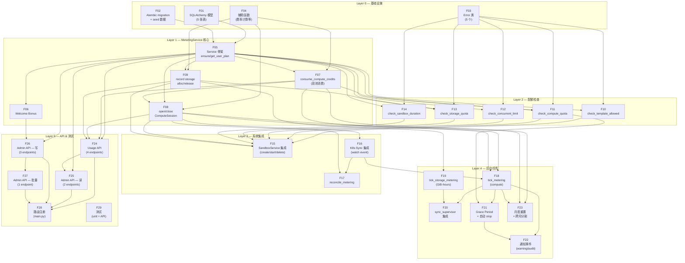

# 计量系统执行计划

**日期：** 2026-03-26
**状态：** 进行中
**关联文档：**
- [计量系统总览](2026-03-26-metering-overview.md)
- [Compute 计量详细设计](2026-03-26-metering-compute.md)
- [Storage 计量详细设计](2026-03-26-metering-storage.md)
- [配额执行与 API 设计](2026-03-26-metering-enforcement.md)

---

## 1. 功能分解 DAG

将计量系统拆分为 **21 个原子功能单元**，分 6 层，按依赖关系排列。同一层内的功能之间无依赖，可以按任意顺序（甚至并行）实现。

### 1.1 DAG 文字描述

```
Layer 0 — 基础设施（无依赖）
  ├─ F01  SQLAlchemy 模型（5 张表）
  ├─ F02  Alembic migration + TierTemplate seed 数据
  ├─ F03  Error 类（5 个新 TreadstoneError 子类）
  └─ F04  辅助函数（calculate_credit_rate, TEMPLATE_SPECS, parse_storage_size_gib, ConsumeResult）

Layer 1 — MeteringService 核心（依赖 Layer 0）
  ├─ F05  MeteringService 骨架 + ensure_user_plan + get_user_plan      ← F01, F02
  ├─ F06  Welcome Bonus（注册时自动创建 CreditGrant）                   ← F05
  ├─ F07  consume_compute_credits（双池消费算法）                        ← F05, F04
  ├─ F08  open_compute_session / close_compute_session                  ← F05, F07, F04
  └─ F09  record_storage_allocation / record_storage_release            ← F05, F04

Layer 2 — 配额检查（依赖 Layer 1）
  ├─ F10  check_template_allowed                                        ← F05, F03
  ├─ F11  check_compute_quota（含 get_total_compute_remaining）          ← F05, F07, F03
  ├─ F12  check_concurrent_limit                                        ← F05, F03
  ├─ F13  check_storage_quota（含 get_total_storage_quota）              ← F05, F09, F03
  └─ F14  check_sandbox_duration                                        ← F05, F03

Layer 3 — 系统集成（依赖 Layer 1 + Layer 2）
  ├─ F15  SandboxService 集成（create/start/delete 中嵌入配额检查与计量） ← F08-F14
  ├─ F16  K8s Sync 集成（watch event 中 open/close session）            ← F08
  └─ F17  reconcile_metering（对账修复）                                 ← F08, F16

Layer 4 — 后台任务（依赖 Layer 3）
  ├─ F18  tick_metering（compute 增量计量，含乐观锁）                    ← F07, F08, F16
  ├─ F19  tick_storage_metering（GiB-hours 累积）                       ← F09
  ├─ F20  sync_supervisor 集成（_metering_tick_loop）                   ← F18, F19
  ├─ F21  Grace Period 状态机 + 自动 stop                               ← F18, F11
  ├─ F22  通知事件（warning_80, warning_100, 审计日志）                  ← F18, F21
  └─ F23  月度重置 + 跨月 session 分割                                  ← F07, F08, F18

Layer 5 — API & 测试（依赖 Layer 4）
  ├─ F24  Usage API（GET /v1/usage, /plan, /sessions, /grants）         ← F05, F07-F09
  ├─ F25  Admin API — 读（GET tier-templates, GET user usage）          ← F05, F24
  ├─ F26  Admin API — 写（PATCH plan, POST grants, PATCH tier-template）← F05, F06
  ├─ F27  Admin API — 批量（POST grants/batch）                         ← F26
  ├─ F28  路由注册（main.py include_router）                             ← F24-F27
  └─ F29  测试（unit + API tests）                                      ← 全部
```

### 1.2 DAG 图



### 1.3 各功能单元详细说明

| ID | 功能 | 涉及文件 | 关键产出 |
|----|------|---------|---------|
| **F01** | SQLAlchemy 模型 | `treadstone/models/metering.py`, `models/__init__.py` | TierTemplate, UserPlan, CreditGrant, ComputeSession, StorageLedger 五个模型类 + StorageState 枚举 |
| **F02** | Alembic migration | `alembic/versions/xxx_add_metering_tables.py` | 5 张表的 DDL + TierTemplate 4 行 seed 数据 |
| **F03** | Error 类 | `treadstone/core/errors.py` | ComputeQuotaExceededError(402), StorageQuotaExceededError(402), ConcurrentLimitError(429), TemplateNotAllowedError(403), SandboxDurationExceededError(400) |
| **F04** | 辅助函数 | `treadstone/services/metering_helpers.py` | calculate_credit_rate(), TEMPLATE_SPECS, parse_storage_size_gib(), ConsumeResult dataclass |
| **F05** | Plan 管理 | `treadstone/services/metering_service.py` | MeteringService 类骨架, ensure_user_plan(), get_user_plan(), update_user_tier() |
| **F06** | Welcome Bonus | `treadstone/services/metering_service.py`, 注册 hook | 注册时自动创建 50 Compute Credits 的 CreditGrant（Free 用户） |
| **F07** | 双池消费 | `treadstone/services/metering_service.py` | consume_compute_credits() — 先 Monthly 后 Extra, FOR UPDATE 行锁, FIFO by expires_at |
| **F08** | Compute Session | `treadstone/services/metering_service.py` | open_compute_session(), close_compute_session() — 含最终增量计算 |
| **F09** | Storage Ledger | `treadstone/services/metering_service.py` | record_storage_allocation(), record_storage_release() — 含 gib_hours 最终计算 |
| **F10** | 模板检查 | `treadstone/services/metering_service.py` | check_template_allowed() → TemplateNotAllowedError |
| **F11** | Compute 配额检查 | `treadstone/services/metering_service.py` | check_compute_quota(), get_total_compute_remaining() → ComputeQuotaExceededError |
| **F12** | 并发限制 | `treadstone/services/metering_service.py` | check_concurrent_limit() → ConcurrentLimitError |
| **F13** | Storage 配额检查 | `treadstone/services/metering_service.py` | check_storage_quota(), get_total_storage_quota(), get_current_storage_used() → StorageQuotaExceededError |
| **F14** | Duration 检查 | `treadstone/services/metering_service.py` | check_sandbox_duration() → SandboxDurationExceededError |
| **F15** | SandboxService 集成 | `treadstone/services/sandbox_service.py` | create() 加 5 项检查 + storage allocation; start() 加 2 项检查; delete() 加 storage release |
| **F16** | K8s Sync 集成 | `treadstone/services/k8s_sync.py` | watch event 中 ready→open_session, stopped/error/deleting→close_session |
| **F17** | Reconcile 对账 | `treadstone/services/k8s_sync.py` 或 `metering_service.py` | reconcile_metering() — 修复 session/sandbox 状态不一致 |
| **F18** | Compute Tick | `treadstone/services/metering_service.py` | tick_metering() — 60s 间隔, 增量计算, 乐观锁 |
| **F19** | Storage Tick | `treadstone/services/metering_service.py` | tick_storage_metering() — 更新 gib_hours_consumed |
| **F20** | Supervisor 集成 | `treadstone/services/sync_supervisor.py` | _metering_tick_loop() — 绑定 leader 生命周期 |
| **F21** | Grace Period | `treadstone/services/metering_service.py` | check_grace_periods() — 状态机(normal→warning→grace→enforcement), _force_stop_sandbox(), 绝对上限(20%) |
| **F22** | 通知事件 | `treadstone/services/metering_service.py` | warning_80/100 阈值检测 + 防重复触发, audit_event 记录 8 种计量事件 |
| **F23** | 月度重置 | `treadstone/services/metering_service.py` | handle_period_rollover() — 跨月 session 分割; reset_monthly_credits() — 全量用户月度归零 |
| **F24** | Usage API | `treadstone/api/usage.py`, `api/schemas.py` | GET /v1/usage, /v1/usage/plan, /v1/usage/sessions, /v1/usage/grants |
| **F25** | Admin API (读) | `treadstone/api/admin.py` | GET /v1/admin/tier-templates, GET /v1/admin/users/{id}/usage |
| **F26** | Admin API (写) | `treadstone/api/admin.py`, `api/schemas.py` | PATCH /v1/admin/users/{id}/plan, POST /v1/admin/users/{id}/grants, PATCH /v1/admin/tier-templates/{name} |
| **F27** | Admin API (批量) | `treadstone/api/admin.py` | POST /v1/admin/grants/batch |
| **F28** | 路由注册 | `treadstone/main.py` | app.include_router(usage_router), app.include_router(admin_router) |
| **F29** | 测试 | `tests/unit/test_metering_service.py`, `tests/api/test_usage_api.py`, `tests/api/test_admin_api.py` | 单元测试 + API 路由测试 |

### 1.4 推荐实施路径

虽然 DAG 允许同层内并行，但考虑到单人开发和测试验证的节奏，推荐按以下线性路径实施：

```
F01 → F02 → F03 → F04 → F05 → F06 → F07 → F08 → F09
  → F10 → F11 → F12 → F13 → F14
  → F15 → F16 → F17
  → F18 → F19 → F20 → F21 → F22 → F23
  → F24 → F25 → F26 → F27 → F28 → F29
```

每完成一个功能单元，建议：
1. 运行 `make lint` 确保代码风格
2. 运行 `make test` 确保无回归
3. `make ship MSG="feat: F0X description"` 提交

---

## 2. 实施 Checklist

> 使用说明：每完成一个功能单元，将 `[ ]` 改为 `[x]` 并记录完成日期。

### Layer 0 — 基础设施

- [x] **F01** SQLAlchemy 模型（TierTemplate, UserPlan, CreditGrant, ComputeSession, StorageLedger, StorageState）
- [x] **F02** Alembic migration（5 张表 DDL + 4 行 TierTemplate seed 数据）
- [x] **F03** Error 类（ComputeQuotaExceededError, StorageQuotaExceededError, ConcurrentLimitError, TemplateNotAllowedError, SandboxDurationExceededError）
- [x] **F04** 辅助函数（calculate_credit_rate, TEMPLATE_SPECS, parse_storage_size_gib, ConsumeResult）

### Layer 1 — MeteringService 核心

- [x] **F05** MeteringService 骨架 + ensure_user_plan + get_user_plan + update_user_tier
- [x] **F06** Welcome Bonus（注册 hook 中自动发放 50 Compute Credits）
- [x] **F07** consume_compute_credits（双池消费算法，含 FOR UPDATE 行锁）
- [x] **F08** open_compute_session / close_compute_session
- [x] **F09** record_storage_allocation / record_storage_release

### Layer 2 — 配额检查

- [x] **F10** check_template_allowed
- [x] **F11** check_compute_quota + get_total_compute_remaining
- [x] **F12** check_concurrent_limit
- [x] **F13** check_storage_quota + get_total_storage_quota + get_current_storage_used
- [x] **F14** check_sandbox_duration

### Layer 3 — 系统集成

- [ ] **F15** SandboxService 集成（create 加 5 项检查 + storage alloc, start 加 2 项检查, delete 加 storage release）
- [ ] **F16** K8s Sync 集成（watch event 中 open/close ComputeSession）
- [ ] **F17** reconcile_metering（对账修复 session/sandbox 状态不一致）

### Layer 4 — 后台任务

- [ ] **F18** tick_metering（compute 增量计量，60s 间隔，乐观锁）
- [ ] **F19** tick_storage_metering（GiB-hours 持续累积）
- [ ] **F20** sync_supervisor 集成（_metering_tick_loop 绑定 leader 生命周期）
- [ ] **F21** Grace Period 状态机（normal → warning → grace → enforcement，含 auto-stop 和绝对上限 20%）
- [ ] **F22** 通知事件（warning_80/100 阈值检测 + 防重复触发 + 8 种审计事件）
- [ ] **F23** 月度重置（handle_period_rollover 跨月分割 + reset_monthly_credits 全量归零）

### Layer 5 — API & 测试

- [ ] **F24** Usage API（GET /v1/usage, /v1/usage/plan, /v1/usage/sessions, /v1/usage/grants）
- [ ] **F25** Admin API — 读（GET /v1/admin/tier-templates, GET /v1/admin/users/{id}/usage）
- [ ] **F26** Admin API — 写（PATCH users/{id}/plan, POST users/{id}/grants, PATCH tier-templates/{name}）
- [ ] **F27** Admin API — 批量（POST /v1/admin/grants/batch）
- [ ] **F28** 路由注册（main.py include_router）
- [ ] **F29** 测试（unit/test_metering_service.py, api/test_usage_api.py, api/test_admin_api.py）

---

## 3. 文件变更清单

| 变更类型 | 文件路径 | 首次涉及 |
|---------|---------|---------|
| **新增** | `treadstone/models/metering.py` | F01 |
| **修改** | `treadstone/models/__init__.py` | F01 |
| **新增** | `alembic/versions/xxx_add_metering_tables.py` | F02 |
| **修改** | `treadstone/core/errors.py` | F03 |
| **新增** | `treadstone/services/metering_service.py` | F04–F23 |
| **修改** | `treadstone/services/sandbox_service.py` | F15 |
| **修改** | `treadstone/services/k8s_sync.py` | F16, F17 |
| **修改** | `treadstone/services/sync_supervisor.py` | F20 |
| **新增** | `treadstone/api/usage.py` | F24 |
| **新增** | `treadstone/api/admin.py` | F25–F27 |
| **修改** | `treadstone/api/schemas.py` | F24–F27 |
| **修改** | `treadstone/main.py` | F28 |
| **新增** | `tests/unit/test_metering_service.py` | F29 |
| **新增** | `tests/api/test_usage_api.py` | F29 |
| **新增** | `tests/api/test_admin_api.py` | F29 |
