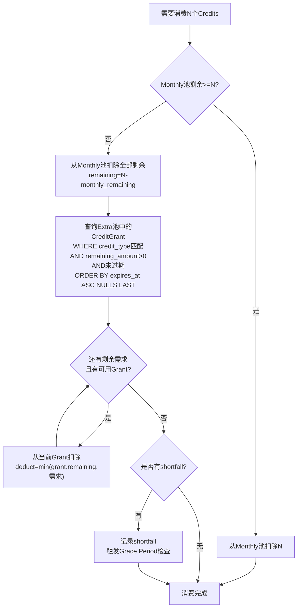
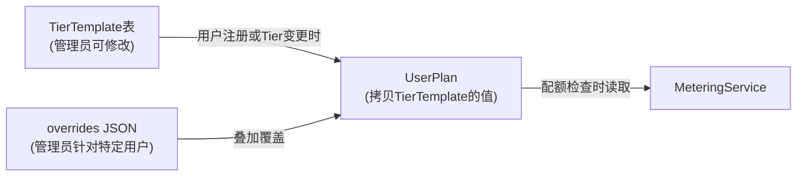
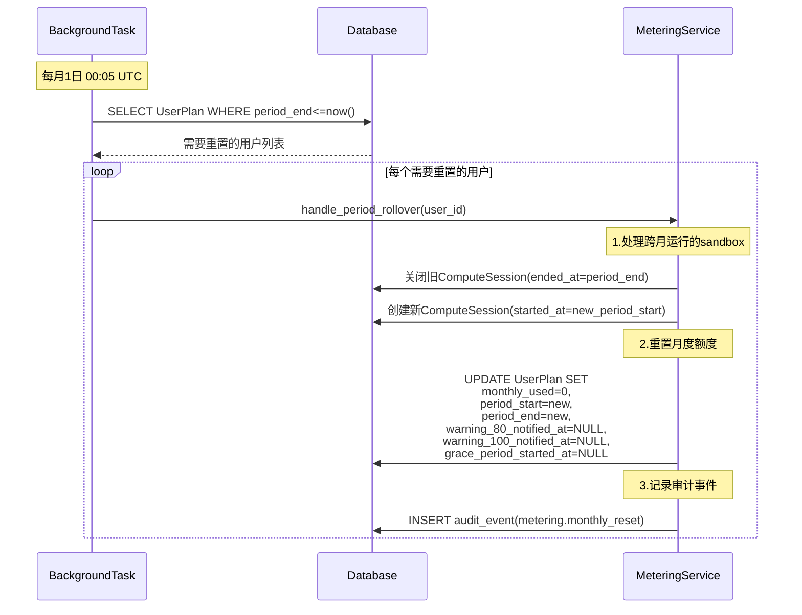
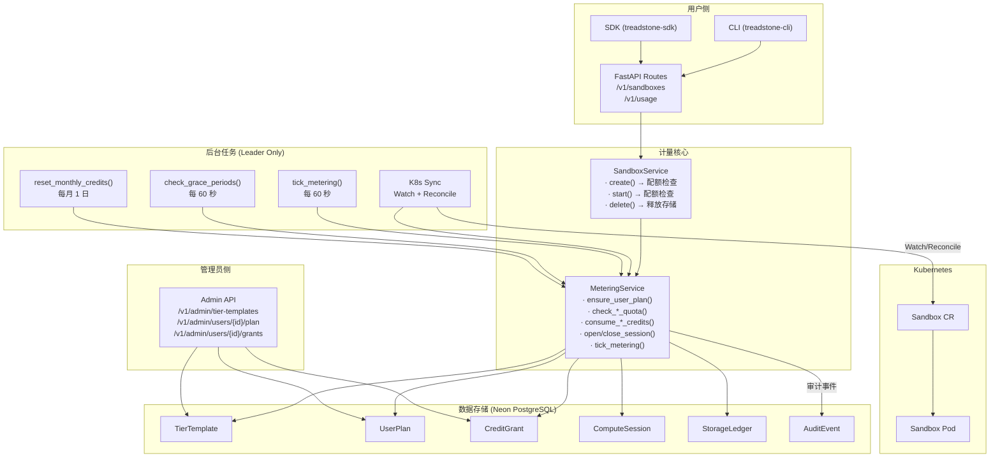
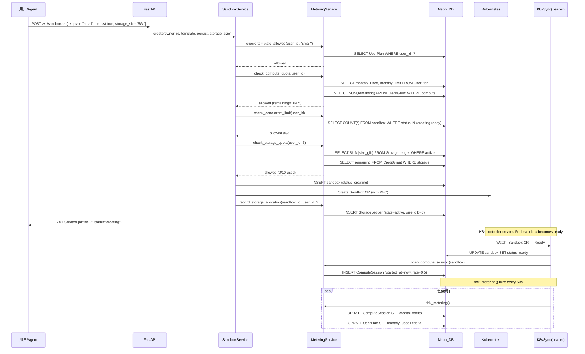

# 计量系统总览设计

**日期：** 2026-03-26
**状态：** 设计中
**关联文档：**
- [Compute 计量详细设计](2026-03-26-metering-compute.md)
- [Storage 计量详细设计](2026-03-26-metering-storage.md)
- [配额执行与 API 设计](2026-03-26-metering-enforcement.md)

---

## 1. 系统概述与设计目标

Treadstone 是一个面向 AI Agent 的 sandbox 平台，为用户提供按需创建、运行和管理 sandbox 的能力。随着平台从内部工具演进为 SaaS 服务，需要建立一套完整的计量系统来追踪资源使用、执行配额限制，并为未来的计费能力奠定基础。

### 1.1 为什么需要计量系统

当前 Treadstone 没有任何资源使用追踪或配额控制机制。任何注册用户都可以无限制地创建和运行 sandbox，这在以下方面带来了风险：

- **资源耗尽**：有限的服务器资源（当前 1.5 台 16 核 32G 云服务器，约 24 vCPU / 48 GiB 可用于 sandbox）可能被少数用户独占
- **成本失控**：云服务器按时计费，无法追踪哪些用户消耗了多少资源
- **无法运营**：缺乏用户分层和配额体系，无法区分免费体验用户和付费用户
- **无法定价**：没有用量数据，无法制定合理的定价策略

### 1.2 分阶段目标

| Phase | 目标 | 范围 |
|-------|------|------|
| **Phase 1（当前）** | 计量（Metering） | 数据模型、Tier 体系、双池 Credit、配额执行、Usage API、Grace Period |
| **Phase 2（未来）** | 计费（Billing） | Stripe 支付集成、钱包/充值、发票/账单、自助 Tier 升级 |
| **Phase 3（远期）** | 高级运营 | 冷存储迁移、用量预测、动态定价、推荐奖励体系 |

Phase 1 的核心原则：**数据模型必须为 Phase 2 做好准备**，但不实现任何支付逻辑。所有计量数据（Compute Credits 消耗、Storage GiB-hours 累积）从第一天开始完整记录，确保未来计费上线时有历史数据可用。

### 1.3 设计原则

| 原则 | 说明 |
|------|------|
| 基于 K8s request 计费 | Kubernetes 调度以 Pod 的 resource request 为依据进行节点分配。request 是为 Pod 保底预留的资源量，无论用户是否用满都已占用集群容量。因此计费基于 request，不基于 limit |
| 简单对用户透明 | 用户只需理解 4 个概念：Tier、Compute Credits、Storage Credits、Grace Period |
| 灵活对运营友好 | Tier 配额存储在数据库而非代码中，管理员可通过 API 动态调整，无需重新部署 |
| 不强杀但有兜底 | 额度耗尽时不立即终止运行中的 sandbox，但有 Grace Period 时限兜底，防止无限透支 |
| 双池消费 | Monthly Credits 和 Extra Credits 分开管理，消费顺序明确，减少用户困惑 |

---

## 2. 双池 Credit 模型

这是计量系统的核心设计。每个用户同时拥有两个额度池，每个池又分为 Compute 和 Storage 两个独立维度。

### 2.1 模型总览

```
┌──────────────────────────────────────────────────────────────────┐
│                     用户额度全景                                  │
│                                                                  │
│  ┌─────────────── Compute Credits ──────────────┐               │
│  │                                               │               │
│  │  ┌─────────────────┐  ┌────────────────────┐ │               │
│  │  │ Monthly Pool    │  │ Extra Pool         │ │               │
│  │  │                 │  │                    │ │               │
│  │  │ · Tier 决定额度 │  │ · CreditGrant 记录 │ │               │
│  │  │ · 每月1日重置   │  │ · 永不自动刷新     │ │               │
│  │  │ · 优先消费      │  │ · 按过期时间排序   │ │               │
│  │  │                 │  │ · 用完即止         │ │               │
│  │  │ 单位: vCPU-hour │  │ 单位: vCPU-hour    │ │               │
│  │  └─────────────────┘  └────────────────────┘ │               │
│  └───────────────────────────────────────────────┘               │
│                                                                  │
│  ┌─────────────── Storage Credits ──────────────┐               │
│  │                                               │               │
│  │  ┌─────────────────┐  ┌────────────────────┐ │               │
│  │  │ Monthly Pool    │  │ Extra Pool         │ │               │
│  │  │                 │  │                    │ │               │
│  │  │ · Tier 决定额度 │  │ · CreditGrant 记录 │ │               │
│  │  │ · 每月1日重置   │  │ · 永不自动刷新     │ │               │
│  │  │ · Phase 1: GiB  │  │ · 按过期时间排序   │ │               │
│  │  │   容量上限      │  │ · 用完即止         │ │               │
│  │  │                 │  │                    │ │               │
│  │  │ 单位: GiB       │  │ 单位: GiB          │ │               │
│  │  └─────────────────┘  └────────────────────┘ │               │
│  └───────────────────────────────────────────────┘               │
│                                                                  │
└──────────────────────────────────────────────────────────────────┘
```

### 2.2 Monthly Credits（月度额度）

Monthly Credits 是用户订阅 Tier 后每月自动获得的基础额度，是用户的"保底资源"。

| 属性 | 说明 |
|------|------|
| 来源 | 由用户所属的 Tier 决定，从 `TierTemplate` 拷贝到 `UserPlan` |
| 刷新周期 | 每月 1 日 00:00 UTC 重置为 Tier 定义的上限 |
| 首月处理 | 新用户注册时，无论当月还剩几天，直接给满当月完整额度（不按比例折算） |
| 结转 | 不结转。月度额度不累积到下月——用不完就作废 |
| 消费优先级 | **优先消费**。当 Monthly 和 Extra 同时存在时，先消费 Monthly |
| 分为两个维度 | Compute Credits（vCPU-hours）和 Storage Credits（GiB） |

**为什么先消费 Monthly？**

Monthly Credits 到月末必然重置，未用完的部分等于浪费。而 Extra Credits 没有月度重置机制，消费顺序为"先 Monthly 后 Extra"可以最大化保留 Extra Credits 的价值。这与手机流量套餐的消费逻辑一致——先用赠送流量，再用购买流量。

### 2.3 Extra Credits（额外额度）

Extra Credits 是通过各种渠道一次性发放给用户的额外资源，不会自动刷新。每一笔发放都以独立的 `CreditGrant` 记录存储。

| 属性 | 说明 |
|------|------|
| 来源 | Welcome Bonus、营销活动、管理员手动授予、推荐奖励、未来的充值购买 |
| 刷新 | 不自动刷新，用完即止 |
| 过期 | 每笔 CreditGrant 有独立的 `expires_at`，支持永不过期（`NULL`） |
| 消费优先级 | Monthly 耗尽后再消费 Extra。Extra 内部按 `expires_at` 升序（即将过期的先消费） |
| 记录粒度 | 每笔发放独立记录原始发放量、剩余量、来源类型、过期时间 |
| 分为两个维度 | Compute Credits 和 Storage Credits 分开记录，不可混用 |

**CreditGrant 的来源类型**：

| grant_type | 说明 | 典型 expires_at |
|------------|------|----------------|
| `welcome_bonus` | 新用户注册自动发放 | 注册后 90 天 |
| `campaign` | 营销活动批量发放 | 活动结束后 30-90 天 |
| `admin_grant` | 管理员手动授予（特殊支持、补偿） | 视情况而定，可永不过期 |
| `referral` | 用户推荐奖励 | 发放后 180 天 |
| `purchase` | 用户付费购买（Phase 2） | 永不过期 |

### 2.4 消费顺序

Compute Credits 和 Storage Credits 各自独立消费，互不干扰。但两者遵循相同的消费优先级规则：



**消费顺序总结**：

1. 先消费当月 Monthly Credits（`UserPlan.compute_credits_monthly_used` 递增）
2. Monthly 耗尽后，消费 Extra Credits（遍历 `CreditGrant` 表，按 `expires_at ASC, NULLS LAST` 排序）
3. Extra 中优先消费即将过期的 Grant（FIFO by expiry）
4. 跳过已过期的 Grant（`expires_at < now()`）
5. 永不过期的 Grant（`expires_at IS NULL`）排在最后
6. 两个池都耗尽 → `shortfall > 0` → 触发 Grace Period 机制

### 2.5 Compute Credits vs Storage Credits 的区别

| 维度 | Compute Credits | Storage Credits |
|------|----------------|----------------|
| 衡量对象 | CPU + 内存 × 运行时间 | 持久存储容量 |
| 消耗方式 | 随时间持续扣减（消耗型） | 分配时占用，释放时归还（占用型，Phase 1） |
| 关联资源 | Running sandbox 的 vCPU 和内存 | 持久化 sandbox 的 PVC 磁盘 |
| sandbox stop 影响 | 停止消耗 | 不影响，PVC 仍存在，仍占用配额 |
| sandbox delete 影响 | 停止消耗 | 释放配额 |
| 月度重置 | `monthly_used` 归零，重新开始消耗 | 配额上限刷新，但已有 PVC 的占用不变 |
| 单位 | vCPU-hour（1 Credit = 1 vCPU 运行 1 小时） | GiB（1 Credit = 1 GiB 持久存储容量） |
| Phase 2 演进 | 按秒计费，对接支付 | 演进为 GiB-月计费单位 |

```
Compute Credits（消耗型）：

  ┌─ running ────────────────────── stopped ─┐
  │ ████████████████████████████████          │  ← 持续消耗 credits
  │ 每秒扣减 credit_rate / 3600              │
  └──────────────────────────────────────────┘

Storage Credits（占用型 — Phase 1）：

  ┌─ created ─────────────────── deleted ────┐
  │ ▓▓▓▓▓▓▓▓▓▓▓▓▓▓▓▓▓▓▓▓▓▓▓▓▓▓▓▓          │  ← 容量占用
  │ 分配时占用, 删除时归还                      │
  │ 不随时间消耗更多                            │
  │ stopped 状态 PVC 仍在 → 仍占用             │
  └──────────────────────────────────────────┘
```

---

## 3. Tier 产品模型

### 3.1 Tier 定义

Treadstone 提供 4 个产品层级，覆盖从免费体验到企业定制的全部场景：

| Tier | 可用模板 | 并发运行数 | 单次最长运行 | 月度 Compute Credits | 月度 Storage Credits (GiB) | Grace Period | 定位 |
|------|---------|--------:|----------:|-------------------:|-------------------------:|------------:|------|
| **Free** | tiny, small | 1 | 30 分钟 | 10 | 0 | 10 分钟 | 默认注册用户，免费体验 |
| **Pro** | tiny, small, medium | 3 | 2 小时 | 100 | 10 | 30 分钟 | 认真使用的个人用户 |
| **Ultra** | tiny, small, medium, large | 5 | 8 小时 | 300 | 20 | 60 分钟 | 高活跃 / 高价值用户 |
| **Enterprise** | 全部（含 xlarge） | 自定义 | 自定义 | 自定义 | 自定义 | 自定义 | 手工审批，非自助 |

**Free Tier 的额度换算**：10 Compute Credits = 40 小时 tiny 运行时间 = 20 小时 small 运行时间，足够每天约 1 小时的 tiny sandbox 使用，满足评估和轻度试用需求。

**Pro Tier 的额度换算**：100 Compute Credits = 400 小时 tiny = 200 小时 small = 100 小时 medium，满足日常开发和 AI Agent 工作负载。

**Ultra Tier 的额度换算**：300 Compute Credits = 150 小时 medium = 75 小时 large，面向重度用户和持续运行的 Agent 场景。

### 3.2 Tier 模板的可配置性

**关键设计决策**：Tier 的默认配额不硬编码在 Python 代码中，而是存储在数据库的 `TierTemplate` 表中。

这个决策的背景是：Treadstone 是单人项目，服务器资源有限且会随用户增长逐步扩容。Tier 配额需要能够在以下场景中快速调整：

| 场景 | 操作 |
|------|------|
| 服务器从 1.5 台扩容到 4.5 台 | 通过管理员 API 提高所有 Tier 的并发数和 Compute Credits |
| 竞品降价或提高免费额度 | 通过管理员 API 提高 Free Tier 的额度以保持竞争力 |
| 节假日/新年促销活动 | 通过管理员 API 临时提高额度，活动结束后恢复 |
| 发现某个 Tier 的用户流失率高 | 通过管理员 API 调整配额，观察留存变化 |
| 特定用户需要超配 | 通过 UserPlan.overrides 字段单独调整，不影响其他用户 |

**配额生效流程**：



1. 管理员通过 `PATCH /v1/admin/tier-templates/{tier_name}` 修改 TierTemplate 的默认值
2. 用户注册（或 Tier 变更）时，从 TierTemplate 拷贝当前默认值到 UserPlan
3. 如果管理员通过 `PATCH /v1/admin/users/{user_id}/plan` 设置了 overrides，则 overrides 中的值优先
4. MeteringService 的所有配额检查都从 UserPlan 读取，不直接查 TierTemplate

**TierTemplate 更新是否影响现有用户？** 默认不影响——已创建的 UserPlan 是快照。管理员可以通过 `apply_to_existing=true` 参数批量更新（仅更新没有 overrides 的用户）。

### 3.3 Welcome Bonus

新注册用户自动获得 **50 Compute Credits** 的 Extra Credits，以独立的 `CreditGrant` 记录发放。

| 属性 | 值 |
|------|------|
| credit_type | `compute` |
| grant_type | `welcome_bonus` |
| original_amount | `50.0` |
| expires_at | 注册后 90 天（推荐，可通过配置调整） |
| granted_by | `NULL`（系统自动发放） |

**Welcome Bonus 的额度换算**：50 Compute Credits = 200 小时 tiny = 100 小时 small = 50 小时 medium。结合 Free Tier 每月 10 Credits，新用户首月实际可用 60 Credits（240 小时 tiny），足够充分评估平台。

**为什么不赠送 Storage Credits？** Free Tier 不允许创建持久化 sandbox（`storage_credits_monthly = 0`），因此赠送 Storage Credits 对 Free 用户无意义。当用户升级到 Pro 后，已有月度 10 GiB 的 Storage Credits。

**与竞品对标**：

| 平台 | 新用户免费额度 | 等价 Treadstone tiny 小时数 |
|------|--------------|--------------------------|
| Daytona | $200 一次性 credit | ~4,000 小时 |
| E2B | $100 一次性 credit | ~2,000 小时 |
| **Treadstone** | **50 Credits + 10/月** | **200 + 40/月** |
| GitHub Codespaces | 120 core-hours/月 | ~480 小时/月 |

Treadstone 的一次性赠送量低于 Daytona/E2B，但有持续的月度额度补充。Daytona/E2B 的大额一次性赠送本质上是获客成本（CAC），大部分用户不会用完——Treadstone 作为单人项目，无需在这方面硬拼。

### 3.4 Enterprise Tier 的定位

Enterprise 不是公开售卖的自助计划。它是管理员手工创建的超配版本，用于：

- 与 Treadstone 有深度合作的团队或项目
- 需要 xlarge 模板（4 vCPU / 8 GiB）的用户
- 需要超过 Ultra 配额的高频用户
- 内部测试或 demo 用途

创建 Enterprise 用户的流程：管理员通过 `PATCH /v1/admin/users/{user_id}/plan` 将用户的 Tier 设为 `enterprise`，并在 overrides 中指定具体配额。

---

## 4. 计费周期

### 4.1 周期规则

| 属性 | 规则 |
|------|------|
| 周期长度 | 自然月（每月 1 日 00:00 UTC 至次月 1 日 00:00 UTC） |
| 重置时间 | 每月 1 日 00:00 UTC |
| 首月处理 | 注册时直接给满当月完整额度，不按剩余天数折算 |
| 重置内容 | `compute_credits_monthly_used` 归零；`warning_80_notified_at` 和 `warning_100_notified_at` 清零 |
| 不重置内容 | Extra Credits（CreditGrant）不受月度重置影响 |
| Storage 月度重置 | 配额上限刷新，但已有 PVC 的占用不变（可能出现降级后的超配） |

### 4.2 为什么选择「自然月 + 首月给满」

**对比其他方案**：

| 方案 | 优点 | 缺点 |
|------|------|------|
| 滚动 30 天（从注册日算起） | 最公平，每个用户完整 30 天 | 每个用户周期不同，运维复杂，对账困难 |
| 自然月 + 首月按比例 | 精确，不多给 | 月末注册用户体验差（3 月 28 日注册只得 3 天额度） |
| **自然月 + 首月给满** | **简单，用户体验好** | 月末注册用户多享几天——但这是正面体验 |

选择「自然月 + 首月给满」的理由：

1. **简单**：所有用户统一在每月 1 日重置，后台任务和查询逻辑简化
2. **用户友好**：月末注册的用户获得"额外几天"的额度，是正面体验而非损失
3. **未来友好**：Stripe 等支付系统原生支持自然月出账周期，Phase 2 对接时无需迁移
4. **运营友好**：统一出账日便于月度用量报表、成本核算和容量规划

### 4.3 月度重置流程

后台任务在每月 1 日 00:05 UTC 执行（留 5 分钟余量确保所有时区已进入新月）：



### 4.4 跨月 ComputeSession 分割

当 sandbox 从 3 月持续运行到 4 月时：

```
3月28日                    4月1日 00:00 UTC              4月5日
  |──── 旧 Session ────────|──── 新 Session ────────────|
  │ ended_at = 4/1 00:00   │ started_at = 4/1 00:00    │
  │ credits → 3月月度/Extra │ credits → 4月月度/Extra    │
```

1. 旧 Session 在 `period_end` 时刻关闭，最后一段消耗计入 3 月
2. UserPlan 的月度额度重置
3. 为仍在运行的 sandbox 创建新 Session，`started_at = new_period_start`
4. 新 Session 的消耗从 4 月月度额度开始扣除

详见 [Compute 计量设计 — 第 7 节：月度重置](2026-03-26-metering-compute.md)。

---

## 5. 完整数据模型总览

计量系统引入 5 张新表，不修改任何现有表。

### 5.0 ER 关系图

```mermaid
erDiagram
    User ||--o| UserPlan : "has one"
    User ||--o{ CreditGrant : "receives many"
    User ||--o{ ComputeSession : "owns many"
    User ||--o{ StorageLedger : "owns many"
    Sandbox ||--o{ ComputeSession : "generates many"
    Sandbox ||--o| StorageLedger : "has one (if persist)"
    TierTemplate ||--o{ UserPlan : "defines defaults for"

    TierTemplate {
        string id PK
        string tier_name UK
        decimal compute_credits_monthly
        int storage_credits_monthly
        int max_concurrent_running
        int max_sandbox_duration_seconds
        json allowed_templates
        int grace_period_seconds
        bool is_active
    }

    UserPlan {
        string id PK
        string user_id FK_UK
        string tier
        decimal compute_credits_monthly_limit
        int storage_credits_monthly_limit
        int max_concurrent_running
        int max_sandbox_duration_seconds
        json allowed_templates
        int grace_period_seconds
        datetime period_start
        datetime period_end
        decimal compute_credits_monthly_used
        json overrides
        datetime grace_period_started_at
        datetime warning_80_notified_at
        datetime warning_100_notified_at
    }

    CreditGrant {
        string id PK
        string user_id FK
        string credit_type
        string grant_type
        string campaign_id
        decimal original_amount
        decimal remaining_amount
        string reason
        string granted_by
        datetime granted_at
        datetime expires_at
    }

    ComputeSession {
        string id PK
        string sandbox_id FK
        string user_id FK
        string template
        decimal credit_rate_per_hour
        datetime started_at
        datetime ended_at
        datetime last_metered_at
        decimal credits_consumed
        decimal credits_consumed_monthly
        decimal credits_consumed_extra
    }

    StorageLedger {
        string id PK
        string user_id FK
        string sandbox_id FK
        int size_gib
        string storage_state
        datetime allocated_at
        datetime released_at
        datetime archived_at
        decimal gib_hours_consumed
        datetime last_metered_at
    }
```

### 5.1 TierTemplate 表

存储每个 Tier 的默认配额值，是 Tier 体系的"模板"。管理员可通过 Admin API 修改，修改后新注册用户（或手动触发的批量更新）将使用新值。

#### SQL DDL

```sql
CREATE TABLE tier_template (
    id                           VARCHAR(24)   PRIMARY KEY,
    tier_name                    VARCHAR(16)   NOT NULL UNIQUE,
    compute_credits_monthly      DECIMAL(10,4) NOT NULL,
    storage_credits_monthly      INTEGER       NOT NULL,
    max_concurrent_running       INTEGER       NOT NULL,
    max_sandbox_duration_seconds INTEGER       NOT NULL,
    allowed_templates            JSONB         NOT NULL DEFAULT '[]',
    grace_period_seconds         INTEGER       NOT NULL,
    is_active                    BOOLEAN       NOT NULL DEFAULT TRUE,
    gmt_created                  TIMESTAMPTZ   NOT NULL DEFAULT now(),
    gmt_updated                  TIMESTAMPTZ   NOT NULL DEFAULT now()
);

CREATE UNIQUE INDEX ix_tier_template_name ON tier_template(tier_name);
```

#### SQLAlchemy 模型

```python
class TierTemplate(Base):
    __tablename__ = "tier_template"

    id: Mapped[str] = mapped_column(
        String(24), primary_key=True, default=lambda: "tt" + random_id()
    )
    tier_name: Mapped[str] = mapped_column(
        String(16), unique=True, nullable=False
    )
    compute_credits_monthly: Mapped[Decimal] = mapped_column(
        Numeric(10, 4), nullable=False
    )
    storage_credits_monthly: Mapped[int] = mapped_column(
        Integer, nullable=False
    )
    max_concurrent_running: Mapped[int] = mapped_column(
        Integer, nullable=False
    )
    max_sandbox_duration_seconds: Mapped[int] = mapped_column(
        Integer, nullable=False
    )
    allowed_templates: Mapped[list] = mapped_column(
        JSON, nullable=False, default=list
    )
    grace_period_seconds: Mapped[int] = mapped_column(
        Integer, nullable=False
    )
    is_active: Mapped[bool] = mapped_column(
        Boolean, nullable=False, default=True
    )
    gmt_created: Mapped[datetime] = mapped_column(
        DateTime(timezone=True), default=utc_now, nullable=False
    )
    gmt_updated: Mapped[datetime] = mapped_column(
        DateTime(timezone=True), default=utc_now, nullable=False
    )
```

#### 字段说明

| 字段 | 类型 | 约束 | 设计意图 |
|------|------|------|---------|
| `id` | String(24) | PK | 前缀 `tt`，如 `tt3a8f9b2c1d4e5f67` |
| `tier_name` | String(16) | UNIQUE, NOT NULL | 枚举值：`free` / `pro` / `ultra` / `enterprise` |
| `compute_credits_monthly` | Decimal(10,4) | NOT NULL | 该 Tier 的月度 Compute Credit 上限。Decimal 精度避免浮点误差 |
| `storage_credits_monthly` | Integer | NOT NULL | 该 Tier 的月度 Storage Credit 上限（GiB）。Free = 0 表示不允许持久存储 |
| `max_concurrent_running` | Integer | NOT NULL | 同时运行的 sandbox 上限 |
| `max_sandbox_duration_seconds` | Integer | NOT NULL | 单个 sandbox 最长运行时间（秒）。Free = 1800（30分钟） |
| `allowed_templates` | JSON | NOT NULL | 可使用的模板名称列表，如 `["tiny", "small"]` |
| `grace_period_seconds` | Integer | NOT NULL | Credit 耗尽后的宽限期时长（秒） |
| `is_active` | Boolean | NOT NULL, DEFAULT TRUE | 软删除标记。置 false 后该 Tier 不可再分配给新用户 |
| `gmt_created` | DateTime(tz) | NOT NULL | 记录创建时间 |
| `gmt_updated` | DateTime(tz) | NOT NULL | 记录最后修改时间 |

#### 初始数据（Alembic migration 中 seed）

```python
TIER_DEFAULTS = [
    {
        "tier_name": "free",
        "compute_credits_monthly": Decimal("10"),
        "storage_credits_monthly": 0,
        "max_concurrent_running": 1,
        "max_sandbox_duration_seconds": 1800,
        "allowed_templates": ["tiny", "small"],
        "grace_period_seconds": 600,
    },
    {
        "tier_name": "pro",
        "compute_credits_monthly": Decimal("100"),
        "storage_credits_monthly": 10,
        "max_concurrent_running": 3,
        "max_sandbox_duration_seconds": 7200,
        "allowed_templates": ["tiny", "small", "medium"],
        "grace_period_seconds": 1800,
    },
    {
        "tier_name": "ultra",
        "compute_credits_monthly": Decimal("300"),
        "storage_credits_monthly": 20,
        "max_concurrent_running": 5,
        "max_sandbox_duration_seconds": 28800,
        "allowed_templates": ["tiny", "small", "medium", "large"],
        "grace_period_seconds": 3600,
    },
    {
        "tier_name": "enterprise",
        "compute_credits_monthly": Decimal("5000"),
        "storage_credits_monthly": 500,
        "max_concurrent_running": 50,
        "max_sandbox_duration_seconds": 86400,
        "allowed_templates": ["tiny", "small", "medium", "large", "xlarge"],
        "grace_period_seconds": 7200,
    },
]
```

### 5.2 UserPlan 表

每个用户一行，记录用户当前的 Tier、各项配额值、本周期用量和管理状态。是计量系统的核心读写表。

#### SQL DDL

```sql
CREATE TABLE user_plan (
    id                             VARCHAR(24)   PRIMARY KEY,
    user_id                        VARCHAR(24)   NOT NULL UNIQUE REFERENCES "user"(id) ON DELETE CASCADE,
    tier                           VARCHAR(16)   NOT NULL,

    -- Entitlements (copied from TierTemplate, can be overridden)
    compute_credits_monthly_limit  DECIMAL(10,4) NOT NULL,
    storage_credits_monthly_limit  INTEGER       NOT NULL,
    max_concurrent_running         INTEGER       NOT NULL,
    max_sandbox_duration_seconds   INTEGER       NOT NULL,
    allowed_templates              JSONB         NOT NULL DEFAULT '[]',
    grace_period_seconds           INTEGER       NOT NULL,

    -- Current period state
    period_start                   TIMESTAMPTZ   NOT NULL,
    period_end                     TIMESTAMPTZ   NOT NULL,
    compute_credits_monthly_used   DECIMAL(10,4) NOT NULL DEFAULT 0,

    -- Admin overrides
    overrides                      JSONB,

    -- Grace Period tracking
    grace_period_started_at        TIMESTAMPTZ,

    -- Notification dedup
    warning_80_notified_at         TIMESTAMPTZ,
    warning_100_notified_at        TIMESTAMPTZ,

    -- Timestamps
    gmt_created                    TIMESTAMPTZ   NOT NULL DEFAULT now(),
    gmt_updated                    TIMESTAMPTZ   NOT NULL DEFAULT now()
);

CREATE UNIQUE INDEX ix_user_plan_user ON user_plan(user_id);
```

#### SQLAlchemy 模型

```python
class UserPlan(Base):
    __tablename__ = "user_plan"

    id: Mapped[str] = mapped_column(
        String(24), primary_key=True, default=lambda: "plan" + random_id()
    )
    user_id: Mapped[str] = mapped_column(
        String(24), ForeignKey("user.id", ondelete="CASCADE"),
        unique=True, nullable=False,
    )
    tier: Mapped[str] = mapped_column(String(16), nullable=False)

    # Entitlements
    compute_credits_monthly_limit: Mapped[Decimal] = mapped_column(
        Numeric(10, 4), nullable=False
    )
    storage_credits_monthly_limit: Mapped[int] = mapped_column(
        Integer, nullable=False
    )
    max_concurrent_running: Mapped[int] = mapped_column(
        Integer, nullable=False
    )
    max_sandbox_duration_seconds: Mapped[int] = mapped_column(
        Integer, nullable=False
    )
    allowed_templates: Mapped[list] = mapped_column(
        JSON, nullable=False, default=list
    )
    grace_period_seconds: Mapped[int] = mapped_column(
        Integer, nullable=False
    )

    # Current period state
    period_start: Mapped[datetime] = mapped_column(
        DateTime(timezone=True), nullable=False
    )
    period_end: Mapped[datetime] = mapped_column(
        DateTime(timezone=True), nullable=False
    )
    compute_credits_monthly_used: Mapped[Decimal] = mapped_column(
        Numeric(10, 4), nullable=False, default=Decimal("0")
    )

    # Admin overrides
    overrides: Mapped[dict | None] = mapped_column(JSON, nullable=True)

    # Grace Period tracking
    grace_period_started_at: Mapped[datetime | None] = mapped_column(
        DateTime(timezone=True), nullable=True, default=None
    )

    # Notification dedup
    warning_80_notified_at: Mapped[datetime | None] = mapped_column(
        DateTime(timezone=True), nullable=True, default=None
    )
    warning_100_notified_at: Mapped[datetime | None] = mapped_column(
        DateTime(timezone=True), nullable=True, default=None
    )

    # Timestamps
    gmt_created: Mapped[datetime] = mapped_column(
        DateTime(timezone=True), default=utc_now, nullable=False
    )
    gmt_updated: Mapped[datetime] = mapped_column(
        DateTime(timezone=True), default=utc_now, nullable=False
    )
```

#### 字段说明

| 字段 | 类型 | 约束 | 设计意图 |
|------|------|------|---------|
| `id` | String(24) | PK | 前缀 `plan`，如 `plan3a8f9b2c1d4e5f67` |
| `user_id` | String(24) | FK → user.id, UNIQUE | 一个用户只有一个 UserPlan。CASCADE 删除 |
| `tier` | String(16) | NOT NULL | 当前 Tier 名称，与 TierTemplate.tier_name 对应 |
| `compute_credits_monthly_limit` | Decimal(10,4) | NOT NULL | 本月 Compute Credit 上限。创建时从 TierTemplate 拷贝，可被 overrides 覆盖 |
| `storage_credits_monthly_limit` | Integer | NOT NULL | 本月 Storage Credit 上限（GiB）。创建时从 TierTemplate 拷贝 |
| `max_concurrent_running` | Integer | NOT NULL | 允许同时运行的 sandbox 上限 |
| `max_sandbox_duration_seconds` | Integer | NOT NULL | 单个 sandbox 最长运行时间（秒） |
| `allowed_templates` | JSON | NOT NULL | 该用户可使用的模板名称列表 |
| `grace_period_seconds` | Integer | NOT NULL | Credit 耗尽后的宽限期时长（秒） |
| `period_start` | DateTime(tz) | NOT NULL | 当前计费周期开始时间。首次创建时为当月 1 日 00:00 UTC |
| `period_end` | DateTime(tz) | NOT NULL | 当前计费周期结束时间。首次创建时为次月 1 日 00:00 UTC |
| `compute_credits_monthly_used` | Decimal(10,4) | NOT NULL, DEFAULT 0 | 本月已消耗的 Compute Credits。由 `tick_metering()` 和 `close_compute_session()` 递增 |
| `overrides` | JSON | nullable | 管理员设置的配额覆盖，格式如 `{"compute_credits_monthly_limit": 150}`。优先级最高 |
| `grace_period_started_at` | DateTime(tz) | nullable | Grace Period 开始时间。`NULL` 表示不在 Grace Period 中 |
| `warning_80_notified_at` | DateTime(tz) | nullable | 80% 用量预警的触发时间。月度重置时清零，防止同一周期内重复触发 |
| `warning_100_notified_at` | DateTime(tz) | nullable | 100% 用量预警的触发时间。月度重置时清零 |
| `gmt_created` | DateTime(tz) | NOT NULL | UserPlan 创建时间 |
| `gmt_updated` | DateTime(tz) | NOT NULL | 最后更新时间 |

> **为什么 Storage 用量不存为字段？**
>
> Storage 的当前占用量需要实时反映 PVC 的存在状态。如果把它缓存在 UserPlan 中，每次 sandbox 创建/删除都要同步更新 UserPlan，增加了一致性维护成本。当前设计选择在配额检查时从 `StorageLedger` 实时计算：`SELECT SUM(size_gib) FROM storage_ledger WHERE user_id = ? AND storage_state = 'active'`。StorageLedger 表有 `(user_id, storage_state)` 复合索引，查询性能足够。
>
> 如果未来用户量增长到需要优化这一查询，可以在 UserPlan 中添加缓存字段，但 Phase 1 不需要。

#### 创建时机

UserPlan 在以下时机自动创建：

1. **用户注册时**：`UserManager.on_after_register()` 调用 `MeteringService.ensure_user_plan()`
2. **首次 OAuth 登录时**：同上，通过 `on_after_register` hook

```python
async def ensure_user_plan(
    session: AsyncSession,
    user_id: str,
    tier: str = "free",
) -> UserPlan:
    existing = await session.execute(
        select(UserPlan).where(UserPlan.user_id == user_id)
    )
    if existing.scalar_one_or_none() is not None:
        return existing.scalar_one()

    template = await session.execute(
        select(TierTemplate).where(TierTemplate.tier_name == tier)
    )
    tt = template.scalar_one()

    now = utc_now()
    period_start = now.replace(day=1, hour=0, minute=0, second=0, microsecond=0)
    if now.month == 12:
        period_end = period_start.replace(year=now.year + 1, month=1)
    else:
        period_end = period_start.replace(month=now.month + 1)

    plan = UserPlan(
        user_id=user_id,
        tier=tt.tier_name,
        compute_credits_monthly_limit=tt.compute_credits_monthly,
        storage_credits_monthly_limit=tt.storage_credits_monthly,
        max_concurrent_running=tt.max_concurrent_running,
        max_sandbox_duration_seconds=tt.max_sandbox_duration_seconds,
        allowed_templates=tt.allowed_templates,
        grace_period_seconds=tt.grace_period_seconds,
        period_start=period_start,
        period_end=period_end,
    )
    session.add(plan)

    # Welcome Bonus
    if tier == "free":
        grant = CreditGrant(
            user_id=user_id,
            credit_type="compute",
            grant_type="welcome_bonus",
            original_amount=Decimal("50"),
            remaining_amount=Decimal("50"),
            reason="Welcome bonus for new users",
            granted_at=now,
            expires_at=now + timedelta(days=90),
        )
        session.add(grant)

    await session.commit()
    return plan
```

### 5.3 CreditGrant 表

记录每一笔 Extra Credits 的发放。支持 welcome bonus、营销活动、管理员手动授予等多种来源。是双池模型中 Extra 池的底层数据存储。

#### SQL DDL

```sql
CREATE TABLE credit_grant (
    id               VARCHAR(24)    PRIMARY KEY,
    user_id          VARCHAR(24)    NOT NULL REFERENCES "user"(id) ON DELETE CASCADE,
    credit_type      VARCHAR(16)    NOT NULL,
    grant_type       VARCHAR(32)    NOT NULL,
    campaign_id      VARCHAR(64),
    original_amount  DECIMAL(10,4)  NOT NULL,
    remaining_amount DECIMAL(10,4)  NOT NULL,
    reason           TEXT,
    granted_by       VARCHAR(24),
    granted_at       TIMESTAMPTZ    NOT NULL DEFAULT now(),
    expires_at       TIMESTAMPTZ,
    gmt_created      TIMESTAMPTZ    NOT NULL DEFAULT now(),
    gmt_updated      TIMESTAMPTZ    NOT NULL DEFAULT now()
);

CREATE INDEX ix_credit_grant_user_type ON credit_grant(user_id, credit_type);
CREATE INDEX ix_credit_grant_expires   ON credit_grant(expires_at) WHERE remaining_amount > 0;
```

#### SQLAlchemy 模型

```python
class CreditGrant(Base):
    __tablename__ = "credit_grant"
    __table_args__ = (
        Index("ix_credit_grant_user_type", "user_id", "credit_type"),
        Index(
            "ix_credit_grant_expires", "expires_at",
            postgresql_where=text("remaining_amount > 0"),
        ),
    )

    id: Mapped[str] = mapped_column(
        String(24), primary_key=True, default=lambda: "cg" + random_id()
    )
    user_id: Mapped[str] = mapped_column(
        String(24), ForeignKey("user.id", ondelete="CASCADE"),
        nullable=False,
    )
    credit_type: Mapped[str] = mapped_column(
        String(16), nullable=False
    )
    grant_type: Mapped[str] = mapped_column(
        String(32), nullable=False
    )
    campaign_id: Mapped[str | None] = mapped_column(
        String(64), nullable=True
    )
    original_amount: Mapped[Decimal] = mapped_column(
        Numeric(10, 4), nullable=False
    )
    remaining_amount: Mapped[Decimal] = mapped_column(
        Numeric(10, 4), nullable=False
    )
    reason: Mapped[str | None] = mapped_column(Text, nullable=True)
    granted_by: Mapped[str | None] = mapped_column(
        String(24), nullable=True
    )
    granted_at: Mapped[datetime] = mapped_column(
        DateTime(timezone=True), nullable=False, default=utc_now
    )
    expires_at: Mapped[datetime | None] = mapped_column(
        DateTime(timezone=True), nullable=True
    )
    gmt_created: Mapped[datetime] = mapped_column(
        DateTime(timezone=True), default=utc_now, nullable=False
    )
    gmt_updated: Mapped[datetime] = mapped_column(
        DateTime(timezone=True), default=utc_now, nullable=False
    )
```

#### 字段说明

| 字段 | 类型 | 约束 | 设计意图 |
|------|------|------|---------|
| `id` | String(24) | PK | 前缀 `cg`，如 `cg3a8f9b2c1d4e5f67` |
| `user_id` | String(24) | FK → user.id, INDEX | 接收 credit 的用户 |
| `credit_type` | String(16) | NOT NULL | `"compute"` 或 `"storage"`，区分两个维度，不可混用 |
| `grant_type` | String(32) | NOT NULL | 来源类型标记，方便统计各渠道发放量 |
| `campaign_id` | String(64) | nullable | 关联的营销活动 ID，`grant_type = "campaign"` 时有意义 |
| `original_amount` | Decimal(10,4) | NOT NULL | 初始发放量，**不可变**，用于审计和对账 |
| `remaining_amount` | Decimal(10,4) | NOT NULL | 剩余量，消费时递减。当 `= 0` 时表示已用完 |
| `reason` | Text | nullable | 人类可读的发放原因，如 "Welcome bonus for new users" |
| `granted_by` | String(24) | nullable | 管理员手动发放时记录操作者的 user_id。系统自动发放时为 NULL |
| `granted_at` | DateTime(tz) | NOT NULL | 发放时间 |
| `expires_at` | DateTime(tz) | nullable | 过期时间。`NULL` = 永不过期。消费时优先使用即将过期的 grant |
| `gmt_created` | DateTime(tz) | NOT NULL | 记录创建时间 |
| `gmt_updated` | DateTime(tz) | NOT NULL | 记录最后更新时间 |

#### 索引说明

| 索引名 | 列 | 用途 |
|--------|------|------|
| `ix_credit_grant_user_type` | `(user_id, credit_type)` | 查询用户某类型的所有 grant（配额检查和消费的热路径） |
| `ix_credit_grant_expires` | `(expires_at) WHERE remaining_amount > 0` | 部分索引，加速"按过期时间排序消费未用完的 grant"查询，同时方便清理过期记录 |

### 5.4 ComputeSession 表

追踪每个 sandbox 的每次运行期间的计算资源消耗。一个 sandbox 的生命周期中可能产生多个 ComputeSession（每次 start/stop 循环产生一个，跨月分割也会产生新 session）。

#### SQL DDL

```sql
CREATE TABLE compute_session (
    id                       VARCHAR(24)    PRIMARY KEY,
    sandbox_id               VARCHAR(24)    NOT NULL REFERENCES sandbox(id),
    user_id                  VARCHAR(24)    NOT NULL REFERENCES "user"(id),
    template                 VARCHAR(32)    NOT NULL,
    credit_rate_per_hour     DECIMAL(10,4)  NOT NULL,
    started_at               TIMESTAMPTZ    NOT NULL,
    ended_at                 TIMESTAMPTZ,
    last_metered_at          TIMESTAMPTZ    NOT NULL,
    credits_consumed         DECIMAL(10,4)  NOT NULL DEFAULT 0,
    credits_consumed_monthly DECIMAL(10,4)  NOT NULL DEFAULT 0,
    credits_consumed_extra   DECIMAL(10,4)  NOT NULL DEFAULT 0,
    gmt_created              TIMESTAMPTZ    NOT NULL DEFAULT now(),
    gmt_updated              TIMESTAMPTZ    NOT NULL DEFAULT now()
);

CREATE INDEX ix_compute_session_sandbox ON compute_session(sandbox_id);
CREATE INDEX ix_compute_session_user    ON compute_session(user_id);
CREATE INDEX ix_compute_session_open    ON compute_session(ended_at) WHERE ended_at IS NULL;
```

#### 字段说明

| 字段 | 类型 | 约束 | 设计意图 |
|------|------|------|---------|
| `id` | String(24) | PK | 前缀 `cs`，如 `cs3a8f9b2c1d4e5f67` |
| `sandbox_id` | String(24) | FK → sandbox.id, INDEX | 关联的 sandbox |
| `user_id` | String(24) | FK → user.id, INDEX | 冗余存储 owner_id，避免 tick 时 JOIN sandbox 表 |
| `template` | String(32) | NOT NULL | 冗余存储模板名称，方便按模板维度统计 |
| `credit_rate_per_hour` | Decimal(10,4) | NOT NULL | session 创建时锁定的费率。即使模板后续调价，已有 session 不受影响 |
| `started_at` | DateTime(tz) | NOT NULL | sandbox 进入 `ready` 状态的时刻 |
| `ended_at` | DateTime(tz) | nullable | sandbox 离开 `ready` 状态的时刻。`NULL` 表示仍在运行 |
| `last_metered_at` | DateTime(tz) | NOT NULL | 上次 tick 计量的时间点，用于增量计算 `(now - last_metered_at) * rate` |
| `credits_consumed` | Decimal(10,4) | NOT NULL, DEFAULT 0 | 累计消耗的 credit 总量 = monthly + extra |
| `credits_consumed_monthly` | Decimal(10,4) | NOT NULL, DEFAULT 0 | 其中从月度额度扣除的部分 |
| `credits_consumed_extra` | Decimal(10,4) | NOT NULL, DEFAULT 0 | 其中从 Extra Credits（CreditGrant）扣除的部分 |
| `gmt_created` | DateTime(tz) | NOT NULL | 记录创建时间 |
| `gmt_updated` | DateTime(tz) | NOT NULL | 最后更新时间。兼作乐观锁版本标记——tick 更新时 WHERE 条件包含此字段 |

#### 索引说明

| 索引名 | 列 | 用途 |
|--------|------|------|
| `ix_compute_session_sandbox` | `(sandbox_id)` | 通过 sandbox 查找其所有 session（包括历史） |
| `ix_compute_session_user` | `(user_id)` | 查询用户的 session 列表（Usage API） |
| `ix_compute_session_open` | `(ended_at) WHERE ended_at IS NULL` | 部分索引，快速找到所有运行中的 session（tick_metering 热路径） |

详见 [Compute 计量详细设计](2026-03-26-metering-compute.md)。

### 5.5 StorageLedger 表

追踪每个持久卷（PVC）的完整生命周期。是 Storage 配额检查和未来 GiB-月计费的底层数据。

#### SQL DDL

```sql
CREATE TABLE storage_ledger (
    id                VARCHAR(24)    PRIMARY KEY,
    user_id           VARCHAR(24)    NOT NULL REFERENCES "user"(id) ON DELETE CASCADE,
    sandbox_id        VARCHAR(24)    REFERENCES sandbox(id) ON DELETE SET NULL,
    size_gib          INTEGER        NOT NULL,
    storage_state     VARCHAR(16)    NOT NULL DEFAULT 'active',
    allocated_at      TIMESTAMPTZ    NOT NULL,
    released_at       TIMESTAMPTZ,
    archived_at       TIMESTAMPTZ,
    gib_hours_consumed DECIMAL(10,4) NOT NULL DEFAULT 0,
    last_metered_at   TIMESTAMPTZ    NOT NULL,
    gmt_created       TIMESTAMPTZ    NOT NULL DEFAULT now(),
    gmt_updated       TIMESTAMPTZ    NOT NULL DEFAULT now()
);

CREATE INDEX ix_storage_ledger_user_state ON storage_ledger(user_id, storage_state);
CREATE INDEX ix_storage_ledger_sandbox    ON storage_ledger(sandbox_id);
```

#### 字段说明

| 字段 | 类型 | 约束 | 设计意图 |
|------|------|------|---------|
| `id` | String(24) | PK | 前缀 `sl`，如 `sl3a8f9b2c1d4e5f67` |
| `user_id` | String(24) | FK → user.id, INDEX | 存储所属用户 |
| `sandbox_id` | String(24) | FK → sandbox.id (ON DELETE SET NULL) | 关联的 sandbox。sandbox 被硬删除后置 NULL，但 ledger 记录保留用于计费对账 |
| `size_gib` | Integer | NOT NULL | 分配的 PVC 大小（GiB），从 sandbox 的 `storage_size` 解析 |
| `storage_state` | String(16) | NOT NULL, DEFAULT 'active' | 状态机：`active` → `archived` → `deleted`，或 `active` → `deleted` |
| `allocated_at` | DateTime(tz) | NOT NULL | PVC 创建时间 |
| `released_at` | DateTime(tz) | nullable | PVC 删除时间。`NULL` 表示仍在占用 |
| `archived_at` | DateTime(tz) | nullable | 迁移到冷存储的时间（Phase 3 远期功能） |
| `gib_hours_consumed` | Decimal(10,4) | NOT NULL, DEFAULT 0 | 累计 GiB-hours，后台 tick 持续更新，为 Phase 2 GiB-月计费准备 |
| `last_metered_at` | DateTime(tz) | NOT NULL | 上次 tick 更新 gib_hours 的时间点 |
| `gmt_created` | DateTime(tz) | NOT NULL | 记录创建时间 |
| `gmt_updated` | DateTime(tz) | NOT NULL | 记录最后更新时间 |

#### 索引说明

| 索引名 | 列 | 用途 |
|--------|------|------|
| `ix_storage_ledger_user_state` | `(user_id, storage_state)` | 查询用户的活跃存储占用——配额检查热路径 |
| `ix_storage_ledger_sandbox` | `(sandbox_id)` | 通过 sandbox 查找其存储记录 |

详见 [Storage 计量详细设计](2026-03-26-metering-storage.md)。

### 5.6 Alembic Migration 策略

所有 5 张表在同一个 Alembic migration 中创建，连同 TierTemplate 的初始 seed 数据。migration 应紧随当前 head `2457b93fc846`（cli_login_flow）。

```python
def upgrade():
    # 1. CREATE TABLE tier_template
    # 2. CREATE TABLE user_plan
    # 3. CREATE TABLE credit_grant
    # 4. CREATE TABLE compute_session
    # 5. CREATE TABLE storage_ledger
    # 6. INSERT tier_template (4 rows: free, pro, ultra, enterprise)
```

> **不需要为现有用户回填 UserPlan。** 部署后，当现有用户首次执行需要配额检查的操作（如 create sandbox）时，`ensure_user_plan()` 会自动为其创建 Free UserPlan。这避免了批量数据迁移的复杂性。

---

## 6. 竞品对比

### 6.1 对比矩阵

| 维度 | Daytona | E2B | GitHub Codespaces | Vercel Sandbox | **Treadstone** |
|------|---------|-----|-------------------|----------------|---------------|
| **产品定位** | AI Agent sandbox | AI Agent sandbox | 云开发环境 | 全栈应用沙箱 | **AI Agent sandbox** |
| **计费粒度** | 按秒 | 按秒 | 按小时 | 按秒（CPU-ms 级） | **按秒（内部），分钟（展示）** |
| **CPU 单价** | ~$0.05/h/vCPU | ~$0.05/h/vCPU | $0.09/h/core | 按区域 | **Phase 1 不直接定价** |
| **存储计费** | $0.000108/h/GiB (5GiB 免费) | 免费 (10-20GiB) | $0.07/GB-月 | 快照按 GB/月 | **Phase 1 配额控制，Phase 2 GiB-月** |
| **免费额度** | $200 一次性 | $100 一次性 | 120 core-hours/月 | Hobby 限额 | **10 Credits/月 + 50 Welcome Bonus** |
| **额度耗尽** | 通知 + 自动充值 | 封锁账户 | 阻止新建 | 暂停到下周期 | **阻止新建 + Grace Period + 自动 stop** |
| **暂停/停止** | Stop/Archive | Pause/Auto-pause | 手动停止 | 超时 + 手动 | **Stop + auto_stop_interval + Grace Period 自动 stop** |
| **Tier 模型** | 4 级资源上限 (Tier 1-4) | 3 档 (Hobby/Pro/Enterprise) | 无 Tier（按量） | 3 档 (Hobby/Pro/Enterprise) | **4 档 (Free/Pro/Ultra/Enterprise)** |
| **并发限制** | 10-500+ | 20-1,100+ | 无明确限制 | 10-2,000 | **1-50+** |
| **钱包/充值** | 组织钱包 + 自动充值 | 月度后付费 | 月度后付费 | 月度后付费 | **Phase 1 不涉及，Phase 2 引入** |

### 6.2 Treadstone 的差异化

1. **双池额度模型**：Monthly Credits + Extra Credits 的设计在竞品中独特。Daytona 用钱包余额（单池），E2B 用一次性 credit + 月度订阅（但 credit 和订阅是分开的概念）。Treadstone 的双池模型统一了月度配额和一次性赠送，消费逻辑透明。

2. **Tier 配额动态可调**：所有竞品的 Tier 配额都硬编码在代码或配置中。Treadstone 存储在数据库中，通过 Admin API 可实时调整。这对单人项目至关重要——可以快速响应用户反馈和市场变化。

3. **Grace Period 机制**：E2B 在额度耗尽时直接封锁账户（对 AI Agent 不友好）；Daytona 依赖自动充值（需要绑定支付方式）；GitHub Codespaces 阻止新建但不影响运行中的。Treadstone 的 Grace Period 给用户保存工作的缓冲时间，同时通过时限和绝对上限（月度额度的 20%）防止无限透支。

4. **基于 K8s request 计费**：与 AWS Fargate / GCP Cloud Run 的理念一致。Daytona 和 E2B 的计费基础不公开，但推测也是基于分配资源（而非实际使用量）。

5. **专注 AI Agent 场景**：比 GitHub Codespaces 更轻量（sandbox 而非完整开发环境），比 Vercel Sandbox 更专注（不做 Active CPU / 网络 / 快照的多维度计量）。

---

## 7. 架构总览

### 7.1 组件交互图



### 7.2 数据流：创建 Sandbox 的完整链路



### 7.3 系统边界

| 组件 | 属于计量系统 | 说明 |
|------|:-----------:|------|
| MeteringService | 是 | 新建。计量系统的核心业务逻辑 |
| TierTemplate / UserPlan / CreditGrant / ComputeSession / StorageLedger | 是 | 新建。计量数据模型 |
| Usage API (`/v1/usage/*`) | 是 | 新建。用量查询端点 |
| Admin API (`/v1/admin/*`) | 是 | 新建。管理员工具 |
| SandboxService | 否（被修改） | 现有。create/start/delete 方法中插入配额检查和存储记录 |
| K8s Sync | 否（被修改） | 现有。状态变更时触发 session open/close |
| sync_supervisor | 否（被修改） | 现有。添加 tick_metering 定期任务 |
| errors.py | 否（被修改） | 现有。添加 5 种新错误类型 |
| AuditEvent | 否（被使用） | 现有。记录计量通知事件 |

---

## 8. 关联文档

本文档定义了计量系统的全局设计——Tier 模型、双池 Credit 体系、数据模型、计费周期和架构总览。以下 3 份子文档分别提供各模块的详细实现设计：

| 文档 | 主题 | 核心内容 |
|------|------|---------|
| [Compute 计量详细设计](2026-03-26-metering-compute.md) | Compute Credits 的完整实现 | Credit 定义与费率公式、ComputeSession 生命周期、双池消费算法（consume_compute_credits）、后台 tick_metering、K8s Sync 集成、崩溃容错与对账、月度重置对 session 的影响 |
| [Storage 计量详细设计](2026-03-26-metering-storage.md) | Storage Credits 的完整实现 | Storage Credits 定义（Phase 1 配额 / Phase 2 GiB-月）、双池 Storage 模型、StorageLedger 状态机、配额检查流程、后台 gib_hours 累积、冷存储迁移路径 |
| [配额执行与 API 设计](2026-03-26-metering-enforcement.md) | 配额执行和用户/管理员接口 | Create/Start 配额检查流程、Error 类型定义、Grace Period 状态机、通知事件、Usage API（GET /v1/usage 等）、Admin API（修改 Plan / 发放 Grant / 管理 TierTemplate） |

**阅读顺序建议**：先读本文档了解全貌，然后根据实现需要按顺序阅读 Compute → Storage → Enforcement。
