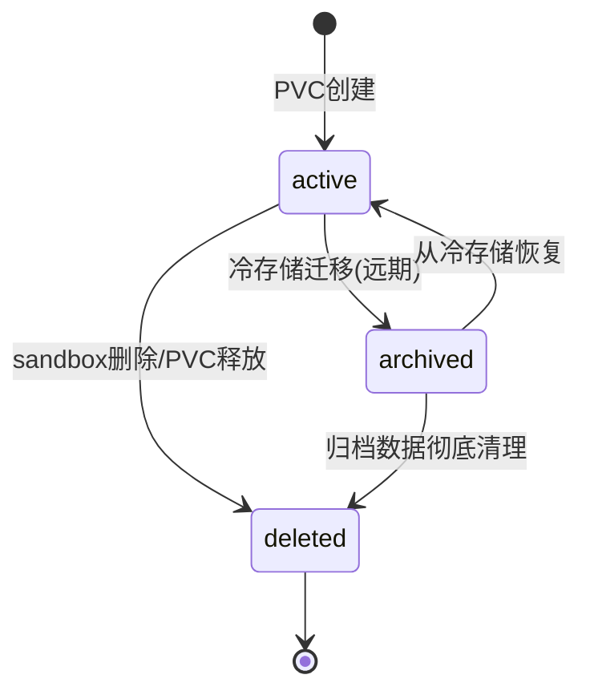
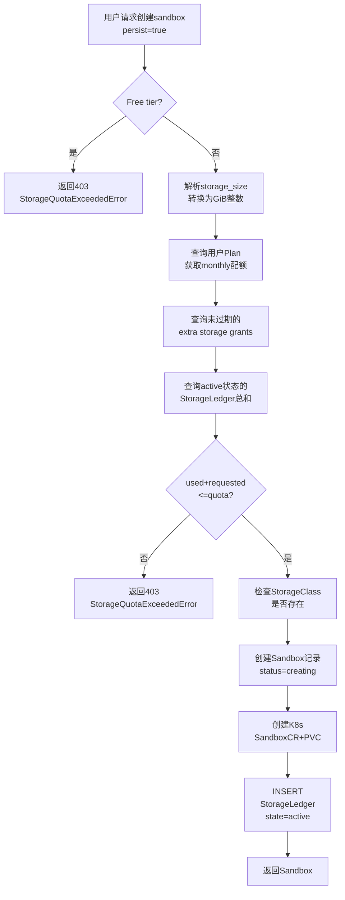
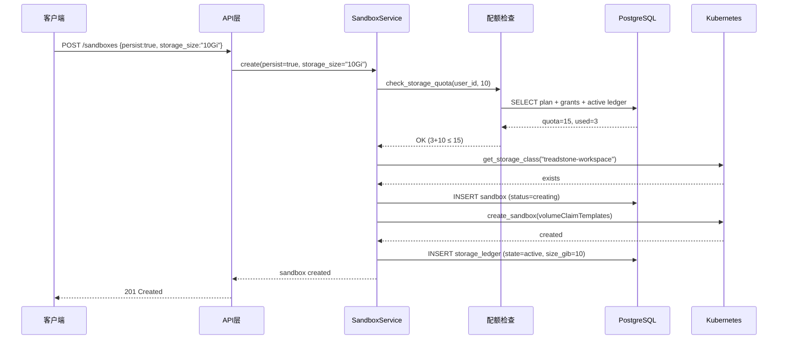
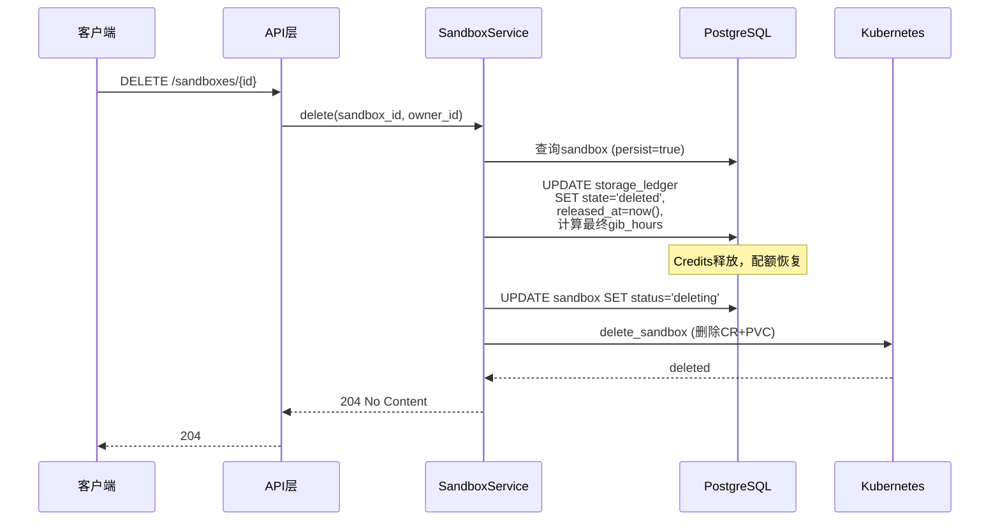
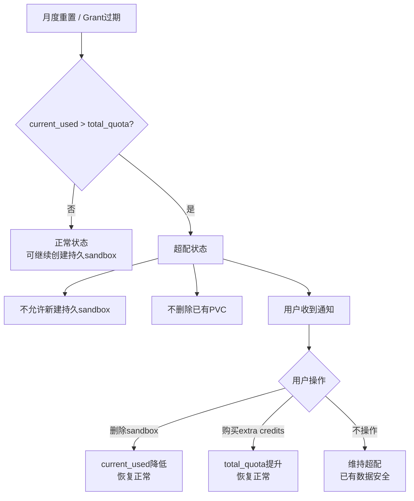
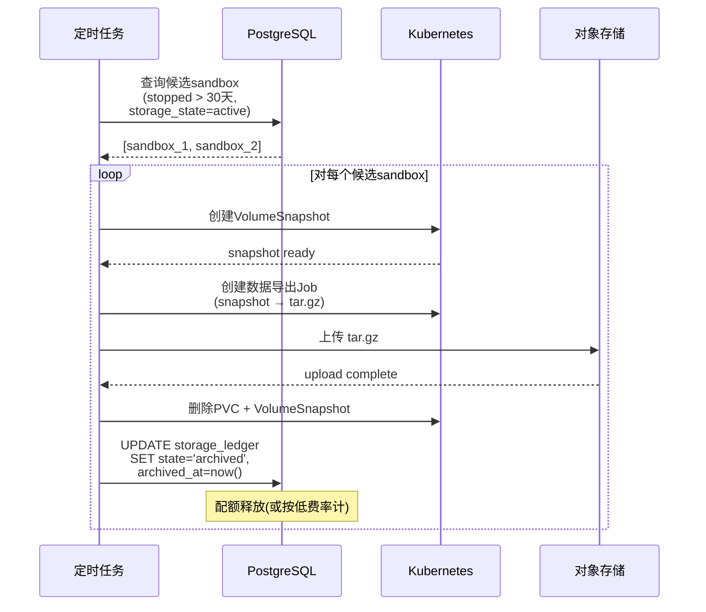
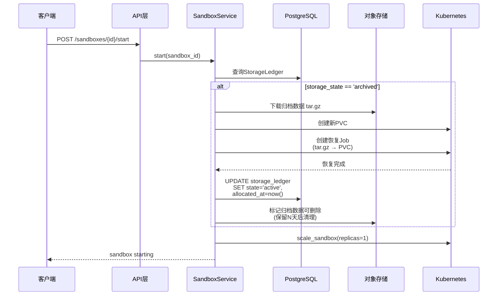
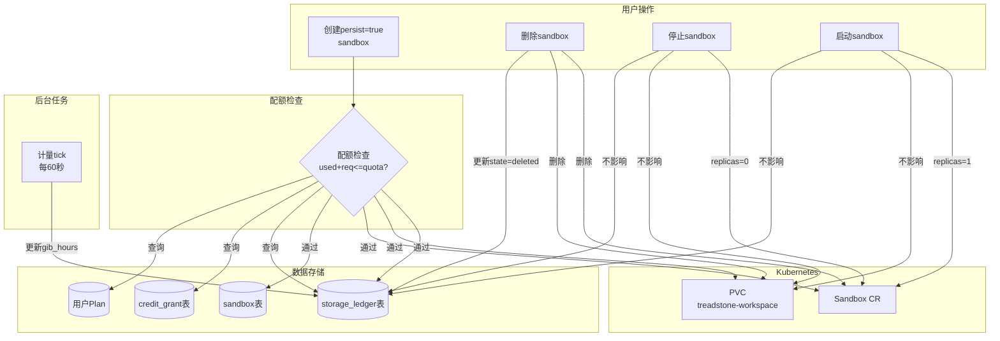

# Storage 计量设计

**日期：** 2026-03-26
**状态：** 设计中
**关联文档：** [计量系统总览](2026-03-26-metering-overview.md)

---

## 1. Storage Credits 定义

Storage Credits 是 Treadstone 计量系统中与 Compute Credits 并列的第二个维度。Compute Credits 衡量的是"运行时间"（CPU + 内存），而 Storage Credits 衡量的是"持久存储容量"（PVC 磁盘空间）。

### 1.1 Phase 1：配额模型（当前实现目标）

在 Phase 1 中，Storage Credits 表现为 **GiB 容量上限**——一个纯配额概念：

- **1 Storage Credit = 1 GiB 的持久存储容量**
- 用户的总可用存储 = Monthly Storage Credits + Extra Storage Credits
- 只要 PVC 存在（即使 sandbox 已 stopped），就持续占用 Storage Credits
- 删除 sandbox（同时删除 PVC）后，对应 Credits 立即释放
- 非持久 sandbox（`persist=False`）不产生任何 Storage Credits 消耗

```
用户配额模型：

┌─────────────────────────────────────────────────────┐
│           Total Storage Quota (GiB)                 │
│  ┌──────────────────────┐  ┌─────────────────────┐  │
│  │ Monthly Storage       │  │ Extra Storage       │  │
│  │ Credits               │  │ Credits             │  │
│  │ (Tier 决定, 月初重置) │  │ (Grant 授予, 可过期)│  │
│  └──────────────────────┘  └─────────────────────┘  │
└─────────────────────────────────────────────────────┘

存储占用 = SUM(所有 active StorageLedger 的 size_gib)
可用空间 = Total Storage Quota - 存储占用
```

### 1.2 Phase 2：GiB-月计费模型（未来演进）

Phase 2 中，Storage Credits 演进为 **GiB-月** 计费单位，即同时考虑"容量"和"持续时间"：

- 1 GiB 分配 1 个月 = 1 GiB-月
- 按比例计算：10 GiB 分配 15 天 ≈ 5 GiB-月
- 更精确的单位：1 GiB-月 ≈ 720 GiB-hours
- 后台通过 `StorageLedger.gib_hours_consumed` 字段持续追踪

**定价参考（Phase 2 使用）：**

| 平台 | 持久存储定价 |
|------|-------------|
| GitHub Codespaces | $0.07 / GiB-月 |
| Daytona | ~$0.08 / GiB-月 |
| Gitpod | $0.30 / GiB-月（含备份） |

Phase 1 已在数据模型中预留 `gib_hours_consumed` 字段并在后台 tick 中持续累积，确保 Phase 2 上线时有历史数据可用。

---

## 2. 双池 Storage Credits 模型

与 Compute Credits 类似，Storage 也采用 **双池** 设计：Monthly 池 + Extra 池。

### 2.1 Monthly Storage Credits

| 属性 | 说明 |
|------|------|
| 来源 | 用户所属 Tier（订阅等级）自动授予 |
| 重置周期 | 每月 1 日 00:00 UTC 重置上限 |
| 首月处理 | 注册时直接给满当月配额 |
| 不可转让 | Monthly Credits 不可转赠、不可提现 |

**各 Tier 的 Monthly Storage Credits：**

| Tier | Monthly Storage Credits (GiB) | 说明 |
|------|------------------------------|------|
| Free | 0 | 不允许创建持久 sandbox |
| Pro | 10 | 最多 10 GiB 持久存储 |
| Ultra | 20 | 最多 20 GiB 持久存储 |
| Enterprise | 自定义 | 按合同约定 |

### 2.2 Extra Storage Credits

| 属性 | 说明 |
|------|------|
| 来源 | `CreditGrant`（`credit_type = "storage"`） |
| 触发来源 | 营销活动、管理员手动授予、付费购买 |
| 过期机制 | 每条 Grant 有 `expires_at`，过期后不再计入配额 |
| Welcome Bonus | **暂不赠送** Storage Credits（Free 用户不允许 persist，无意义） |

### 2.3 Storage 配额计算公式

```python
def calculate_storage_quota(user_id: str, plan: Plan, session: AsyncSession) -> StorageQuota:
    # Monthly 配额（由 Tier 决定）
    monthly_quota = plan.storage_credits_monthly_limit

    # Extra 配额（来自未过期的 storage CreditGrant）
    extra_quota = await session.execute(
        select(func.coalesce(func.sum(CreditGrant.remaining_amount), 0))
        .where(
            CreditGrant.user_id == user_id,
            CreditGrant.credit_type == "storage",
            CreditGrant.expires_at > utc_now(),
        )
    )
    extra_quota_value = extra_quota.scalar_one()

    total_quota = monthly_quota + extra_quota_value

    # 当前已用（所有 active 状态的 StorageLedger）
    current_used = await session.execute(
        select(func.coalesce(func.sum(StorageLedger.size_gib), 0))
        .where(
            StorageLedger.user_id == user_id,
            StorageLedger.storage_state == "active",
        )
    )
    current_used_value = current_used.scalar_one()

    available = total_quota - current_used_value

    return StorageQuota(
        monthly_quota=monthly_quota,
        extra_quota=extra_quota_value,
        total_quota=total_quota,
        current_used=current_used_value,
        available=available,
    )
```

### 2.4 与 Compute Credits 的关键区别

```
Compute Credits（消耗型）：

  ┌─ running ────────────────────── stopped ─┐
  │ ████████████████████████████████          │  ← 持续消耗
  │ 每秒扣减 credits_per_second              │
  └──────────────────────────────────────────┘

Storage Credits（占用型 — Phase 1）：

  ┌─ created ─────────────────── deleted ────┐
  │ ▓▓▓▓▓▓▓▓▓▓▓▓▓▓▓▓▓▓▓▓▓▓▓▓▓▓▓▓          │  ← 容量占用
  │ 分配时占用, 释放时归还                      │
  │ 不随时间消耗更多                            │
  │ stopped 状态 PVC 仍存在 → 仍占用           │
  └──────────────────────────────────────────┘
```

| 维度 | Compute Credits | Storage Credits (Phase 1) |
|------|----------------|--------------------------|
| 消耗方式 | 随时间持续扣减 | 分配时一次性占用 |
| 关联资源 | Running sandbox (CPU + Mem) | PVC (磁盘) |
| stop 影响 | 停止消耗 | 不影响，仍占用 |
| 释放条件 | sandbox stopped | sandbox deleted (PVC 删除) |
| 月度重置 | monthly_used 归零 | 上限刷新，已有分配不变 |

---

## 3. StorageLedger 表设计

`StorageLedger` 追踪每个持久卷的完整生命周期，是 Storage 计量的核心数据模型。

### 3.1 表结构

```python
class StorageState(StrEnum):
    ACTIVE = "active"
    ARCHIVED = "archived"
    DELETED = "deleted"


class StorageLedger(Base):
    __tablename__ = "storage_ledger"
    __table_args__ = (
        Index("ix_storage_ledger_user_state", "user_id", "storage_state"),
        Index("ix_storage_ledger_sandbox", "sandbox_id"),
    )

    # ── 主键 ──
    id: Mapped[str] = mapped_column(
        String(24), primary_key=True, default=lambda: "sl" + random_id()
    )

    # ── 关联 ──
    user_id: Mapped[str] = mapped_column(
        String(24), ForeignKey("user.id", ondelete="CASCADE"), nullable=False
    )
    sandbox_id: Mapped[str] = mapped_column(
        String(24), ForeignKey("sandbox.id", ondelete="SET NULL"), nullable=True
    )

    # ── 容量 ──
    size_gib: Mapped[int] = mapped_column(Integer, nullable=False)

    # ── 状态 ──
    storage_state: Mapped[str] = mapped_column(
        String(16), nullable=False, default=StorageState.ACTIVE
    )

    # ── 生命周期时间戳 ──
    allocated_at: Mapped[datetime] = mapped_column(
        DateTime(timezone=True), nullable=False
    )
    released_at: Mapped[datetime | None] = mapped_column(
        DateTime(timezone=True), nullable=True
    )
    archived_at: Mapped[datetime | None] = mapped_column(
        DateTime(timezone=True), nullable=True
    )

    # ── 计量字段（为 Phase 2 准备） ──
    gib_hours_consumed: Mapped[Decimal] = mapped_column(
        Numeric(10, 4), nullable=False, default=Decimal("0")
    )
    last_metered_at: Mapped[datetime] = mapped_column(
        DateTime(timezone=True), nullable=False
    )

    # ── 审计 ──
    gmt_created: Mapped[datetime] = mapped_column(
        DateTime(timezone=True), default=utc_now, nullable=False
    )
    gmt_updated: Mapped[datetime] = mapped_column(
        DateTime(timezone=True), default=utc_now, onupdate=utc_now, nullable=False
    )
```

### 3.2 字段说明

| 字段 | 类型 | 说明 |
|------|------|------|
| `id` | String(24) | 主键，前缀 `sl`，如 `sl3a8f9b2c1d4e5f67` |
| `user_id` | String(24) | 存储所属用户，FK → `user.id` |
| `sandbox_id` | String(24) | 关联 sandbox，FK → `sandbox.id`（sandbox 被硬删除后置 NULL） |
| `size_gib` | Integer | 分配的 PVC 大小，单位 GiB（5 / 10 / 20） |
| `storage_state` | String(16) | 状态机：`active` → `archived` → `deleted`，或 `active` → `deleted` |
| `allocated_at` | DateTime(tz) | PVC 创建时间（分配时间点） |
| `released_at` | DateTime(tz) | PVC 删除时间（释放时间点），NULL 表示仍在占用 |
| `archived_at` | DateTime(tz) | 迁移到冷存储的时间（远期功能使用） |
| `gib_hours_consumed` | Decimal(10,4) | 累计 GiB-hours，后台 tick 持续更新 |
| `last_metered_at` | DateTime(tz) | 上次 tick 更新时间，用于增量计算 |
| `gmt_created` | DateTime(tz) | 记录创建时间 |
| `gmt_updated` | DateTime(tz) | 记录最后更新时间 |

### 3.3 索引设计

| 索引名 | 列 | 用途 |
|--------|------|------|
| `ix_storage_ledger_user_state` | `(user_id, storage_state)` | 查询用户的活跃存储占用（配额检查热路径） |
| `ix_storage_ledger_sandbox` | `(sandbox_id)` | 通过 sandbox 查找其对应的存储记录 |

### 3.4 状态机



**状态含义：**

| 状态 | 含义 | 占用配额 | PVC 存在 |
|------|------|---------|---------|
| `active` | PVC 存在并可用 | 是 | 是 |
| `archived` | 数据已迁移到对象存储 | 否（或减少费率） | 否 |
| `deleted` | PVC 已删除，存储已释放 | 否 | 否 |

---

## 4. 存储配额检查流程

当用户请求创建 `persist=True` 的 sandbox 时，必须在 K8s 资源创建之前完成配额检查。

### 4.1 检查伪代码

```python
class StorageQuotaExceededError(TreadstoneError):
    def __init__(self, used: int, requested: int, quota: int):
        super().__init__(
            code="storage_quota_exceeded",
            message=(
                f"Storage quota exceeded. "
                f"Used: {used} GiB, Requested: {requested} GiB, "
                f"Quota: {quota} GiB. "
                f"Delete unused persistent sandboxes or upgrade your plan."
            ),
            status=403,
        )


async def check_storage_quota(
    user_id: str,
    requested_gib: int,
    session: AsyncSession,
) -> None:
    """在创建持久 sandbox 前检查存储配额。超出则抛出异常。"""

    # 1. 获取用户 Plan
    plan = await get_user_plan(user_id, session)

    # 2. 计算总配额
    monthly_quota = plan.storage_credits_monthly_limit

    extra_result = await session.execute(
        select(func.coalesce(func.sum(CreditGrant.remaining_amount), 0))
        .where(
            CreditGrant.user_id == user_id,
            CreditGrant.credit_type == "storage",
            CreditGrant.expires_at > utc_now(),
        )
    )
    extra_quota = extra_result.scalar_one()
    total_quota = monthly_quota + extra_quota

    # 3. 计算当前已用
    used_result = await session.execute(
        select(func.coalesce(func.sum(StorageLedger.size_gib), 0))
        .where(
            StorageLedger.user_id == user_id,
            StorageLedger.storage_state == "active",
        )
    )
    current_used = used_result.scalar_one()

    # 4. 检查是否超出
    if current_used + requested_gib > total_quota:
        raise StorageQuotaExceededError(
            used=current_used,
            requested=requested_gib,
            quota=total_quota,
        )
```

### 4.2 特殊情况处理

| 场景 | monthly | extra | 已用 | 请求 | 结果 |
|------|---------|-------|------|------|------|
| Free 用户请求 persist | 0 | 0 | 0 | 5 | **拒绝** (0 + 5 > 0) |
| Pro 用户首次请求 5 GiB | 10 | 0 | 0 | 5 | 允许 (0 + 5 ≤ 10) |
| Pro 用户已用 8 GiB，请求 5 GiB | 10 | 0 | 8 | 5 | **拒绝** (8 + 5 > 10) |
| Pro 用户已用 8 GiB，有 5 GiB extra，请求 5 GiB | 10 | 5 | 8 | 5 | 允许 (8 + 5 ≤ 15) |
| Ultra 用户请求 20 GiB | 20 | 0 | 0 | 20 | 允许 (0 + 20 ≤ 20) |

### 4.3 配额检查在请求流程中的位置



### 4.4 storage_size 字符串到 GiB 整数的转换

```python
def parse_storage_size_gib(size_str: str) -> int:
    """将 '5Gi', '10Gi', '20Gi' 等转换为整数 GiB 值。"""
    if size_str.endswith("Gi"):
        return int(size_str[:-2])
    if size_str.endswith("Ti"):
        return int(size_str[:-2]) * 1024
    raise BadRequestError(f"Unsupported storage size format: {size_str}")
```

---

## 5. 存储分配与释放流程

### 5.1 分配流程（sandbox create with persist=True）



**关键实现细节：**

```python
async def create(self, owner_id: str, ..., persist: bool = False, storage_size: str | None = None) -> Sandbox:
    effective_storage_size = storage_size or settings.sandbox_default_storage_size
    size_gib = parse_storage_size_gib(effective_storage_size)

    if persist:
        # 配额检查 — 必须在任何资源创建之前
        await check_storage_quota(owner_id, size_gib, self.session)
        await self._ensure_persistent_storage_backend_ready()

    # ... 创建 sandbox 记录 ...
    # ... 创建 K8s 资源 ...

    if persist:
        # 创建 StorageLedger 记录
        ledger = StorageLedger(
            user_id=owner_id,
            sandbox_id=sandbox.id,
            size_gib=size_gib,
            storage_state=StorageState.ACTIVE,
            allocated_at=utc_now(),
            last_metered_at=utc_now(),
        )
        self.session.add(ledger)
        await self.session.commit()

    return sandbox
```

### 5.2 释放流程（sandbox delete）



**关键实现细节：**

```python
async def delete(self, sandbox_id: str, owner_id: str) -> None:
    sandbox = await self.get(sandbox_id, owner_id)
    if sandbox is None:
        raise SandboxNotFoundError(sandbox_id)

    # ... 状态转换检查 ...

    if sandbox.persist:
        # 释放存储记录
        result = await self.session.execute(
            select(StorageLedger).where(
                StorageLedger.sandbox_id == sandbox_id,
                StorageLedger.storage_state == StorageState.ACTIVE,
            )
        )
        ledger = result.scalar_one_or_none()
        if ledger is not None:
            now = utc_now()
            # 最终计算 gib_hours
            elapsed_seconds = (now - ledger.last_metered_at).total_seconds()
            final_gib_hours = ledger.size_gib * elapsed_seconds / 3600
            ledger.gib_hours_consumed += Decimal(str(final_gib_hours))
            ledger.last_metered_at = now

            ledger.storage_state = StorageState.DELETED
            ledger.released_at = now
            self.session.add(ledger)

    # ... 更新 sandbox 状态为 deleting ...
    # ... 删除 K8s 资源 ...
```

### 5.3 Sandbox stop/start 对存储计量的影响

**核心原则：stop/start 不影响存储计量。**

| 操作 | PVC 状态 | StorageLedger.storage_state | 占用配额 |
|------|---------|---------------------------|---------|
| create (persist=true) | 创建 | `active` | 是 |
| stop | 不变（PVC 仍存在） | `active`（不变） | 是 |
| start | 不变 | `active`（不变） | 是 |
| delete | 删除 | → `deleted` | 否 |

```mermaid
gantt
    title PVC生命周期与存储占用
    dateFormat X
    axisFormat %s

    section PVC存在
    PVC created → deleted    :active, 0, 100

    section Sandbox状态
    creating   :crit, 0, 5
    ready      :done, 5, 30
    stopped    :30, 60
    ready      :done, 60, 80
    deleting   :crit, 80, 100

    section 存储配额占用
    占用credits :active, 0, 100
```



stop 后 PVC 仍然存在（K8s 只是将 Pod 副本数缩至 0，PVC 保留），因此 `storage_state` 保持 `active`，存储配额持续占用。这与 Compute Credits 不同——Compute 在 stop 后停止消耗。

---

## 6. GiB-Hours 追踪（为未来计费准备）

虽然 Phase 1 采用纯配额模型，但从 Day 1 开始就在后台追踪 GiB-hours，为 Phase 2 的按量计费做数据准备。

### 6.1 后台 Tick 逻辑

与 Compute Credits 的 tick 使用同一个定时循环（每 60 秒执行一次），确保不引入额外的调度复杂度：

```python
async def tick_storage_metering(session: AsyncSession) -> int:
    """更新所有 active 存储条目的 GiB-hours。返回更新条目数。"""
    now = utc_now()
    updated = 0

    result = await session.execute(
        select(StorageLedger).where(
            StorageLedger.storage_state == StorageState.ACTIVE
        )
    )
    active_entries = result.scalars().all()

    for entry in active_entries:
        elapsed_seconds = (now - entry.last_metered_at).total_seconds()
        if elapsed_seconds <= 0:
            continue

        new_gib_hours = entry.size_gib * elapsed_seconds / 3600
        entry.gib_hours_consumed += Decimal(str(round(new_gib_hours, 4)))
        entry.last_metered_at = now
        updated += 1

    if updated > 0:
        await session.commit()

    return updated
```

### 6.2 Tick 调度集成

```python
async def metering_tick():
    """统一计量 tick，同时处理 Compute 和 Storage。"""
    async with async_session_factory() as session:
        # Compute tick（已有）
        await tick_compute_metering(session)

        # Storage tick（新增）
        count = await tick_storage_metering(session)
        if count > 0:
            logger.debug("Storage metering tick: updated %d entries", count)
```

### 6.3 GiB-Hours 到 GiB-月的换算

```
1 GiB-月 = 30 天 × 24 小时 = 720 GiB-hours

示例：
- 10 GiB 存储运行 30 天 = 10 × 720 = 7200 GiB-hours = 10 GiB-月
- 5 GiB 存储运行 15 天 = 5 × 360 = 1800 GiB-hours = 2.5 GiB-月
- 20 GiB 存储运行 3 天 = 20 × 72 = 1440 GiB-hours = 2 GiB-月
```

### 6.4 精度保证

- `gib_hours_consumed` 使用 `Decimal(10,4)`，精度 0.0001 GiB-hours ≈ 0.36 秒
- tick 间隔 60 秒，误差窗口 < 60 秒（在 PVC 创建/删除边界）
- 删除 sandbox 时执行最终计算，消除最后一个 tick 的误差

---

## 7. Storage 月度重置逻辑

Storage 的月度重置与 Compute 有本质区别。

### 7.1 Compute vs Storage 的月度重置对比

```
Compute 月度重置：
  月末: monthly_used = 850 / 1000 credits
  月初: monthly_used → 0 / 1000 credits  ← 清零，重新给一池水

Storage 月度重置：
  月末: 已分配 8 GiB / quota 15 GiB (monthly=10, extra=5)
  月初: 已分配 8 GiB / quota 10 GiB (monthly=10, extra=5过期→0)
  注意: 已有 PVC 不动! 只是上限可能变化
```

### 7.2 重置逻辑详解

Storage 月度重置不需要任何主动操作——它是**自然发生的**：

1. Monthly Storage Credits 每月重置为 Tier 定义的值（本质上不变，因为本来就是固定值）
2. Extra Storage Credits 可能因 Grant 过期而减少
3. 已有的 `StorageLedger` 记录和 PVC **不受任何影响**

```python
# 月度重置不需要存储相关的特殊逻辑
# 配额自然通过查询实时计算：
# total_quota = plan.monthly_limit + SUM(unexpired grants)
# 如果 grants 过期了，total_quota 自然降低
```

### 7.3 超配（Over-Provisioned）状态

当月度重置或 Grant 过期导致 `current_used > total_quota` 时，进入超配状态。



**超配处理规则：**

| 规则 | 说明 |
|------|------|
| 不删除 PVC | 用户数据安全是第一优先级，绝不自动删除 |
| 不降级 PVC | 不会自动缩减已有 PVC 的大小 |
| 阻止新建 | `check_storage_quota` 对新请求返回 403 |
| 通知用户 | 通过 API 响应 / 控制台 / 邮件提示超配状态 |
| 宽限期（可选） | 超配 N 天后可考虑强制 stop sandbox（不删除）以降低 Compute 消耗 |

---

## 8. 冷存储迁移设计（远期）

### 8.1 目标

长时间未使用的持久 sandbox 的存储自动迁移到低成本的对象存储（如 S3、阿里云 OSS 等），显著降低存储成本。

**成本对比（估算）：**

| 存储类型 | 单价（大致） | 20 GiB 月成本 |
|---------|------------|-------------|
| SSD 块存储 (PVC) | $0.10 / GiB-月 | $2.00 |
| 对象存储 (S3/OSS) | $0.005 / GiB-月 | $0.10 |
| 差额 | 20 倍 | $1.90 / 月 |

对于个人项目来说，冷存储可以带来 **90-95%** 的存储成本降低。

### 8.2 归档流程



**归档触发条件：**

```python
ARCHIVE_THRESHOLD_DAYS = 30

async def find_archive_candidates(session: AsyncSession) -> list[StorageLedger]:
    cutoff = utc_now() - timedelta(days=ARCHIVE_THRESHOLD_DAYS)
    result = await session.execute(
        select(StorageLedger)
        .join(Sandbox, StorageLedger.sandbox_id == Sandbox.id)
        .where(
            StorageLedger.storage_state == StorageState.ACTIVE,
            Sandbox.status == SandboxStatus.STOPPED,
            Sandbox.gmt_stopped < cutoff,
        )
    )
    return list(result.scalars().all())
```

### 8.3 恢复流程



### 8.4 对计量的影响

| 状态 | 配额占用 | GiB-hours 追踪 |
|------|---------|---------------|
| `active` | 完整占用 `size_gib` | 按 `size_gib` 累积 |
| `archived` | 不占用配额（或按 1/10 费率） | 停止累积 active GiB-hours |
| `deleted` | 不占用 | 停止 |

### 8.5 为什么要现在预留

虽然冷存储迁移是远期功能，但在 Phase 1 的 `StorageLedger` 表设计中就预留了关键字段：

- `storage_state`：三态枚举 `active / archived / deleted`，零运行时成本
- `archived_at`：nullable 时间戳，仅在归档时填充
- 后续实现冷存储时**无需 schema 变更**（无 Alembic migration）
- 对象存储成本约为块存储的 1/10 ~ 1/20，对单人项目的成本优化意义重大

---

## 9. storage_size 枚举值与 Tier 的关系

### 9.1 当前配置

`config.py` 中定义：

```python
SANDBOX_STORAGE_SIZE_VALUES = ("5Gi", "10Gi", "20Gi")
```

`settings.sandbox_default_storage_size` 默认为 `"5Gi"`。

### 9.2 Tier 控制总配额，不控制单个 PVC 大小

**核心原则：** Tier 控制的是用户的总存储配额（Total Storage Quota），而非单个 PVC 允许的大小选项。用户可以自由选择枚举值中的任意大小，只要总占用不超过配额。

```
Pro 用户 (quota = 10 GiB):

  合法方案 A: 2 × 5Gi = 10 GiB ✓
  合法方案 B: 1 × 10Gi = 10 GiB ✓
  合法方案 C: 1 × 5Gi = 5 GiB ✓ (未用满)
  非法方案 D: 1 × 20Gi = 20 GiB ✗ (超出配额)
  非法方案 E: 3 × 5Gi = 15 GiB ✗ (超出配额)
```

### 9.3 Size 选项与配额的交互矩阵

| Tier | 配额 (GiB) | 可选 5Gi | 可选 10Gi | 可选 20Gi |
|------|-----------|---------|----------|----------|
| Free | 0 | 不可 | 不可 | 不可 |
| Pro | 10 | 最多 2 个 | 最多 1 个 | 不可 |
| Ultra | 20 | 最多 4 个 | 最多 2 个 | 最多 1 个 |
| Enterprise | 自定义 | 取决于配额 | 取决于配额 | 取决于配额 |

### 9.4 未来扩展

Phase 2 可考虑更细粒度的 size 选项：

```python
# 未来可能的扩展
SANDBOX_STORAGE_SIZE_VALUES = ("1Gi", "2Gi", "5Gi", "10Gi", "20Gi", "50Gi")
```

扩展 size 选项不影响 `StorageLedger` 表结构（`size_gib` 是 Integer，不是枚举）。

---

## 10. Acceptance Scenarios

以下验收场景覆盖 Storage 计量系统的核心功能路径。

### 场景 1：Free 用户创建 persist=True 的 sandbox

```
Given: Free tier 用户 (monthly_storage = 0, extra_storage = 0)
When:  请求创建 sandbox (persist=true, storage_size="5Gi")
Then:  返回 403 StorageQuotaExceededError
       消息: "Storage quota exceeded. Used: 0 GiB, Requested: 5 GiB, Quota: 0 GiB."
       不创建 K8s 资源
       不创建 StorageLedger 记录
```

### 场景 2：Pro 用户存储配额不足

```
Given: Pro tier 用户 (monthly_storage = 10)
       已有 2 个持久 sandbox: 5Gi + 3Gi = 8 GiB 已用
When:  请求创建 sandbox (persist=true, storage_size="5Gi")
Then:  返回 403 StorageQuotaExceededError
       消息: "Storage quota exceeded. Used: 8 GiB, Requested: 5 GiB, Quota: 10 GiB."
```

### 场景 3：Extra Credits 扩展配额

```
Given: Pro tier 用户 (monthly_storage = 10)
       Extra storage grant: 5 GiB (未过期)
       已有 8 GiB 存储已用
When:  请求创建 sandbox (persist=true, storage_size="5Gi")
Then:  允许创建 (8 + 5 = 13 ≤ 10 + 5 = 15)
       K8s 创建 Sandbox CR + PVC (5Gi)
       StorageLedger 写入: state=active, size_gib=5
```

### 场景 4：删除持久 sandbox 释放配额

```
Given: Pro tier 用户，已有 10 GiB 存储 (1 × 10Gi sandbox)
       StorageLedger: state=active, size_gib=10, gib_hours=120.0000
When:  删除该 sandbox
Then:  StorageLedger 更新:
         state → deleted
         released_at = now()
         gib_hours_consumed = 最终值（含最后一个 tick 的增量）
       K8s 删除 Sandbox CR + PVC
       用户配额恢复: current_used = 0, available = 10 GiB
```

### 场景 5：Sandbox stopped 后存储仍占用配额

```
Given: Pro tier 用户，1 个 running 持久 sandbox (5Gi)
When:  stop 该 sandbox
Then:  Sandbox status → stopped
       K8s Pod 副本 → 0
       PVC 仍然存在
       StorageLedger state 仍为 active
       current_used 仍为 5 GiB
       gib_hours 继续在后台 tick 中累积
```

### 场景 6：月度重置后的超配状态

```
Given: Pro tier 用户 (monthly=10)
       Extra storage grant: 5 GiB (3月31日过期)
       已有 12 GiB 存储 (quota 15, 未超配)
When:  4月1日 grant 过期
Then:  total_quota = 10 + 0 = 10 GiB
       current_used = 12 GiB
       12 > 10 → 进入超配状态
       已有 PVC 不受影响，数据安全
       新的 persist=true 请求被拒绝
       用户收到超配通知
```

### 场景 7：GiB-hours 持续累积

```
Given: 持久 sandbox (size_gib=10, gib_hours=0, last_metered=T0)
When:  后台 tick 在 T0+60s 执行
Then:  new_gib_hours = 10 × 60 / 3600 = 0.1667
       gib_hours_consumed = 0.1667
       last_metered_at = T0+60s

When:  经过 24 小时 (1440 次 tick)
Then:  gib_hours_consumed ≈ 10 × 24 = 240.0000
```

### 场景 8：Extra Storage Credits 过期后总配额降低

```
Given: Ultra tier 用户 (monthly=20)
       Extra storage grant A: 10 GiB (过期时间: 明天)
       Extra storage grant B: 5 GiB (过期时间: 下月)
       已有 25 GiB 存储
       当前配额: 20 + 10 + 5 = 35 GiB → 未超配
When:  Grant A 过期
Then:  新配额: 20 + 0 + 5 = 25 GiB
       current_used = 25 GiB = 25 GiB → 恰好不超配
       但无法新建任何持久 sandbox (available = 0)
When:  Grant B 也过期
Then:  新配额: 20 GiB
       current_used = 25 GiB > 20 GiB → 超配
       已有 PVC 安全，阻止新建
```

---

## 附录 A：完整数据流总览



## 附录 B：API 接口变更

Storage 计量引入后，以下 API 需要变更：

### B.1 新增：获取存储配额

```
GET /api/v1/metering/storage/quota

Response:
{
    "monthly_quota_gib": 10,
    "extra_quota_gib": 5,
    "total_quota_gib": 15,
    "current_used_gib": 8,
    "available_gib": 7,
    "is_over_provisioned": false,
    "active_volumes": [
        {
            "sandbox_id": "sb3a8f9b2c1d4e5f",
            "sandbox_name": "my-project",
            "size_gib": 5,
            "allocated_at": "2026-03-15T10:00:00Z",
            "gib_hours_consumed": 1320.5000
        },
        ...
    ]
}
```

### B.2 变更：创建 sandbox 响应增加配额信息

```
POST /api/v1/sandboxes
Request: { "persist": true, "storage_size": "10Gi", ... }

Response (201):
{
    "id": "sb...",
    "persist": true,
    "storage_size": "10Gi",
    "storage_quota_after": {
        "total_quota_gib": 15,
        "current_used_gib": 13,
        "available_gib": 2
    },
    ...
}
```

### B.3 错误响应

```
POST /api/v1/sandboxes
Request: { "persist": true, "storage_size": "10Gi", ... }

Response (403):
{
    "error": {
        "code": "storage_quota_exceeded",
        "message": "Storage quota exceeded. Used: 8 GiB, Requested: 10 GiB, Quota: 10 GiB. Delete unused persistent sandboxes or upgrade your plan.",
        "status": 403
    }
}
```
