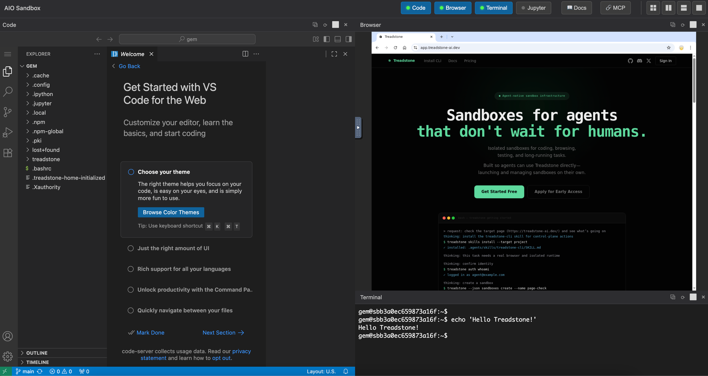

# 模块 3：浏览器接管与数据面代理

## 模块目标

这个模块处理两件事：

- 代理到 sandbox 内部服务的 **数据面访问**
- 把 sandbox 的浏览器界面安全地 **交接给人类**

当前实现主要位于：

- `treadstone/api/sandbox_proxy.py`
- `treadstone/api/browser.py`
- `treadstone/middleware/sandbox_subdomain.py`
- `treadstone/services/browser_auth.py`
- `treadstone/services/browser_login.py`

## 1. 数据面代理

### 路径

- `ALL /v1/sandboxes/{sandbox_id}/proxy/{path:path}`

这是一个薄代理层：

- 支持 HTTP
- 支持 WebSocket
- 不重新定义 sandbox 内部 API
- 只负责鉴权、路由和错误边界

### 当前鉴权边界

数据面明确只接受 API Key：

- cookie 用户访问数据面会得到 `auth_invalid`
- API Key 如果 `data_plane.mode = none` 会被拒绝
- `selected` 模式下必须命中授权过的 `sandbox_id`

这部分边界已经在 `get_current_data_plane_user()` 里定死。

## 2. 浏览器接管

打开 handoff 入口后，人类看到的是 sandbox 内部的完整浏览器视图——包括 in-sandbox 浏览器、VS Code（含集成终端）、文件树、Jupyter 等：

### 核心 URL 形态

当前浏览器入口建立在 sandbox 子域名上：

- canonical URL：`https://sandbox-{sandbox_id}.{sandbox_domain}`

注意这里用的是 **sandbox ID**，不是 sandbox name。

### Web Link API

当前控制面提供三条 Web Link 接口：

- `POST /v1/sandboxes/{sandbox_id}/web-link`
- `GET /v1/sandboxes/{sandbox_id}/web-link`
- `DELETE /v1/sandboxes/{sandbox_id}/web-link`

语义如下：

- `POST`：启用分享入口；如果当前已有有效 link，会直接返回现有 link，而不是强制轮换
- `GET`：返回当前是否启用、何时过期、最后一次使用时间
- `DELETE`：撤销当前 link

如果启用了 `sandbox_domain`，创建 sandbox 时还会自动生成一个 link，并让 `urls.web` 直接返回推荐打开入口。

## 3. 浏览器凭证模型

当前浏览器场景里存在三种凭证，但职责不同：

- **控制面 session cookie**：用户登录 Treadstone API
- **bootstrap ticket**：已登录用户打开特定 sandbox 时的一次性跳转票据
- **sandbox web cookie (`ts_bui`)**：进入 sandbox 子域名后使用的子域名会话

这三者不是一回事，当前实现也故意没有把控制面 cookie 直接共享到所有 sandbox 子域名。

## 4. 实际浏览器流程

### 已登录拥有者直接打开

1. 用户访问 sandbox 子域名
2. 子域名中间件发现没有 `ts_bui`
3. 跳转到 `/v1/browser/bootstrap?return_to=...`
4. 控制面校验当前 cookie 用户是否拥有这个 sandbox
5. 签发短期 bootstrap ticket
6. 重定向到 `/_treadstone/open?ticket=...`
7. 中间件下发 `ts_bui`
8. 之后正式代理到 sandbox 内部服务

### 持有分享链接的打开者

1. 打开 `/_treadstone/open?token=swl...`
2. 中间件校验 `SandboxWebLink`
3. 记录 `last_used_at`
4. 下发 `ts_bui`
5. 重定向到真正目标路径

### 未登录直接访问 canonical URL

会先被重定向到控制面的浏览器登录页：

- `GET /v1/browser/login`
- `POST /v1/browser/login`

登录成功后再回到 bootstrap 流程。

## 5. 配置边界

### 开启条件

如果 `TREADSTONE_SANDBOX_DOMAIN` 为空：

- 子域名路由整体关闭
- `urls.web` 为空
- Web Link API 无法使用

### 公网部署约束

当 `sandbox_domain` 是公网域名而不是 `localhost` 变体时，代码会强制要求：

- `TREADSTONE_APP_BASE_URL` 必须是可公开访问的 Web App 地址（如 `https://app.treadstone-ai.dev`）

这是为了让浏览器跳转和 OAuth callback 都能返回正确地址，且 cookie 保持在同一个域名上。

## 6. 当前实现现状

- 子域名网关已经是当前仓库里的真实能力，不再是设计稿
- 数据面代理仍然是 **thin proxy**，不会屏蔽 runtime 自己的路径结构
- 浏览器 hand-off 是围绕 link/token/ticket/cookie 这套机制实现的，当前没有独立前端网关应用

