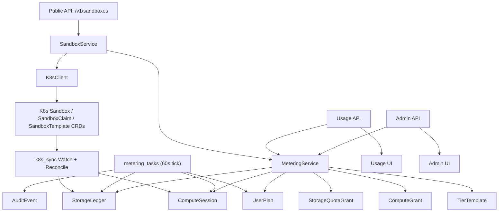
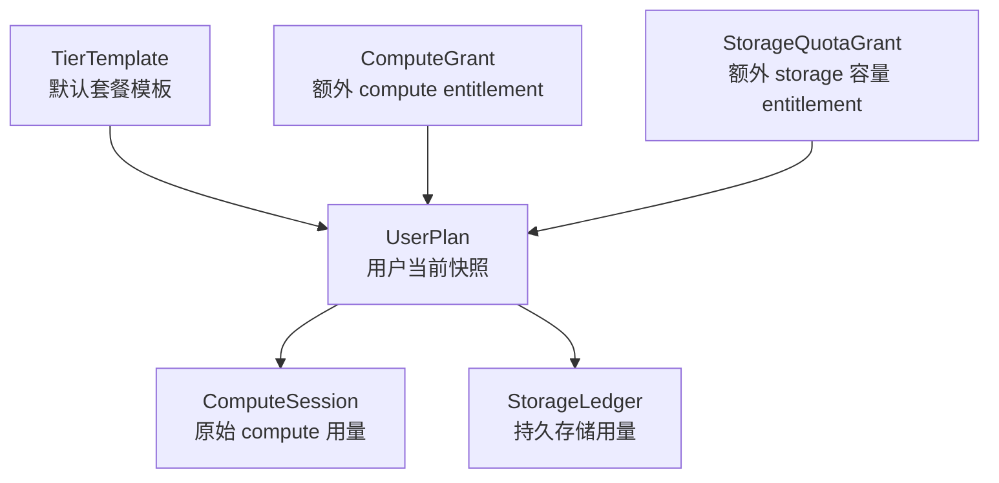

# 计量系统审计报告（当前代码实况）

**审计日期：** 2026-03-29
**代码基线：** `main` 分支当前 `HEAD`（提交 `7bb2d6c`）
**审计范围：**

- Compute 资源计量
- Storage 资源计量
- 套餐模板、用户计划、Compute/Storage 授予体系
- 配额执行、后台采集任务、K8s 同步链路、Usage/Admin 接口
- 与上述能力直接相关的数据库结构、迁移脚本、测试覆盖、前端使用方式

**判定原则：**

1. 只以仓库中当前实际运行的代码为准。
2. 历史文档和上一次审计报告只作为对比背景，不覆盖当前代码事实。
3. 公开 API、后台任务、K8s Watch/Reconcile、数据库结构、测试用例之间如果存在冲突，以当前运行链路和当前代码路径为准。
4. 对“是否适合上线”的判断，会同时从产品语义、功能闭环、代码一致性、测试可信度四个维度给出结论。

---

## 1. 审计材料与代码来源

### 1.1 本次重点核对的后端文件

- `treadstone/models/metering.py`
- `treadstone/services/metering_service.py`
- `treadstone/services/metering_tasks.py`
- `treadstone/services/k8s_sync.py`
- `treadstone/services/sync_supervisor.py`
- `treadstone/services/metering_helpers.py`
- `treadstone/services/sandbox_service.py`
- `treadstone/services/k8s_client.py`
- `treadstone/api/sandboxes.py`
- `treadstone/api/usage.py`
- `treadstone/api/admin.py`
- `treadstone/api/metering_serializers.py`
- `treadstone/api/schemas.py`
- `treadstone/api/sandbox_templates.py`
- `treadstone/api/auth.py`
- `treadstone/main.py`
- `treadstone/config.py`

### 1.2 本次重点核对的迁移脚本

- `alembic/versions/9f3a6a152a5c_add_metering_tables.py`
- `alembic/versions/f7a1b3c5d9e2_normalize_allowed_templates_to_full_.py`
- `alembic/versions/bc37bfeef9ac_add_provision_mode_persist_storage_size_.py`
- `alembic/versions/c4d5e6f7a8b9_metering_system_overhaul.py`
- `alembic/versions/d7e8f9a0b1c2_split_credit_grant_into_compute_and_storage.py`

### 1.3 本次重点核对的测试与前端文件

- `tests/unit/test_metering_models.py`
- `tests/unit/test_metering_service.py`
- `tests/unit/test_metering_tasks.py`
- `tests/unit/test_metering_integration.py`
- `tests/api/test_usage_api.py`
- `tests/api/test_admin_api.py`
- `tests/e2e/07-metering-usage.hurl`
- `tests/e2e/08-metering-admin.hurl`
- `web/src/pages/app/usage.tsx`
- `web/src/pages/internal/admin-metering.tsx`

### 1.4 与上一次审计相比，本次确认到的重大变化

当前代码相较上一次审计，已经发生了几处结构性变化：

1. 公开 `sandboxes` 路由已经注入 `MeteringService`，不再是完全脱线状态。
2. 新增 `metering_enforcement_enabled` 总开关，计量记录和配额拦截被拆开。
3. Compute 的运行记账从“credits 累计”改成了“原始资源小时累计”：
   - `vcpu_request`
   - `memory_gib_request`
   - `vcpu_hours`
   - `memory_gib_hours`
4. Storage 授予从旧的单表 `credit_grant` 拆成了：
   - `compute_grant`
   - `storage_quota_grant`
5. 新增了 `reconcile_storage_metering()`，Storage 已经不再只有 best-effort 记账。
6. `allowed_templates` 已通过单独迁移从 `tiny/small/...` 规范化为 `aio-sandbox-*`。

这意味着：**当前系统已经不是上一次审计时那套半接线的形态了，但也出现了新的断裂点。**

---

## 2. 执行摘要

### 2.1 一句话结论

**当前系统已经具备“原始资源用量采集 + 套餐/授予管理 + Storage 容量配额”的主体框架，但还不适合被描述为“完整可上线的 Compute 计量计费闭环”。**

更准确地说：

- Compute 原始用量记账链路已经存在，而且公共路径、Watch、Reconcile、Tick 都接上了。
- Storage 容量与 GiB-hours 记账链路也已经存在，而且现在有 Reconcile 兜底。
- 但是 Compute 的“额度消费”链路在当前生产代码里已经断开：系统会累计 `vcpu_hours` / `memory_gib_hours`，但不会把这些用量消耗到 `UserPlan.compute_credits_monthly_used` 或 `ComputeGrant.remaining_amount`。
- 因此所有依赖“剩余额度”的能力，包括：
  - `check_compute_quota()`
  - 80% / 100% warning
  - grace period
  - 超额自动 stop
  当前都无法随着真实运行时长自然触发。

### 2.2 当前状态总表

| 子系统 | 当前状态 | 审计结论 |
| --- | --- | --- |
| Compute 原始用量采集 | 已实现 | `可运行` |
| Compute 额度消费 | 代码存在，但生产路径未调用 | `未闭环` |
| Compute 配额拦截 | create/start 已接线，但受总开关控制，且依赖未消费的额度字段 | `部分有效` |
| Storage 分配/释放记账 | 已实现 | `可运行` |
| Storage 后台 GiB-hours 累计 | 已实现 | `可运行` |
| Storage Reconcile | 已实现 | `比上次明显更完整` |
| Storage 配额拦截 | create 已接线，但受总开关控制 | `基本成立` |
| Usage API | 已实现，返回原始用量与配额视图 | `可用` |
| Admin API | 已实现，支持 tier、plan、compute grant、storage grant | `可用` |
| 前端 Usage/Admin 页面 | 基本跟随后端新模型 | `基本可用，但命名存在混淆` |
| E2E Hurl 计量测试 | 仍停留在旧接口/旧字段 | `已失效` |
| 商业计费闭环 | 未实现 | `不应按 billing system 对外宣称` |

### 2.3 本次最关键的 6 个审计发现

#### 发现 A：公开请求路径已经接入 metering，但默认不会执行配额拦截

当前 `treadstone/api/sandboxes.py` 的 `create/start/delete/stop` 都已经用 `SandboxService(session=session, metering=_metering)` 实例化服务层，和上一次审计不同。

但在 `SandboxService.create()` / `start()` 中，所有配额检查都被挂在：

- `self._metering is not None`
- `settings.metering_enforcement_enabled`

这两个条件之后。

而 `treadstone/config.py` 中默认值是：

- `metering_enforcement_enabled = False`

这意味着：

- 默认部署下，系统会记录数据，但不会在 create/start 时基于额度阻止用户。
- 只有显式打开 `TREADSTONE_METERING_ENFORCEMENT_ENABLED=true`，这些配额检查才会进入真实执行路径。

#### 发现 B：Compute 现在记录的是原始资源小时，但“credit 扣减”生产链路已经断开

当前 ComputeSession 记录的是：

- `vcpu_request`
- `memory_gib_request`
- `vcpu_hours`
- `memory_gib_hours`

后台 tick 和 close 逻辑也只会累加这两类原始资源小时。

但是当前生产代码中，`consume_compute_credits()` 已经没有任何生产调用者。它只在单元测试中被直接调用。

结果就是：

- `UserPlan.compute_credits_monthly_used` 不会随着真实 sandbox 运行而增长。
- `ComputeGrant.remaining_amount` 不会随着真实 sandbox 运行而减少。
- `get_total_compute_remaining()` 读到的是一个“理论额度池”，而不是“已被真实运行消耗后的额度池”。

这是当前系统最大的功能性断裂点。

#### 发现 C：Compute 的 warning / grace period / auto-stop 逻辑目前没有真实触发基础

`check_warning_thresholds()`、`check_grace_periods()`、`_handle_exhausted()`、`_enforce_stop()` 都仍然依赖：

- `plan.compute_credits_monthly_used`
- `get_total_compute_remaining()`

因为这些字段/结果不再被真实运行时长驱动，所以在默认业务流程里：

- 80% warning 不会自然触发
- 100% warning 不会自然触发
- grace period 不会自然启动
- auto-stop 不会因为真实 compute 使用超额而生效

除非：

- 管理员手工修改 `compute_credits_monthly_used`
- 或未来重新接回 `consume_compute_credits()`

否则这些能力目前更像“保留的框架”，而不是可上线宣称的能力。

#### 发现 D：Storage 体系现在比 Compute 体系更接近真正可用

Storage 当前具备以下闭环：

1. `persist=True` 创建 sandbox 时可检查容量配额。
2. 创建成功后会写 `StorageLedger(ACTIVE)`。
3. 删除 persistent sandbox 时会释放 ledger。
4. 每 60 秒累加 `gib_hours_consumed`。
5. 每 300 秒 reconcile，会修复缺失 ledger 或孤儿 ACTIVE ledger。
6. StorageGrant 是单独的 `storage_quota_grant`，语义上是“额外容量上限”，不再伪装成可消费 credits。

因此，Storage 这条线虽然仍受 enforcement 开关控制，但从“模型一致性”和“后台修复能力”来说，已经比 Compute 更完整。

#### 发现 E：前端和 API 已部分跟随新模型，但名称体系仍然混杂

当前后端 `GET /v1/usage` 返回的是：

- Compute：原始 `vcpu_hours` / `memory_gib_hours`
- Storage：`gib_hours` + 当前容量使用

但前端与接口命名里仍混用：

- `Usage & Credits`
- `Compute Credits / Mo (vCPU-h)`
- `Storage Credits / Mo (GiB)`

这会造成产品语义上的混乱：

- Compute summary 已是原始资源小时，不再是完整的 credit ledger summary
- Storage 本质上是容量 entitlement，不是“每月消费型 credits”

也就是说，**底层模型已经拆开了，用户心智和部分命名还没完全拆开。**

#### 发现 F：E2E 计量测试已经明显过时，不能作为当前上线审计依据

当前：

- `tests/api/test_usage_api.py`
- `tests/api/test_admin_api.py`
- `tests/unit/test_metering_*`

已经基本对齐新模型。

但：

- `tests/e2e/07-metering-usage.hurl`
- `tests/e2e/08-metering-admin.hurl`

仍在断言旧字段和旧端点，例如：

- `$.compute.monthly_limit`
- `$.compute.monthly_used`
- `POST /v1/admin/users/{id}/grants`
- `POST /v1/admin/grants/batch`

而当前代码里这些接口/字段已经不存在或语义已经变更。

因此，**当前 E2E 计量测试集事实上已经失效。**

### 2.4 当前是否适合上线

#### 适合上线的部分

- Usage / Admin 读写接口
- TierTemplate / UserPlan / ComputeGrant / StorageQuotaGrant 的管理能力
- Compute 原始资源小时观测
- Storage 容量与 GiB-hours 记账
- Storage 配额框架

#### 不适合直接对外承诺的部分

- “Compute credits 会随实际运行自动扣减”
- “Compute 用尽后系统会自动 warning / grace / stop”
- “当前是完整的 compute + storage 计量计费系统”
- “现有 E2E 已验证计量系统上线可靠性”

---

## 3. 当前系统的整体架构

### 3.1 组件分层

当前计量系统可以拆成 6 层：

1. **套餐与授予层**
   - `TierTemplate`
   - `UserPlan`
   - `ComputeGrant`
   - `StorageQuotaGrant`
2. **请求路径执行层**
   - `SandboxService`
   - `MeteringService` 的 quota checks / storage allocation hooks
3. **K8s 状态同步层**
   - `k8s_sync.handle_watch_event()`
   - `k8s_sync.reconcile()`
4. **周期任务层**
   - `metering_tasks.tick_metering()`
   - `metering_tasks.tick_storage_metering()`
   - `check_warning_thresholds()`
   - `check_grace_periods()`
   - `reset_monthly_credits()`
5. **读取与运营层**
   - `/v1/usage/*`
   - `/v1/admin/*`
6. **前端消费层**
   - `web/src/pages/app/usage.tsx`
   - `web/src/pages/internal/admin-metering.tsx`

### 3.2 架构图

### 3.3 运行模式

系统有两种后台运行方式：

#### 模式 A：启用 leader election

- `LeaderControlledSyncSupervisor` 只允许 leader 副本运行：
  - K8s sync loop
  - metering tick loop
- 适用于多副本部署

#### 模式 B：关闭 leader election

- `main.py` 中每个 API 进程都会直接启动：
  - `start_sync_loop()`
  - `_run_metering_loop()`

这在单副本开发环境可接受，但在多副本环境会造成重复任务风险，因此生产多副本部署理论上必须启用 leader election。

---

## 4. 计量维度：系统到底按什么维度计量

## 4.1 总体原则

当前系统不是按 Prometheus / cAdvisor / Kubelet 的真实实时利用率计量，而是按：

- **模板资源规格**
- **Sandbox 生命周期状态**
- **逻辑分配的持久卷容量**
- **时间长度**

来做计量。

因此它本质上是：

- **规格型计量**
- **状态事件驱动计量**
- 不是底层容器实时资源利用率账单

## 4.2 Compute 的计量维度

当前 Compute 同时按以下维度计量：

| 维度 | 当前实现 | 说明 |
| --- | --- | --- |
| 用户维度 | `user_id` | 所有 compute 使用最终归属到用户 |
| sandbox 维度 | `sandbox_id` | 每个 sandbox 在 READY 生命周期内对应一条 open session |
| 模板维度 | `template` | session 打开时锁定模板名 |
| 资源规格维度 | `vcpu_request`、`memory_gib_request` | session 打开时从模板规格静态映射锁定 |
| 时间维度 | `started_at`、`last_metered_at`、`ended_at` | 按 wall-clock 时间差累计 |
| 账期维度 | `period_start`、`period_end` | 用于 usage summary 和月度 rollover |
| 套餐维度 | `tier`、`UserPlan` | 决定理论 compute 月额度、并发、模板权限、时长限制 |
| 授予维度 | `ComputeGrant` | 代表额外 compute entitlement |

## 4.3 Storage 的计量维度

当前 Storage 同时按以下维度计量：

| 维度 | 当前实现 | 说明 |
| --- | --- | --- |
| 用户维度 | `user_id` | 所有存储使用与存储授予归属到用户 |
| sandbox 维度 | `sandbox_id` | 一条 ledger 绑定一个 persistent sandbox |
| 容量维度 | `size_gib` | 基于请求的 PVC 逻辑大小，不是实际已写字节 |
| 生命周期维度 | `allocated_at`、`released_at`、`last_metered_at` | 用于累计 GiB-hours |
| 状态维度 | `storage_state` | 当前真实使用的是 `active` / `deleted`，`archived` 仅预留 |
| 套餐维度 | `storage_capacity_limit_gib` | UserPlan 的基础容量上限 |
| 授予维度 | `StorageQuotaGrant.size_gib` | 额外容量上限，非消费型余额 |

## 4.4 授予与限制的维度

除实际 usage 外，当前系统还存在另一条“entitlement 维度”：

| 维度 | 作用 |
| --- | --- |
| `TierTemplate` | 定义系统默认套餐模板 |
| `UserPlan` | 记录用户当前生效的 entitlement 快照 |
| `ComputeGrant` | 理论上的可消费 compute 额外额度 |
| `StorageQuotaGrant` | 理论上的附加存储容量 |
| `allowed_templates` | 模板准入控制 |
| `max_concurrent_running` | 并发限制 |
| `max_sandbox_duration_seconds` | 单个 sandbox 最长时长限制 |
| `grace_period_seconds` | compute 用尽后的缓冲时间 |

---

## 5. 计量模型：当前系统的数据模型是什么样的

## 5.1 模型总览

当前计量相关核心模型有 6 张表：

1. `tier_template`
2. `user_plan`
3. `compute_grant`
4. `storage_quota_grant`
5. `compute_session`
6. `storage_ledger`

它们的关系可以概括为：

## 5.2 `TierTemplate`

定义系统级套餐模板。

关键字段：

- `tier_name`
- `compute_credits_monthly`
- `storage_capacity_gib`
- `max_concurrent_running`
- `max_sandbox_duration_seconds`
- `allowed_templates`
- `grace_period_seconds`
- `is_active`

语义：

- 这是系统默认模板，不是用户实时状态。
- 管理员修改 tier template 后，可以选择是否同步到没有 overrides 的现有用户。

## 5.3 `UserPlan`

定义用户当前真正生效的套餐快照。

关键字段：

- `user_id`
- `tier`
- `compute_credits_monthly_limit`
- `storage_capacity_limit_gib`
- `max_concurrent_running`
- `max_sandbox_duration_seconds`
- `allowed_templates`
- `grace_period_seconds`
- `period_start`
- `period_end`
- `compute_credits_monthly_used`
- `overrides`
- `grace_period_started_at`
- `warning_80_notified_at`
- `warning_100_notified_at`

语义：

- 这张表既保存 entitlement，也保存当前周期状态。
- 它不是只读引用 `TierTemplate`，而是复制模板值后再允许 override。
- 计量系统当前仍然把 compute 剩余额度建立在 `compute_credits_monthly_limit - compute_credits_monthly_used` 上。

## 5.4 `ComputeGrant`

定义额外 compute 授予。

关键字段：

- `original_amount`
- `remaining_amount`
- `grant_type`
- `campaign_id`
- `expires_at`

语义：

- 这是**消费型** entitlement 模型。
- 设计上它应该随着 compute 使用被逐渐扣减。
- 当前生产代码里，真正会修改 `remaining_amount` 的只有 `consume_compute_credits()`。
- 但这个函数没有任何生产调用链，因此当前 `ComputeGrant` 更像一个“静态余额对象”，而不是与真实运行实时联动的额度池。

## 5.5 `StorageQuotaGrant`

定义额外 storage 容量授予。

关键字段：

- `size_gib`
- `grant_type`
- `campaign_id`
- `expires_at`

语义：

- 这是**容量型 entitlement**，不是消费型余额。
- 当前系统的解释是：只要 grant 没过期，就把 `size_gib` 加到总容量上限里。
- 它不会像 compute grant 一样随着使用而减少。

## 5.6 `ComputeSession`

定义 compute 的原始资源用量记录。

关键字段：

- `sandbox_id`
- `user_id`
- `template`
- `vcpu_request`
- `memory_gib_request`
- `started_at`
- `ended_at`
- `last_metered_at`
- `vcpu_hours`
- `memory_gib_hours`

索引：

- `ix_compute_session_open`：`ended_at IS NULL`
- `sandbox_id` 普通索引
- `user_id` 普通索引

语义：

- 每个 sandbox 在 READY 运行区间对应一条 open session。
- 当前系统不再把 session 本身当成 credits ledger，而是把它当成原始资源小时 ledger。

## 5.7 `StorageLedger`

定义 persistent sandbox 的存储分配生命周期。

关键字段：

- `user_id`
- `sandbox_id`
- `size_gib`
- `storage_state`
- `allocated_at`
- `released_at`
- `archived_at`
- `gib_hours_consumed`
- `last_metered_at`

索引：

- `ix_storage_ledger_user_state`
- `ix_storage_ledger_sandbox`
- `ix_storage_ledger_sandbox_active`（partial unique，`storage_state='active'`）

语义：

- 一条 ACTIVE ledger 表示用户当前占有一个 persistent volume。
- 删除 sandbox 后 ledger 被标记为 `deleted`，并结算最后一段 GiB-hours。
- `archived` 目前没有业务流使用。

---

## 6. 数据采集：系统如何收集和采集数据

## 6.1 采集入口总表

| 入口 | 触发方式 | 频率 | 采集/写入内容 |
| --- | --- | --- | --- |
| `POST /v1/sandboxes` | 用户创建 sandbox | 按请求触发 | 持久存储配额校验、persistent storage allocation 记账 |
| `POST /v1/sandboxes/{id}/start` | 用户启动 sandbox | 按请求触发 | 可做 compute 配额与并发校验 |
| `DELETE /v1/sandboxes/{id}` | 用户删除 sandbox | 按请求触发 | persistent storage release 记账 |
| K8s Watch | Sandbox CR 事件流 | 近实时 | READY/open session，STOPPED/ERROR/DELETING close session |
| K8s Reconcile | 列表对账 | 启动时 + 每 300 秒 | 修复 session / storage ledger 漏记或孤儿状态 |
| Metering Tick | 周期任务 | 每 60 秒 | 增量累计 compute raw hours、storage GiB-hours、warning、grace、月度 reset |
| `GET /v1/usage*` | 用户读取 usage | 按请求触发 | 懒创建 `UserPlan` 和 welcome bonus |
| `GET /v1/admin/users/{id}/usage` | 管理员读取 usage | 按请求触发 | 懒创建目标用户 `UserPlan` |

## 6.2 请求路径中的采集/触发

### (a) 如何收集和采集数据

#### 创建 sandbox

入口：

- `POST /v1/sandboxes`

路径：

1. `api/sandboxes.py:create_sandbox()`
2. `SandboxService.create()`
3. 如果 `persist=True` 且 metering 对象存在：
   - 可做 `check_storage_quota()`
   - 创建成功后调用 `record_storage_allocation()`

注意：

- 创建 sandbox 本身不会直接打开 `ComputeSession`。
- Compute session 的打开由 K8s 状态同步层在 sandbox 真正进入 READY 后触发。

#### 启动 sandbox

入口：

- `POST /v1/sandboxes/{sandbox_id}/start`

路径：

1. `api/sandboxes.py:start_sandbox()`
2. `SandboxService.start()`
3. 若 enforcement 开启，则做：
   - `check_compute_quota()`
   - `check_concurrent_limit()`
4. 真实 `ComputeSession` 仍由后续 READY 状态触发打开。

#### 删除 sandbox

入口：

- `DELETE /v1/sandboxes/{sandbox_id}`

路径：

1. `api/sandboxes.py:delete_sandbox()`
2. `SandboxService.delete()`
3. 若 `persist=True` 且 metering 对象存在，先调用 `record_storage_release()`
4. 然后再删 K8s 资源

### (b) 调用哪些接口来触发和采集数据

#### 公共 API

- `POST /v1/sandboxes`
- `POST /v1/sandboxes/{id}/start`
- `POST /v1/sandboxes/{id}/stop`
- `DELETE /v1/sandboxes/{id}`
- `GET /v1/usage`
- `GET /v1/usage/plan`
- `GET /v1/usage/sessions`
- `GET /v1/usage/storage-ledger`
- `GET /v1/usage/grants`
- `GET /v1/admin/users/{id}/usage`
- `PATCH /v1/admin/users/{id}/plan`
- `POST /v1/admin/users/{id}/compute-grants`
- `POST /v1/admin/users/{id}/storage-grants`
- `POST /v1/admin/compute-grants/batch`
- `POST /v1/admin/storage-grants/batch`

#### 内部函数入口

- `MeteringService.open_compute_session()`
- `MeteringService.close_compute_session()`
- `MeteringService.record_storage_allocation()`
- `MeteringService.record_storage_release()`
- `tick_metering()`
- `tick_storage_metering()`
- `reconcile_metering()`
- `reconcile_storage_metering()`

### (c) 多久采集一次

#### 近实时事件采集

- K8s Watch：事件流驱动，近实时
- Watch 连接超时：300 秒
- Watch 异常重启 backoff：5 秒

#### 周期型对账/累计

- Reconcile：每 300 秒一次
- Metering tick：每 60 秒一次

#### 按需懒创建

- `UserPlan` 与 welcome bonus 不在注册时创建
- 它们会在以下时机懒创建：
  - 读取 usage
  - 管理员读取 usage
  - 请求路径 quota check 调用 `get_user_plan()`
  - warning/grace task 首次遇到 open session 用户

### (d) Compute 数据具体如何被采集

1. sandbox 创建或启动后，真正开始运行前没有 compute usage 数据。
2. K8s Watch/Reconcile 观察到 sandbox 进入 READY。
3. `_apply_metering_on_transition()` 调用 `open_compute_session()`。
4. `open_compute_session()` 根据模板锁定：
   - `vcpu_request`
   - `memory_gib_request`
5. 周期任务每 60 秒把 `(now - last_metered_at)` 转成小时，再累加：
   - `vcpu_hours += vcpu_request * elapsed_hours`
   - `memory_gib_hours += memory_gib_request * elapsed_hours`
6. sandbox 从 READY 转到 STOPPED / ERROR / DELETING 时，`close_compute_session()` 做最后一段结算。

### (e) Storage 数据具体如何被采集

1. 用户创建 `persist=True` 的 sandbox。
2. 创建成功后写一条 `StorageLedger(ACTIVE)`。
3. 周期任务每 60 秒把 `(size_gib * elapsed_seconds / 3600)` 累加到 `gib_hours_consumed`。
4. 删除 persistent sandbox 时，把 ACTIVE ledger 转为 DELETED，并写最终一段 GiB-hours。
5. Reconcile 每 300 秒修复：
   - 有 persistent sandbox 但没有 ACTIVE ledger
   - 有 ACTIVE ledger 但 sandbox 已删/正在删

### (f) 数据采集的幂等与修复策略

#### Compute

- `open_compute_session()`：
  - 对 open session 做 `FOR UPDATE`
  - 已存在就直接返回
- `close_compute_session()`：
  - 没有 open session 则返回 `None`
- `tick_metering()`：
  - 用 optimistic lock (`gmt_updated`) + savepoint，避免某条 session 冲突拖垮整批 tick
- `reconcile_metering()`：
  - READY 但没 open session -> 补开
  - 非 READY 但仍有 open session -> 补关

#### Storage

- `record_storage_allocation()`：
  - 对 ACTIVE ledger 做 `FOR UPDATE`
  - 已存在则直接返回
- `record_storage_release()`：
  - 没有 ACTIVE ledger 则返回 `None`
- `reconcile_storage_metering()`：
  - persist sandbox 缺 ledger -> 补建
  - 孤儿 ACTIVE ledger -> 补 release

---

## 7. Compute 资源计量的当前工作方式

## 7.1 Compute 的数据源是什么

当前 Compute 计量的资源规格来源不是直接读取 K8s Template CR，而是来自 `metering_helpers.TEMPLATE_SPECS` 里的静态映射：

- `aio-sandbox-tiny -> 0.25 vCPU / 0.5 GiB`
- `aio-sandbox-small -> 0.5 vCPU / 1 GiB`
- `aio-sandbox-medium -> 1 vCPU / 2 GiB`
- `aio-sandbox-large -> 2 vCPU / 4 GiB`
- `aio-sandbox-xlarge -> 4 vCPU / 8 GiB`

这和 `sandbox_service._create_direct()` / `k8s_client.list_sandbox_templates()` 读取的模板 CR 资源规格是两套独立来源。

**当前代码里的现实：**

- 两套数值目前看起来是一致的
- 但它们不是同一个 source of truth
- 后续如果 K8s Template 被改了，metering 静态映射可能漂移

## 7.2 ComputeSession 什么时候打开

ComputeSession 不是在 API create/start 时打开，而是在 sandbox 真正 READY 时打开。

触发链路：

1. `k8s_sync.handle_watch_event()` 或 `reconcile()`
2. 发现状态从非 READY -> READY
3. `_apply_metering_on_transition()`
4. `MeteringService.open_compute_session()`

这意味着：

- 计量开始点是“真实运行就绪”，不是“用户发起创建请求”
- 对短暂失败、一直没 READY 的 sandbox，不会误记 compute hours

## 7.3 ComputeSession 记录什么

打开 session 时会锁定：

- `template`
- `vcpu_request`
- `memory_gib_request`
- `started_at`
- `last_metered_at`

随后每次 tick 或 close 时只累加：

- `vcpu_hours`
- `memory_gib_hours`

所以当前 session 已经从“credits 会计分录”演化成“原始资源小时账本”。

## 7.4 Compute 采集的周期逻辑

`tick_metering()` 每 60 秒执行一次：

1. 找到所有 `ended_at IS NULL` 的 open session
2. 用 `now - last_metered_at` 计算 elapsed seconds
3. 折算为 `elapsed_hours`
4. 累加：
   - `delta_vcpu_hours`
   - `delta_memory_gib_hours`
5. 更新 `last_metered_at` 与 `gmt_updated`

特点：

- 不是每次写一条事件，而是原地累加 aggregate
- 有 optimistic lock 冲突保护
- leader crash 后下次 tick 会补整段 gap，不按固定 60 秒片段强制切片

## 7.5 Compute 结束与跨月处理

### session 关闭

触发条件：

- READY -> STOPPED
- READY -> ERROR
- READY -> DELETING
- K8s DELETED 事件 / reconcile 发现 sandbox 不再 READY

关闭时会：

- 结算最后一段 `vcpu_hours`
- 结算最后一段 `memory_gib_hours`
- 写 `ended_at`

### 跨月 rollover

`reset_monthly_credits()` 会对到期 plan 做月度 rollover。

如果用户还有 open session：

- `handle_period_rollover()` 会把老 session 切到 `period_end`
- 然后创建一条新的 open session，从新账期开始继续累计原始资源小时

这一点说明当前系统已经认真处理了“跨月运行中的 sandbox”这个问题。

## 7.6 Compute 授予与配额现在是怎么工作的

理论模型仍然是：

1. 先用 `UserPlan.compute_credits_monthly_limit - compute_credits_monthly_used`
2. 再用 `ComputeGrant.remaining_amount`

`consume_compute_credits()` 也仍然保留了完整双池消费算法：

- 月度池优先
- extra grants 按 `expires_at` FIFO

但是当前生产代码有一个关键事实：

**真实 compute 运行不会调用 `consume_compute_credits()`。**

所以当前“Compute 授予系统”的真实工作状态是：

| 项 | 当前是否存在 | 当前是否被真实运行驱动 |
| --- | --- | --- |
| 月度 compute limit | 存在 | 否 |
| ComputeGrant welcome bonus | 存在 | 否 |
| Admin create compute grant | 存在 | 否 |
| 消费扣减算法 | 存在 | 否 |
| compute remaining 计算 | 存在 | 但读取的是未被真实运行消耗的池子 |

## 7.7 如何限制用户达到 compute 限额后不能继续使用

当前理论路径是：

### 创建时

- `check_compute_quota()`
- `check_concurrent_limit()`
- `check_template_allowed()`
- `check_sandbox_duration()`

### 启动时

- `check_compute_quota()`
- `check_concurrent_limit()`

### 用尽后

- `check_warning_thresholds()` 发 80% / 100% audit event
- `check_grace_periods()` 启动 grace period
- 到期后 `_enforce_stop()` 调用 stop callback 强制 scale to 0

但是由于 compute remaining 不会随真实运行减少，所以当前真实效果是：

- 结构上支持
- 语义上不成立

### 当前实际结论

如果 `metering_enforcement_enabled=false`：

- create/start 不会做 compute quota 拦截

如果 `metering_enforcement_enabled=true`：

- create/start 会做 compute quota 拦截
- 但因为月度 used / grant remaining 不会随着真实运行更新，所以大多数用户在真实使用中不会自然达到 compute exhausted 状态

**因此当前 Compute 限额阻断链路在架构上存在，在生产语义上未闭环。**

---

## 8. Storage 资源计量的当前工作方式

## 8.1 Storage 只对 persistent sandbox 生效

Storage 记账只在以下条件下发生：

- `persist=True`
- `storage_size` 合法

非 persistent sandbox：

- 不做 `StorageLedger` 分配
- 不参与 storage current used 统计

## 8.2 Storage 创建时如何工作

创建 persistent sandbox 时的流程：

1. `SandboxService.create(... persist=True)`
2. 检查 storage backend 是否就绪：
   - `get_storage_class(settings.sandbox_storage_class)`
3. 如果 enforcement 打开：
   - `parse_storage_size_gib()`
   - `check_storage_quota()`
4. sandbox K8s 创建成功后：
   - `record_storage_allocation()`
   - 写入一条 `StorageLedger(ACTIVE)`

### 当前支持的 storage size

当前 schema 和配置约束只允许：

- `5Gi`
- `10Gi`
- `20Gi`

## 8.3 Storage 释放时如何工作

删除 persistent sandbox 时：

1. `SandboxService.delete()`
2. 在删 K8s 资源之前，best-effort 调用 `record_storage_release()`
3. 把 ACTIVE ledger 转成 DELETED
4. 结算最后一段 GiB-hours

### 如果 release 失败怎么办

当前不会阻止 sandbox 删除。

但和上一次不同的是，现在还有 `reconcile_storage_metering()` 会兜底：

- ACTIVE ledger 指向的 sandbox 消失了
- 或 sandbox 进入 `DELETING`

后台会再次尝试 `record_storage_release()`

## 8.4 Storage 的后台累计

`tick_storage_metering()` 每 60 秒执行一次：

- 遍历所有 ACTIVE ledger
- 计算 `size_gib * elapsed_seconds / 3600`
- 累加到 `gib_hours_consumed`

这意味着当前系统同时保留了两种 storage 视图：

1. **当前容量视图**
   - `current_used_gib`
   - `total_quota_gib`
2. **累计时间视图**
   - `gib_hours_consumed`

## 8.5 Storage 配额与 StorageQuotaGrant 如何工作

Storage 配额计算是：

`total_storage_quota = UserPlan.storage_capacity_limit_gib + sum(active StorageQuotaGrant.size_gib)`

然后：

`available = total_storage_quota - current_storage_used`

`check_storage_quota(requested_gib)` 会在 `available < requested_gib` 时抛出 `StorageQuotaExceededError(402)`。

这里的关键点是：

- `StorageQuotaGrant` 是容量上限 addon，不是消费型余额
- 它不会因为用户分配了 5Gi 就剩 5Gi
- 它只是把 ceiling 抬高

## 8.6 StorageGrant 过期后的行为

当前代码没有额外的“过期 grant 回收已分配卷”逻辑。

这会导致一种明确的产品行为：

1. 用户依赖某个 storage grant 拿到了更高容量上限
2. grant 过期后，总 quota 下降
3. 如果此时 `current_used_gib > total_quota_gib`
4. 系统不会强制删除现有卷
5. 但新的 persistent sandbox 分配会被阻止

这是当前实现的自然结果，应被视为产品语义的一部分。

## 8.7 当前 Storage 是否能阻止用户超过限额

结论：

- **如果 enforcement 关闭：不能**
- **如果 enforcement 打开：基本可以**

因为 Storage 这条线至少具备：

- 当前使用量实时来源：ACTIVE ledger sum
- 总配额来源：plan limit + active storage grants
- 创建时检查：`check_storage_quota()`
- 释放与 reconcile：已存在

所以和 Compute 不同，Storage 限额执行在设计和实现上是对得上的。

---

## 9. 授予系统：Compute / Storage grant 现在怎么工作

## 9.1 用户注册时并不会立即创建 plan 或 grant

`auth.register()` 当前只做：

- 创建 `User`
- 写 audit event
- 发送验证邮件（非首个管理员用户）

它不会：

- 创建 `UserPlan`
- 发 welcome bonus

## 9.2 `UserPlan` 的真实创建时机

`ensure_user_plan()` 是真正的入口。

当以下路径首次遇到某个用户时，系统才会创建 free plan：

- `/v1/usage`
- `/v1/usage/plan`
- `/v1/usage/sessions`
- `/v1/usage/storage-ledger`
- `/v1/usage/grants`
- `/v1/admin/users/{id}/usage`
- 任意 enforcement 检查里调用 `get_user_plan()`
- warning/grace 任务遇到 open session 用户

## 9.3 welcome bonus 的真实工作方式

当前 welcome bonus 不是“注册即发放”，而是：

- 首次创建 free `UserPlan` 时
- 自动创建一条 `ComputeGrant`
- 默认：
  - `grant_type = welcome_bonus`
  - `original_amount = 50`
  - `remaining_amount = 50`
  - 过期时间 = 90 天后

这是一种 **lazy minting** 语义。

## 9.4 管理员如何授予 compute 和 storage

### 单用户

- `POST /v1/admin/users/{user_id}/compute-grants`
- `POST /v1/admin/users/{user_id}/storage-grants`

### 批量

- `POST /v1/admin/compute-grants/batch`
- `POST /v1/admin/storage-grants/batch`

当前批量接口的实现特点：

- 按用户逐个处理
- 每个用户在 nested transaction 中执行
- 某个用户失败不会回滚整个 batch
- 返回 per-user 成功/失败结果

## 9.5 Tier 与 Plan 如何工作

### TierTemplate 更新

`PATCH /v1/admin/tier-templates/{tier_name}`

可更新：

- compute monthly
- storage capacity
- max concurrent
- max duration
- allowed templates
- grace period

若 `apply_to_existing=true`：

- 只会更新没有 overrides 的同 tier 用户
- 有 overrides 的用户会被跳过

### 用户计划更新

`PATCH /v1/admin/users/{user_id}/plan`

有两种模式：

1. 改 tier
2. 只改 overrides

其中：

- 改 tier + overrides：会用新 tier 默认值覆盖，再套上新的 overrides
- 只改 overrides：会 merge 到现有 overrides 中

---

## 10. 如何限制用户在达到限额之后不能再使用资源

## 10.1 当前所有限制点

| 限制项 | 触发点 | 错误码 | 当前状态 |
| --- | --- | --- | --- |
| 模板权限限制 | create | 403 | 可工作 |
| Compute quota | create/start | 402 | 结构存在，但依赖未被真实消耗的余额 |
| 并发限制 | create/start | 429 | 可工作 |
| Storage quota | create(persist) | 402 | 可工作 |
| 单次运行最长时长 | create | 400 | 可工作 |
| Grace period 超时自动停机 | 后台 tick | 系统自动动作 | 结构存在，但依赖 compute 余额变化 |

## 10.2 限制是否真的在公开路径上生效

### create / start

只有在同时满足以下条件时才会执行：

1. 路由传入了 `metering=_metering`
2. `settings.metering_enforcement_enabled == True`

当前第 1 点已经成立。
当前第 2 点默认不成立。

因此当前系统的真实上线语义是：

- **记录链路默认开启**
- **拦截链路默认关闭**

## 10.3 哪些限制是现在真正可靠的

### 真正可靠

- `check_template_allowed()`
- `check_concurrent_limit()`
- `check_storage_quota()`
- `check_sandbox_duration()`

前提：`metering_enforcement_enabled=true`

### 结构存在但不可靠

- `check_compute_quota()`
- warning threshold
- grace period
- auto-stop on compute exhaustion

原因不是这些函数写错，而是**它们依赖的 compute 剩余额度没有被真实 usage 更新。**

---

## 11. 数据流程：从请求到数据库再到后台任务

## 11.1 创建 sandbox 的完整数据流

### 非 persistent sandbox

1. 用户调用 `POST /v1/sandboxes`
2. `SandboxService.create()` 可做 template / compute / concurrent / duration 检查
3. 写 `sandbox` 行，状态 `creating`
4. 走 `SandboxClaim` 路径创建 K8s 资源
5. K8s Watch/Reconcile 看到 READY
6. 打开 `ComputeSession`
7. 60 秒 tick 持续累加 `vcpu_hours` / `memory_gib_hours`
8. stop/delete/error 时关闭 `ComputeSession`

### persistent sandbox

在上述流程基础上额外增加：

1. 创建前检查 `StorageClass`
2. enforcement 开启时检查 `StorageQuota`
3. 创建成功后写 `StorageLedger(ACTIVE)`
4. 60 秒 tick 累计 `gib_hours_consumed`
5. 删除时 release ledger
6. Reconcile 可修复漏建/漏释 ledger

## 11.2 Usage 读取的数据流

`GET /v1/usage`

会读取：

- `UserPlan`
- `StorageQuotaGrant`
- `StorageLedger`
- `Sandbox`
- `ComputeSession`

返回组合后的聚合视图：

- 当前 tier
- 当前账期
- Compute 原始用量
- Storage 当前容量与累计 GiB-hours
- 并发/模板/时长限制
- grace period 状态

注意：

- `/v1/usage` 不再返回完整 compute 额度池摘要
- 想看 plan quota 需要 `/v1/usage/plan`
- 想看 grants 需要 `/v1/usage/grants`

## 11.3 Admin 写入的数据流

### 改 tier template

`PATCH /v1/admin/tier-templates/{tier}`

- 更新 `tier_template`
- 可选同步 `user_plan`
- 写 audit event

### 改用户 plan

`PATCH /v1/admin/users/{id}/plan`

- 读 `user_plan`
- 改 tier 或 merge overrides
- 写 audit event

### 发 grant

- 写 `compute_grant` 或 `storage_quota_grant`
- 写 audit event

---

## 12. 数据库结构与迁移链

## 12.1 关键迁移链

和当前 metering 直接相关的演进顺序大致是：

1. `9f3a6a152a5c`
   - 首次引入 metering 基础表
2. `f7a1b3c5d9e2`
   - 把 `allowed_templates` 从短名规范化到 `aio-sandbox-*`
3. `bc37bfeef9ac`
   - sandbox 表增加 `provision_mode` / `persist` / `storage_size` 等与 Storage 计量直接相关字段
4. `c4d5e6f7a8b9`
   - metering overhaul：
     - storage 列重命名为 capacity 语义
     - compute_session 改成原始资源小时模型
     - storage_ledger 增加 ACTIVE partial unique index
5. `d7e8f9a0b1c2`
   - 把旧 `credit_grant` 拆成：
     - `compute_grant`
     - `storage_quota_grant`

## 12.2 当前表结构里的关键设计点

### `tier_template` / `user_plan`

- storage 字段现在统一改成 `*_capacity_gib`
- 说明 storage 现在被定义为容量 entitlement，而不是 monthly credits

### `compute_session`

- `template` 已扩到 `String(255)`
- 不再存：
  - `credit_rate_per_hour`
  - `credits_consumed`
  - `credits_consumed_monthly`
  - `credits_consumed_extra`
- 改为存：
  - `vcpu_request`
  - `memory_gib_request`
  - `vcpu_hours`
  - `memory_gib_hours`

这说明底层账本模型已经明确切到“原始资源计量”。

### `storage_ledger`

- `(sandbox_id) WHERE storage_state='active'` 的唯一索引非常关键
- 它保证一个 sandbox 同时最多只有一条 ACTIVE ledger

### `compute_grant` / `storage_quota_grant`

- 表层面已经把两种完全不同的 entitlement 语义分开
- 这是当前代码里最健康的一处设计变化

---

## 13. 关键函数与接口清单

## 13.1 `MeteringService`

### Plan / Grant

- `ensure_user_plan()`
- `get_user_plan()`
- `update_user_tier()`
- `create_compute_grant()`
- `create_storage_quota_grant()`
- `list_tier_templates()`
- `update_tier_template()`
- `apply_overrides()`

### Quota / Entitlement

- `check_template_allowed()`
- `check_compute_quota()`
- `check_concurrent_limit()`
- `check_storage_quota()`
- `check_sandbox_duration()`
- `get_total_compute_remaining()`
- `get_total_storage_quota()`
- `get_current_storage_used()`
- `get_extra_compute_remaining()`
- `get_extra_storage_quota()`

### Usage Ledgers

- `open_compute_session()`
- `close_compute_session()`
- `record_storage_allocation()`
- `record_storage_release()`
- `get_compute_usage_for_period()`
- `get_usage_summary()`
- `list_compute_sessions()`
- `list_storage_ledger()`
- `list_compute_grants()`
- `list_storage_quota_grants()`

### 目前保留但未接入真实生产消费链路

- `consume_compute_credits()`

## 13.2 `metering_tasks`

- `tick_metering()`
- `tick_storage_metering()`
- `check_warning_thresholds()`
- `check_grace_periods()`
- `handle_period_rollover()`
- `reset_monthly_credits()`
- `run_metering_tick()`

## 13.3 `k8s_sync`

- `handle_watch_event()`
- `reconcile()`
- `_apply_metering_on_transition()`
- `reconcile_metering()`
- `reconcile_storage_metering()`

## 13.4 公开 API

### 用户

- `GET /v1/usage`
- `GET /v1/usage/plan`
- `GET /v1/usage/sessions`
- `GET /v1/usage/storage-ledger`
- `GET /v1/usage/grants`

### 管理员

- `GET /v1/admin/tier-templates`
- `PATCH /v1/admin/tier-templates/{tier_name}`
- `GET /v1/admin/users/lookup-by-email`
- `POST /v1/admin/users/resolve-emails`
- `GET /v1/admin/users/{user_id}/usage`
- `PATCH /v1/admin/users/{user_id}/plan`
- `POST /v1/admin/users/{user_id}/compute-grants`
- `POST /v1/admin/users/{user_id}/storage-grants`
- `POST /v1/admin/compute-grants/batch`
- `POST /v1/admin/storage-grants/batch`

---

## 14. 测试覆盖与当前空洞

## 14.1 当前覆盖到的部分

### 模型/帮助函数

- `tests/unit/test_metering_models.py`

覆盖：

- 模型字段
- 索引
- helper 函数
- template spec / storage size parse

### Service 层

- `tests/unit/test_metering_service.py`

覆盖：

- plan 创建与 tier 更新
- welcome bonus
- dual-pool consume 逻辑
- open/close session
- storage allocation/release
- quota checks

### 后台任务

- `tests/unit/test_metering_tasks.py`

覆盖：

- compute tick
- storage tick
- warnings
- grace period
- rollover

### Service/K8s 集成

- `tests/unit/test_metering_integration.py`

覆盖：

- `SandboxService` 与 metering 集成
- `_apply_metering_on_transition()`
- request-path quota checks

### Usage/Admin API

- `tests/api/test_usage_api.py`
- `tests/api/test_admin_api.py`

覆盖：

- usage summary / plan / sessions / storage ledger / grants
- tier template 管理
- user plan 管理
- compute/storage grants 管理

## 14.2 当前没有覆盖好的部分

### 缺口 A：没有 API 级别验证 enforcement 开关打开后的真实 create/start 拦截

虽然 unit integration tests 模拟了 `SandboxService` 行为，但缺少完整 API route 级别用例去验证：

- `metering_enforcement_enabled=true` 时
- 公共 `/v1/sandboxes` create/start
- 真的返回 402 / 403 / 429 / 400

### 缺口 B：没有任何测试证明 compute raw usage 会驱动 compute credits 消费

原因很简单：

- 当前生产代码本来就没有这条链路
- 单元测试只证明 `consume_compute_credits()` 本身可运行
- 但没有测试能证明后台 tick 或 close session 会调用它

### 缺口 C：E2E Hurl 已失效

`tests/e2e/07-metering-usage.hurl` 和 `08-metering-admin.hurl` 仍然断言旧模型：

- 旧 usage summary 字段
- 旧 grant endpoint
- 旧 admin batch endpoint

因此：

- 它们不能作为当前系统上线前审计证据
- 当前计量系统等于失去了端到端可验证性

### 缺口 D：前端文案没有完全和后端模型统一

前端当前会展示：

- 原始 compute usage
- welcome bonus remaining
- storage used/quota

但命名仍有“credits / mo”残留，容易混淆：

- 哪些是 raw usage
- 哪些是 entitlement
- 哪些会被消耗
- 哪些只是容量上限

---

## 15. 当前系统是否适合上线：产品、功能、代码三层判断

## 15.1 产品层

### 适合上线

- 让用户看到：
  - 当前 plan
  - 当前允许模板
  - 当前并发上限
  - 当前 storage used/quota
  - 当前 compute raw usage
  - 当前 grants

### 不适合上线

- 向用户承诺：
  - compute credits 会按真实运行自动扣减
  - compute 用尽会自动告警并停机
  - usage summary 本身就完整表达了 credit pool 状态

## 15.2 功能层

### Compute

- 原始用量采集：成立
- request-path 配额检查框架：成立
- 额度消耗与超额执行闭环：不成立

### Storage

- 分配/释放记账：成立
- 当前容量统计：成立
- GiB-hours 累计：成立
- Reconcile 修复：成立
- 配额执行：在 enforcement 打开时基本成立

## 15.3 代码层

### 优点

- 模型比上次更干净
- grants 语义拆分正确
- storage reconcile 已补齐
- compute tick 有 optimistic lock
- request-path / watch / reconcile / tick 分层清楚

### 当前 blockers

1. `consume_compute_credits()` 没有生产调用链
2. compute warning / grace / auto-stop 依赖未消费的额度字段
3. `metering_enforcement_enabled` 默认关闭，默认部署不会阻断
4. E2E 测试失效
5. template 资源规格仍有“双 source of truth”风险
6. 前端和部分命名仍混合 raw usage / credits / capacity 三套语义

---

## 16. 审计结论与上线前建议

### 16.1 当前结论

**如果把目标定义成“资源计量观测 + 套餐运营后台”，当前系统已经相当接近可上线。**

**如果把目标定义成“Compute/Storage 两套都能严格限额、自动告警、自动超额控制的完整计量计费系统”，当前系统还不能上线。**

### 16.2 上线前最优先要补的 5 件事

1. 把真实 compute usage 和 `consume_compute_credits()` 接回去，明确：
   - 是按 `vcpu_hours` 消耗 monthly credits
   - 还是按某个 credit conversion 消耗
2. 明确 compute summary 对外要展示什么：
   - 原始资源小时
   - 额度池剩余
   - 还是两者都展示
3. 打开 enforcement 前先补 API 级与 E2E 级测试，验证：
   - create/start 阻断
   - warning / grace / auto-stop
4. 统一 template resource spec 的 source of truth，避免静态 helper 与 K8s Template 漂移
5. 更新前端和文案，明确区分：
   - raw usage
   - monthly entitlement
   - bonus / grant
   - storage capacity

### 16.3 适合对外的准确表述

当前更准确的对外表述应该是：

- 系统已经具备 compute 原始资源使用观测能力。
- 系统已经具备 persistent storage 容量与 GiB-hours 记账能力。
- 系统已经具备 tier / plan / compute grant / storage grant 的后台运营能力。
- Storage 容量配额框架已基本成型。
- Compute credit 扣减与自动超额执行链路仍需补完，当前不应按“完整 billing/quota enforcement system”对外宣称。
