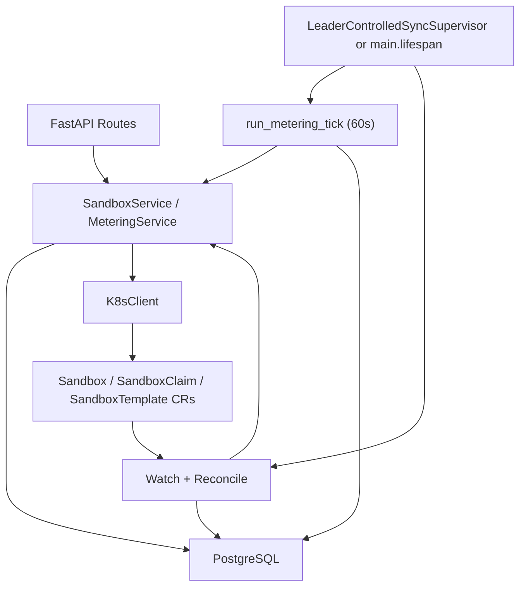
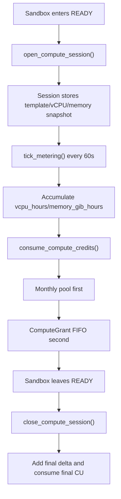
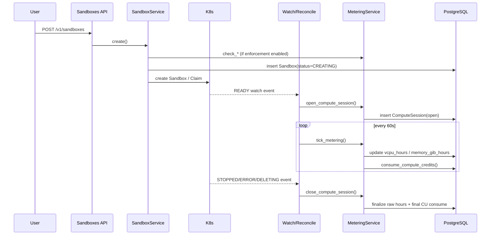
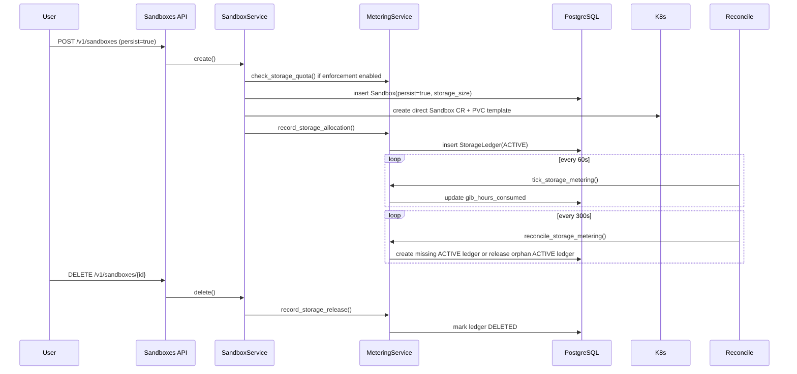

# 计量系统审计报告（第三轮，基于当前代码实况）

**审计日期：** 2026-03-29
**代码基线：** `main` 分支当前 `HEAD`，提交 `70258c9`
**审计范围：**

- Compute 资源计量
- Storage 资源计量
- 套餐模板、用户计划、Compute/Storage 授予体系
- 配额执行、后台采集任务、K8s Watch/Reconcile、Usage/Admin 接口
- 与上述能力直接相关的数据库结构、迁移脚本、测试覆盖、前端展示与当前已知缺陷

**判定原则：**

1. 只以仓库当前代码为准，不以历史设计稿、过期文档或旧 PR 讨论为准。
2. 如果文档、测试、接口、后台任务之间存在冲突，以当前生产路径和当前代码真实调用链为准。
3. “适不适合上线”同时从四个维度判断：
   - 产品语义是否清晰
   - 功能闭环是否成立
   - 数据准确性是否足够
   - 代码与测试是否支持上述结论

---

## 1. 审计材料与代码来源

### 1.1 本次重点核对的后端文件

- `treadstone/models/metering.py`
- `treadstone/services/metering_service.py`
- `treadstone/services/metering_tasks.py`
- `treadstone/services/metering_helpers.py`
- `treadstone/services/k8s_sync.py`
- `treadstone/services/sync_supervisor.py`
- `treadstone/services/sandbox_service.py`
- `treadstone/services/k8s_client.py`
- `treadstone/api/sandboxes.py`
- `treadstone/api/sandbox_templates.py`
- `treadstone/api/usage.py`
- `treadstone/api/admin.py`
- `treadstone/api/metering_serializers.py`
- `treadstone/api/schemas.py`
- `treadstone/api/auth.py`
- `treadstone/main.py`
- `treadstone/config.py`

### 1.2 本次重点核对的迁移脚本

- `alembic/versions/9f3a6a152a5c_add_metering_tables.py`
- `alembic/versions/f7a1b3c5d9e2_normalize_allowed_templates_to_full_.py`
- `alembic/versions/bc37bfeef9ac_add_provision_mode_persist_storage_size_.py`
- `alembic/versions/c4d5e6f7a8b9_metering_system_overhaul.py`
- `alembic/versions/d7e8f9a0b1c2_split_credit_grant_into_compute_and_storage.py`
- `alembic/versions/e1a2b3c4d5f6_rename_credits_to_compute_units.py`

### 1.3 本次重点核对的测试与前端文件

- `tests/unit/test_metering_models.py`
- `tests/unit/test_metering_service.py`
- `tests/unit/test_metering_tasks.py`
- `tests/unit/test_metering_integration.py`
- `tests/unit/test_k8s_sync.py`
- `tests/api/test_usage_api.py`
- `tests/api/test_admin_api.py`
- `tests/api/test_sandboxes_api.py`
- `tests/e2e/07-metering-usage.hurl`
- `tests/e2e/08-metering-admin.hurl`
- `web/src/pages/app/usage.tsx`
- `web/src/pages/internal/admin-metering.tsx`

### 1.4 与第二轮审计相比，本次确认到的重大变化

相较第二轮审计，当前代码已经发生了几处关键变化：

1. 术语层从 `credits` 统一迁移为 `compute_units`，数据库列名、Schema、前端和文档都做了更新。
2. 第二轮最大的断裂点已经补上：
   - `tick_metering()` 会在每轮 tick 后调用 `consume_compute_credits()`
   - `close_compute_session()` 会在关闭 session 时消耗最后一段 Compute Unit
3. `GET /v1/usage` 的 Compute 区块现在明确是“实际 Compute Unit 小时 + entitlement 池状态”的混合视图。
4. E2E Hurl 的字段和接口已经基本跟上当前 API 形状，不再停留在旧 `credits` 版接口。
5. K8s 模板资源规格现在会在 Reconcile 时同步进运行时缓存，Compute 计量不再只依赖硬编码模板规格。
6. 但也暴露出新的更细粒度问题：
   - ComputeSession 缺少“单个 sandbox 仅允许 1 个 open session”的数据库级约束
   - Storage 的 `gib_hours` 仍然是生命周期累计值，不是严格按 billing period 切割后的值
   - 删除 persistent sandbox 时，会在 K8s 删除成功前先释放 StorageLedger

---

## 2. 执行摘要

### 2.1 一句话结论

**当前系统已经明显强于第二轮审计时的状态：Compute 与 Storage 都具备可运行的计量主链路，Compute 的“额度消费闭环”也已经接回；但它仍然不适合被定义为“严格账务级、无明显边界缺陷的上线计量计费系统”。**

更准确地说：

- Compute 已经具备：
  - 原始资源小时采集
  - Compute Unit 计算
  - 月度池 + Grant 池双池消费
  - warning / grace / auto-stop 主链路
- Storage 已经具备：
  - 容量配额
  - 持久卷分配 / 释放记账
  - GiB-hours 周期性累计
  - Reconcile 修复
- 但系统仍有若干会影响上线可信度的结构性问题：
  - Compute open session 缺少数据库级唯一约束
  - Storage 周期用量统计不是严格 period-accurate
  - 删除路径会过早释放 Storage 配额
  - grace 期间的“真实超额量”并未持久化，absolute overage cap 实际上无法工作

### 2.2 当前状态总表

| 子系统 | 当前状态 | 审计结论 |
| --- | --- | --- |
| Compute 原始用量采集 | 已实现 | `可运行` |
| Compute Unit 消费 | 已实现 | `已闭环` |
| Compute 配额拦截 | 已实现，受总开关控制 | `可运行` |
| Compute warning / grace / auto-stop | 已实现，但 overage 持久化不足 | `部分成立` |
| Storage 容量分配/释放记账 | 已实现 | `可运行` |
| Storage GiB-hours 累计 | 已实现 | `可运行，但 period 精度不足` |
| Storage Reconcile | 已实现 | `可运行` |
| Storage 配额拦截 | 已实现，受总开关控制 | `基本成立` |
| Usage API | 已实现 | `可用` |
| Admin API | 已实现 | `可用` |
| 前端 Usage/Admin 页面 | 已跟上新模型 | `可用，但仍有命名混杂` |
| E2E 计量 Hurl | 已跟上接口形状 | `有价值，但覆盖不深` |
| 商业级 billing 闭环 | 未实现 | `不应按 Stripe/AWS 级 billing system 对外宣称` |

### 2.3 本次最关键的 8 个审计发现

#### 发现 A：Compute 额度消费闭环已经修复

第二轮审计时最关键的 blocker 是：系统会记 `vcpu_hours` / `memory_gib_hours`，但不会把真实运行消耗映射到 `UserPlan` 和 `ComputeGrant`。

当前代码中，这个问题已经被修复：

- `treadstone/services/metering_tasks.py:tick_metering()`
  - 每 60 秒累积所有 open session 的原始资源小时
  - 按用户聚合本轮 Compute Unit 增量
  - 调用 `MeteringService.consume_compute_credits()`
- `treadstone/services/metering_service.py:close_compute_session()`
  - 在 session 关闭时补上最后一段未 tick 的 Compute Unit
  - 同样调用 `consume_compute_credits()`

因此：

- `UserPlan.compute_units_monthly_used` 会随真实运行增长
- `ComputeGrant.remaining_amount` 会在月度池用完后被自然消耗
- `check_compute_quota()`、warning、grace、auto-stop 不再是“空壳”

#### 发现 B：系统的计量维度已经清晰拆成“实际使用量”与“entitlement 池”

当前实现不是单一 ledger，而是两套叠加视图：

1. **实际使用量**
   - Compute：
     - `ComputeSession.vcpu_hours`
     - `ComputeSession.memory_gib_hours`
     - `UsageSummary.compute.compute_unit_hours`
   - Storage：
     - `StorageLedger.gib_hours_consumed`
     - `UsageSummary.storage.gib_hours`
2. **entitlement / quota 池**
   - `UserPlan.compute_units_monthly_limit`
   - `UserPlan.compute_units_monthly_used`
   - `ComputeGrant.remaining_amount`
   - `UserPlan.storage_capacity_limit_gib`
   - `StorageQuotaGrant.size_gib`

这意味着：

- Compute 区块同时回答两个问题：
  - “这个周期实际跑了多少 CU-hours？”
  - “当前月度池和额外池还剩多少？”
- Storage 区块也同时回答两个问题：
  - “当前持久存储占用了多少 GiB？”
  - “累计了多少 GiB-hours？”

这个模型比第二轮更完整，但也带来一个产品层面的副作用：**Usage 接口返回的是“usage + entitlement 混合视图”，不是单纯的 usage report。**

#### 发现 C：ComputeSession 的“幂等性”只做到代码层，没有做到数据库层

`MeteringService.open_compute_session()` 的注释声称“幂等”，但它的实现方式是：

- 先 `SELECT ... FOR UPDATE` 查 open session
- 没查到就插入新 `ComputeSession`

问题在于：

- `compute_session` 表只有 `ix_compute_session_open`，这是普通 partial index，不是唯一约束
- 对“空结果”做 `FOR UPDATE` 并不能锁住“未来不存在的行”
- 因此 Watch 与 Reconcile 如果并发进入“为同一 sandbox 打开 open session”这条路径，理论上仍然可能插入两个 open session

这不是纯理论问题，因为当前确实存在并发来源：

- `handle_watch_event()` 触发 `_apply_metering_on_transition()`
- `reconcile_metering()` 也会修复缺失 session

一旦真的出现两个 open session，会导致：

- 计量重复
- `close_compute_session()` 的 `scalar_one_or_none()` 抛 `MultipleResultsFound`
- 后续 reconcile / close 逻辑进一步失效

这是当前最需要优先修正的数据库级缺陷之一。

#### 发现 D：Storage 的 GiB-hours 仍然不是严格的“按 billing period”数据

当前 `StorageLedger.gib_hours_consumed` 是从 `allocated_at` 开始累计的生命周期总量。

`GET /v1/usage` 在组装 Storage 区块时，只做了：

- 过滤“与当前 billing period 有重叠”的 ledger
- 然后直接 `SUM(StorageLedger.gib_hours_consumed)`

但它**没有**把 ledger 在当前 period 之外的历史部分裁掉。

因此，如果一个 persistent sandbox：

- 上个月就已经创建
- 这个月仍然存在

那么当前 `storage.gib_hours` 会包含“上个月 + 这个月”的累计值，而不是“本月值”。

结论：

- `current_used_gib` 作为容量视图是可信的
- `gib_hours` 作为“当前 billing period 的 Storage 用量”并不严格可信

如果未来真的要把 Storage GiB-hours 用于账单、报表、导出或超额计费，这个问题必须先解决。

#### 发现 E：删除 persistent sandbox 时，Storage 配额释放得过早

当前 `SandboxService.delete()` 的顺序是：

1. 如果 `persist=True`，先调用 `record_storage_release()`
2. 把 sandbox 状态改成 `DELETING`
3. 提交数据库
4. 再调用 K8s 删除 Sandbox CR / SandboxClaim

这意味着如果第 4 步失败：

- 数据库里的 `StorageLedger` 已经从 `ACTIVE` 变成 `DELETED`
- 用户的 `current_storage_used` 会立刻下降
- 但实际 PVC / Sandbox 资源可能还留在集群里

更关键的是，当前 `reconcile_storage_metering()` 只能：

- 为缺失 ACTIVE ledger 的 persistent sandbox 补 ledger
- 为 ACTIVE ledger 做 release

它**不会**把一个已经释放掉的 ledger“恢复为 ACTIVE”。

所以这个错误一旦发生，系统就会出现：

- 真实集群还占着存储
- 计量系统却认为这部分容量已经释放

这会直接破坏 Storage quota 的可信度。

#### 发现 F：grace period 能启动，但“absolute overage cap”实际上没有真实数据基础

当前 `check_grace_periods()` 的设计里有两种强制 stop 条件：

1. grace 时间到期
2. 超额量超过 `ABSOLUTE_OVERAGE_CAP_RATIO = 20%`

但当前 `consume_compute_credits()` 的行为是：

- 月度池扣到上限为止
- Grant 池扣到 0 为止
- 如果还不够，就把差额记在返回值 `shortfall`
- 但不会把 shortfall 持久化到任何表中

结果就是：

- 正常业务流下，`get_total_compute_remaining()` 最多只能到 `0`
- 它不会自然变成负数
- `_handle_exhausted()` 里的 `overage = abs(total_remaining)` 在大多数真实场景下只会得到 `0`

所以：

- grace period 会启动
- grace 超时后会 stop
- 但“超额 20% 立即 stop”这条规则在正常路径下几乎没有可用数据基础

换句话说，当前 grace 模型仍然更接近：

- `quota exhausted -> start timer -> timer expires -> stop`

而不是：

- `quota exhausted -> measure exact overage -> overage or timer triggers stop`

#### 发现 G：stop 回调失败时，grace 状态会被过早清空

`_enforce_stop()` 当前的行为是：

- 逐个 sandbox 调 `stop_callback` 或 `_db_only_stop()`
- 单个 sandbox stop 失败只记录日志
- 循环结束后，无论成功与否，都会把 `plan.grace_period_started_at = None`

这会导致：

- 如果 K8s scale-down 失败
- 用户 sandbox 事实上还在运行
- 但当前用户的 grace 状态已经被清掉

下一轮 tick 时，系统不会延续“已经进入 enforcement 阶段”的状态，而是会重新把它当作“第一次耗尽”，重新开始 grace 计时。

这会使 enforcement 变软，延长实际超额运行时间。

#### 发现 H：E2E 测试已经对齐接口，但仍不足以证明“整套计量链路上线级可靠”

这是相较第二轮的积极变化：

- `tests/e2e/07-metering-usage.hurl`
- `tests/e2e/08-metering-admin.hurl`

已经使用当前字段：

- `compute.compute_unit_hours`
- `compute.monthly_limit`
- `compute.extra_remaining`
- `/v1/admin/users/{id}/compute-grants`
- `/v1/admin/storage-grants`

所以它们已经不是“过期测试”了。

但仍然要注意：

- 这些 E2E 主要覆盖的是 Usage/Admin 读写接口
- 它们几乎没有真正覆盖：
  - sandbox READY -> STOPPED 状态转移下的 session 开关
  - 长时间 tick 后的消费累计
  - grace period 自动 stop
  - reconcile 修复丢失 session / ledger
  - storage crossing period 的准确计量

结论是：

- 当前 E2E 已能证明“接口形状大致正确”
- 还不能证明“计量系统在真实长时运行下绝对可靠”

---

## 3. 当前系统的定位与总体架构

### 3.1 系统在产品上的真实定位

如果只看代码事实，当前这套系统更准确的定位是：

- 一套**资源计量 + entitlement + 配额执行 + 管理员运营**基础设施

而不是：

- 一套已经完整打通支付、账单、发票、钱包、订单的 billing 平台

当前代码确实已经支持：

- 资源采集
- 配额与套餐
- 管理员发放 Compute/Storage 授予
- Usage/Admin 可观测视图
- 配额耗尽后的 warning / grace / stop

但仍然没有：

- 支付入口
- 账单结算
- 发票
- 钱包 / 充值
- 金额维度的对账系统

### 3.2 架构总览



### 3.3 主要组件职责

| 组件 | 责任 |
| --- | --- |
| `SandboxService` | create/start/stop/delete 的业务编排，入口处执行 metering enforcement |
| `MeteringService` | 套餐、授予、双池消费、用量汇总、配额查询 |
| `metering_tasks.py` | 60 秒周期 tick、warning、grace、monthly reset |
| `k8s_sync.py` | Watch 事件、Reconcile、模板规格同步、计量修复 |
| `k8s_client.py` | 与 K8s API / SandboxTemplate CR 交互 |
| `usage.py` | 用户自助查看 usage / plan / sessions / grants |
| `admin.py` | 管理员查看 usage、改 plan、发 grants、改 tier templates |
| `sync_supervisor.py` | 领导者副本控制下启动 K8s sync 与 metering tick |

### 3.4 领导者模式与后台任务启动方式

当前后台任务有两种启动模式：

1. **单实例 / 未开启 leader election**
   - `main.py` 在 `lifespan()` 中直接启动：
     - `start_sync_loop()`
     - `_run_metering_loop()`
2. **多实例 / 开启 leader election**
   - `LeaderControlledSyncSupervisor` 在拿到 lease 后才启动：
     - K8s sync loop
     - metering tick loop

这意味着：

- Watch / Reconcile / Metering Tick 都被设计成“单 leader 执行”
- 当前实现已经考虑了多副本部署下的后台任务重复执行问题

---

## 4. 计量维度：系统当前到底按什么维度计量

### 4.1 Compute 的计量维度

Compute 当前不是按“请求次数”计量，而是按**运行时间 × 资源规格**计量。

核心维度包括：

- sandbox template
- vCPU request
- memory GiB request
- session 开始 / 结束时间
- session 生命周期内累计的：
  - `vcpu_hours`
  - `memory_gib_hours`

在此基础上，再映射出用户看得见的 Compute Unit：

**公式：**

```text
CU / hour = max(vCPU_request, memory_GiB_request / 2)
```

换句话说，当前 Compute Unit 的语义是：

- 1 CU/h = `max(1 vCPU, 2 GiB memory)` 的 1 小时

### 4.2 当前模板与 CU 速率

基于 `TEMPLATE_SPECS` 与 FakeK8sClient 的默认模板，当前内置模板速率如下：

| Template | vCPU | Memory | CU/h |
| --- | --- | --- | --- |
| `aio-sandbox-tiny` | `0.25` | `0.5 GiB` | `0.25` |
| `aio-sandbox-small` | `0.5` | `1 GiB` | `0.5` |
| `aio-sandbox-medium` | `1` | `2 GiB` | `1` |
| `aio-sandbox-large` | `2` | `4 GiB` | `2` |
| `aio-sandbox-xlarge` | `4` | `8 GiB` | `4` |

### 4.3 Compute 的两个不同口径

当前系统内同时存在两个 Compute 口径：

1. **实际资源使用**
   - `ComputeSession.vcpu_hours`
   - `ComputeSession.memory_gib_hours`
   - `UsageSummary.compute.compute_unit_hours`
2. **可消费 entitlement 池**
   - `UserPlan.compute_units_monthly_limit`
   - `UserPlan.compute_units_monthly_used`
   - `ComputeGrant.remaining_amount`

这两个口径相关但不相同：

- `compute_unit_hours` 更接近“实际跑了多少”
- `monthly_used` 更接近“月度池已经消耗了多少”
- 如果用户开始消耗 `ComputeGrant`，`compute_unit_hours` 还会继续增长，但 `monthly_used` 会停在月度上限

这是当前 API 设计中最容易让产品方和用户产生误解的一点。

### 4.4 Storage 的计量维度

Storage 当前分成两个维度：

1. **容量占用**
   - `size_gib`
   - `current_used_gib`
   - `total_quota_gib`
2. **时间累计**
   - `gib_hours_consumed`

Storage 不是对所有 sandbox 计量，只对 `persist=True` 的 sandbox 计量。

也就是说，Storage 计量的前提条件是：

- 持久存储被请求
- sandbox 走 direct Sandbox CR 路径
- `StorageLedger` 被创建

### 4.5 Storage 和 Compute 的产品语义差异

当前代码已经隐含接受了一个更合理的设计：

- Compute 是**消费型 entitlement**
- Storage 是**容量型 entitlement**

体现为：

- Compute 使用 `UserPlan + ComputeGrant.remaining_amount` 进行持续扣减
- Storage 使用 `storage_capacity_limit_gib + StorageQuotaGrant.size_gib` 表示配额上限

这是比“两个完全对称的 credits 池”更合理的模型。

---

## 5. 计量模型：当前系统如何把资源用量映射成用户可见的额度系统

### 5.1 关键概念总览

| 概念 | 当前语义 |
| --- | --- |
| `TierTemplate` | 系统级套餐模板 |
| `UserPlan` | 用户当前生效的套餐快照 |
| `ComputeGrant` | 可消费的额外 Compute Unit 池 |
| `StorageQuotaGrant` | 增加容量上限的存储授予 |
| `ComputeSession` | 单个 sandbox 一段运行区间的 Compute 计量记录 |
| `StorageLedger` | 单个 persistent sandbox 的存储分配生命周期记录 |

### 5.2 TierTemplate：套餐模板

`TierTemplate` 是所有默认 entitlement 的来源，字段包括：

- `tier_name`
- `compute_units_monthly`
- `storage_capacity_gib`
- `max_concurrent_running`
- `max_sandbox_duration_seconds`
- `allowed_templates`
- `grace_period_seconds`
- `is_active`

### 5.3 UserPlan：用户套餐快照

`UserPlan` 并不是简单引用 `TierTemplate`，而是把模板值拷贝到用户侧形成快照。这样做的好处是：

- 管理员可以对单个用户做 override
- 即使 TierTemplate 后续变化，旧用户 plan 也不一定跟着变
- `apply_to_existing=True` 时可以只批量覆盖“没有 override 的 plan”

`UserPlan` 除 entitlement 外，还包含 period 与状态字段：

- `period_start`
- `period_end`
- `compute_units_monthly_used`
- `grace_period_started_at`
- `warning_80_notified_at`
- `warning_100_notified_at`

### 5.4 ComputeGrant：额外 Compute Unit 池

`ComputeGrant` 是一个真正会被消耗的池：

- `original_amount`
- `remaining_amount`
- `grant_type`
- `campaign_id`
- `expires_at`

消费顺序是：

1. 月度池
2. ComputeGrant 池，按 `expires_at ASC NULLS LAST` FIFO

### 5.5 StorageQuotaGrant：额外容量上限

`StorageQuotaGrant` 不是消费型余额，而是“额外容量 entitlement”：

- `size_gib`
- `expires_at`

它不会随着 `gib_hours_consumed` 递减。它只影响：

- `get_total_storage_quota()`
- `check_storage_quota()`
- `UsageSummary.storage.total_quota_gib`

### 5.6 Welcome Bonus 的当前真实行为

free 用户的 welcome bonus 仍然存在，但触发点不是注册接口本身，而是：

- 第一次调用 `ensure_user_plan()` 创建 free plan 时

当前默认值：

- 金额：`50` Compute Units
- 有效期：`90` 天

这意味着：

- 注册用户但从未访问 usage / create sandbox / 进入需要 plan 的路径时，数据库里可能还没有 `UserPlan`
- 第一次触发 metering 相关路径时，plan 和 welcome bonus 才会惰性创建

### 5.7 当前内置 Tier

根据迁移脚本当前 seed，系统内置 tier 如下：

| Tier | Compute Units / 月 | Storage 容量 | 并发上限 | 最长时长 | 允许模板 | Grace |
| --- | --- | --- | --- | --- | --- | --- |
| `free` | `10` | `0 GiB` | `1` | `1800s` | `aio-sandbox-tiny`, `aio-sandbox-small` | `600s` |
| `pro` | `100` | `10 GiB` | `3` | `7200s` | `aio-sandbox-tiny`, `aio-sandbox-small`, `aio-sandbox-medium` | `1800s` |
| `ultra` | `300` | `20 GiB` | `5` | `28800s` | `aio-sandbox-tiny`, `aio-sandbox-small`, `aio-sandbox-medium`, `aio-sandbox-large` | `3600s` |
| `enterprise` | `5000` | `500 GiB` | `50` | `86400s` | `aio-sandbox-tiny`, `aio-sandbox-small`, `aio-sandbox-medium`, `aio-sandbox-large`, `aio-sandbox-xlarge` | `7200s` |

其中模板名在初始迁移中是短名，后续已由 `f7a1b3c5d9e2` 规范化为完整的 `aio-sandbox-*`。

---

## 6. 数据采集：系统如何收集、触发和累积数据

### 6.1 采集链路总表

| 采集类型 | 触发入口 | 关键函数 | 频率 |
| --- | --- | --- | --- |
| 用户创建 sandbox | `POST /v1/sandboxes` | `SandboxService.create()` | 请求触发 |
| 用户启动 sandbox | `POST /v1/sandboxes/{id}/start` | `SandboxService.start()` | 请求触发 |
| 用户删除 sandbox | `DELETE /v1/sandboxes/{id}` | `SandboxService.delete()` | 请求触发 |
| K8s 状态变更 | Watch `ADDED/MODIFIED/DELETED` | `handle_watch_event()` | 近实时 |
| 周期性 Compute tick | leader loop | `tick_metering()` | 每 60 秒 |
| 周期性 Storage tick | leader loop | `tick_storage_metering()` | 每 60 秒 |
| warning 检查 | leader loop | `check_warning_thresholds()` | 每 60 秒 |
| grace 检查 | leader loop | `check_grace_periods()` | 每 60 秒 |
| monthly reset | leader loop | `reset_monthly_credits()` | 每 60 秒检查 |
| K8s / DB 漂移修复 | reconcile | `reconcile()` | 每 300 秒 |
| Compute repair | reconcile 子流程 | `reconcile_metering()` | 每 300 秒 |
| Storage repair | reconcile 子流程 | `reconcile_storage_metering()` | 每 300 秒 |
| 模板资源规格同步 | reconcile 子流程 | `sync_template_specs_from_k8s()` | 每 300 秒 |

### 6.2 请求路径采集

#### 6.2.1 创建 sandbox

入口：

- `POST /v1/sandboxes`
- `treadstone/api/sandboxes.py:create_sandbox()`
- `SandboxService.create()`

请求路径当前会做三类事情：

1. **参数与模板校验**
   - `CreateSandboxRequest` 校验 `name`、`persist`、`storage_size`
   - `persist=True` 时，从 `SandboxTemplate` 注解读取允许的 storage size
2. **可选的 metering enforcement**
   - 只有 `settings.metering_enforcement_enabled == True` 才会执行
   - 会检查：
     - 模板是否允许
     - Compute quota 是否已耗尽
     - 并发限制
     - Storage quota
     - 最大运行时长
3. **成功后做 Storage 分配记账**
   - 仅 `persist=True` 时
   - 写入 `StorageLedger(ACTIVE)`

#### 6.2.2 启动 sandbox

入口：

- `POST /v1/sandboxes/{id}/start`
- `SandboxService.start()`

会执行：

- `check_compute_quota()`
- `check_concurrent_limit()`

但同样受 `metering_enforcement_enabled` 控制。

#### 6.2.3 删除 sandbox

入口：

- `DELETE /v1/sandboxes/{id}`
- `SandboxService.delete()`

当前行为：

- 如果 `persist=True`，先 `record_storage_release()`
- 再把 DB 状态改为 `DELETING`
- 再请求 K8s 删除

这是当前 Storage 主链路中的一个精度风险点，详见后文缺陷部分。

### 6.3 K8s Watch 采集

#### 6.3.1 Watch 入口

入口：

- `start_sync_loop()`
- `watch_loop()`
- `handle_watch_event()`

Watch 负责消费真实 Sandbox CR 状态变化，并把它们反向同步回数据库。

#### 6.3.2 状态映射规则

`derive_status_from_sandbox_cr()` 的当前规则：

- `Ready=True && replicas=1` -> `READY`
- `Ready=True && replicas=0` -> `STOPPED`
- `reason=SandboxExpired` -> `STOPPED`
- `reason=ReconcilerError` -> `ERROR`
- `reason=DependenciesNotReady` -> `CREATING`

#### 6.3.3 Watch 事件触发的计量动作

当状态发生转换时，`_apply_metering_on_transition()` 会：

- `非 READY -> READY`
  - `open_compute_session()`
- `READY -> STOPPED/ERROR/DELETING`
  - `close_compute_session()`

这条链路负责让 ComputeSession 尽量贴近真实 sandbox 生命周期。

### 6.4 Reconcile 采集与修复

Reconcile 每 `300` 秒跑一次，同时在启动时与 Watch 重启前也会执行一次。

其职责分成三层：

1. **Sandbox 状态对账**
   - CR 存在但 DB 状态落后 -> 更新 DB
   - DB 存在但 CR 缺失 -> 标 error 或删除行
2. **Metering repair**
   - `reconcile_metering()`
   - `reconcile_storage_metering()`
3. **模板资源规格同步**
   - `sync_template_specs_from_k8s()`
   - `validate_template_specs()`

#### 6.4.1 Compute repair

`reconcile_metering()` 处理两类问题：

1. `Sandbox.status == READY` 但没有 open `ComputeSession`
2. 有 open `ComputeSession`，但 sandbox 不是 `READY` 或已不存在

#### 6.4.2 Storage repair

`reconcile_storage_metering()` 处理两类问题：

1. persistent sandbox 没有 ACTIVE `StorageLedger`
2. ACTIVE `StorageLedger` 对应的 sandbox 已删除或处于 `DELETING`

#### 6.4.3 模板规格同步

这条链路是本轮新系统里很重要的一点：

- `SandboxService.create()` 的模板合法性来自 K8s 当前 `SandboxTemplate`
- `MeteringService.open_compute_session()` 的资源规格来自 `metering_helpers` 的 runtime cache
- cache 的同步点在 Reconcile

所以系统现在至少具备：

- “用 K8s 实际模板资源规格驱动计量”的能力

但仍有短暂窗口期和 fallback 行为，详见缺陷部分。

### 6.5 周期性 Compute 采集

`tick_metering()` 每 `60` 秒执行一次。

处理流程：

1. 查所有 open `ComputeSession`
2. 计算 `now - last_metered_at`
3. 更新：
   - `vcpu_hours += vcpu_request * elapsed_hours`
   - `memory_gib_hours += memory_gib_request * elapsed_hours`
4. 按用户聚合本轮 `cu_delta`
5. 对每个用户调用一次 `consume_compute_credits()`

这意味着当前 Compute 记账已经不再只依赖状态切换，而是依赖：

- 周期性 tick 累积
- 关闭 session 时补最后一段

### 6.6 周期性 Storage 采集

`tick_storage_metering()` 每 `60` 秒执行一次。

处理对象：

- `StorageLedger.storage_state == ACTIVE`

计算方式：

```text
new_gib_hours = size_gib * elapsed_seconds / 3600
```

并把结果累加到 `gib_hours_consumed`。

### 6.7 warning / grace / monthly reset

`run_metering_tick()` 当前固定顺序：

1. `tick_metering`
2. `tick_storage_metering`
3. `check_warning_thresholds`
4. `check_grace_periods`
5. `reset_monthly_credits`

这条顺序非常重要：

- 先累计和消费
- 再判断 warning/grace
- 最后处理 period rollover

---

## 7. Compute 计量系统详细拆解

### 7.1 ComputeSession 的生命周期



### 7.2 打开 session：`open_compute_session()`

打开 session 时会锁定两类数据：

- `sandbox_id`
- 打开时刻对应的模板资源规格

被写入的关键字段：

- `template`
- `vcpu_request`
- `memory_gib_request`
- `started_at`
- `last_metered_at`

这意味着当前 session 是**资源规格快照模型**：

- sandbox 运行期间即使模板资源规格未来变了
- 已打开的 session 也不会 retroactively 改计量口径

### 7.3 周期性累计：`tick_metering()`

每个 open session 在每轮 tick 都会累加：

- `delta_vcpu_hours`
- `delta_memory_gib_hours`

然后再按 template 速率换算出：

- `cu_delta = calculate_cu_rate(template) * elapsed_hours`

最后把多个 session 的 `cu_delta` 对同一用户做聚合，再统一消费额度池。

这样做的好处是：

- 一个用户同时运行多个 sandbox 时，本轮只需要对 plan / grants 做一次聚合消费
- 避免对同一用户在单次 tick 中多次争用 plan / grant 行锁

### 7.4 双池消费：`consume_compute_credits()`

当前消费算法非常明确：

#### Phase 1：月度池

- 读取 `UserPlan.compute_units_monthly_limit`
- 读取 `UserPlan.compute_units_monthly_used`
- 优先从月度池扣

#### Phase 2：Grant 池

- 查所有未过期且 `remaining_amount > 0` 的 `ComputeGrant`
- 按 `expires_at ASC NULLS LAST`
- `SELECT ... FOR UPDATE`
- FIFO 扣减

#### 返回值

返回 `ConsumeResult`：

- `monthly`
- `extra`
- `shortfall`

当前 `shortfall` 只存在于函数返回值中，没有持久化表字段承接。

### 7.5 关闭 session：`close_compute_session()`

关闭逻辑负责两件事：

1. 从 `last_metered_at` 到 `now` 补最后一段原始资源小时
2. 把这最后一段对应的 `cu_delta` 再消费掉

这里有一个显式的准确性 tradeoff：

- 如果 `elapsed_seconds > MAX_CLOSE_DELTA_SECONDS`
- 会被 cap 到 `120` 秒

意图是：

- 避免 leader 停摆、Watch 延迟或异常状态导致一次 close 结算过长时间的费用

副作用是：

- 在极端延迟场景下，会故意低估最后一段使用量

### 7.6 Usage Summary 中 Compute 区块的真实含义

当前 `GET /v1/usage` 返回：

- `compute_unit_hours`
- `monthly_limit`
- `monthly_used`
- `monthly_remaining`
- `extra_remaining`
- `total_remaining`

建议把它理解成两层：

#### 实际 usage 指标

- `compute_unit_hours`

#### entitlement 池状态

- `monthly_limit`
- `monthly_used`
- `monthly_remaining`
- `extra_remaining`
- `total_remaining`

如果用户已经在使用 Grant 池：

- `compute_unit_hours` 会继续增长
- `monthly_used` 会卡在月度 limit

这会造成“实际用量”和“月度池已用量”不一致。代码上没有错，但产品展示上要非常小心解释。

### 7.7 Compute quota、warning、grace、auto-stop

#### 7.7.1 create/start 前拦截

只在 `metering_enforcement_enabled=True` 时启用。

会检查：

- 模板是否允许
- Compute quota 是否耗尽
- 并发限制
- 最大时长

#### 7.7.2 warning

当前逻辑：

- 100% warning：
  - `total_remaining <= 0`
- 80% warning：
  - `monthly_used >= monthly_limit * 0.8`

注意它是 dedupe 的：

- 同一 period 只通知一次
- period reset 时清空

#### 7.7.3 grace

当 `total_remaining <= 0` 且用户仍有 running sandboxes 时：

- 第一次检测到：写 `grace_period_started_at`
- 超过 `grace_period_seconds`：进入 stop 逻辑

#### 7.7.4 auto-stop

默认 stop 回调是：

- `sync_supervisor._k8s_stop_sandbox()`
- 实际做的是 K8s scale to 0

如果没有提供 callback，则会走 `_db_only_stop()`，直接：

- 改 DB 状态为 `STOPPED`
- 关闭 ComputeSession

### 7.8 当前 Compute 体系的优点

- 第二轮的主链路断裂已经补齐
- 双池模型明确
- warning / grace / auto-stop 框架完整
- 与 K8s Watch / Reconcile 已经打通

### 7.9 当前 Compute 体系最重要的风险

- open session 缺少数据库级唯一约束
- shortfall 不持久化，absolute overage cap 无法真实工作
- 如果 stop callback 失败，grace 状态会被提前清空

---

## 8. Storage 计量系统详细拆解

### 8.1 Storage 只作用于 persistent sandbox

Storage 计量不会覆盖所有 sandbox。

前提是：

- `persist=True`
- 请求通过 `CreateSandboxRequest`
- `SandboxService.create()` 走 direct Sandbox CR 路径

非持久 sandbox：

- 没有 `storage_size`
- 不写 `StorageLedger`
- 不进入 storage quota 计算

### 8.2 存储规格来源

当前存储规格验证由两个来源共同参与：

1. `CreateSandboxRequest.storage_size`
   - 正则只允许 `\d+(Gi|Ti)`
2. `SandboxTemplate.allowed_storage_sizes`
   - 由 K8s `SandboxTemplate` 注解 `treadstone.io/allowed-storage-sizes` 提供
   - 若注解缺失，则 fallback 到全局 `SANDBOX_STORAGE_SIZE_VALUES`

因此 persistent sandbox 的 storage size 不是完全自由输入，而是受模板能力约束。

### 8.3 记录分配：`record_storage_allocation()`

成功创建 persistent sandbox 后，系统会记录：

- `user_id`
- `sandbox_id`
- `size_gib`
- `storage_state=ACTIVE`
- `allocated_at`
- `last_metered_at`

这一层比 Compute 更稳健的一点是：

- `storage_ledger` 有 partial unique index：
  - `ix_storage_ledger_sandbox_active`
  - `sandbox_id` 在 `storage_state='active'` 条件下唯一

所以 Storage ACTIVE ledger 的幂等性不仅靠代码，也靠数据库约束。

### 8.4 周期性累计：`tick_storage_metering()`

每轮 tick 对所有 ACTIVE ledger：

- 算出从 `last_metered_at` 到 `now` 的增量
- 把 `size_gib * elapsed_hours` 累加进 `gib_hours_consumed`

这条链路本身是成立的。

### 8.5 释放：`record_storage_release()`

当 persistent sandbox 删除时：

- 查 ACTIVE ledger
- 计算最后一段 GiB-hours
- 把状态切到 `DELETED`
- 写 `released_at`

逻辑本身也成立。

### 8.6 Reconcile：`reconcile_storage_metering()`

Storage repair 当前覆盖两类修复：

1. persistent sandbox 没有 ACTIVE ledger -> 补建
2. ACTIVE ledger 对应的 sandbox 已删除或 `DELETING` -> release

这使 Storage 链路比第二轮时成熟得多。

### 8.7 Usage Summary 中 Storage 区块的真实含义

当前返回：

- `gib_hours`
- `current_used_gib`
- `total_quota_gib`
- `available_gib`

#### 容量视图

- `current_used_gib`
- `total_quota_gib`
- `available_gib`

这组字段当前基本可信。

#### 时间累计视图

- `gib_hours`

它当前更接近“与当前周期有重叠的 ledger 的生命周期累计 GiB-hours 总和”，并不是严格的“当前 billing period GiB-hours”。

### 8.8 当前 Storage 体系的优点

- 资源模型比第二轮更统一
- ACTIVE ledger 有唯一约束
- Reconcile 已接入
- 请求路径和 K8s repair 路径都存在

### 8.9 当前 Storage 体系最重要的风险

- `gib_hours` 不是严格按 billing period 切割的
- delete 路径会在 K8s 删除确认前先释放 ledger
- expired `StorageQuotaGrant` 对已存在 persistent storage 不会做主动回收或 enforcement

---

## 9. 数据流程：从请求到数据库再到后台任务的完整流转

### 9.1 Compute 数据流程



### 9.2 Storage 数据流程



### 9.3 当前系统里最重要的“最终一致性”点

当前实现明确接受如下设计：

- Sandbox 状态同步和 metering 不是单事务硬绑定
- K8s Sync / Metering 之间允许短时间不一致
- Reconcile 会在 5 分钟维度兜底修复

这在工程上是合理的，但前提是：

- repair 逻辑要正确
- repair 不能丢关键状态

当前 Compute repair 基本成立；Storage repair 存在“delete 先释放”的缺陷。

---

## 10. 数据库结构与关键表

### 10.1 `tier_template`

关键字段：

- `tier_name`
- `compute_units_monthly`
- `storage_capacity_gib`
- `max_concurrent_running`
- `max_sandbox_duration_seconds`
- `allowed_templates`
- `grace_period_seconds`
- `is_active`

关键用途：

- 系统默认套餐模板

### 10.2 `user_plan`

关键字段：

- `user_id` 唯一
- `tier`
- `compute_units_monthly_limit`
- `compute_units_monthly_used`
- `storage_capacity_limit_gib`
- `max_concurrent_running`
- `max_sandbox_duration_seconds`
- `allowed_templates`
- `grace_period_seconds`
- `period_start`
- `period_end`
- `overrides`
- warning / grace 字段

关键用途：

- 用户 entitlement 快照
- 月度池消费记录
- warning / grace 状态机载体

### 10.3 `compute_grant`

关键字段：

- `original_amount`
- `remaining_amount`
- `expires_at`

关键索引：

- `ix_compute_grant_user`
- `ix_compute_grant_expires`，条件 `remaining_amount > 0`

关键用途：

- Compute 的额外可消费池

### 10.4 `storage_quota_grant`

关键字段：

- `size_gib`
- `expires_at`

关键索引：

- `ix_storage_quota_grant_user`

关键用途：

- 扩容用户的 storage capacity 上限

### 10.5 `compute_session`

关键字段：

- `sandbox_id`
- `user_id`
- `template`
- `vcpu_request`
- `memory_gib_request`
- `started_at`
- `ended_at`
- `last_metered_at`
- `vcpu_hours`
- `memory_gib_hours`

关键索引：

- `ix_compute_session_open`，条件 `ended_at IS NULL`

当前关键问题：

- 这个索引不是唯一索引
- 没有 `sandbox_id + ended_at is null` 的唯一约束

### 10.6 `storage_ledger`

关键字段：

- `user_id`
- `sandbox_id`
- `size_gib`
- `storage_state`
- `allocated_at`
- `released_at`
- `gib_hours_consumed`
- `last_metered_at`

关键索引：

- `ix_storage_ledger_user_state`
- `ix_storage_ledger_sandbox`
- `ix_storage_ledger_sandbox_active`，条件 `storage_state='active'` 且唯一

这是当前 Storage 链路强于 Compute 的重要原因之一。

---

## 11. 关键函数与接口

### 11.1 核心服务函数

#### `MeteringService`

- `ensure_user_plan()`
- `get_user_plan()`
- `update_user_tier()`
- `_create_welcome_bonus()`
- `consume_compute_credits()`
- `open_compute_session()`
- `close_compute_session()`
- `record_storage_allocation()`
- `record_storage_release()`
- `check_template_allowed()`
- `check_compute_quota()`
- `check_concurrent_limit()`
- `check_storage_quota()`
- `check_sandbox_duration()`
- `get_total_compute_remaining()`
- `get_total_storage_quota()`
- `get_current_storage_used()`
- `get_usage_summary()`

#### `metering_tasks.py`

- `tick_metering()`
- `tick_storage_metering()`
- `check_warning_thresholds()`
- `check_grace_periods()`
- `reset_monthly_credits()`
- `run_metering_tick()`

#### `k8s_sync.py`

- `derive_status_from_sandbox_cr()`
- `handle_watch_event()`
- `reconcile()`
- `_apply_metering_on_transition()`
- `reconcile_metering()`
- `reconcile_storage_metering()`

#### `metering_helpers.py`

- `calculate_cu_rate()`
- `get_template_resource_spec()`
- `parse_storage_size_gib()`
- `compute_period_bounds()`
- `sync_template_specs_from_k8s()`
- `validate_template_specs()`

### 11.2 当前用户接口

#### Usage 读接口

- `GET /v1/usage`
- `GET /v1/usage/plan`
- `GET /v1/usage/sessions`
- `GET /v1/usage/storage-ledger`
- `GET /v1/usage/grants`

这些接口有一个实现细节很重要：

- 它们会在需要时惰性创建 `UserPlan`
- 所以 GET 请求里会执行 `session.commit()`

这是非常不典型但真实存在的副作用。

#### Sandbox 相关接口

- `POST /v1/sandboxes`
- `POST /v1/sandboxes/{id}/start`
- `POST /v1/sandboxes/{id}/stop`
- `DELETE /v1/sandboxes/{id}`

这些接口本身不是 metering API，但它们是最重要的 metering 触发入口。

#### SandboxTemplate 接口

- `GET /v1/sandbox-templates`

返回：

- `resource_spec`
- `allowed_storage_sizes`

它既是 UI 展示接口，也可以看作 storage size 与 template 关系的外部可观察面。

### 11.3 当前管理员接口

- `GET /v1/admin/tier-templates`
- `PATCH /v1/admin/tier-templates/{tier_name}`
- `GET /v1/admin/users/lookup-by-email`
- `POST /v1/admin/users/resolve-emails`
- `GET /v1/admin/users/{user_id}/usage`
- `PATCH /v1/admin/users/{user_id}/plan`
- `POST /v1/admin/users/{user_id}/compute-grants`
- `POST /v1/admin/users/{user_id}/storage-grants`
- `POST /v1/admin/compute-grants/batch`
- `POST /v1/admin/storage-grants/batch`

其中值得特别指出的行为：

- `update_tier_template(..., apply_to_existing=True)` 只影响没有 `overrides` 的用户 plan
- `admin_update_user_plan()` 允许只改 `tier`、只改 `overrides`，或两者一起改

---

## 12. 目前的计算资源和存储资源授予系统是如何工作的

### 12.1 Compute 授予系统

Compute entitlement 由两部分组成：

1. `UserPlan.compute_units_monthly_limit`
2. `ComputeGrant.remaining_amount`

使用顺序：

1. 月度池先用
2. Grant 池后用

发放来源：

- free tier 自动 `welcome_bonus`
- 管理员单发
- 管理员批量发
- 未来也可以扩展 campaign / compensation / enterprise grant

### 12.2 Storage 授予系统

Storage entitlement 也有两层：

1. `UserPlan.storage_capacity_limit_gib`
2. `StorageQuotaGrant.size_gib`

但它不是消费型模型，而是相加模型：

```text
总 Storage 配额 = plan.storage_capacity_limit_gib + active StorageQuotaGrant.size_gib 之和
```

### 12.3 授予系统当前的优势

- Compute 和 Storage 终于在数据模型上彻底分表
- Compute 使用 consumable pool
- Storage 使用 capacity entitlement

这比早期混在 `credit_grant` 单表里合理得多。

### 12.4 授予系统当前的限制

- Compute 的超额 shortfall 没有独立 ledger
- Storage grant 过期后不会主动处理已经存在的超配 volume
- 用户视图同时展示 usage 与 grant 池，理解门槛仍然偏高

---

## 13. 达到限额后，系统现在如何限制用户继续使用资源

### 13.1 总开关

所有请求路径上的 metering enforcement 都受：

- `TREADSTONE_METERING_ENFORCEMENT_ENABLED`

控制。

当前默认值：

- `False`

也就是说：

- 默认部署下，系统会记录用量，但不会在 create/start 时真正拦截用户
- 只有显式打开后，配额系统才会成为“硬门禁”

### 13.2 create / start 的前置限制

当 enforcement 开启时：

#### create

- 模板是否允许
- Compute 是否还有剩余
- 并发是否超上限
- Storage 配额是否够
- auto_stop_interval 是否超过最大时长

#### start

- Compute 是否还有剩余
- 并发是否超上限

### 13.3 运行中的后置限制

用户在 create / start 时通过检查后，运行中仍然可能超额。

此时系统靠后台 tick 处理：

1. 计算并消耗本轮 Compute Unit
2. warning 80 / 100
3. 进入 grace
4. grace 超时后 stop

### 13.4 当前限制模型的真实强度

#### Compute

- 前置阻断：有
- 运行中阻断：有
- overage 精确量化：不足

#### Storage

- 前置阻断：有
- 运行中持续再检查：没有
- 删除失败场景下的配额一致性：不足

---

## 14. 当前测试覆盖情况

### 14.1 已覆盖的部分

#### 单元测试

- `MeteringService`
  - plan 创建 / tier 更新
  - welcome bonus
  - dual-pool consume
  - close session 最后一段消费
  - storage allocation / release
- `metering_tasks`
  - tick_metering 会调用 `consume_compute_credits()`
  - warning / grace / monthly reset
- `metering_integration`
  - SandboxService enforcement 接线
  - create/delete 对 storage 的接线
- `k8s_sync`
  - 状态映射
  - Watch / Reconcile 基本流程

#### API 测试

- `GET /v1/usage*`
- `GET/PATCH /v1/admin/*`
- `POST /v1/sandboxes` 参数校验、persistent storage size 校验

#### E2E Hurl

- Usage API 基本读路径
- Admin API 基本写路径

### 14.2 仍然不足的部分

当前测试体系对以下链路覆盖仍然不够：

- 真正的长时间 tick 后 `compute_unit_hours` 与 `monthly_used` 的持续一致性
- Watch 与 Reconcile 并发打开 session 的竞争条件
- duplicate open `ComputeSession` 的故障表现
- Storage crossing billing period 的 `gib_hours` 精确性
- delete 失败后 StorageLedger 与真实 PVC 的不一致
- grace stop callback 失败后的恢复行为

---

## 15. 当前系统的关键缺陷与改进建议

### 15.1 高优先级缺陷

#### 1. `compute_session` 缺少 active 唯一约束

问题：

- 同一 sandbox 可能出现多个 open session

后果：

- 双重计量
- close/reconcile 失败

建议：

- 增加 partial unique index：
  - `(sandbox_id) WHERE ended_at IS NULL`
- 保留应用层幂等逻辑，但以数据库约束为最终兜底

#### 2. Storage `gib_hours` 不是 period-accurate

问题：

- 当前返回的是生命周期累计值，而非当前 billing period 值

后果：

- 报表和未来账单会高估跨月 persistent volume 的当期用量

建议：

- 方案 A：给 `StorageLedger` 增加 period 切分机制，月度 rollover 时拆 ledger
- 方案 B：保留生命周期累计字段，但 usage summary 时按 `allocated_at/released_at/last_metered_at` 做 period clipping 计算

#### 3. delete 路径过早释放 StorageLedger

问题：

- K8s 删除尚未确认成功，ledger 就先被标记为 `DELETED`

后果：

- quota 被过早释放
- 真实资源与 DB 视图不一致

建议：

- 不要在 `SandboxService.delete()` 里直接 release
- 改为：
  - 仅标记 sandbox `DELETING`
  - 等 Watch `DELETED` 或 Reconcile 确认资源消失后，再 release ledger

### 15.2 中优先级缺陷

#### 4. overage 没有持久化，absolute cap 规则实际上不可用

问题：

- `shortfall` 只存在函数返回值，不进入 DB

后果：

- 不能真实计算超额量
- 20% absolute cap 基本形同虚设

建议：

- 给 `UserPlan` 或单独 ledger 增加 `compute_units_overage` 字段
- 明确 grace 期间是否允许累计负债

#### 5. stop callback 失败仍然清空 grace 状态

问题：

- 实际 stop 失败，但 plan 上的 grace 状态被清掉

后果：

- 下一轮会重新开始 grace，而不是立即继续 enforcement

建议：

- 只有全部 sandbox stop 成功时才清空 grace
- 或者至少把失败的用户维持在 grace/enforcement 状态

#### 6. Usage Summary 是 usage + entitlement 混合视图，容易误读

问题：

- `compute_unit_hours` 与 `monthly_used` 不代表同一概念

后果：

- 前端和产品文案容易误导用户

建议：

- 前端把这两类值拆成“实际用量”和“额度池状态”两个卡片
- API 字段层面可以增加说明文档，或重命名为：
  - `actual_compute_unit_hours`
  - `monthly_pool_used`

### 15.3 低优先级问题

#### 7. `credits` 与 `compute units` 命名仍然混杂

当前仍能看到：

- 旧注释
- 旧 docstring
- 部分 UI 文案中 “/ MO” 或 “bonus remaining” 之类的表述

建议：

- 后端注释统一改成 `Compute Units`
- 前端把 “Storage / MO” 改成 “Storage Capacity”

#### 8. 模板规格仍有静态 fallback，严格意义上的单一真相源还不够彻底

问题：

- metering_helpers 仍保留静态 `TEMPLATE_SPECS`

建议：

- 若 K8s 模板是唯一真相源，长期应考虑把静态表降级成测试 fallback，而不是生产 fallback

---

## 16. 上线判断与建议

### 16.1 当前已经适合上线的部分

- Usage / Admin 基础接口
- Compute 基本计量和 entitlement 消费
- Storage 容量配额
- persistent storage 分配 / 释放 / reconcile
- TierTemplate / UserPlan / Grant 运营体系

### 16.2 当前不适合直接对外承诺为“强账务级能力”的部分

- “Storage GiB-hours 是严格按账期计算的”
- “grace 期间的超额量可以精确计费/封顶”
- “Compute open session 绝不会重复创建”
- “Storage delete 失败时 quota 仍然完全可信”

### 16.3 如果目标是近期内上线一个可运营的 Beta 版本

当前我会给出这样的判断：

- **可以上线**
  - 作为“可观测 usage + 可执行 quota + 管理员运营”系统
- **不建议对外承诺**
  - 严格账务级结算
  - storage billing-grade usage

### 16.4 上线前最建议优先完成的 4 项修复

1. 给 `compute_session` 加 active 唯一约束
2. 把 StorageLedger 的 release 改到“确认删除成功之后”
3. 修正 Storage `gib_hours` 的账期统计逻辑
4. 给 grace / overage 加一条真实可持久化的 overage ledger

### 16.5 最终结论

**第三轮审计的结论比第二轮更积极：Compute 主链路已经真正闭环，Storage 也已具备基本可运行的配额与记账体系。**

但如果标准是“上线后可被产品、运营、财务共同依赖，并可作为将来商业计费基础”的话，当前系统仍有几处不能忽视的结构性缺陷，尤其是：

- Compute open session 的唯一性
- Storage 删除一致性
- Storage 账期精度
- grace overage 的持久化

因此，当前版本最适合的定位是：

- **上线级 metering & quota foundation**

而不是：

- **最终形态的 billing-grade metering platform**
