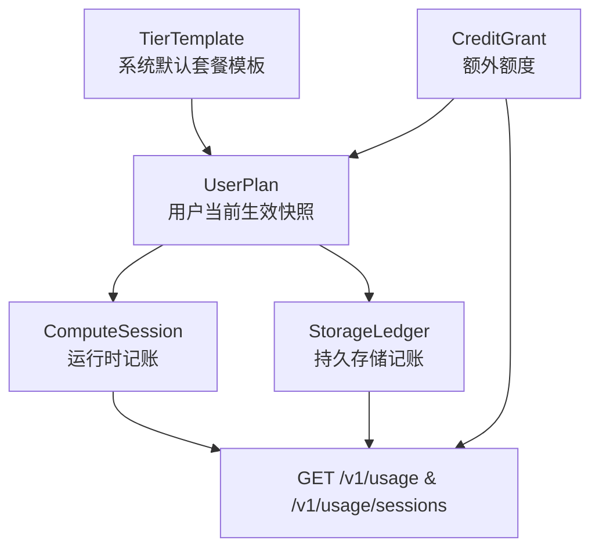
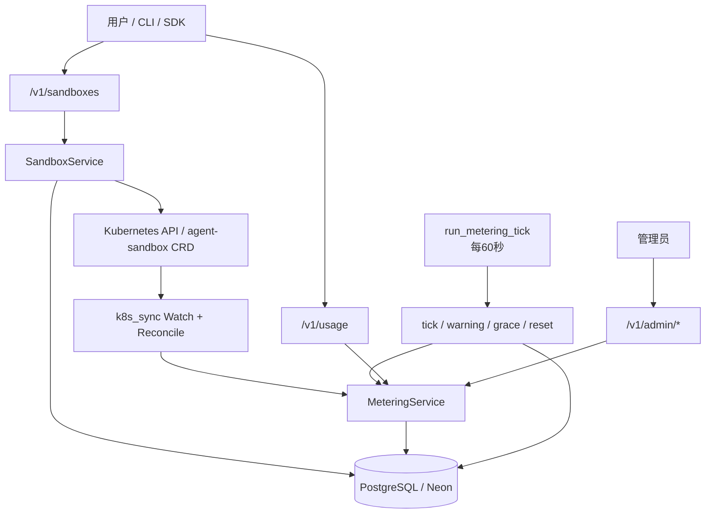
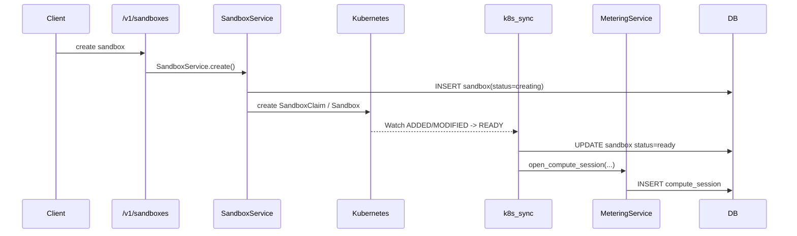
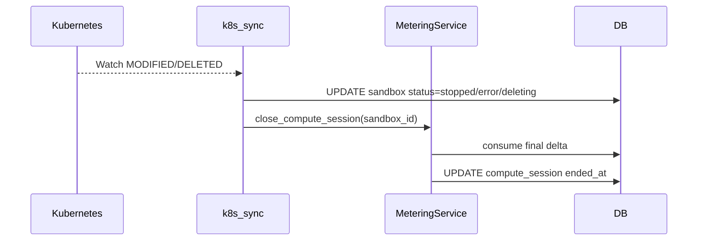
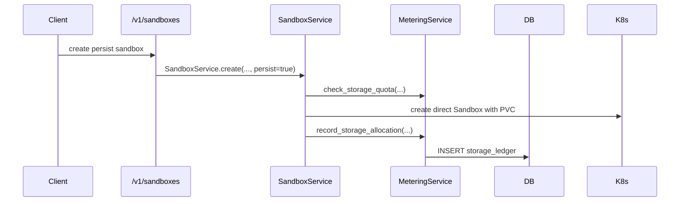
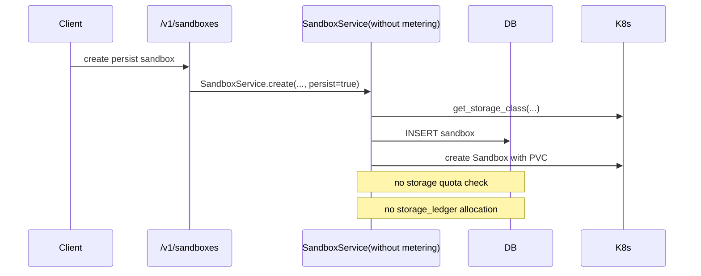

# 计量系统审计报告（当前代码实况）

**审计日期：** 2026-03-28  
**代码基线：** `main` 分支当前 `HEAD`（提交 `1ebd7b9`）  
**审计范围：**

- Compute 资源计量
- Storage 资源计量
- 套餐、额度、配额执行、后台采集任务、Usage/Admin 接口
- 与上述能力直接相关的数据库结构、K8s 同步链路、调度方式、测试覆盖

**本报告的判定原则：**

1. 以当前仓库中实际运行的代码为准。
2. 参考文档只用于还原设计意图和历史背景，不覆盖代码事实。
3. 只把“当前公开路径真正会触发”的行为算作已经接线；仅存在于 service 内但未被公开 API 注入的逻辑，不算真正上线能力。

---

## 1. 审计依据与材料来源

### 1.1 当前代码中的核心事实来源

- `treadstone/models/metering.py`
- `treadstone/services/metering_service.py`
- `treadstone/services/metering_tasks.py`
- `treadstone/services/k8s_sync.py`
- `treadstone/services/sync_supervisor.py`
- `treadstone/services/sandbox_service.py`
- `treadstone/services/k8s_client.py`
- `treadstone/api/usage.py`
- `treadstone/api/admin.py`
- `treadstone/api/sandboxes.py`
- `treadstone/api/schemas.py`
- `treadstone/main.py`
- `alembic/versions/9f3a6a152a5c_add_metering_tables.py`
- `alembic/versions/bc37bfeef9ac_add_provision_mode_persist_storage_size_.py`
- `tests/unit/test_metering_service.py`
- `tests/unit/test_metering_tasks.py`
- `tests/unit/test_metering_integration.py`
- `tests/api/test_usage_api.py`
- `tests/api/test_admin_api.py`
- `tests/e2e/07-metering-usage.hurl`
- `tests/e2e/08-metering-admin.hurl`

### 1.2 参考文档

- 当前模块文档：`docs/zh-CN/modules/05-metering-and-admin-ops.md`
- 历史设计文档（已在 PR #111 中删除，但本次审计已从 Git 历史恢复）：
  - `docs/zh-CN/design/2026-03-26-metering-overview.md`
  - `docs/zh-CN/design/2026-03-26-metering-compute.md`
  - `docs/zh-CN/design/2026-03-26-metering-storage.md`
  - `docs/zh-CN/design/2026-03-26-metering-enforcement.md`
  - `docs/zh-CN/design/2026-03-26-metering-execution-plan.md`

### 1.3 历史文档的 Git 来源

- 文档最初引入提交：
  - `04ec482`：引入 overview / compute / storage / enforcement
  - `2c1ded7`：引入 execution plan
- 文档移除提交：
  - `e47ff51`（PR #111）

**结论：** 历史设计文档提供了完整设计意图，但不能直接当成“现状文档”。本报告会明确指出哪些设计已经落地，哪些只落了一半，哪些仍然没有接入公开入口。

---

## 2. 执行摘要

### 2.1 总结判断

如果把“计量系统”拆成四个子问题：

1. Compute 记账是否存在并能跑起来
2. Compute 配额是否在公开产品路径上被真正执行
3. Storage 记账是否存在并能覆盖真实持久存储
4. Storage 配额是否在公开产品路径上被真正执行

那么当前代码的实际状态如下：

| 子系统 | 当前状态 | 审计结论 |
| --- | --- | --- |
| Compute 记账 | 已实现，且有真实后台采集链路 | `部分可上线` |
| Compute 配额执行 | Service 已实现，但公开 `/v1/sandboxes` 路由未注入 metering | `不可按“已上线配额控制”宣称` |
| Storage 记账 | 模型、任务、service 方法都在，但公开路径未接线，且无 reconcile | `当前不构成真实可用的 storage 计量系统` |
| Storage 配额执行 | Service 已实现，但公开 `/v1/sandboxes` 路由未注入 metering | `当前未在产品入口生效` |
| Usage/Admin 读写接口 | 已实现并有测试 | `可作为运营/查看层上线` |
| 完整商业计费闭环 | 未实现 | `不应按 billing system 对外描述` |

### 2.2 最重要的审计发现

#### 发现 A：Compute 的“后台记账”与“前台限流”是分裂的

当前代码里：

- `MeteringService.check_template_allowed()`、`check_compute_quota()`、`check_concurrent_limit()`、`check_storage_quota()`、`check_sandbox_duration()` 都存在；
- 但公开的 `treadstone/api/sandboxes.py` 在 create/start/delete/stop 等入口里调用的是 `SandboxService(session=session)`，**没有注入 `MeteringService`**；
- 因此公开 API 上不会执行这些配额检查。

这意味着：

- 用户可以通过公开 API 创建和启动 sandbox；
- ComputeSession 仍然会在 K8s 状态变为 `ready` 后被后台打开，并在 tick 中持续记账；
- 但这不是“先校验额度，再允许使用”的产品语义，而是“先允许运行，后台再记账”的语义。

#### 发现 B：Storage 逻辑“代码存在”，但公开系统里几乎不会生成真实数据

当前 `StorageLedger` 的创建和释放只发生在：

- `SandboxService.create(..., persist=True)` 中的 `record_storage_allocation()`
- `SandboxService.delete(..., persist=True)` 中的 `record_storage_release()`

但这些逻辑同样依赖 `self._metering is not None`。公开路由没有注入 metering，所以：

- 不会做 `check_storage_quota()`
- 不会做 `record_storage_allocation()`
- 不会做 `record_storage_release()`
- `tick_storage_metering()` 即使每 60 秒运行，也通常没有数据可 tick
- `GET /v1/usage` 里的 storage 字段会基于 `storage_ledger` 求和，因此很可能显示为 0，即使真实 PVC 已存在

#### 发现 C：Compute 有 reconcile，自愈性较强；Storage 没有 reconcile，自愈性很弱

Compute：

- `k8s_sync.reconcile_metering()` 会修复 READY sandbox 与 open ComputeSession 不一致的问题；
- 即使 Watch / metering 调用失败，也有机会被 reconcile 补回。

Storage：

- 没有任何类似 `reconcile_storage_metering()` 的修复逻辑；
- `record_storage_allocation()` 和 `record_storage_release()` 都是 best-effort；
- 一旦错过写 ledger，就不会被后台自动修复。

#### 发现 D：当前迁移 seed 与当前模板命名存在真实不一致风险

`alembic/versions/9f3a6a152a5c_add_metering_tables.py` 里 seed 的 `allowed_templates` 仍然是：

- `tiny`
- `small`
- `medium`
- `large`
- `xlarge`

但当前控制面、schema、helpers、测试使用的是：

- `aio-sandbox-tiny`
- `aio-sandbox-small`
- `aio-sandbox-medium`
- `aio-sandbox-large`
- `aio-sandbox-xlarge`

这意味着：

- 只要真正把 metering 注入到公开 `SandboxService`，fresh DB 上的 `check_template_allowed()` 就很可能直接拒绝合法模板；
- 目前之所以没有暴露，是因为公开 `/v1/sandboxes` 根本没有启用 metering 检查。

### 2.3 上线建议

**结论：当前代码不适合以“完整的 compute/storage 计量与配额执行系统”身份上线。**

更准确的表述应该是：

- Compute 后台记账链路已经具备雏形，并带有告警、grace period、月度 rollover。
- Usage/Admin API 已具备基本运营能力。
- 但公开产品入口尚未真正启用 compute/storage 配额执行。
- Storage 计量在当前公开路径上基本不成立。

如果要上线：

- 可以上线“Usage/Admin 查询能力 + Compute 后台记账的内部试运行”；
- 不应上线“对外收费 / 严格配额控制 / Storage 已可审计结算”的承诺。

---

## 3. 当前系统到底在按什么维度计量

## 3.1 总体原则

当前系统不是按“实际 CPU 使用率 / 实际内存占用 / 实际磁盘已写字节数”计量，而是按**资源请求规格 + 生命周期时长 / 逻辑容量占用**计量。

换句话说，它是一个：

- **基于配置与状态事件的计量系统**
- 不是一个基于 Prometheus/cAdvisor/Kubelet metrics 的真实资源利用率计量系统

### 3.2 Compute 的计量维度

当前 Compute 按以下维度共同计量：

| 维度 | 当前实现 | 说明 |
| --- | --- | --- |
| 用户维度 | `user_id` | 所有额度和使用量最终归属到用户 |
| 套餐维度 | `tier` / `UserPlan` | 决定月度额度、模板权限、并发限制、grace period |
| 账期维度 | `period_start` / `period_end` | 自然月（UTC） |
| 额度池维度 | 月度池 + Extra Grant 池 | 月度池优先，额外池后置 |
| 资源规格维度 | `template` | 费率由模板规格推导 |
| 运行实例维度 | `ComputeSession` | 每个 sandbox 每次运行是一个 session |
| 时间维度 | `started_at` / `last_metered_at` / `ended_at` | 通过 wall-clock 差值累计 |
| 费率维度 | `credit_rate_per_hour` | session 打开时锁定 |

### 3.3 Storage 的计量维度

当前 Storage 按以下维度共同计量：

| 维度 | 当前实现 | 说明 |
| --- | --- | --- |
| 用户维度 | `user_id` | 存储额度和 ledger 都归属到用户 |
| 套餐维度 | `tier` / `UserPlan` | 决定月度 storage quota 上限 |
| 额度池维度 | 月度 storage limit + storage 类型 `CreditGrant` | storage grant 只扩容配额，不发生消费递减 |
| 逻辑卷维度 | `StorageLedger` | 一条 ledger 对应一段持久存储生命周期 |
| sandbox 维度 | `sandbox_id` | 用于把 ledger 关联回具体 sandbox |
| 容量维度 | `size_gib` | 取自请求的 storage size，而不是实际已用字节 |
| 状态维度 | `storage_state` | 当前只有 `active -> deleted` 真实生效，`archived` 仅预留 |
| 时间维度 | `allocated_at` / `last_metered_at` / `released_at` | 用于累计 `gib_hours_consumed` |

### 3.4 两条计量线的根本区别

| 项 | Compute | Storage |
| --- | --- | --- |
| 计量对象 | sandbox 运行时间 | persistent volume 逻辑容量 |
| 单位 | `vCPU-hours` | `GiB` + 未来 `GiB-hours` |
| 实际采集基础 | 模板 request 规格 + 运行时长 | 请求的 PVC 大小 + 占用时长 |
| 是否按真实资源利用率 | 否 | 否 |
| 是否按时间持续累加 | 是 | 是，但只写 aggregate，不写事件流 |
| 是否有后台 reconcile | 有（ComputeSession） | 没有 |

---

## 4. 当前计量模型是什么样的

## 4.1 核心模型概览

当前系统由 5 张 metering 相关表组成：

1. `tier_template`
2. `user_plan`
3. `credit_grant`
4. `compute_session`
5. `storage_ledger`

它们的关系可以概括为：



### 4.2 TierTemplate：系统默认套餐模板

`TierTemplate` 是套餐模板，不是用户实时状态。

它保存的是：

- `compute_credits_monthly`
- `storage_credits_monthly`
- `max_concurrent_running`
- `max_sandbox_duration_seconds`
- `allowed_templates`
- `grace_period_seconds`

特点：

- 这是系统级默认值；
- 管理员可通过 `/v1/admin/tier-templates` 查看，通过 `PATCH /v1/admin/tier-templates/{tier_name}` 修改；
- 只有当用户 plan 创建或 tier 变更时，这些默认值才会被拷贝到 `UserPlan`；
- 因此它不是实时读取的“动态套餐”，而是“模板”。

### 4.3 UserPlan：用户生效快照 + 账期状态

`UserPlan` 是真正被 quota check 和 usage summary 使用的核心表。

它同时承担两类职责：

1. **静态 entitlement 快照**
   - compute/storage monthly limit
   - allowed templates
   - concurrent limit
   - max duration
   - grace period seconds

2. **动态账期状态**
   - `period_start`
   - `period_end`
   - `compute_credits_monthly_used`
   - `grace_period_started_at`
   - `warning_80_notified_at`
   - `warning_100_notified_at`

注意：

- 只有 compute 有 `monthly_used` 字段；
- storage 没有 `monthly_used`，因为当前 storage 模型是“容量占用上限”，不是“月累计消耗上限”。

### 4.4 CreditGrant：额外额度池

`CreditGrant` 同时承载：

- compute extra credits
- storage extra quota

但这两种用法在当前代码里并不完全对称：

| credit_type | 当前行为 |
| --- | --- |
| `compute` | 会在 `consume_compute_credits()` 中按 FIFO-by-expiry 被真实扣减 |
| `storage` | 不会在存储分配时被扣减，只会被 `get_total_storage_quota()` 当成额外 quota 相加 |

这意味着当前 storage grant 的本质是：

- “额外容量上限”
- 不是“会随着 PVC 使用而递减的 consumable credit”

### 4.5 ComputeSession：按 session 聚合的 compute 账本

`ComputeSession` 是 compute 计量的核心事实表。

每条记录表示：

- 某个 sandbox
- 在某次 READY 运行区间
- 以固定 `credit_rate_per_hour`
- 从 `started_at` 持续到 `ended_at`
- 中间通过 `last_metered_at` 增量推进

它不是每秒/每分钟的原始 usage event 表，而是一个**聚合表**：

- `credits_consumed`
- `credits_consumed_monthly`
- `credits_consumed_extra`

持续被原地更新。

### 4.6 StorageLedger：按逻辑卷生命周期聚合的 storage 账本

`StorageLedger` 保存的是：

- 该卷大小 `size_gib`
- 当前状态 `storage_state`
- 分配时间 / 释放时间
- 聚合的 `gib_hours_consumed`

它同样不是事件流表，而是一个**聚合行**。

### 4.7 月度池 + Extra 池

当前 compute 的双池模型已经真实落地：

1. Monthly pool：`UserPlan.compute_credits_monthly_limit - compute_credits_monthly_used`
2. Extra pool：`CreditGrant` 中所有未过期、`remaining_amount > 0` 的 compute grant

消费顺序：

1. 先 monthly
2. 再 extra
3. extra 内按 `expires_at ASC NULLS LAST`

storage 没有对应的“消费”动作，而是：

1. monthly storage limit 作为基础 quota
2. storage grant 作为额外 quota
3. `current_used` 来自 ACTIVE ledger 的 `size_gib` 求和
4. `available = total_quota - current_used`

---

## 5. 系统架构与数据流总览

## 5.1 架构总览



### 5.2 当前真实的控制面分工

| 组件 | 当前职责 |
| --- | --- |
| `SandboxService` | sandbox create/start/stop/delete；可选 metering integration |
| `k8s_sync` | 把 K8s Sandbox CR 状态同步回 DB；并在状态转换时 best-effort 打开/关闭 ComputeSession |
| `MeteringService` | plan / grant / quota / usage summary / compute session / storage ledger 核心逻辑 |
| `metering_tasks` | 周期性增量记账、warning、grace、rollover |
| `sync_supervisor` / `main.py` | 让 metering tick 只在 leader 或单进程主实例上运行 |

### 5.3 Source of Truth 划分

| 数据类型 | 当前 Source of Truth |
| --- | --- |
| 用户 entitlement | `UserPlan` |
| Tier 默认值 | `TierTemplate` |
| Extra credits / extra quota | `CreditGrant` |
| sandbox 是否处于运行态 | K8s Sandbox CR 状态，经 `k8s_sync` 同步到 DB |
| compute 记账聚合 | `ComputeSession` |
| storage 逻辑占用聚合 | `StorageLedger` |

---

## 6. Compute 资源计量审计

## 6.1 Compute 当前按什么模型计量

### 6.1.1 费率模型

当前 Compute rate 由 `treadstone/services/metering_helpers.py` 中的 `calculate_credit_rate()` 决定：

```text
credit_rate_per_hour = max(vCPU_request, memory_GiB_request / 2)
```

模板规格写死在 `TEMPLATE_SPECS`：

| 模板 | vCPU | 内存 | 当前 rate |
| --- | --- | --- | --- |
| `aio-sandbox-tiny` | 0.25 | 0.5 GiB | 0.25 credits/h |
| `aio-sandbox-small` | 0.5 | 1 GiB | 0.5 credits/h |
| `aio-sandbox-medium` | 1 | 2 GiB | 1.0 credits/h |
| `aio-sandbox-large` | 2 | 4 GiB | 2.0 credits/h |
| `aio-sandbox-xlarge` | 4 | 8 GiB | 4.0 credits/h |

### 6.1.2 计量基础不是实际利用率

当前没有任何代码去采集：

- Pod 实际 CPU 使用率
- Pod 实际内存 RSS
- Prometheus 指标
- Kubelet / Metrics Server 数据

当前 Compute 计量只依赖：

1. sandbox template 的 request 规格
2. sandbox 是否处于 `ready`
3. `last_metered_at -> now` 的时间差

所以它是：

- **shape-based accounting**
- 不是 actual usage accounting

### 6.1.3 session 锁定费率

`open_compute_session()` 在 session 打开时把 `credit_rate_per_hour` 写入行内。

含义：

- 如果未来模板费率变化，已打开的 session 不受影响；
- 当前 session 的 rate 是“打开时快照”。

## 6.2 Compute 数据采集：当前到底如何采

### 6.2.1 a. 采集源是什么

当前 Compute 采集依赖三个源：

1. **K8s Sandbox CR 状态**
   - 决定何时打开或关闭 session
2. **模板规格表 `TEMPLATE_SPECS`**
   - 决定费率
3. **应用服务器 UTC 时间**
   - 决定每次 tick 的增量时长

### 6.2.2 b. 调用哪些接口来触发与采集

#### 触发 session 打开/关闭的 K8s 接口

由 `treadstone/services/k8s_client.py` 调用：

| 用途 | 方法 | 接口 |
| --- | --- | --- |
| 初始 list | `GET` | `/apis/agents.x-k8s.io/v1alpha1/namespaces/{namespace}/sandboxes` |
| 持续 watch | `GET` | `/apis/agents.x-k8s.io/v1alpha1/namespaces/{namespace}/sandboxes?watch=true&timeoutSeconds=300&resourceVersion=...` |
| 周期 reconcile | `GET` | 同上 list 接口 |

这些接口并不返回“使用量”，只返回 sandbox 的控制面状态。Compute 记账是由控制面状态推导出来的。

#### 触发状态变化的控制面接口

这些接口会间接导致 ComputeSession 打开或关闭：

| 场景 | 方法 | 接口 |
| --- | --- | --- |
| 创建 ephemeral sandbox | `POST` | `/apis/extensions.agents.x-k8s.io/v1alpha1/namespaces/{namespace}/sandboxclaims` |
| 创建 persistent sandbox | `POST` | `/apis/agents.x-k8s.io/v1alpha1/namespaces/{namespace}/sandboxes` |
| 启动/停止 sandbox | `PATCH` | `/apis/agents.x-k8s.io/v1alpha1/namespaces/{namespace}/sandboxes/{name}/scale` |
| 删除 sandbox | `DELETE` | 对应 claim 或 sandbox 资源接口 |

#### 触发用户侧读数据的 API

| 用途 | 接口 |
| --- | --- |
| usage summary | `GET /v1/usage` |
| plan 详情 | `GET /v1/usage/plan` |
| session 列表 | `GET /v1/usage/sessions` |
| admin 查看任意用户 | `GET /v1/admin/users/{user_id}/usage` |

### 6.2.3 c. 多久采集一次

Compute 当前有两类节奏：

| 机制 | 周期 |
| --- | --- |
| 增量 tick `tick_metering()` | 每 60 秒 |
| K8s 状态 reconcile | 每 300 秒 |
| K8s watch timeout | 300 秒后 server 关闭，需要重连 |

此外：

- leader election 开启时，tick 只在 leader 上运行；
- leader election 关闭时，由 `main.py` 中 `_run_metering_loop()` 在单进程内运行。

### 6.2.4 d. 采集后的数据写到哪里

每次 compute tick / close 时，当前会更新三类数据：

1. `UserPlan.compute_credits_monthly_used`
2. `CreditGrant.remaining_amount`（如果 extra 被消费）
3. `ComputeSession` 聚合字段
   - `credits_consumed`
   - `credits_consumed_monthly`
   - `credits_consumed_extra`
   - `last_metered_at`
   - `ended_at`（close 时）

### 6.2.5 e. 失败时怎么补

Compute 的补偿机制是真实存在的，主要靠 `reconcile_metering()`：

| 失败场景 | 当前补偿方式 |
| --- | --- |
| Watch 丢事件 | periodic reconcile 重新 list，然后修正 sandbox 状态 |
| sandbox READY 但没 open session | `reconcile_metering()` 自动补开 |
| open session 对应 sandbox 已非 READY / 已删除 | `reconcile_metering()` 自动补关 |
| `_apply_metering_on_transition()` 报错 | 只记录日志，但后续 reconcile 有机会修复 |

### 6.2.6 f. 一致性模型是什么

Compute 不是强一致链路，而是**最终一致**：

1. `_optimistic_update()` 会先提交 sandbox 状态
2. 然后 `_apply_metering_on_transition()` 再 best-effort 调用 metering
3. 如果 metering 步骤失败，sandbox 状态已经变了，但 session 可能还没同步
4. 之后靠 `reconcile_metering()` 修复

因此当前系统更准确的描述是：

- **状态变更路径：先状态，后记账**
- **一致性模型：eventual consistency**

## 6.3 Compute 的真实数据流程

### 6.3.1 从 sandbox 创建到开始记账



### 6.3.2 从运行中到持续扣减

```mermaid
sequenceDiagram
    participant Loop as run_metering_tick
    participant Task as tick_metering
    participant Meter as MeteringService
    participant DB as DB

    Loop->>Task: every 60s
    Task->>DB: SELECT open compute_session
    Task->>Meter: consume_compute_credits(user_id, delta)
    Meter->>DB: SELECT UserPlan FOR UPDATE
    Meter->>DB: SELECT CreditGrant FOR UPDATE
    Task->>DB: UPDATE compute_session aggregate fields
```

### 6.3.3 从停止/删除到结束记账



## 6.4 Compute 使用哪些关键函数

| 函数 | 作用 |
| --- | --- |
| `calculate_credit_rate(template)` | 根据模板 request 推导 rate |
| `open_compute_session(session, sandbox_id, user_id, template)` | READY 时打开 session |
| `close_compute_session(session, sandbox_id)` | 停止/报错/删除时关闭 session |
| `consume_compute_credits(session, user_id, amount)` | 执行 monthly -> extra 的双池扣减 |
| `tick_metering(session)` | 每 60 秒对所有 open session 做增量结算 |
| `reconcile_metering(session_factory)` | 修补 READY/open-session 不一致 |
| `get_total_compute_remaining(session, user_id)` | 计算 monthly + extra 剩余额度 |
| `check_compute_quota(session, user_id)` | 额度不足时抛 `ComputeQuotaExceededError` |
| `check_warning_thresholds(session)` | 触发 80% / 100% warning audit event |
| `check_grace_periods(session, callback)` | 处理 grace period 与 auto-stop |
| `handle_period_rollover(session, cs, plan)` | 跨账期切分 session |
| `reset_monthly_credits(session)` | 月度重置 |

## 6.5 Compute 在数据库里怎么落

### 6.5.1 `user_plan` 中与 compute 相关的字段

| 字段 | 作用 |
| --- | --- |
| `compute_credits_monthly_limit` | 月度额度上限 |
| `compute_credits_monthly_used` | 月度已用额度 |
| `period_start` / `period_end` | 当前账期 |
| `warning_80_notified_at` | 80% 告警去重 |
| `warning_100_notified_at` | 100% 告警去重 |
| `grace_period_started_at` | grace period 状态 |

### 6.5.2 `credit_grant` 中与 compute 相关的字段

| 字段 | 作用 |
| --- | --- |
| `credit_type="compute"` | 标识是 compute grant |
| `original_amount` | 原始发放量 |
| `remaining_amount` | 剩余额度 |
| `expires_at` | 过期时间 |

### 6.5.3 `compute_session` 是最核心的事实表

| 字段 | 当前语义 |
| --- | --- |
| `sandbox_id` | 该次运行属于哪个 sandbox |
| `user_id` | 归属用户 |
| `template` | 运行模板 |
| `credit_rate_per_hour` | 当前 session 锁定 rate |
| `started_at` / `ended_at` | session 起止 |
| `last_metered_at` | 下次 tick 的起点 |
| `credits_consumed` | session 总消耗 |
| `credits_consumed_monthly` | 从 monthly 扣掉的部分 |
| `credits_consumed_extra` | 从 extra grant 扣掉的部分 |

### 6.5.4 一个重要但容易忽略的事实

当前没有单独字段记录 `shortfall`。

也就是说：

- 如果用户额度耗尽，但 sandbox 仍在 grace period 内继续运行，
- `credits_consumed` 仍然会继续增长，
- 但 `credits_consumed_monthly + credits_consumed_extra` 可能小于 `credits_consumed`，
- 这部分差值只能间接理解为“超额使用”，没有单独落账字段。

## 6.6 Compute 当前的上线风险

### 6.6.1 风险 1：公开 create/start 不执行 compute quota check

这是当前最核心的产品级风险。

直接影响：

- `check_compute_quota()` 不会在公开 create/start 路径上执行
- `check_concurrent_limit()` 不会在公开 create/start 路径上执行
- `check_template_allowed()` 不会执行
- `check_sandbox_duration()` 不会执行

后果：

- 用户能先跑起来，再被后台记账
- 当前更像“usage accounting”而不是“usage enforcement”

### 6.6.2 风险 2：welcome bonus 不是在注册时发放，而是在 plan 首次创建时发放

代码里 welcome bonus 的创建点是 `ensure_user_plan()`，不是 `auth.register`。

这意味着：

- 新用户注册后不一定立刻有 plan / grant；
- 第一次访问 usage/admin，或第一次真实发生 compute credit 结算时，才会懒创建。

这与历史文档中“注册即发放”的表述不完全一致。

### 6.6.3 风险 3：fresh DB 上的 allowed template 命名可能不兼容

原因：

- migration seed 仍写 `tiny/small/...`
- helpers/schemas/tests/public API 使用 `aio-sandbox-*`

这会在 metering 真正接入公开创建接口时形成阻塞性 bug。

### 6.6.4 风险 4：长时间停机跨多个月时，rollover catch-up 不是一次完成

`reset_monthly_credits()` 与 `handle_period_rollover()` 当前一次只推进一个 billing period。

如果系统停机超过一个完整月：

- 第一次 tick 只会把 period 推进一个月
- 仍然落后时，要等下一轮 tick 再推进

这不是立即错误，但意味着大跨度 catch-up 是“逐 tick 追平”，不是“一次追平”。

---

## 7. Storage 资源计量审计

## 7.1 Storage 当前按什么模型计量

### 7.1.1 当前不是“真实磁盘使用量”计量

系统当前没有采集：

- PVC 实际 bytes used
- 文件系统实际占用
- Volume metrics
- CSI/Prometheus 指标

当前 Storage 的基础量只来自：

1. 请求时的 `storage_size` 字符串
2. `parse_storage_size_gib()` 解析得到的 `size_gib`
3. `StorageLedger` 的 ACTIVE / DELETED 状态
4. `allocated_at -> last_metered_at / released_at` 的时间差

所以当前 Storage 是：

- **requested-capacity accounting**
- 不是 actual-bytes accounting

### 7.1.2 当前 storage 有两套并行语义

| 字段 / 指标 | 当前真实语义 |
| --- | --- |
| `storage_credits_monthly_limit` | 用户可持有的月度存储容量上限（GiB） |
| `current_used` | 所有 ACTIVE ledger 的 `size_gib` 求和 |
| `available` | `total_quota - current_used` |
| `gib_hours_consumed` | 未来 billing 准备的累计量，目前不对外展示为计费结果 |

### 7.1.3 Storage grant 当前不是“消费型 credit”

当前 storage 类型的 `CreditGrant` 不会随着 PVC 分配而减少 `remaining_amount`。

也就是说：

- storage grant 在当前实现里相当于“临时或长期扩容配额”
- 不是“创建一个 5Gi PVC 就扣掉 5 个 storage extra credits”

## 7.2 Storage 数据采集：当前到底如何采

### 7.2.1 a. 采集源是什么

Storage 采集源只有两个：

1. sandbox create/delete 生命周期事件
2. 应用层记录的 `size_gib`

没有任何来自 K8s 的实际用量指标采样。

### 7.2.2 b. 调用哪些接口来触发与采集

#### 与 storage 创建直接相关的接口

| 场景 | 方法 | 接口 |
| --- | --- | --- |
| 检查 StorageClass 是否存在 | `GET` | `/apis/storage.k8s.io/v1/storageclasses/{name}` |
| 创建 persistent sandbox | `POST` | `/apis/agents.x-k8s.io/v1alpha1/namespaces/{namespace}/sandboxes` |
| 删除 persistent sandbox | `DELETE` | `/apis/agents.x-k8s.io/v1alpha1/namespaces/{namespace}/sandboxes/{name}` |

#### 公开产品接口

| 场景 | 接口 |
| --- | --- |
| 创建持久 sandbox | `POST /v1/sandboxes` with `persist=true` |
| 删除持久 sandbox | `DELETE /v1/sandboxes/{sandbox_id}` |
| 查看 storage summary | `GET /v1/usage` / admin usage |

### 7.2.3 c. 多久采集一次

Storage 有两种节奏：

| 机制 | 周期 |
| --- | --- |
| 分配/释放记录 | 事件触发（create/delete） |
| `tick_storage_metering()` | 每 60 秒 |

### 7.2.4 d. 采集后的数据写到哪里

理论上应写入 `storage_ledger`：

- create persist -> `record_storage_allocation()` -> INSERT ACTIVE row
- delete persist -> `record_storage_release()` -> UPDATE row to DELETED + final gib-hours
- tick -> UPDATE ACTIVE rows 的 `gib_hours_consumed`

### 7.2.5 e. 失败时怎么补

**当前几乎没有补偿。**

Compute 有 `reconcile_metering()`，Storage 没有。

所以：

- 如果 create 成功了但 `record_storage_allocation()` 没写进去，
- 后续不会有后台任务自动补齐这条 ledger；
- `tick_storage_metering()` 也无从计算；
- usage/admin storage summary 也不会反映真实 PVC。

### 7.2.6 f. 一致性模型是什么

Storage 当前甚至不能算“最终一致”，因为缺失 reconcile。

更准确地说：

- 它是一个 **best-effort side effect**
- 不是一个具备自愈能力的闭环系统

## 7.3 Storage 当前的真实数据流

### 7.3.1 代码里“设计上应该发生”的流程



### 7.3.2 公开 API 路径里“实际上发生”的流程

当前公开 `treadstone/api/sandboxes.py` 中：

- create 是 `SandboxService(session=session)`
- delete 是 `SandboxService(session=session)`
- 没有 `metering=MeteringService()`

所以真实路径变成：



删除路径同理：

- 没有 `record_storage_release()`
- 只会删 sandbox/K8s 资源，不会释放 storage ledger（因为压根没 ledger）

### 7.3.3 tick_storage_metering 的现实含义

`tick_storage_metering()` 本身实现没问题，但它依赖 `storage_ledger` 里已有 ACTIVE rows。

因此当前公开路径下它的现实效果往往是：

- 任务在跑
- 但没有有效数据可累加

## 7.4 Storage 使用哪些关键函数

| 函数 | 作用 |
| --- | --- |
| `parse_storage_size_gib(size_str)` | 把 `5Gi/10Gi/20Gi/...` 解析成整数 GiB |
| `record_storage_allocation(session, user_id, sandbox_id, size_gib)` | 写入 ACTIVE ledger |
| `record_storage_release(session, sandbox_id)` | 把 ACTIVE ledger 置为 DELETED，并结算最后的 gib-hours |
| `tick_storage_metering(session)` | 每 60 秒累加 ACTIVE ledger 的 `gib_hours_consumed` |
| `get_total_storage_quota(session, user_id)` | monthly limit + storage grants |
| `get_current_storage_used(session, user_id)` | ACTIVE ledger `size_gib` 求和 |
| `check_storage_quota(session, user_id, requested_gib)` | 配额不足时抛 `StorageQuotaExceededError` |

## 7.5 Storage 在数据库里怎么落

### 7.5.1 `user_plan` 中与 storage 相关的字段

| 字段 | 当前语义 |
| --- | --- |
| `storage_credits_monthly_limit` | 月度允许持有的总容量上限（GiB） |

### 7.5.2 `credit_grant` 中与 storage 相关的字段

| 字段 | 当前语义 |
| --- | --- |
| `credit_type="storage"` | 额外 storage quota |
| `remaining_amount` | 当前仍记为“额外 quota 规模”，不会被分配逻辑递减 |
| `expires_at` | 过期后不再计入 total quota |

### 7.5.3 `storage_ledger` 是唯一的 storage 使用事实表

| 字段 | 当前语义 |
| --- | --- |
| `user_id` | 归属用户 |
| `sandbox_id` | 对应 sandbox |
| `size_gib` | 逻辑卷大小 |
| `storage_state` | 当前卷状态 |
| `allocated_at` | 分配时间 |
| `released_at` | 释放时间 |
| `gib_hours_consumed` | 聚合累计值 |
| `last_metered_at` | 下次 tick 起点 |

### 7.5.4 `archived` 目前只是 schema 预留

虽然 `StorageState` 定义了：

- `ACTIVE`
- `ARCHIVED`
- `DELETED`

但当前仓库中：

- 没有任何写路径会把 row 设为 `ARCHIVED`
- `archived_at` 也从未被使用

因此当前真实状态机只有：

```text
active -> deleted
```

## 7.6 Storage 当前的上线风险

### 7.6.1 风险 1：公开路径没有 storage quota enforcement

直接原因：

- `check_storage_quota()` 没被公开 create 路径调用

后果：

- Pro 用户可否超配创建 persistent sandbox，当前不是由 metering system 控制的
- Free 用户理论上也不会因 metering 被拦截；是否被其他逻辑拦截，只取决于当前 create API 其他校验

### 7.6.2 风险 2：storage summary 很可能与真实 PVC 不一致

因为 summary 的 `current_used` 只来自 `StorageLedger`。

如果公开 create/delete 不写 ledger，则：

- usage summary 看到的是“ledger 世界”
- K8s 真实 PVC 是“cluster 世界”
- 两者会分叉

### 7.6.3 风险 3：没有 storage reconcile

这意味着 storage 账本一旦漏写：

- 不会被后台自动发现
- 不会被 list/watch 修复
- 不会被周期任务修复

### 7.6.4 风险 4：`record_storage_allocation()` 不是幂等接口

与 compute 不同：

- `open_compute_session()` 先查 open session，具备幂等保护；
- `record_storage_allocation()` 直接 INSERT，没有检查是否已经存在 ACTIVE ledger。

如果未来补接线时重复调用：

- 有可能产生重复 ACTIVE row；
- `get_current_storage_used()` 会重复计入；
- `record_storage_release()` 的 `scalar_one_or_none()` 甚至可能因为多条 ACTIVE row 而出错。

这意味着 storage path 就算接上线，也还需要额外做幂等设计。

---

## 8. 当前后台任务、调度频率与运行位置

## 8.1 统一 tick 入口

后台周期任务统一从 `run_metering_tick()` 进入，顺序是：

1. `tick_metering`
2. `tick_storage_metering`
3. `check_warning_thresholds`
4. `check_grace_periods`
5. `reset_monthly_credits`

### 8.2 这些任务多久跑一次

`TICK_INTERVAL = 60` 秒。

### 8.3 每一步是否共用一个事务

不是。

`run_metering_tick()` 为每个 step 都新建一个独立 `AsyncSession`：

- 这样单个 step 失败不会影响其他 step；
- 代价是整个 tick 不是一个原子事务。

### 8.4 leader-only 运行方式

有两种模式：

| 模式 | 当前行为 |
| --- | --- |
| `leader_election_enabled = false` | `main.py` 直接起 `_run_metering_loop()` |
| `leader_election_enabled = true` | `LeaderControlledSyncSupervisor` 在 leader 上启动 `_metering_tick_loop()` |

### 8.5 reconcile / watch 调度

| 机制 | 当前值 |
| --- | --- |
| Watch timeout | 300 秒 |
| Reconcile interval | 300 秒 |
| Lease duration | 15 秒 |
| Lease renew interval | 5 秒 |
| Lease retry interval | 2 秒 |

---

## 9. 数据库结构审计

## 9.1 表级摘要

| 表 | 角色 | 当前是否真实被公开路径依赖 |
| --- | --- | --- |
| `tier_template` | 套餐默认模板 | 是 |
| `user_plan` | 用户生效套餐与账期状态 | 是 |
| `credit_grant` | compute/storage 额外额度 | 是 |
| `compute_session` | compute 聚合账本 | 是 |
| `storage_ledger` | storage 聚合账本 | 逻辑上是，但公开路径几乎不写 |

## 9.2 关键索引

| 表 | 索引 | 用途 |
| --- | --- | --- |
| `credit_grant` | `ix_credit_grant_user_type` | 查询用户某种 credit_type 的 grant |
| `credit_grant` | `ix_credit_grant_expires` | 过期顺序消费 |
| `compute_session` | `ix_compute_session_open` | 查询 open session |
| `compute_session` | `sandbox_id` / `user_id` 索引 | 按 sandbox 或用户查 session |
| `storage_ledger` | `ix_storage_ledger_user_state` | 查询用户 ACTIVE 卷 |
| `storage_ledger` | `ix_storage_ledger_sandbox` | 按 sandbox 找 storage entry |

## 9.3 当前 schema 与产品语义的几个关键点

### 9.3.1 `storage_credits_monthly_limit` 名字容易误导

它听起来像“每月可消费多少 storage credits”，但当前实际语义是：

- 允许同时占有的最大容量上限

并不是：

- 本月累计最多可创建多少 GiB

### 9.3.2 `storage_ledger.gib_hours_consumed` 已经为未来 billing 预留

它当前：

- 会被后台 tick 累加
- 但没有用户 API 暴露明细
- 也没有管理员 API 暴露明细
- 更没有 billing pipeline 消费这个值

### 9.3.3 当前没有 immutable usage event 表

这对审计意味着：

- 系统保留的是聚合状态；
- 没有每次 tick 的单独事件行；
- 如果未来要做争议账单、精细对账、历史重放，当前表结构的解释力有限。

---

## 10. 关键函数与接口清单

## 10.1 Compute 关键函数

| 文件 | 函数 | 当前职责 |
| --- | --- | --- |
| `treadstone/services/metering_helpers.py` | `calculate_credit_rate` | 模板费率 |
| `treadstone/services/metering_service.py` | `ensure_user_plan` | 懒创建 user plan 与 welcome bonus |
| `treadstone/services/metering_service.py` | `consume_compute_credits` | 双池扣减 |
| `treadstone/services/metering_service.py` | `open_compute_session` | 打开 session |
| `treadstone/services/metering_service.py` | `close_compute_session` | 关闭 session |
| `treadstone/services/metering_tasks.py` | `tick_metering` | 增量结算 |
| `treadstone/services/metering_tasks.py` | `check_warning_thresholds` | 告警 |
| `treadstone/services/metering_tasks.py` | `check_grace_periods` | 宽限期与自动 stop |
| `treadstone/services/metering_tasks.py` | `reset_monthly_credits` | 月度重置 |
| `treadstone/services/k8s_sync.py` | `_apply_metering_on_transition` | 用 K8s 状态转换触发 open/close |
| `treadstone/services/k8s_sync.py` | `reconcile_metering` | Compute 自愈 |

## 10.2 Storage 关键函数

| 文件 | 函数 | 当前职责 |
| --- | --- | --- |
| `treadstone/services/metering_helpers.py` | `parse_storage_size_gib` | 存储大小解析 |
| `treadstone/services/metering_service.py` | `record_storage_allocation` | 写 ACTIVE ledger |
| `treadstone/services/metering_service.py` | `record_storage_release` | 写 DELETED ledger |
| `treadstone/services/metering_service.py` | `get_total_storage_quota` | 计算总 quota |
| `treadstone/services/metering_service.py` | `get_current_storage_used` | 求 ACTIVE 容量 |
| `treadstone/services/metering_service.py` | `check_storage_quota` | 存储配额检查 |
| `treadstone/services/metering_tasks.py` | `tick_storage_metering` | 累加 gib-hours |

## 10.3 用户可见接口

| 接口 | 当前用途 |
| --- | --- |
| `GET /v1/usage` | 总览 |
| `GET /v1/usage/plan` | plan 详情 |
| `GET /v1/usage/sessions` | compute session 列表 |
| `GET /v1/usage/grants` | extra grants 列表 |

## 10.4 管理员接口

| 接口 | 当前用途 |
| --- | --- |
| `GET /v1/admin/tier-templates` | 查看 tier template |
| `PATCH /v1/admin/tier-templates/{tier_name}` | 修改 tier template |
| `GET /v1/admin/users/{user_id}/usage` | 查看任意用户 usage |
| `PATCH /v1/admin/users/{user_id}/plan` | 改用户 tier / overrides |
| `POST /v1/admin/users/{user_id}/grants` | 单发 grant |
| `POST /v1/admin/grants/batch` | 批量发 grant |

## 10.5 公开 sandbox 接口与 metering 的真实关系

| 接口 | 当前是否真正触发 metering integration |
| --- | --- |
| `POST /v1/sandboxes` | 否 |
| `POST /v1/sandboxes/{id}/start` | 否 |
| `POST /v1/sandboxes/{id}/stop` | 否（只改 sandbox 状态） |
| `DELETE /v1/sandboxes/{id}` | 否 |

注意：

- 这些接口虽然不直接调用 metering integration；
- 但 create/start/stop/delete 造成的 K8s 状态变化，仍会通过 `k8s_sync` 间接影响 ComputeSession。

这也是为什么当前 compute 是“后台记账已存在，但公开 enforcement 不存在”。

---

## 11. 测试覆盖审计

## 11.1 当前有哪些测试是真的

| 测试文件 | 覆盖内容 |
| --- | --- |
| `tests/unit/test_metering_service.py` | plan / grant / compute / storage service 逻辑 |
| `tests/unit/test_metering_tasks.py` | tick / warning / grace / rollover |
| `tests/unit/test_metering_integration.py` | 当 `SandboxService` 被显式注入 metering 时的行为 |
| `tests/api/test_usage_api.py` | usage API |
| `tests/api/test_admin_api.py` | admin API |
| `tests/e2e/07-metering-usage.hurl` | usage e2e |
| `tests/e2e/08-metering-admin.hurl` | admin e2e |

## 11.2 当前测试覆盖的一个关键“盲区”

`tests/unit/test_metering_integration.py` 证明了：

- **如果** `SandboxService(..., metering=metering)` 被正确注入，
- 那么配额检查、storage allocation/release 等逻辑是会工作的。

但这不等于：

- 公开 `/v1/sandboxes` 已经这么接线。

当前 API 路由没有这么做，所以：

- 单元测试验证的是“service 具备能力”
- 不是“产品入口已经启用能力”

## 11.3 当前缺少哪些关键验证

### Compute 缺少

- e2e 验证 create/start 是否真正被 quota 拦截
- fresh migration 数据下 template name mismatch 的集成验证
- 超长停机跨多账期 catch-up 的验证

### Storage 缺少

- 公开 create persist 后是否真的生成 `storage_ledger`
- 公开 delete persist 后是否真的释放 ledger
- usage summary 是否与真实 PVC 数量/大小一致
- 重复 allocation / duplicate active ledger 的幂等验证

---

## 12. 与历史设计文档的差异对照

| 主题 | 历史设计文档中的预期 | 当前代码事实 | 审计结论 |
| --- | --- | --- | --- |
| Compute 双池消费 | 已设计 | 已实现 | 一致 |
| Compute tick | 已设计 | 已实现 | 一致 |
| Grace period / warning / monthly reset | 已设计 | 已实现 | 一致 |
| K8s 状态驱动 open/close session | 已设计 | 已实现 | 一致 |
| SandboxService 接入 quota check | 历史文档认为会接到 create/start/delete | service 支持，但公开路由未注入 | `部分落地` |
| Storage quota check | 历史文档认为 create persist 时会执行 | service 支持，但公开路由未注入 | `未在产品入口生效` |
| Storage ledger create/delete | 历史文档认为会写 | 公开路由下不会写 | `未在产品入口生效` |
| Welcome bonus | 历史文档倾向于“注册即发” | 实际是 plan 首次懒创建时发 | `语义偏移` |
| 模板命名 | 历史文档早期使用 `tiny/small` | 当前 API/runtime 使用 `aio-sandbox-*`，但 migration seed 仍是旧名 | `存在未清理历史债务` |
| Storage archived 冷存储 | 设计预留 | 只有 enum/字段，无业务逻辑 | `未实现` |
| 完整 billing/payments | 设计明确属于后续阶段 | 当前未实现 | 一致 |

---

## 13. 是否适合上线：产品、功能、代码三个层面的结论

## 13.1 产品层面

如果产品文案要表达的是：

- “用户可以查看自己的用量”
- “管理员可以调整 tier / grant / usage”

那么当前代码基本支撑得住。

如果产品文案要表达的是：

- “系统已经对 compute/storage 做了严格的额度控制”
- “storage 用量已经真实可审计”
- “可以据此上线收费或出账单”

那么当前代码不支撑。

## 13.2 功能层面

### Compute

| 功能 | 当前判断 |
| --- | --- |
| 使用量聚合 | 可用 |
| Usage/Admin 查看 | 可用 |
| 告警、grace、auto-stop | 可用，但建立在后台记账之上 |
| 公开 create/start 的配额拦截 | 不可用 |

### Storage

| 功能 | 当前判断 |
| --- | --- |
| 配额模型定义 | 可用 |
| storage summary 计算逻辑 | 可用 |
| 真实 ledger 采集 | 公开路径下不可用 |
| quota enforcement | 公开路径下不可用 |
| 自愈修复 | 不可用 |

## 13.3 代码层面

### 当前已经具备的优点

- Compute 计量链路有完整的 service/task/sync/API 结构。
- Compute 有 eventual-consistency 修复机制。
- 背景任务拆分明确，leader 生命周期管理清晰。
- Usage/Admin API 和测试相对完整。

### 当前最明显的上线阻塞项

1. 公开 `sandboxes` 路由没有注入 `MeteringService`
2. migration seed 与当前模板命名不一致
3. Storage 无 reconcile、无公开路径 ledger 写入、无幂等保护

---

## 14. 审计结论与建议优先级

## 14.1 结论

**当前系统不适合按“完整 compute/storage 计量系统”上线。**

更准确的上线结论是：

- Compute 记账能力已经进入可内部试运行状态；
- Compute enforcement 还没有真正接上公开产品入口；
- Storage 相关能力当前更像“未接完的框架”，不应作为已完成能力对外承诺。

## 14.2 建议优先级

### P0：必须先处理

1. 把公开 `treadstone/api/sandboxes.py` 的 `SandboxService` 实例化改为显式注入 `MeteringService`
2. 修正 `tier_template` migration seed 与运行时模板命名不一致的问题
3. 为 storage 增加至少一种 reconcile / backfill 机制，确保 ledger 能与真实 persistent sandbox 对齐

### P1：强烈建议在上线前处理

1. 让 storage allocation/release 具备幂等性
2. 补 usage/admin 对 storage ledger 明细或最少审计字段的可见性
3. 增加 e2e 覆盖：
   - create/start quota enforcement
   - persist create/delete 对 storage ledger 的真实影响

### P2：可在后续迭代处理

1. 单独记录 compute shortfall / overage 字段
2. 支持多账期一次性 catch-up
3. 视产品需要引入 immutable metering event log

---

## 15. 最终判断（一句话版本）

**当前代码已经有 Compute 的后台记账系统和 Usage/Admin 运营界面，但还没有把配额执行真正接入公开产品入口；Storage 则仍停留在“框架已写、公开路径未闭环”的阶段，因此不适合把这两套系统一起作为正式上线能力对外承诺。**
