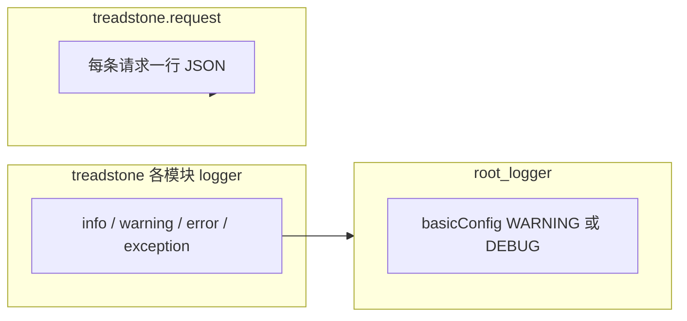

# 服务端日志打印审计报告

**文档路径（自仓库根）：** `docs/zh-CN/modules/08-logging-audit.md`  
说明：本仓库贡献者向设计文档统一放在 **`docs/`**（全小写）下；[`AGENTS.md`](../../../AGENTS.md) 约定中文材料在 `docs/zh-CN/`。若在大小写不敏感的文件系统上习惯称为「Docs 目录」，通常即指本 `docs/` 树，无需另建 `Docs/` 以免混淆。

**审计日期：** 2026-03-31  
**代码基线：** `main` 分支，`HEAD` = `e498e582a1dc5dec653323f3bbae5962219fee3e`（更新文档时请执行 `git rev-parse HEAD` 替换本节哈希）。  
**审计范围：** `treadstone/` 包内全部 `logger.debug` / `logger.info` / `logger.warning` / `logger.error` / `logger.exception` 调用，以及 [`treadstone/middleware/request_logging.py`](../../../treadstone/middleware/request_logging.py) 中独立日志器 `treadstone.request`。

**未纳入范围：**

- `cli/`、`sdk/python/`：当前无业务 `logger` 调用。
- `web/`：本次检索未发现普遍使用的 `console.log` / `console.debug` 等；若需审计前端可另开任务。

**判定目标：**

1. 日志位置与级别是否合理，是否覆盖关键排障信息。
2. 明确 Debug / Info / Warning / Error 的分级准则，在「不过度淹没控制台」与「不丢有效信号」之间折中。
3. 标出重复打印、与全局配置冲突、缺少关联字段等结构性问题。

---

## 1. 全局日志配置（必须先理解）

### 1.1 `basicConfig` 与根级别

[`treadstone/main.py`](../../../treadstone/main.py) 在模块加载时执行：

```python
logging.basicConfig(level=logging.DEBUG if settings.debug else logging.WARNING)
```

含义：

- **`TREADSTONE_DEBUG` 未开启时，根日志器级别为 `WARNING`**，用于压低第三方库的噪音。
- 同名文件在 `basicConfig` 之后对 **`logging.getLogger("treadstone")` 单独 `setLevel`**：`debug=True` 时为 `DEBUG`，否则为 **`INFO`**。因此 `treadstone.*` 子 logger 的 **`logger.info()` 在生产默认仍会输出**，而根上仍为 `WARNING` 的库（未挂在 `treadstone` 名下）保持安静。

### 1.2 独立访问日志：`treadstone.request`

[`treadstone/middleware/request_logging.py`](../../../treadstone/middleware/request_logging.py) 为 `treadstone.request` 单独配置了 `StreamHandler`、`setLevel(logging.INFO)`，且 **`propagate = False`**。

因此：**每条 HTTP / WebSocket 请求仍会输出一行 JSON**（`event=http_request` 等），**不受根级别为 WARNING 的影响**。这是线上排查请求的**主审计轨迹**。

### 1.3 与 Uvicorn 的交互

容器入口为 `uvicorn treadstone.main:app`（见根目录 [`Dockerfile`](../../../Dockerfile)）。Uvicorn 仍可能影响其自身 access log 等；**业务包 `treadstone` 的级别以上述显式 `setLevel` 为准**。若需全局可调的 `LOG_LEVEL` 环境变量，可作为后续增强。

### 1.4 Sandbox 异常状态与删除（已实施）

- **[`k8s_sync._record_status_change`](../../../treadstone/services/k8s_sync.py)**：当 `to_status` 为 **`error` / `deleting` / `deleted`**（含 reconcile/watch 写入审计的同路径）时追加 **`logger.info`**，包含 `sandbox_id`、`from_status`、`source`、可选 `message`。
- **[`sandbox_service`](../../../treadstone/services/sandbox_service.py)**：用户 API 创建失败进入 **error**、删除进入 **deleting**、删除/启停 K8s 失败进入 **error** 时，在持久化后打 **`logger.info`**（与 `logger.exception` 互补）。
- **[`sync_supervisor._k8s_delete_sandbox`](../../../treadstone/services/sync_supervisor.py)**：K8s 删除 API **成功返回后** 再打 **deleting** 日志（避免删除失败回滚时误报）。
- **[`sandbox_lifecycle_tasks._db_only_delete`](../../../treadstone/services/sandbox_lifecycle_tasks.py)**：DB 兜底删除进入 **deleting** 时打 **`logger.info`**。

### 1.5 结构示意



---

## 2. 按模块：位置、级别、关键信息

### 2.1 访问与代理（易重复、易刷屏）

| 位置 | 行为 | 评估与建议 |
|------|------|------------|
| [`request_logging.py`](../../../treadstone/middleware/request_logging.py) | 每请求一行 JSON，`INFO` | **保留**：含 `request_id`、`path`、`status_code`、`duration_ms`、`route_kind`、`sandbox_id`、`error_code` 等，应作为串联主线。流量极大时可再议采样或按 `route_kind` 过滤。 |
| [`sandbox_subdomain.py`](../../../treadstone/middleware/sandbox_subdomain.py) `_proxy_http` / WS | `Subdomain proxy …` / `Subdomain WS proxy …`，**当前为 `DEBUG`** | 已与 JSON 访问日志解耦：默认不刷屏；需要排障时开 `TREADSTONE_DEBUG` 或抬高 `treadstone` logger 级别。异常路径仍用 `exception`。 |
| [`services/sandbox_proxy.py`](../../../treadstone/services/sandbox_proxy.py) | `Proxying` / `WS proxy to`，**当前为 `DEBUG`** | 与上同理；API 代理与访问日志不再双 INFO。 |
| [`api/sandbox_proxy.py`](../../../treadstone/api/sandbox_proxy.py) | `logger.exception` | **合理**：代理失败需要堆栈。 |

### 2.2 K8s 客户端（高频）

[`treadstone/services/k8s_client.py`](../../../treadstone/services/k8s_client.py)：**当前实现**下，SandboxClaim/Sandbox 的 `POST`/`DELETE`、`scale` 的 `PATCH`、`watch_sandboxes` 启动、`Using Kr8sClient` 等低层调用均已为 **`DEBUG`**，避免 Watch/对账循环刷屏。

- **仍建议关注**：这些日志与 `request_id` 仍无关联；跨请求排障需依赖访问日志时间窗或 Pod 名。
- **保持不变**：`Malformed Watch event line` → **WARNING**；Watch `ERROR` 非 410 → **ERROR**；410 由 `WatchExpiredError` 交给上层处理。

### 2.3 K8s 同步与对账

[`treadstone/services/k8s_sync.py`](../../../treadstone/services/k8s_sync.py)

| 类型 | 示例 | 评估 |
|------|------|------|
| DEBUG | 未知 CR、乐观锁冲突 | **合适**。 |
| WARNING | 非法状态迁移、CR 缺失、会话/账本修复（READY 无 Session、stale session、缺 ledger 等） | **运维信号**，保留 Warning 合理；长期稳定后可考虑指标化并降频。 |
| INFO | `Starting reconciliation`、`Reconciliation complete`、`Sync loop shutting down`；**以及** `_record_status_change` 在目标状态为 `error` / `deleting` / `deleted` 时的一行摘要（含 `source`、可选 `message`） | 对账起止与 **关键状态迁移** 保留在 INFO，便于运维扫日志。 |
| DEBUG | `Watch loop starting`、`Watch stream ended`、重启/410 重列 等 | **当前代码**已降为 DEBUG，避免 Watch 心跳淹没控制台。 |
| EXCEPTION | reconcile/watch/计量过渡失败等 | **利于排障**，与 AGENTS.md 中「异常前记录」一致。 |

### 2.4 计量

| 文件 | 日志 | 评估 |
|------|------|------|
| [`metering_service.py`](../../../treadstone/services/metering_service.py) | `ComputeSession` 关闭时间差超过 cap | **WARNING 合理**（宕机/时钟类信号）。 |
| [`metering_tasks.py`](../../../treadstone/services/metering_tasks.py) | 乐观锁冲突跳过本 tick | 高并发下可能偏吵；若为**预期重试**，可 **DEBUG** 或 WARNING + 降频。 |
| [`metering_helpers.py`](../../../treadstone/services/metering_helpers.py) | 同步模板 spec 数量 | **INFO** 可接受；若触发频繁可 **DEBUG**。 |

### 2.5 Sandbox 生命周期

[`sandbox_service.py`](../../../treadstone/services/sandbox_service.py)：创建 Claim、删除 CR、扩缩容等多为 **INFO**，量级相对 K8s 原始 HTTP 较低，**可保留**；若与审计事件完全重复，可收敛为摘要或 DEBUG。

[`sandbox_service.py`](../../../treadstone/services/sandbox_service.py)：`Post-start K8s status check failed` → **DEBUG**，**已合理**。

[`sandbox_lifecycle_tasks.py`](../../../treadstone/services/sandbox_lifecycle_tasks.py)：idle auto-stop、auto-delete 的 **INFO** 与 audit 并存；**业务可观测**，建议保留或略简文案。

### 2.6 监督与选举

[`sync_supervisor.py`](../../../treadstone/services/sync_supervisor.py)、[`leader_election.py`](../../../treadstone/services/leader_election.py)：启动子循环、shutdown、`Stopping …` → **INFO 合理**；子循环意外退出 **`logger.error` + exc_info** → **合理**；释放 lease 失败 **WARNING + exc_info** → **合理**。

### 2.7 API、主程序与配置

| 位置 | 行为 | 备注 |
|------|------|------|
| [`main.py`](../../../treadstone/main.py) | Leader 选举、单进程 `_run_metering_loop` / `_run_lifecycle_loop` 内 tick 失败 | 启动与选举相关 **INFO** 合理；tick 内 **`logger.exception("Metering tick failed")` / `Lifecycle tick failed`** 与 [`sync_supervisor`](../../../treadstone/services/sync_supervisor.py) 多副本路径语义重复，但单进程部署仍需要，**合理**。 |
| [`main.py`](../../../treadstone/main.py) | `IntegrityError` | **`logger.exception`**（含堆栈），与 AGENTS.md「冲突类仍应服务端留痕」一致。 |
| [`main.py`](../../../treadstone/main.py) | 未处理异常 | **`logger.exception`**，合理。 |
| [`config.py`](../../../treadstone/config.py) | `metering_enforcement` 关闭 | **WARNING**，合理。 |
| [`api/docs.py`](../../../treadstone/api/docs.py) | 文档文件缺失 | **WARNING**，合理。 |
| [`api/waitlist.py`](../../../treadstone/api/waitlist.py) | 申请提交成功 | **INFO**，合理。 |
| [`services/email.py`](../../../treadstone/services/email.py) | 内存后端捕获链接、Resend 已发送 | **INFO** 便于开发/运维；生产若敏感可脱敏或 **DEBUG**。 |
| [`api/auth.py`](../../../treadstone/api/auth.py) | 验证邮件失败、OAuth token/profile | **`exception`**，合理。 |
| [`api/admin.py`](../../../treadstone/api/admin.py)、[`support.py`](../../../treadstone/api/support.py) | 授予/反馈持久化失败 | **`exception`**，合理。 |

### 2.8 死代码

[`api/cli_auth.py`](../../../treadstone/api/cli_auth.py) 定义了 `logger` 但**无任何调用**——可删除未使用 logger，或在关键流程补日志（二选一）。

---

## 3. 日志分级准则（建议全仓统一）

| 级别 | 建议用途（本项目语境） |
|------|------------------------|
| **DEBUG** | K8s 每次 REST 细节；Watch 流**常态**事件；与 JSON 访问日志**重复**的「即将转发」类；**预期**乐观锁冲突；模板缓存例行同步；子域每请求代理详情。 |
| **INFO** | 进程/Leader 生命周期；对账**摘要**（非每条 Watch 心跳）；用户/业务事件（如 waitlist）；低频控制面动作；**`treadstone.request` JSON 保持 INFO**。 |
| **WARNING** | 配置危险（如计量旁路）；数据不一致需修复（CR 缺失、会话/账本漂移）；模板校验；可预期的外部失败前兆；非 410 的 Watch ERROR。 |
| **ERROR / EXCEPTION** | 未预期失败、后台任务失败、需堆栈的排障场景；**优先 `logger.exception`**。 |

---

## 4. 主要风险与缺口（非「级别对错」）

1. **缺少 `request_id`**：除 `treadstone.request` 外，多数模块日志未带 `request_id`，与访问日志**难以串联**（代理、子域尤甚）。
2. **重复打印（已缓解）**：子域与 API 代理的「转发详情」已统一为 **DEBUG**；在根级别 **WARNING** 的默认生产配置下，通常只剩 **`treadstone.request` JSON** 作为每请求主线。开启 `TREADSTONE_DEBUG` 时仍可能看到 DEBUG 层重复，属预期。
3. **根级别 WARNING 与业务 Info**：已通过 **`getLogger("treadstone").setLevel(INFO)`** 在默认生产配置下让包内 **INFO 稳定可见**；若仍需按环境切换，可再引入 **`LOG_LEVEL`** 等统一开关。

---

## 5. 建议的后续改动顺序（实施时）

**已在当前基线完成的降噪（代码已落地）：**

- `k8s_client`：低层 K8s REST / Watch 启动 / Kr8s 提示 → **DEBUG**。
- `sandbox_subdomain` / `sandbox_proxy`：代理转发详情 → **DEBUG**。
- `k8s_sync`：Watch 循环心跳类消息 → **DEBUG**；对 ERROR/DELETING/deleted 等迁移保留 **INFO**（经 `_record_status_change` 过滤）。

**仍建议推进：**

1. 可选：引入 **`LOG_LEVEL`** 等环境变量，覆盖 `treadstone` 命名空间默认 **INFO**。  
2. 可选：在关键路径注入 `request_id`（contextvar / `request.state`），与 `treadstone.request` JSON 串联。

**已完成：** [`cli_auth.py`](../../../treadstone/api/cli_auth.py) 已移除未使用的 `logger`。

---

## 6. 附录 A：涉及的主要源文件清单

- [`treadstone/main.py`](../../../treadstone/main.py)
- [`treadstone/config.py`](../../../treadstone/config.py)
- [`treadstone/middleware/request_logging.py`](../../../treadstone/middleware/request_logging.py)
- [`treadstone/middleware/sandbox_subdomain.py`](../../../treadstone/middleware/sandbox_subdomain.py)
- [`treadstone/services/k8s_client.py`](../../../treadstone/services/k8s_client.py)
- [`treadstone/services/k8s_sync.py`](../../../treadstone/services/k8s_sync.py)
- [`treadstone/services/sync_supervisor.py`](../../../treadstone/services/sync_supervisor.py)
- [`treadstone/services/leader_election.py`](../../../treadstone/services/leader_election.py)
- [`treadstone/services/sandbox_service.py`](../../../treadstone/services/sandbox_service.py)
- [`treadstone/services/sandbox_proxy.py`](../../../treadstone/services/sandbox_proxy.py)
- [`treadstone/services/metering_service.py`](../../../treadstone/services/metering_service.py)
- [`treadstone/services/metering_tasks.py`](../../../treadstone/services/metering_tasks.py)
- [`treadstone/services/metering_helpers.py`](../../../treadstone/services/metering_helpers.py)
- [`treadstone/services/sandbox_lifecycle_tasks.py`](../../../treadstone/services/sandbox_lifecycle_tasks.py)
- [`treadstone/services/email.py`](../../../treadstone/services/email.py)
- [`treadstone/api/auth.py`](../../../treadstone/api/auth.py)、[`admin.py`](../../../treadstone/api/admin.py)、[`docs.py`](../../../treadstone/api/docs.py)、[`waitlist.py`](../../../treadstone/api/waitlist.py)、[`support.py`](../../../treadstone/api/support.py)、[`sandbox_proxy.py`](../../../treadstone/api/sandbox_proxy.py)、[`cli_auth.py`](../../../treadstone/api/cli_auth.py)

---

## 7. 附录 B：逐调用清单（与当前代码对照）

下列清单按**文件**列出 `treadstone/` 包内 `logger.*` / `request_logger.info` 调用，便于复查级别与文案。行号以仓库内文件为准，重构后请以 `rg 'logger\\.' treadstone` 为准更新本文档。

### `treadstone/main.py`

| 级别 | 消息要点 / 上下文 |
|------|-------------------|
| exception | `Metering tick failed`（单进程 `_run_metering_loop`） |
| exception | `Lifecycle tick failed`（单进程 `_run_lifecycle_loop`） |
| info | Leader 选举启用（lease、namespace、holder） |
| info | Leader 选举关闭、直接启动 K8s sync |
| exception | `Unhandled IntegrityError: …`（`integrity_error_handler`，带堆栈） |
| exception | `Unhandled exception on {method} {path}`（通用 500 处理） |

### `treadstone/config.py`

| 级别 | 消息要点 / 上下文 |
|------|-------------------|
| warning | `TREADSTONE_METERING_ENFORCEMENT_ENABLED` 为 False 时计量旁路告警 |

### `treadstone/middleware/request_logging.py`

| 记录器 | 级别 | 消息要点 / 上下文 |
|--------|------|-------------------|
| `treadstone.request` | info | 每条 HTTP/WS 一行 JSON：`event=http_request`、`request_id`、`path`、`status_code`、`duration_ms` 等 |

### `treadstone/middleware/sandbox_subdomain.py`

| 级别 | 消息要点 / 上下文 |
|------|-------------------|
| debug | `Subdomain proxy {method} {name} → {target_url}` |
| exception | `Subdomain proxy failed for sandbox {id}` |
| debug | `Subdomain WS proxy {name} → {path}` |

### `treadstone/services/k8s_client.py`

| 级别 | 消息要点 / 上下文 |
|------|-------------------|
| debug | `K8s POST`（SandboxClaim）、`K8s DELETE`（SandboxClaim） |
| debug | `K8s POST`（Sandbox direct）、`K8s DELETE`（Sandbox） |
| debug | `Starting K8s Watch on …` |
| warning | `Malformed Watch event line` |
| error | `Watch ERROR event`（非 410） |
| debug | `K8s PATCH`（scale） |
| debug | `Using Kr8sClient` |

### `treadstone/services/k8s_sync.py`

| 级别 | 消息要点 / 上下文 |
|------|-------------------|
| debug | 未知 CR Watch 事件忽略 |
| warning | Watch 上意外 `DELETED` |
| debug | 乐观锁冲突跳过 |
| warning | Watch 上非法状态迁移 |
| info | `Starting reconciliation`、`Reconciliation complete` |
| warning | 对账时 CR 缺失 |
| exception | 计算/存储计量对账失败、模板 sync/校验失败 |
| debug | Watch 循环起止、流结束、410 重列 |
| info | `Sync loop shutting down`；`_record_status_change` 在 `to_status ∈ {error,deleting,deleted}` 时的 `Sandbox {id} status … -> … (source=…)` |
| exception | Watch 事件处理、周期对账、初始对账/Watch 循环失败 |
| exception | 计量过渡、关闭 session、释放 ledger 失败 |
| warning | READY 无 ComputeSession、stale session、缺 ledger、异常 ledger |
| exception | 对账中 open/close session、create/release ledger 失败 |

### `treadstone/services/sync_supervisor.py`

| 级别 | 消息要点 / 上下文 |
|------|-------------------|
| exception | Leader 选举循环失败、释放 lease 失败、metering/lifecycle tick 失败 |
| info | 持有 Leader 后启动 sync / metering / lifecycle 循环 |
| info | Supervisor shutdown、`Stopping {name} ({reason})` |
| error | 子任务意外退出（带 `exc_info`） |

### `treadstone/services/leader_election.py`

| 级别 | 消息要点 / 上下文 |
|------|-------------------|
| info | Leadership released / acquired |
| warning | 释放 leadership 失败（`exc_info=True`） |

### `treadstone/services/sandbox_service.py`

| 级别 | 消息要点 / 上下文 |
|------|-------------------|
| exception | 创建/删除 K8s 资源、记录 storage、scale 失败 |
| info | 创建 SandboxClaim、创建 Sandbox CR（persist）、删除 CR/Claim |
| info | Scale 到 1/0、启动后已 READY 立即更新 DB |
| debug | Post-start K8s 状态检查失败 |

### `treadstone/services/sandbox_proxy.py`

| 级别 | 消息要点 / 上下文 |
|------|-------------------|
| debug | `Proxying {method} to {url}`、`WS proxy to {url}` |

### `treadstone/services/metering_service.py`

| 级别 | 消息要点 / 上下文 |
|------|-------------------|
| warning | ComputeSession 关闭时间差超过 cap（可能 leader 宕机） |

### `treadstone/services/metering_helpers.py`

| 级别 | 消息要点 / 上下文 |
|------|-------------------|
| debug | 模板 spec 同步到运行时缓存的数量 |
| warning | 模板 spec 校验告警 |

### `treadstone/services/metering_tasks.py`

| 级别 | 消息要点 / 上下文 |
|------|-------------------|
| debug | ComputeSession 乐观锁冲突、跳过本 tick |
| exception | grace 强制停 sandbox 失败、metering tick 某 step 失败 |

### `treadstone/services/sandbox_lifecycle_tasks.py`

| 级别 | 消息要点 / 上下文 |
|------|-------------------|
| info | Idle auto-stop、auto-delete 阈值触发 |
| exception | idle stop / auto-delete / lifecycle tick step 失败 |

### `treadstone/services/email.py`

| 级别 | 消息要点 / 上下文 |
|------|-------------------|
| info | 内存后端捕获验证邮件、Resend 已发送 |

### `treadstone/api/auth.py`

| 级别 | 消息要点 / 上下文 |
|------|-------------------|
| exception | 验证邮件发送失败、OAuth token/profile 拉取失败 |

### `treadstone/api/admin.py` / `support.py` / `docs.py` / `waitlist.py` / `sandbox_proxy.py`

| 文件 | 级别 | 消息要点 |
|------|------|----------|
| admin | exception | 创建 compute / storage quota grant 失败 |
| support | exception | 持久化用户反馈失败 |
| docs | warning | 公开文档文件缺失 |
| waitlist | info | 候补申请提交（email/tier/id） |
| sandbox_proxy | exception | 代理失败 |

### `treadstone/api/cli_auth.py`

- **已清理**：此前未使用的 `logger` 已移除（见第 9 节落地记录）。

---

## 8. 修订记录

| 日期 | 说明 |
|------|------|
| 2026-03-31 | 定稿：合并会话审计结论；补充文档路径说明；与当前 `treadstone/` 中 DEBUG/INFO 实现及 `main.py` Integrity 处理对齐；附录 B 供按文件复查级别与文案。 |
| 2026-03-31 | 增补第 9 节：记录已在仓库落地的日志与状态同步优化（含 K8s 同步告警增强）。 |
| 2026-03-31 | 修订第 9.4：移除「GET 详情自愈合」与后续「GET 只读漂移」——读路径不查 K8s；根因仅靠同步侧日志并在 Watch/reconcile 修复。 |
| 2026-03-31 | 修订第 9 节措辞与列表格式；与「读路径不探测 K8s」的代码注释对齐。 |

---

## 9. 已落地的代码优化（实施记录）

以下为审计定稿之后**随主分支演进已合并**的日志与同步相关改动摘要，便于对照控制台现象与排障关键词（具体以当次合并为准）。

### 9.1 日志级别与命名空间（`treadstone/main.py`）

- **`logging.basicConfig`**：非 debug 时根级别仍为 **`WARNING`**，压低第三方库噪音。
- **`logging.getLogger("treadstone").setLevel(...)`**：`TREADSTONE_DEBUG` 时为 **`DEBUG`**，否则为 **`INFO`**，保证包内 **`logger.info`** 在生产默认可见，与第 1 节描述一致。
- **`IntegrityError` 全局处理**：改为 **`logger.exception`**，保留堆栈。

### 9.2 降噪（DEBUG 迁移）

- **`treadstone/services/k8s_client.py`**：单次 REST（POST/DELETE/PATCH）、Watch 流启动、Kr8s 单例提示 → **DEBUG**。
- **`treadstone/middleware/sandbox_subdomain.py`**、**`treadstone/services/sandbox_proxy.py`**：子域 / API 代理「转发目标」类日志 → **DEBUG**（与 `treadstone.request` JSON 访问日志去重）。
- **`treadstone/services/k8s_sync.py`**：Watch 循环心跳（起止、410、重连）→ **DEBUG**；**对账开始/结束**仍为 **INFO**。
- **`treadstone/services/metering_tasks.py`**：ComputeSession 乐观锁冲突跳过本 tick → **DEBUG**。
- **`treadstone/services/metering_helpers.py`**：模板 spec 同步条数 → **DEBUG**。

### 9.3 Sandbox 异常状态与删除（必选 INFO）

- **`k8s_sync._record_status_change`**：当 `to_status` 为 **`error` / `deleting` / `deleted`** 时，在写审计后追加 **`logger.info`**（`sandbox_id`、`from_status`、`source`、可选 `message`）。
- **`sandbox_service`**：API 创建失败进 **error**、用户删除进 **deleting**、删除或启停 K8s 失败进 **error** 等路径，持久化后打 **INFO**（与 **`logger.exception`** 互补）。
- **`sync_supervisor._k8s_delete_sandbox`**：在 **K8s 删除 API 成功返回后** 再打 **deleting**（避免失败回滚仍误报）。
- **`sandbox_lifecycle_tasks._db_only_delete`**：DB 兜底进入 **deleting** 时打 **INFO**。

### 9.4 「K8s 健康但 DB 误 Error」：只在同步侧观测与纠偏（不在 GET 上动手脚）

**不在 `GET /v1/sandboxes/{id}` 上根据 K8s 做任何事**（既不回写 DB，也不为了打日志而额外 **GET** Sandbox CR）。读路径上的「纠偏」或「对照日志」容易让人误以为问题已消失，或引入与 Watch/List 不一致的观测维度；根因应在 **Watch / 周期性 reconcile** 与已有 **WARNING** 日志中定位并修复。

**依赖的同步侧日志**（仍为 **WARNING**，便于 `grep` 与事后对照）：

- **CR missing（reconcile List）**：含 `sandbox_id`、`db_status`、**`expected_cr_key`**、`ns`，并提示 list 快照缺 CR / 命名不一致 / 一致性延迟。
- **Invalid transition（Watch）**：含 `sandbox_id`、db 与 K8s 推导状态、**`cr` ns/name、`rv`、CR `message`**。
- **Unexpected DELETED（Watch）**：含 `sandbox_id`、`db_status`、**`cr` ns/name、`rv`**。

### 9.5 工程与运维辅助

- **`.gitignore`**：忽略 **`logs/`**（本地 kubectl 日志导出目录）。
- **`scripts/export-k8s-logs.sh`**：将命名空间内 Pod 日志导出到 **`logs/k8s-export/<时间戳>/`**，便于离线检索。
- **`docs/README.md`**：指向中文审计文档与 `docs/zh-CN` 索引。

### 9.6 控制台检索建议（与第 4、5 节互补）

除 **`CR missing` / `Invalid transition` / `Unexpected DELETED` / `Failed to scale`** 外，可搜 **`Sandbox … status … -> error`** / **`-> deleting`**（来自 `_record_status_change` 或 API 的显式状态迁移 **INFO**），用于对照同一时间段内的状态变更。

---

文档结束。
